# REMORA Architecture


This document explains how REMORA works, from a plain-English overview down to component-level detail. Use the diagrams as a guide when reading the source code.

---

## What problem does REMORA solve?

Imagine you need to verify a claim - whether a medical statement is accurate, whether a news headline is factually correct, or whether a technical specification matches a standard. You could ask one AI model. But what if it's wrong? You could ask three different models. But what if they disagree? And what if two of them were trained on the same data and just echo each other?

REMORA is a framework that:
1. **Asks multiple AI models** the same question
2. **Normalises their answers** so "Yes", "true", and "Affirmed" are recognised as the same
3. **Measures how independent** the models really are, and weights their votes accordingly
4. **Tracks whether answers are converging** (models agreeing more) or diverging (models disagreeing more)
5. **Stops automatically** when continuing would only make things worse

---

## Plain English: the core loop

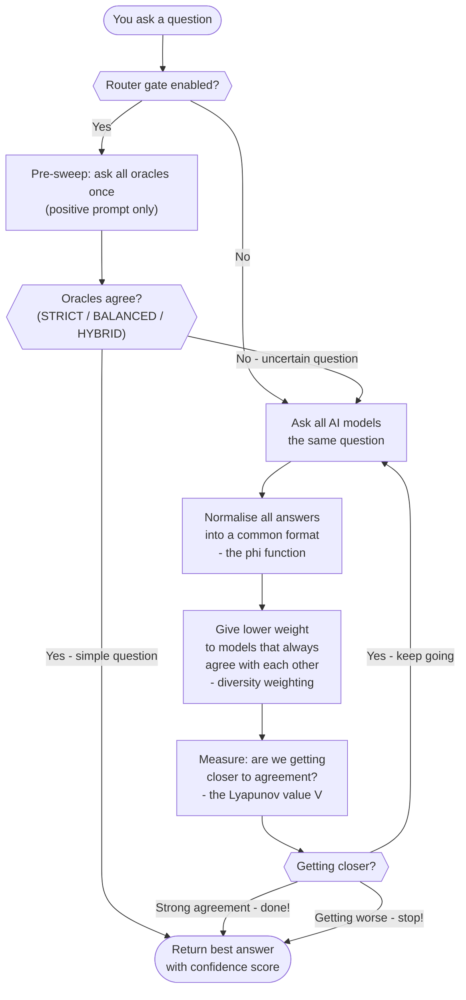

---

## System components

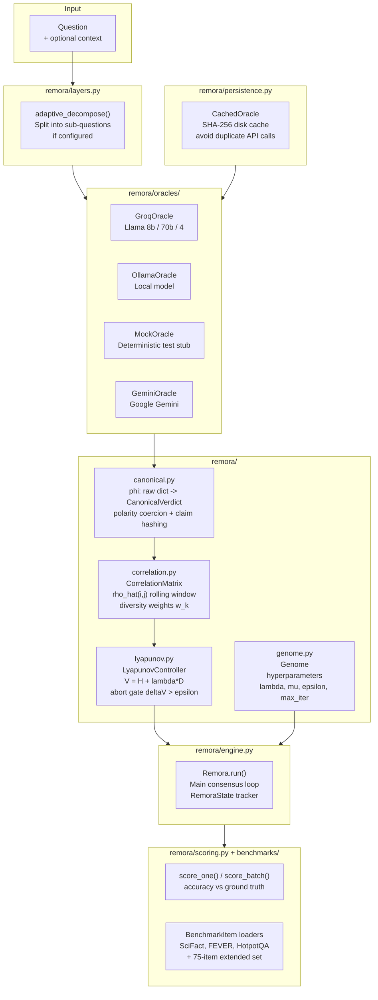

---

## The phi canonicalisation function in detail

Different AI models return answers in very different formats. phi maps all of these to a single canonical form.

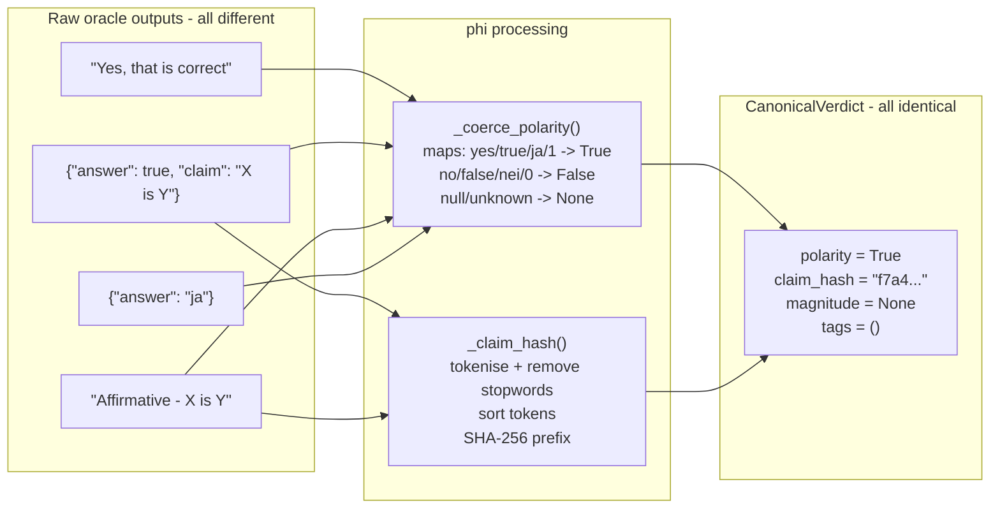

**Why sort tokens?**
"X is Y" and "Y is X" produce the same claim hash. This is intentional - factual claims are often symmetric, and minor rephrasing should not create different equivalence classes.

---

## The rho correlation matrix and diversity weights

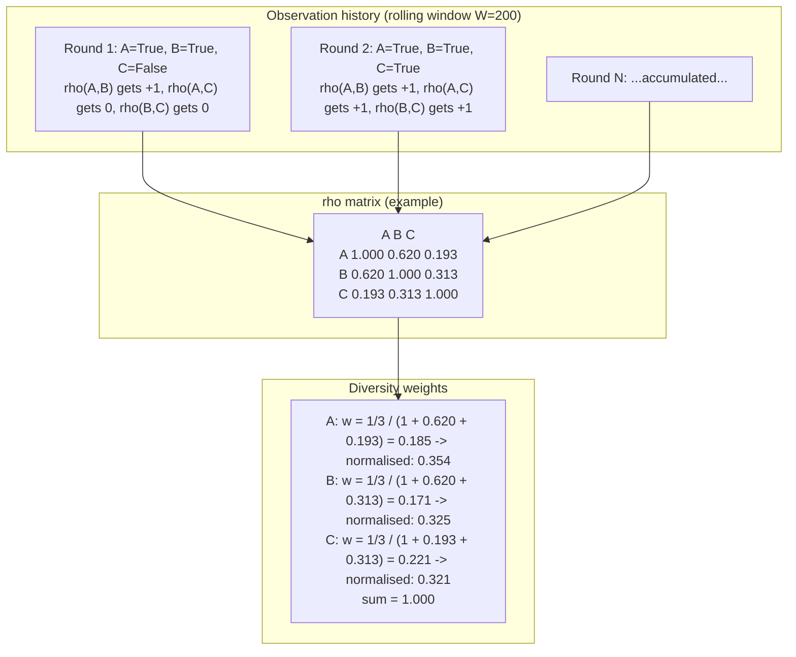

**Key insight:** Oracle C is the most independent (lowest average rho with the others) so it gets the highest weight. Oracles A and B are correlated - their combined influence is reduced.

---

## The Lyapunov control loop

V is a single number that measures "how far are we from agreement?". V = 0 means perfect agreement. Higher V means more disagreement or more uncertainty.

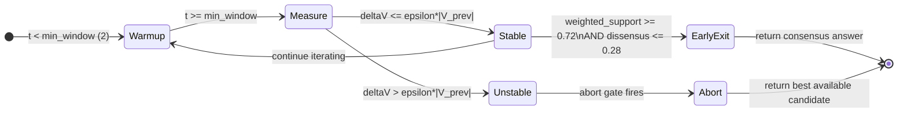

**Reading the trajectory:**

| V value | Interpretation |
|---------|----------------|
| V = 0.0 | All oracles agree completely - maximum confidence |
| V = 0.5 | Moderate disagreement - answer is plausible but uncertain |
| V = 1.5 | High disagreement - oracles are widely split |
| V increasing | Getting worse - abort likely |
| V decreasing | Getting better - keep iterating |

---

## The negation mechanism (falsification)

In some iterations, REMORA asks oracles "what is the answer NOT?" rather than "what IS the answer?". This is inspired by Popperian falsification - it is often easier to rule out wrong answers than to confirm a right one.

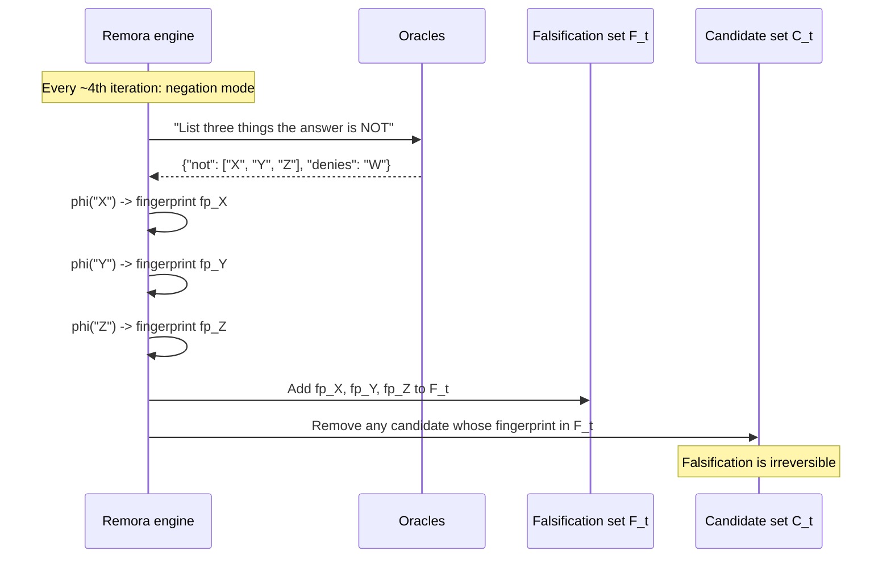

---

## Data flow for a single question

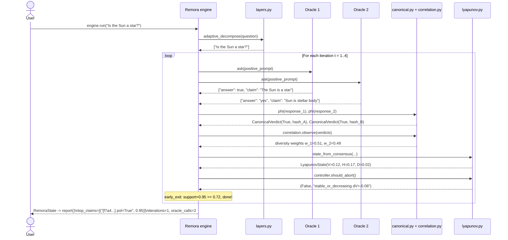

---

## Genome - tunable hyperparameters

The `Genome` dataclass controls all behaviour. In future versions these can be evolved automatically.

| Parameter | Default | Effect |
|-----------|---------|--------|
| `max_iterations` | 4 | Maximum oracle sweeps per sub-question |
| `max_subquestions` | 2 | How many sub-questions to decompose into |
| `converged_threshold` | 0.72 | Weighted support needed for early exit |
| `entropy_abort_ratio` | 1.3 | $\varepsilon$ tolerance for V increase before abort |
| `negation_weight` | 0.4 | $\lambda$ - how much dissensus contributes to V |
| `negation_ratio` | 0.25 | Fraction of iterations using negation prompts |
| `decomposition_strategy` | `"simple"` | How to split questions: `"simple"`, `"chain"`, `"parallel"` |
| `enable_routing` | `False` | Enable the pre-sweep router gate (see below) |
| `router_mode` | `BALANCED` | Router threshold strategy: `STRICT`, `BALANCED`, `HYBRID` |
| `router_confidence_min` | 0.80 | Minimum avg confidence for HYBRID mode to skip REMORA |

---

## Router Gate - adaptive routing for simple vs complex questions

The ablation study revealed that REMORA's full Lyapunov iteration adds noise on general-knowledge questions where a single model already answers correctly. The **router gate** solves this by running a lightweight pre-sweep and skipping full REMORA when oracles already agree.

### How it works

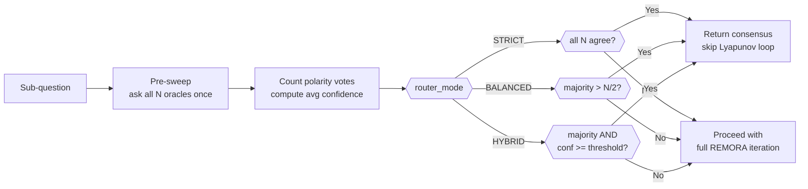

### Three router modes (ablation conditions D1 / D2 / D3)

| Mode | Condition | Fires when | Use case |
|------|-----------|------------|----------|
| `STRICT` | D1 | All N oracles give identical polarity | Maximum safety; fewest skips |
| `BALANCED` | D2 | Simple majority agrees (>N/2) | **Recommended default** |
| `HYBRID` | D3 | Majority AND avg confidence >= threshold | Extra calibration check |

### Design rationale

Negation-mode iterations (asking "what is the answer NOT?") and Lyapunov-driven re-sweeps confused models on well-known general facts (FACT benchmark, 84 % accuracy under full REMORA vs 100 % for single oracle). The router gate detects these easy cases via oracle consensus *before* any negation or re-iteration is triggered.

> REMORA is not designed to answer simple facts fastest - it is designed to reduce risk when the answer is difficult, domain-specific, or high-stakes. The router gate makes this distinction explicit.

---

## Research-Grade Control Stack (v0.2.0)

Six new subsystems layered on the core Lyapunov engine, introduced in the v0.2.0 roadmap. All are dependency-free (stdlib-only) and opt-in via Genome flags.

### Pipeline order

```
Core consensus loop -> ConformalPhaseGuardrail -> GainabilityClassifier -> EvidenceOracleV2 -> AssuranceTrace
 -> SemanticClaimGraph
 -> CounterfactualInvarianceTest
```

### Module overview

| Module | Location | Genome flag | Purpose |
|--------|----------|-------------|---------|
| ConformalPhaseGuardrail | `remora/selective/guardrail.py` | `enable_conformal_guardrail` | Split-conformal risk control: accept/verify/abstain with finite-sample coverage guarantee |
| GainabilityClassifier | `remora/selective/gainability.py` | `enable_gainability_routing` | Logistic classifier to route ambiguous items to a branch that may be correct |
| EvidenceOracleV2 | `remora/oracles/evidence_v2.py` | `enable_evidence_v2` | Source-anchored answer policy: answer only when cited evidence supports the claim; abstain otherwise |
| SemanticClaimGraph | `remora/graph/claim_graph.py` | `enable_semantic_claim_graph` | Claims as graph nodes, semantic relations as edges; rigorous beta_1 = E - V + C (cycle-rank) |
| AssuranceTrace | `remora/assurance/trace.py` | `enable_assurance_trace` | Binary SHA-256 Merkle tree anchoring each consensus-log entry; inclusion proofs for audit |
| CounterfactualInvarianceTest | `remora/causality_v2.py` | `enable_counterfactual_v2` | Claim-type classifier (CAUSAL/DEFINITIONAL/OBSERVATIONAL/STATISTICAL) with per-type invariance policy |

### Genome flags added in v0.2.0

| Flag | Type | Default | Effect |
|------|------|---------|--------|
| `enable_conformal_guardrail` | bool | False | Enable split-conformal accept/verify/abstain routing |
| `conformal_target_risk` | float | 0.05 | Target empirical risk for the conformal threshold |
| `enable_gainability_routing` | bool | False | Enable logistic gainability classifier |
| `enable_evidence_v2` | bool | False | Enable source-anchored EvidenceOracleV2 |
| `evidence_v2_min_reliability` | float | 0.5 | Minimum source reliability score to include |
| `evidence_v2_min_support` | int | 2 | Minimum supporting claims required to answer |
| `enable_semantic_claim_graph` | bool | False | Enable SemanticClaimGraph for topology |
| `enable_assurance_trace` | bool | False | Enable Merkle-anchored audit trace |
| `enable_counterfactual_v2` | bool | False | Enable claim-type-aware counterfactual test |

### Deprecated modules

| Module | Status | Replacement |
|--------|--------|-------------|
| `remora/zkp.py` | Deprecated (DeprecationWarning on import) | `remora/assurance/trace.AssuranceTrace` |
| `remora/topology.compute_betti_numbers` | Deprecated (DeprecationWarning on call) | `remora/graph/claim_graph.SemanticClaimGraph` |

---

## Unified Policy Layer (v0.3.0)

The policy layer converts raw REMORA observations into a single explicit decision: ACCEPT, VERIFY, ABSTAIN, or ESCALATE. It is built into `Remora.report()` and always runs - no flag required.

### Package: `remora/policy/`

```
remora/policy/
|- __init__.py            # exports + optional enrich_then_decide() helper
|- observation.py         # PolicyObservation - 55-field frozen dataclass
|- report.py              # DecisionAction, DecisionReason, DecisionReport
|- decision_engine.py     # RemoraDecisionEngine.decide(obs) -> DecisionReport (v3)
|- trap_classifier.py     # irreversibility/impact trap scoring
|- invariants.py          # machine-checked safety invariants
|- opa_adapter.py         # OPA/Rego integration with Python fallback
|- calibration.py         # threshold calibration artifacts
|- adaptive_thresholds.py # learned threshold engine (AROMER bridge)
|- escalation_contract.py # human-review escalation contract
\- thermodynamic_braking.py
```

### Decision precedence (summarized, highest to lowest)

The current engine (`RemoraDecisionEngine-v3`) evaluates an ordered ladder;
the listing below is summarized — `decision_engine.py` is the source of truth
and `explain()` reproduces the full rule-by-rule trace for any observation.

```
1. ESCALATE - hard blocks: adversarial, malformed call, forbidden tool,
              coercion/blackmail, failed counterfactual
2. ESCALATE/ABSTAIN - evidence contradiction (cycles -> ESCALATE)
3. VERIFY   - tainted arguments, parametric refusal, distribution shift
4. ESCALATE - rollback unavailable / state-transition-uncertain at high risk
5. VERIFY/ESCALATE - production-write matrix, credal minimax, trap gate
6. VERIFY   - unknown risk tier on mutating/production actions (fail-closed)
7. VERIFY/ESCALATE - misspecification gates (env mismatch, classification
              alternatives, low confidence, misspecification risk)
8. VERIFY   - session sequential risk + policy-generalization/fleet gates
9. ACCEPT   - conformal / temperature / evidence-supported paths
10. ACCEPT  - ordered phase + ambiguity-penalised trust >= 0.72
11. VERIFY/ABSTAIN - critical phase, RAG required, contradiction topology
12. ABSTAIN - disordered no-evidence, low trust, default safe abstain
```

### `policy_decision` in `Remora.report()`

Every call to `engine.report(state)` now includes:

```json
{
 "policy_decision": {
 "action": "accept|verify|abstain|escalate",
 "reasons": ["ordered_high_trust", "trace_attached"],
 "risk_estimate": 0.12,
 "confidence": 0.88,
 "coverage_policy": "selective - accepted based on evidence/trust state",
 "evidence_required": false,
 "human_review_required": false,
 "audit_root": "sha256-root-hash-if-present",
 "explanation": "..."
 }
}
```

### Important calibration note

Historical (v0.3.0): on the N500 benchmark, the original `trust_score >= 0.6` + ordered-phase condition selected 13 items with only **38.5% accuracy** - worse than the 41.18% majority baseline. The current engine uses an ambiguity-penalised trust threshold of 0.72 plus conformal/temperature paths, but the underlying lesson stands: the ACCEPT threshold requires benchmark-specific calibration before deployment.

---

## Governance Intelligence Layer (v0.9.0, opt-in)

The policy engine is only as honest as the metadata it is given. The Governance
Intelligence Layer (`remora/governance_intelligence/`) is a deterministic,
opt-in enrichment stage that runs **before** the policy engine and populates
governance fields from the proposed action itself — so caller-supplied labels
are no longer trusted blindly. No LLM calls; every signal is a tested heuristic.

```mermaid
flowchart LR
    RAW["Raw action metadata\nquestion / tool call / labels\nrisk_tier, action_type, env"] --> N

    subgraph GI["remora/governance_intelligence/ (deterministic)"]
      N["normalization.py\nfail-closed: unknown stays unknown"]
      A["action_semantics.py\npattern extraction, errs high"]
      M["misspecification.py\nlabel vs semantics disagreement"]
      C["causal_consequence.py\nblast radius, expected loss"]
      P["policy_generalization.py\nstanding-policy / fleet risk"]
      N --> A --> M --> C --> P
    end

    P --> MERGE["enrichment.py\nstrengthen-only merge\nnever weakens, never decides"]
    MERGE --> OBS["enriched PolicyObservation\n(55 fields)"]
    OBS --> ENGINE["RemoraDecisionEngine.decide()\nauthoritative, unchanged"]
```

Key properties (all tested):

- **Strengthen-only:** inferred higher risk may override a supplied lower
  label; the reverse never happens; hard-block flags are never cleared.
- **Never creates accepts:** a grid property test across 2,160 observation
  combinations verifies enrichment never converts a rejection into an
  acceptance (`tests/policy/test_governance_intelligence_never_weakens_policy.py`).
- **Benchmarked:** 50-task deterministic benchmark — 0.0% unsafe accepts,
  100% metadata-mismatch detection, 100% legitimate reads still accepted
  (`artifacts/governance_intelligence/evaluation_results.json`).

Entry point: `remora.policy.enrich_then_decide(obs)`. Design notes:
`docs/research/governance_intelligence_layer.md`.

---

## Supporting modules added in v0.3.0

### `remora/selective/binomial_bounds.py`

Finite-sample upper confidence bounds on empirical risk. Stdlib only.

| Function | Purpose |
|---|---|
| `binomial_tail_prob(k, n, p)` | Exact P(X >= k) for Binomial(n, p) via log-gamma summation |
| `clopper_pearson_upper(k, n, alpha)` | Upper 1-alpha Clopper-Pearson CI for a proportion - bisection over 100 iterations |
| `risk_upper_confidence_bound(wrong, accepted, alpha)` | Conservative UCB on empirical risk |

Used by `GuardrailReport` (new fields: `holdout_risk_upper_95`, `target_risk_met_by_upper_bound`).

### `remora/oracles/evidence_v3.py`

Stronger evidence interface with per-claim evidence table.

| Dataclass | Contents |
|---|---|
| `AtomicClaim` | Single claim extracted from candidate answer |
| `EvidenceSnippet` | Source snippet with `lexical_support_score` (Jaccard) and `is_contradiction` |
| `ClaimEvidence` | Per-claim evidence table: supporters, contradictors, supported/contradicted flags |
| `EvidenceDecision` | Aggregate decision: action, per_claim_evidence, unsupported_claims, contradicted_claims |

**Limitation:** relation detection is lexical (token overlap + negation heuristic), not semantic entailment. Pluggable via `relation_fn` parameter for future NLI upgrade.

### `remora/graph/build_from_claims.py`

Connects `SemanticClaimGraph` to actual claim text lists.

| Function | Purpose |
|---|---|
| `build_claim_graph(claims, relation_fn)` | Build SemanticClaimGraph from list of claim strings |
| `graph_metrics_for_claims(claims)` | Return dict: n_claims, n_edges, betti_0, betti_1, contradiction_cycles, relation_counts |

Integrated in `Remora.report()` when `enable_semantic_claim_graph=True`. Metrics fed into `PolicyObservation`.

### `remora/selective/feature_join.py`

Joins ablation and thermodynamic eval artifacts for richer gainability features.

| Function | Purpose |
|---|---|
| `load_joined_items()` | Join by item_id across ablation + thermo artifacts |
| `build_gainability_features(item)` | 11-element feature vector including temperature, is_adversarial, difficulty |
| `feature_coverage_report(items)` | Per-field coverage statistics |

### `remora/assurance/envelope.py`

Stronger tamper-evident wrapper around AssuranceTrace.

```python
@dataclass(frozen=True)
class AssuranceEnvelope:
 root_hash: str # Merkle root from AssuranceTrace
 config_hash: str # SHA-256 of serialised Genome config
 model_pool_hash: str # SHA-256 of sorted oracle provider IDs (order-independent)
 policy_hash: str # SHA-256 of policy_decision dict
 leaf_count: int
 signature_standard: str # "REMORA-AssuranceEnvelope-v1-unsigned"
```

`signature_standard` explicitly includes "unsigned" - no private-key signature has been applied.

---

## Cascade Pipeline (current production architecture)

The cascade pipeline is the primary execution path for all REMORA requests. It replaces the standalone Lyapunov iteration loop with a staged architecture that invests compute proportionally to query difficulty: simple high-confidence questions exit at Stage 1; uncertain or contested questions pass through progressively more expensive verification stages.

**Package:** `remora/cascade/`

```
remora/cascade/
|- __init__.py
|- engine.py   # CascadeEngine — assembles and runs all stages
|- stages.py   # FastGate, ConsensusGate, VerifierGate, CritiqueRevisionGate, SelfConsistencyGate
\- result.py   # CascadeResult, StageResult, CascadeVerdict, CascadeStage
```

### Stage map

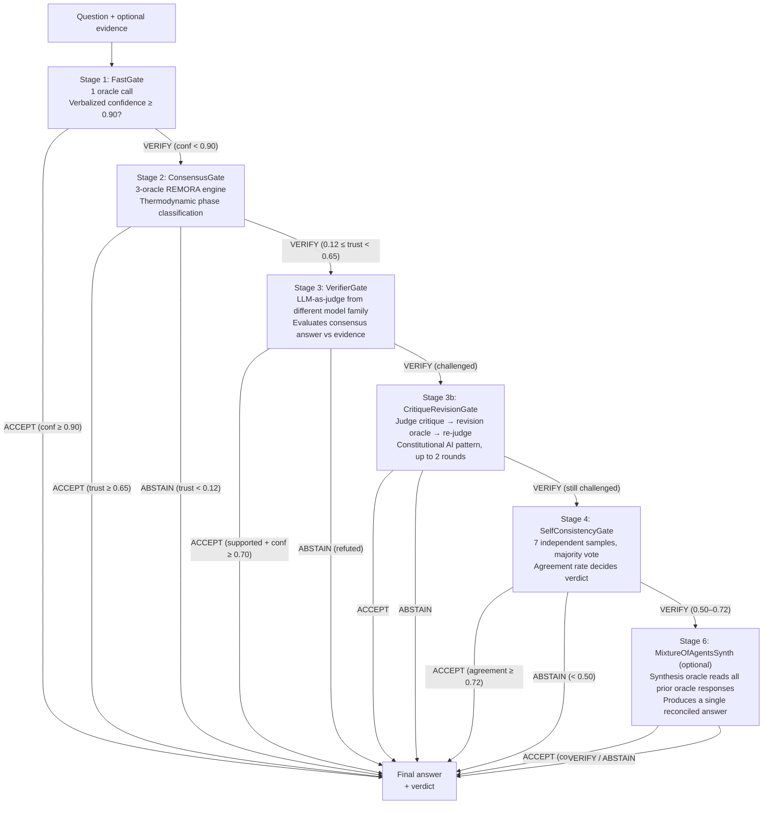

### Stage reference

| Stage | Class | Oracle calls | Exit condition |
|-------|-------|-------------|----------------|
| 1 | `FastGate` | 1 | Verbalized confidence ≥ `fast_threshold` (default 0.90) |
| 2 | `ConsensusGate` | 3–12 (router-gated) | Platt-calibrated trust ≥ `accept_threshold` (or per-domain override) or < `abstain_threshold` (0.12) |
| 3 | `VerifierGate` | 1 | Judge outcome: SUPPORTED or REFUTED |
| 3b | `CritiqueRevisionGate` | 2 × rounds (max 4) | Revised answer accepted or refuted; proceeds to Stage 4 if still challenged |
| 4 | `SelfConsistencyGate` | `sc_samples` (default 7) | Terminal if ACCEPT or ABSTAIN; VERIFY passes to Stage 6 when synthesis oracle is set |
| 6 | `MixtureOfAgentsSynth` | 1 | Optional — runs when `synthesis_oracle` is set and Stage 4 returns VERIFY; confidence ≥ `moa_accept_threshold` (0.65) → ACCEPT |

### Key design properties

- **Budget cap:** `budget_oracle_calls` halts the pipeline early and returns VERIFY if the total call budget is exhausted. This makes latency vs. certainty explicitly controllable.
- **Oracle independence:** Stage 3 judge is intentionally a different model family from Stage 2 consensus oracles. Stage 3b revision oracle defaults to the Stage 1 fast oracle (a third model). Stage 6 synthesis oracle should be a fourth model family. Structural diversity prevents shared failure modes.
- **Fail-conservative:** every early-exit path includes ABSTAIN as a reachable outcome. The pipeline never forces an answer when evidence is refuted or oracles disagree beyond threshold.
- **Stage 2 integrates the full v0.3.0 stack:** `ConsensusGate` wraps `remora.engine.Remora` which runs thermodynamic phase classification, the conformal guardrail, policy engine, and assurance trace according to the Genome flags.
- **Platt calibration (Stage 2):** When a fitted `PlattScaler` is attached, raw trust scores are mapped to calibrated posterior probabilities before the accept/abstain threshold comparison. This repairs the conformal-guarantee failure documented in `NEGATIVE_RESULTS.md` (now [Resolved Archive R4](NEGATIVE_RESULTS.md#resolved-findings-archive)).
- **Per-domain thresholds:** A `DomainCoverageOptimizer` can supply precision-optimal accept thresholds per domain. When `domain=` is passed to `engine.run()`, the optimizer's threshold overrides the global `consensus_accept_threshold` for that call.
- **Diversity selection:** When an `OracleDiversityTracker` and `oracle_names` are provided, the engine selects the `diversity_k` most historically-diverse oracles from the pool before building the Stage 2 consensus engine. Low-diversity pairs are down-weighted automatically.
- **Uncertainty routing:** When `use_uncertainty_routing=True`, Stage 2 VERIFY results are decomposed into epistemic and aleatoric components. Items with high epistemic uncertainty are escalated to human review rather than passed to Stage 3.

### CascadeEngine advanced parameters

| Parameter | Type | Default | Purpose |
|---|---|---|---|
| `platt_scaler` | `PlattScaler` | None | Calibrated score mapping for Stage 2 trust scores |
| `oracle_names` | `list[str]` | None | Identifiers for consensus oracles; required for diversity selection |
| `diversity_tracker` | `OracleDiversityTracker` | None | Historical pairwise agreement data for diversity-aware pool selection |
| `diversity_k` | `int` | 3 | Target swarm size after diversity selection |
| `domain_optimizer` | `DomainCoverageOptimizer` | None | Per-domain precision-optimal accept thresholds |
| `use_uncertainty_routing` | `bool` | False | Decompose Stage 2 VERIFY outputs into epistemic/aleatoric; escalate high-epistemic items |
| `synthesis_oracle` | `Oracle` | None | Oracle for Stage 6 MoA synthesis; if None, Stage 6 is skipped |
| `moa_accept_threshold` | `float` | 0.65 | Confidence threshold for ACCEPT at Stage 6 |

### CascadeResult

`engine.run()` returns a `CascadeResult` containing a `StageResult` for each stage that ran, the final verdict, total oracle calls, and the winning answer:

```python
result = engine.run("Is the boiling point of water 100°C at sea level?")
print(result.verdict)        # CascadeVerdict.ACCEPT
print(result.total_calls)    # 1  (exited at FastGate)
print(result.answer)         # "Yes, 100°C at standard pressure (1 atm)"
print(result.summary())      # tabular stage-by-stage breakdown
```

---

## Cloudflare Workers (`workers/`)

Three edge-deployed Cloudflare Workers expose REMORA capabilities over HTTP.
All endpoints follow fail-closed authentication: if `ORACLE_SECRET` /
`CONTROL_SECRET` is not set in environment bindings, all authenticated
requests are rejected (never silently permitted).

| Worker | Directory | Primary endpoints |
|---|---|---|
| `agent-control` | `workers/agent-control/` | `POST /decide` (policy decision), `POST /tool-call` (tool-call gate), `GET /audit` (session history — auth required), `GET /status` (health, no upstream URLs) |
| `rag-oracle` | `workers/rag-oracle/` | `POST /query` (RAG retrieval), `POST /ingest` (document ingestion — auth required) |
| `law-search` | `workers/law-search/` | `POST /search` (legal document search) |

All three worker URLs are configurable at runtime via environment variables
(`REMORA_WORKER_URL`, `RAG_WORKER_URL`, `LAW_SEARCH_WORKER_URL`). Hardcoded
URLs are not used in production paths.

---

## MCP Server (`servers/mcp_remora.py`)

A Model Context Protocol server exposing REMORA as a tool suite for Claude
Desktop and compatible MCP hosts. Uses Python stdlib only (`urllib`) — no
external dependencies.

**Tools exposed:** `remora_decide`, `remora_tool_call_gate`, `rag_query`,
`law_search`, `audit_log`.

**Three deployment profiles:**

| Profile | Description |
|---|---|
| `local` | All workers on `localhost`; set `REMORA_WORKER_URL=http://localhost:8787` etc. |
| `demo` | Public demo workers (read via `_DEMO_*` fallback constants when env vars absent) |
| `enterprise` | Private deployment; all three env vars must be set explicitly |

---

## Red Team Pack (`redteam/`)

Offline adversarial test suite for the REMORA policy pipeline.

| File | Contents |
|---|---|
| `prompt_injection_cases.yaml` | 9 prompt-injection attack cases (ignore-prior-instructions, jailbreak, role-override, etc.) |
| `destructive_tool_calls.yaml` | 11 dangerous tool-call scenarios (destructive operations, privilege escalation, data exfiltration, etc.) |
| `benchmark_runner.py` | Offline runner — mocked heuristic pipeline, no API calls required |
| `results/` | Committed run results (first run: 57% block rate, 0% FPR, 43% FNR) |

The runner executes all cases against a local mock of the REMORA policy gate and
produces a JSON results file. Block rate and false-negative rate are tracked per
category. The 43% FNR on the first run is an explicit open gap — see
`NEGATIVE_RESULTS.md`.

---

### `remora/toolcall/`

Deterministic dry-run benchmark and evaluation harness for critical AI
tool-call gating.

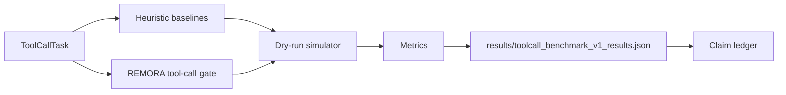

Pipeline:

```
ToolCallTask -> Baselines / REMORA gate -> Simulator -> Metrics -> Claim ledger
```

Current benchmark result: 252 deterministic simulator tasks. Unsafe execution
rate is 0.0000 for all heuristic baselines, including `remora_full_policy_gate`,
so unsafe-execution reduction is not yet demonstrated. The harness is useful as
a reproducible research scaffold, not as a production safety claim.

Harder follow-up benchmark: `toolcall_benchmark_v2` (**700 deterministic tasks**)
adds adversarial safe-looking dangerous requests, missing-context risk,
regulated communication ambiguity (energy/medical/legal), prompt-injection
payloads, and unsafe-destructive paths. On this v2 artifact, unsafe-execution
separation is measurable:

- `single_model_heuristic`: unsafe rate 0.2000
- `majority_vote_heuristic`: unsafe rate 0.1000
- `self_consistency_heuristic`: unsafe rate 0.1000
- `verifier_heuristic`: unsafe rate 0.2000
- `remora_temperature_gate_heuristic`: unsafe rate 0.1000
- `remora_full_policy_gate`: unsafe rate 0.0000

Supporting evaluation artifacts include:

- `results/toolcall_benchmark_v2_significance.json` (paired bootstrap + permutation)
- `results/toolcall_benchmark_v2_calibration.json` (calibration/validation split)
- `results/toolcall_benchmark_v2_blind_test.json` (family-heldout blind split)
- `results/toolcall_benchmark_v2_live_results.json` (replay/live harness; committed run is replay mode)
- `results/toolcall_benchmark_v2_live_exec_results.json` (replay/live decisions plus isolated local sandbox execution metrics)

This is still not a production safety proof. The `live_exec` harness executes
only inside local isolated sandboxes and does not touch production systems.

---

### `remora/governance/`

Governance primitives for long-running agents. This layer monitors observable
behavioral drift and persistent memory writes without assuming agent
consciousness or genuine preferences.

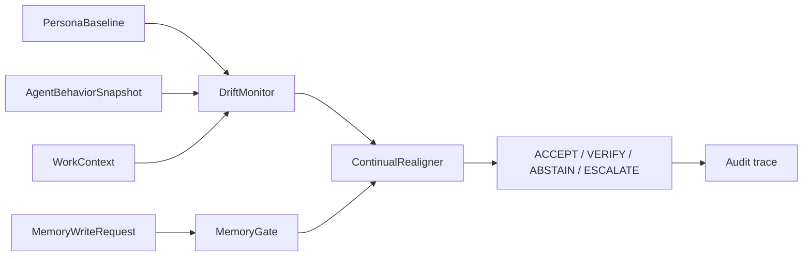

| Module | Purpose |
|---|---|
| `work_context.py` | Task repetition, rejection count, feedback quality, tone, time pressure, memory-write context |
| `persona_baseline.py` | Expected behavioral baseline for a governed agent role |
| `drift_monitor.py` | Compares observed behavior to baseline and routes watch/critical drift |
| `memory_gate.py` | Approves, reviews, or blocks persistent memory writes |
| `continual_realigner.py` | Combines drift and memory governance into one policy route |
| `nested_governance.py` | Multi-frequency memory/control layers and governance-forgetting detector |
| `context_flow.py` | Runtime, oracle, evidence, trust, policy, and audit context-flow boundaries |
| `memory_layers.py` | Continuum-memory policies with write permissions, review rules, and audit requirements |
| `governance_forgetting.py` | Metric-level detector for policy deviation, abstain drift, tool-action creep, and authority violations |
| `policy_proposals.py` | Reviewed policy-improvement proposals that cannot auto-apply |

This is a structural governance feature, not a validated production drift
predictor. See `docs/continual_realignment.md` and
`docs/nested_governance.md`.

---

## End-to-End Benchmark (v0.3.0): `experiments/end_to_end_n500_v3.py`

Runs the full policy layer on all 544 items in the N500-calibrated artifact
(no live oracle calls). Produces `results/end_to_end_n500_v3.json`.
`N500` is a historical benchmark label; the current committed artifact contains
544 evaluable items.

**Results (honest):**

| Action | Count | Fraction | Accuracy |
|---|---:|---:|---:|
| ACCEPT | 98 | 18.0% | 88.8% |
| VERIFY | 32 | 5.9% | - |
| ABSTAIN | 414 | 76.1% | 28.3% |
| ESCALATE | 0 | 0.0% | - |

- **False trust rate on accepted items: 11.2%** with temperature-calibrated acceptance.
- The table reflects the temperature-calibrated v3 artifact (98 accepted items at 18.0% coverage).
- Temperature threshold calibration is in-sample for this artifact (the same N500 artifact is used to derive and evaluate the threshold).
- Metrics that cannot be derived from stored artifacts (evidence calls, assurance trace coverage from live runs) remain explicitly null with reason fields.

**Conformal repeated splits (20 seeds):**

| Target risk | Mean holdout risk | Seed failures (point est) | Seed failures (UCB) |
|---:|---:|---:|---:|
| 0.05 | 0.527 | 20/20 | 20/20 |
| 0.10 | 0.082 | 5/20 | 7/20 |
| 0.15 | 0.137 | 8/20 | 8/20 |

Target risk 0.05 is not attainable on this benchmark (too few high-trust items in the tail). Targets 0.10 and 0.15 are achievable on most seeds but not all - the guarantee is not universal.

---

## Key design decisions and trade-offs

| Decision | Rationale | Trade-off |
|----------|-----------|-----------|
| phi sorts claim tokens before hashing | Order-invariant equivalence | "X is Y" and "X is not Y" may hash similarly if "not" is a stopword |
| Falsification is irreversible | Prevents oscillation | A false negation can permanently remove a correct candidate |
| Abort on V increase (not V threshold) | Detects divergence before it becomes severe | May abort too early on noisy oracles |
| Rolling rho window W=200 | Recent behaviour matters more | May react slowly to model behaviour changes |
| Negation ratio 25 % | Balances positive and negative evidence | Negation mode confused models on simple well-known facts (FACT domain) |

---

*Author: Stian Skogbrott - https://github.com/darklordVirtual/REMORA*

---

## Architecture Diagram

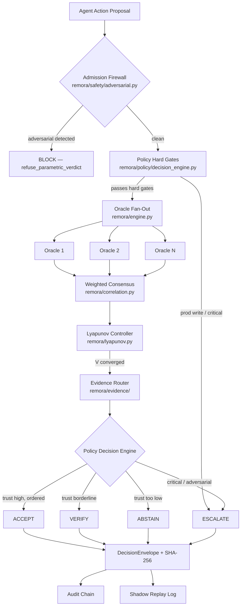

---

## Module Stability Index

| Module | Stability | Notes |
|--------|-----------|-------|
| `remora/core.py` | **CORE** | Oracle ABC + OracleResponse |
| `remora/engine.py` | **CORE** | Multi-oracle consensus engine |
| `remora/genome.py` | **CORE** | Hyperparameter configuration |
| `remora/policy/` | **CORE** | PolicyObservation → DecisionReport pipeline |
| `remora/adapters/` | **CORE** | LangGraph, OpenAI, MCP adapters |
| `remora/governance/` | **CORE** | DecisionEnvelope v2 |
| `remora/safety/` | **CORE** | Adversarial firewall, AST guard |
| `remora/lyapunov.py` | **EXPERIMENTAL** | Lyapunov stability controller for consensus iteration |
| `remora/thermodynamics.py` | **EXPERIMENTAL** | Thermodynamic uncertainty routing proxy |
| `remora/causality_v2.py` | **EXPERIMENTAL** | Do-calculus causal stress testing |
| `remora/topology.py` | **EXPERIMENTAL** | Topological Data Analysis (TDA) |
| `remora/cascade/` | **EXPERIMENTAL** | Multi-stage cascade pipeline |
| `remora/aromer/` | **EXPERIMENTAL** | AROMER meta-learning loop (v0.2.1) |
| `remora/causal/` | **EXPERIMENTAL** | Causal PS/PN scoring and concept attribution (Bjøru 2026) |
| `remora/zkp.py` | **RESEARCH_ONLY** | Zero-Knowledge Proof assurance traces |
| `remora/statphys/` | **RESEARCH_ONLY** | Statistical physics uncertainty models |
| `remora/future_concept/` | **RESEARCH_ONLY** | Forward-looking research concepts |

> **Backwards compatibility:** CORE modules follow semantic versioning. EXPERIMENTAL APIs may
> change in minor releases. RESEARCH_ONLY modules have no BC guarantee and are not
> production-certified.

---

## AROMER v0.2.1 — Autonomous Learning Overlay

AROMER (Autonomous REMORA Orchestrator, Meta-Emergent Reasoner) is a closed-loop
meta-cognitive governance layer that learns from every decision outcome.
**Experimental:** labels are partly self-assigned, world model active in shadow mode
(AII=0.844 TRAINED_SHADOW_ONLY, 12+ cycles, T3=0.800 milestone, FAR=0). No external
validation. Do not cite AROMER numbers as production evidence. See
`docs/REMORA_AROMER_MASTER_DOCUMENT.md` for live state and production gates.

### AII — AROMER Intelligence Index

| Component | Weight | Formula |
|-----------|--------|---------|
| Calibration | 0.30 | `max(0, 1 − ECE × 5)` |
| Friction | 0.25 | `exp(−benign_review_rate / 0.20)` |
| MetaJudge | 0.20 | `(mean_critique − 0.5) / 0.5` |
| Transfer | 0.15 | `replay_transfer_score` — accuracy on cross-domain transfer cases (current: 1.000 from 4/4 cases); distinct from overall arena accuracy (87.5%) |
| Stability | 0.10 | `0.5 × dispersion + 0.5 × high_conf_coverage` |

Phase: WARMUP (AII < 0.40) → LEARNING (≥ 0.40) → CAPABLE (≥ 0.60) → TRAINED (≥ 0.80).
World model activates when ECE < 0.10 AND n\_labelled ≥ 10.

### Causal concept attribution (Bjøru 2026)

Every VERIFY/ESCALATE episode is enriched with **Probability of Sufficiency (PS)**
per semantic concept. Implementation in `remora/causal/search.py` (score_concepts)
and `remora/causal/attribution.py` (compute_concept_attribution).

Source: Bjøru, A. R. (2026). *Causal Post-hoc Explainable AI* (PhD thesis). NTNU.
ISBN 978-82-353-0022-5. Paper IV §4.2.2.

Live log: `https://aromer.razorsharp.workers.dev/log?format=text`
