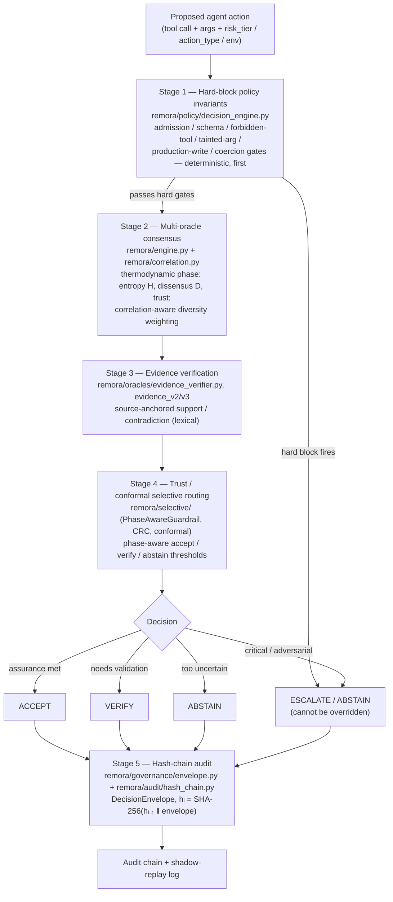
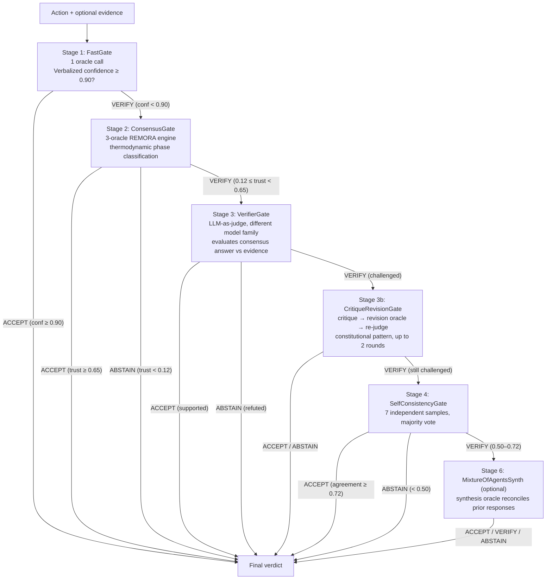

# REMORA Architecture

REMORA is a **pre-execution governance overlay for agentic AI actions**: given a
proposed tool call, it returns exactly one of **ACCEPT / VERIFY / ABSTAIN /
ESCALATE**, is conservative under uncertainty (it fails toward ABSTAIN or
ESCALATE rather than toward execution), and records every decision in a
SHA-256 hash-chained audit trail.

This document is the canonical top-level architecture reference. It describes the
system as it exists now. For the detailed numbered walkthrough see the `docs/`
series, beginning with [`docs/01-architecture.md`](docs/01-architecture.md); the
two are complementary and describe the same current governance architecture. Use
the diagrams as a map when reading the source.

---

## 1. What REMORA governs

REMORA governs **agent actions** — tool calls an autonomous agent proposes to
run (write to a database, send a payment, change infrastructure, call an external
API). It is not a fact-checker and does not answer questions. It sits between the
agent's decision to act and the action actually running, and decides whether that
specific proposed action is allowed to execute without a human.

| Outcome | Meaning | Autonomous action |
|---|---|---|
| **ACCEPT** | assurance conditions for unattended execution are met | permitted |
| **VERIFY** | plausible but validation is required first | pending |
| **ABSTAIN** | too uncertain to decide | blocked |
| **ESCALATE** | human review required | blocked, routed to a person |

`ACCEPT` does not assert the action is *correct*. It asserts the conditions for
running it without a human are verifiably met. REMORA governs **execution
permission**, not truth.

---

## 2. The canonical research claim (stated honestly)

**The safety floor is carried by the deterministic Stage-1 policy layer, not by
the probabilistic consensus / thermodynamic / Lyapunov machinery.**

On the 700-task adversarial tool-call benchmark (a deterministic simulator), the
uncertainty signal alone was not sufficient: the temperature-gate-only
configuration still left ~10% of unsafe actions executing. Adding the hard-block
policy rules closed unsafe execution to 0% (Wilson CI [0.00%, 0.55%]). The
hard-block rules account for **100%** of that reduction.

The consensus, entropy/dissensus, thermodynamic-phase, and Lyapunov components do
**not** contribute to the unsafe-execution safety floor. What they contribute is
**routing quality**: calibrated separation of the plausible-but-unverified cases
into VERIFY versus ABSTAIN. Do not cite REMORA's safety result as evidence for
the value of the consensus machinery — they are distinct claims backed by
distinct artifacts. See `docs/02-evidence-and-claims.md` §1 and
`NEGATIVE_RESULTS.md`.

---

## 3. The five-stage pipeline

A proposed action passes through five stages. **Stage 1 always runs first and its
hard-block invariants cannot be overridden by any probabilistic score** — a
confident, wrong majority cannot push an unsafe action through.



**Stage summary:**

1. **Hard-block policy invariants** (`remora/policy`) — deterministic gates that
   run before any vote is tallied. Adversarial input, malformed calls, forbidden
   tools, coercion/blackmail patterns, tainted arguments, and production-write
   without safeguards route straight to ESCALATE/ABSTAIN. This is the safety
   floor of §2.
2. **Multi-oracle consensus** (`remora/engine.py`, `remora/correlation.py`,
   `remora/thermodynamics`) — several oracle backends answer; a thermodynamic
   *phase* (ordered / critical / disordered) is derived from entropy `H`,
   dissensus `D`, and a trust score. Correlated oracles are down-weighted so
   echo-chamber agreement does not inflate confidence. "Thermodynamic" here is an
   operational uncertainty-routing metaphor, **not** a physics claim.
3. **Evidence verification** (`remora/oracles/evidence_verifier.py`,
   `evidence_v2.py`, `evidence_v3.py`) — where evidence is available, checks
   whether cited sources support or contradict the candidate. Relation detection
   is lexical (token overlap + negation heuristic), pluggable for a future NLI
   upgrade.
4. **Trust / conformal selective routing** (`remora/selective`) — the
   `PhaseAwareGuardrail`, conformal risk control (`conformal.py`), and the
   weight-corrected CRC (`crc.py`) map the phase and trust state to
   accept/verify/abstain, with phase-specific thresholds (the critical phase is
   handled by score inversion — see §8).
5. **Hash-chain audit** (`remora/governance/envelope.py`,
   `remora/audit/hash_chain.py`) — the decision is written as a
   `DecisionEnvelope` and hash-chained. The record is **tamper-evident**, not
   tamper-proof.

---

## 4. Component map

| Area | Location | Role |
|---|---|---|
| **Policy engine** | `remora/policy/decision_engine.py` | `RemoraDecisionEngine.decide(obs) -> DecisionReport`; ordered hard-block-first ladder; `explain()` reproduces the full rule-by-rule trace |
| Policy support | `remora/policy/invariants.py`, `trap_classifier.py`, `opa_adapter.py` | machine-checked safety invariants; irreversibility/impact trap scoring; OPA/Rego integration with a Python fallback |
| **Governance envelope** | `remora/governance/envelope.py` | `DecisionEnvelope` (v2) + `AuditBlock` — the canonical governance contract |
| **Cascade pipeline** | `remora/cascade/` | staged execution: `FastGate` → `ConsensusGate` → `VerifierGate` → `CritiqueRevisionGate` → `SelfConsistencyGate` → `MixtureOfAgentsSynth` (see §5) |
| **Consensus core** | `remora/engine.py`, `remora/correlation.py` | multi-oracle consensus loop; rolling correlation matrix and diversity weights |
| **Uncertainty observables** | `remora/thermodynamics/`, `remora/statphys/` | entropy `H`, dissensus `D`, value `V` as an uncertainty-routing metaphor (not physics) |
| **Selective prediction** | `remora/selective/` | `conformal.py`, `crc.py` (weight-corrected slack), `pvd.py`, `guardrail.py` (`PhaseAwareGuardrail`), `drift_detector.py` |
| **Oracles (pluggable)** | `remora/oracles/` | interchangeable backends — see §6 |
| **Audit chain** | `remora/audit/hash_chain.py` | SHA-256 hash chain; tamper-**evident** |
| **Governance API** | `servers/api.py` | FastAPI governance gateway |
| **MCP server** | `servers/mcp_remora.py` | Model Context Protocol tool suite (`remora_verify_claim`, `remora_analyze_document`, `remora_rag_query`, `remora_norwegian_law_search`, `agent_start_session`, `agent_execute_tool`, `remora_session_status`, …) |
| **Edge workers** | `workers/` | `agent-control`, `rag-oracle`, `law-search`, `aromer` (see §5.4) |
| **Learning overlay** | `remora/aromer/` | AROMER — experimental, shadow-only (see §5.5) |

### 5.1 Cascade Pipeline (`remora/cascade/`)

The cascade pipeline is the primary execution path. It invests compute
proportionally to query difficulty: simple high-confidence actions exit at
Stage 1; uncertain or contested ones pass through progressively more expensive
verification stages.

```
remora/cascade/
|- engine.py   # CascadeEngine — assembles and runs all stages
|- stages.py   # FastGate, ConsensusGate, VerifierGate, CritiqueRevisionGate, SelfConsistencyGate
\- result.py   # CascadeResult, StageResult, CascadeVerdict, CascadeStage
```



| Stage | Class | Oracle calls | Exit condition |
|-------|-------|-------------|----------------|
| 1 | `FastGate` | 1 | Verbalized confidence ≥ `cascade_fast_threshold` (0.90) |
| 2 | `ConsensusGate` | 3–12 (router-gated) | Trust ≥ `cascade_consensus_accept_threshold` (0.65) or < `cascade_consensus_abstain_threshold` (0.12) |
| 3 | `VerifierGate` | 1 | Judge outcome SUPPORTED or REFUTED |
| 3b | `CritiqueRevisionGate` | 2 × rounds (`cascade_critique_max_rounds` = 2) | Revised answer accepted/refuted; else to Stage 4 |
| 4 | `SelfConsistencyGate` | `cascade_sc_samples` (7) | Terminal on ACCEPT/ABSTAIN; VERIFY passes to Stage 6 when a synthesis oracle is set |
| 6 | `MixtureOfAgentsSynth` | 1 | Optional; runs only when `synthesis_oracle` is set and Stage 4 returned VERIFY |

Key properties: a `budget_oracle_calls` cap halts early and returns VERIFY when
the call budget is exhausted; each stage's judge/oracle is intentionally a
different model family to avoid shared failure modes; every early-exit path
includes ABSTAIN as a reachable outcome (fail-conservative); Stage 2 wraps the
full `remora.engine.Remora` (thermodynamic phase, conformal guardrail, policy
engine, assurance trace) according to the active Genome flags.

### 5.2 Governance envelope (`remora/governance/envelope.py`)

`DecisionEnvelope` (v2) is the canonical governance contract and is kept stable.
It packages the action, the decision, the reasons, the trust/risk state, and an
`AuditBlock`. Every decision produces one; the envelopes are hash-chained by
`remora/audit/hash_chain.py` (`hᵢ = SHA-256(hᵢ₋₁ ‖ envelope)`). Any modification
breaks the chain, so the record is **tamper-evident**. Tamper-*proofing* requires
an external append-only (WORM) store as a deployment dependency.

### 5.3 Selective prediction (`remora/selective/`)

| Module | Role |
|---|---|
| `guardrail.py` | `PhaseAwareGuardrail` — phase-specific accept/verify/abstain routing; inverts the selection score in the critical phase (§8) |
| `conformal.py` | split-conformal risk control with finite-sample coverage bookkeeping |
| `crc.py` | conformal risk control with the weight-corrected slack term |
| `pvd.py` | Prover-Verifier Deliberation — semantic-entropy clustering of oracle responses blended with a verifier confidence signal (no LLM calls; deliberation rounds are simulated) |
| `binomial_bounds.py` | Clopper–Pearson / binomial upper confidence bounds on empirical risk |

### 5.4 Interfaces: API, MCP, and edge workers

- **`servers/api.py`** — FastAPI governance gateway.
- **`servers/mcp_remora.py`** — MCP server exposing REMORA as a tool suite to
  Claude Desktop and compatible hosts (stdlib `urllib` only). Profiles: `local`,
  `demo`, `enterprise`.
- **`workers/`** — Cloudflare edge workers, all fail-closed on authentication
  (missing `ORACLE_SECRET` / `CONTROL_SECRET` → reject, never silently permit):

  | Worker | Directory | Primary endpoints |
  |---|---|---|
  | `agent-control` | `workers/agent-control/` | `POST /decide`, `POST /tool-call`, `GET /audit` (auth), `GET /status` |
  | `rag-oracle` | `workers/rag-oracle/` | `POST /query`, `POST /ingest` (auth) |
  | `law-search` | `workers/law-search/` | `POST /search` |
  | `aromer` | `workers/aromer/` | AROMER learning-loop endpoints (`/decide`, `/adapt`, `/outcome`, `/log`, `/intelligence`) |

  Worker URLs are configurable at runtime (`REMORA_WORKER_URL`, `RAG_WORKER_URL`,
  `LAW_SEARCH_WORKER_URL`); hardcoded URLs are not used in production paths.

### 5.5 AROMER learning overlay (`remora/aromer/`)

AROMER is a closed-loop meta-cognitive layer that runs alongside REMORA and
learns from decision outcomes (episodic memory, Bayesian world-model priors, a
Workers-AI meta-judge, a replay arena). **AII** ("Autonomous Intelligence Index") is a
composite index over five weighted components (calibration, friction, meta-judge,
transfer, stability). AROMER is **experimental and shadow-only**: episode labels
are partly self-assigned and the world model defaults to shadow mode. It has **no
external validation**. Do not cite AROMER numbers as production evidence. See
`docs/aromer_learning_evidence_v1.md` and `NEGATIVE_RESULTS.md`.

---

## 6. Oracles are pluggable backends, not the purpose

The oracles in `remora/oracles/` are **interchangeable backends** that supply
answers to the consensus stage. They are an implementation detail of Stage 2, not
the purpose of the system.

| Backend | Class | Notes |
|---|---|---|
| Cloudflare Workers AI | `CloudflareOracle` | edge inference |
| Cloudflare RAG | `CloudflareRAGOracle` | retrieval-augmented (source-anchored) |
| Groq | `GroqOracle` | Llama-family via Groq API |
| Ollama | `OllamaOracle` | local models |
| Gemini | `GeminiOracle` | Google Gemini |
| Hugging Face | `HuggingFaceOracle` | HF inference |
| OpenRouter | `OpenRouterOracle` | gateway to many models (e.g. Anthropic Claude, `openai/gpt-4o`, Gemma) |
| Mock | `MockOracle` | deterministic test stub |

`remora/oracles/factory.py` assembles diverse swarms (mixing providers/families
to reduce correlated failure). `remora/oracles/diversity.py` provides
`OracleDiversityTracker`, which accumulates pairwise agreement history so the
engine can select the most historically-diverse oracles and down-weight
correlated pairs. OpenAI-family models are reachable through the OpenRouter
backend; there is no standalone OpenAI oracle class.

---

## 7. Genome hyperparameters

`remora/genome.py::Genome` is the evolvable hyperparameter bundle for a single
REMORA run. Current defaults:

| Parameter | Default | Effect |
|---|---|---|
| `max_iterations` | 4 | max oracle sweeps per sub-question |
| `max_subquestions` | 2 | decomposition breadth |
| `converged_threshold` | **0.75** | weighted support needed for early exit |
| `entropy_abort_ratio` | 1.3 | ε tolerance for V increase before abort |
| `negation_weight` | 0.4 | λ — dissensus contribution to the Lyapunov value |
| `thermo_lambda` | 0.4 | dissensus weight in the thermodynamic phase metric |
| `divergent_boost` | 0.5 | boost applied to divergence signal |
| `negation_ratio` | 0.25 | fraction of iterations using negation prompts |
| `decomposition_strategy` | `"simple"` | question-splitting strategy |
| `early_exit_on_convergence` | `True` | allow early exit once converged |
| `enable_routing` | `False` | pre-sweep router gate disabled by default |
| `router_mode` | `RouterMode.BALANCED` | router threshold strategy (STRICT/BALANCED/HYBRID) |
| `router_confidence_min` | 0.80 | min avg confidence for HYBRID to skip |
| `enable_thermodynamic_control` | `False` | experimental thermodynamic pre-router |
| `trust_threshold_high` | 0.45 | thermodynamic high-trust bound |
| `trust_threshold_low` | 0.08 | thermodynamic low-trust bound |
| `hallucination_threshold` | 0.05 | candidate hallucination-bound proxy |
| `enable_cascade` | `False` | enable the cascade pipeline (§5.1) |
| `cascade_fast_threshold` | 0.90 | Stage 1 verbalized-confidence accept |
| `cascade_consensus_accept_threshold` | 0.65 | Stage 2 accept |
| `cascade_consensus_abstain_threshold` | 0.12 | Stage 2 abstain |
| `cascade_verify_threshold` | 0.70 | Stage 3 judge accept |
| `cascade_sc_samples` | 7 | Stage 4 self-consistency samples |
| `cascade_sc_threshold` | 0.72 | Stage 4 agreement accept |
| `cascade_max_stages` | 4 | stage cap |
| `cascade_critique_max_rounds` | 2 | Stage 3b rounds |
| `enable_conformal_guardrail` | `False` | split-conformal accept/verify/abstain |
| `conformal_target_risk` | 0.05 | target empirical risk |
| `enable_evidence_v2` | `False` | source-anchored evidence oracle |
| `evidence_v2_min_reliability` | 0.5 | min source reliability |
| `evidence_v2_min_support` | 2 | min supporting claims to answer |
| `enable_semantic_claim_graph` | `False` | claim-graph topology metrics |
| `enable_assurance_trace` | `False` | Merkle-anchored audit trace |
| `enable_counterfactual_v2` | `False` | claim-type-aware counterfactual test |
| `enable_parallel_fanout` | `True` | fan oracle calls out in parallel |

`LyapunovParams` (`remora/lyapunov.py`) defaults:

| Parameter | Default | Meaning |
|---|---|---|
| `lambda_dissensus` | 1.0 | dissensus weight in V = H + λ·D (+ μ·cost) |
| `mu_cost` | 0.0 | cumulative-cost weight |
| `epsilon_tolerance` | 0.05 | ΔV tolerance before the abort gate fires |
| `min_window` | 2 | warm-up steps before stability is measured |

Note: the engine wires the running controller from Genome fields
(`remora/engine.py`), so a live consensus run uses `lambda_dissensus =
negation_weight` (0.4) and an epsilon derived from `entropy_abort_ratio`; the
values above are the `LyapunovParams` dataclass defaults.

---

## 8. The critical-phase inversion (why routing is phase-aware)

In the hardest ("critical") cases, the trust score **anti-correlates** with
correctness — low-trust items were more often correct than high-trust ones (a
trust inversion, N=32 critical items total; small sample, published as a negative
result). A naive conformal guardrail at a 5% risk target collapses to 100%
observed risk / 0 coverage in this regime. REMORA does not trust the score here;
`PhaseAwareGuardrail` **inverts** the selection score for the critical phase and
routes around the inversion rather than through it. This is the concrete reason
selective routing is phase-aware rather than a single global threshold. See
`docs/02-evidence-and-claims.md` §3 and `NEGATIVE_RESULTS.md`.

---

## 9. Module Stability Index

| Module | Stability | Notes |
|--------|-----------|-------|
| `remora/core.py` | **CORE** | Oracle ABC + OracleResponse |
| `remora/engine.py` | **CORE** | Multi-oracle consensus engine |
| `remora/genome.py` | **CORE** | Hyperparameter configuration |
| `remora/policy/` | **CORE** | PolicyObservation → DecisionReport pipeline (hard-block-first) |
| `remora/adapters/` | **CORE** | LangGraph, OpenAI, MCP adapters |
| `remora/governance/` | **CORE** | DecisionEnvelope v2 + AuditBlock |
| `remora/safety/` | **CORE** | Adversarial firewall, AST guard |
| `remora/audit/` | **CORE** | SHA-256 hash-chain (tamper-evident) |
| `remora/selective/` | **CORE** | Conformal / CRC / PhaseAwareGuardrail |
| `remora/lyapunov.py` | **EXPERIMENTAL** | Lyapunov stability controller for consensus iteration |
| `remora/thermodynamics.py` | **EXPERIMENTAL** | Thermodynamic uncertainty-routing proxy |
| `remora/causal/intervention.py` | **EXPERIMENTAL** | Do-calculus causal stress testing |
| `remora/topology.py` | **EXPERIMENTAL** | Topological Data Analysis (TDA) |
| `remora/cascade/` | **EXPERIMENTAL** | Multi-stage cascade pipeline |
| `remora/aromer/` | **EXPERIMENTAL** | AROMER meta-learning loop (shadow-only) |
| `remora/causal/` | **EXPERIMENTAL** | Causal PS/PN scoring and concept attribution |
| `remora/statphys/` | **RESEARCH_ONLY** | Statistical-physics uncertainty models |
| `remora/future_concept/` | **RESEARCH_ONLY** | Forward-looking research concepts |

> **Backwards compatibility:** CORE modules follow semantic versioning.
> EXPERIMENTAL APIs may change in minor releases. RESEARCH_ONLY modules carry no
> BC guarantee and are not production-certified.

---

## 10. Scope and maturity

REMORA is a **research-grade reference architecture**, not a certified product,
not a guarantee of safety, and not a replacement for domain authority.

- **Deployment status: SHADOW_ONLY.** The system is intended to be run beside an
  agent (Shadow Mode) and does not have a production-certified enforcement mode.
- **Production gates:** `REM-022` (RBAC audit) is **DONE** (2026-06-30). `REM-020`
  (longitudinal false-accept stability: AII EMA ≥ 0.80 for 7 calendar days with
  FAR = 0.0% throughout) is **open**, eligible to close no earlier than
  2026-07-05 (see `docs/assurance/release_gates.md` and
  `results/longitudinal_stability_v1.json`). `REM-021` (independent human review) is **open** (not started).
  Deployment status cannot advance past SHADOW_ONLY until REM-020 and REM-021 are
  cleared.
- **External replication is pending.** All benchmarks are internally run; no
  external live-agent validation has been conducted.
- **Result scope:** reported results are simulator-scoped or post-hoc over
  committed artifacts where noted (the 0% unsafe-execution result is a
  deterministic simulator; the selective-accuracy hold-out accepted only ~25
  items, so its Wilson CI is wide — quote the CI, not the point estimate). The
  historically-labelled "N500" selective-prediction artifact currently has
  **544 evaluable items** ("N500" is a legacy name, not the item count).
- **Semantic-entropy caveat:** the reported headline numbers use a
  **token-fingerprint heuristic** (sorted SHA-256 tokens), **not** the NLI-based
  Semantic Entropy backend. The NLI backend exists as a drop-in but was not used
  for any reported result. State this plainly whenever the uncertainty numbers
  are quoted.

Full claim → evidence → artifact → caveat map: `docs/02-evidence-and-claims.md`.
Negative results: `NEGATIVE_RESULTS.md`.

---

## 11. Evolution

REMORA began as a multi-oracle consensus research system for claim verification.
The current architecture generalizes that consensus core into a **governance
overlay for agent actions**; the full history is in git.

---

*Document scope: this document describes the current governance architecture. It
is the canonical architecture reference for this repository.*

*Author: Stian Skogbrott — https://github.com/darklordVirtual/REMORA*
