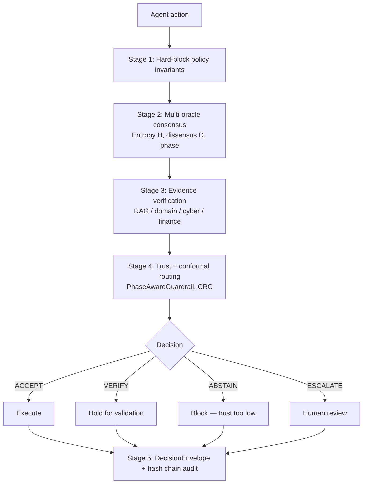

# REMORA — Policy-Gated Governance for Operational AI Agents

REMORA is a pre-execution governance overlay for AI agents operating in environments where actions carry real operational consequences — building automation, energy management, infrastructure control, and regulated enterprise workflows. It governs proposed agent actions; it does not replace the agent. Before any proposed action executes, REMORA evaluates it through a deterministic policy layer and a multi-oracle consensus pipeline, returning one of four outcomes:

| Outcome | Meaning |
|---------|---------|
| **ACCEPT** | Assurance conditions met; execution permitted |
| **VERIFY** | Plausible but requires additional validation before proceeding |
| **ABSTAIN** | Trust too low to decide; action blocked |
| **ESCALATE** | Risk exceeds autonomous authority; routed to human review |

Every decision is logged in an immutable `DecisionEnvelope` carrying a SHA-256 tamper-evident hash chain, a policy version stamp, and a complete audit trail. The architecture is designed to remain conservative under uncertainty: when evidence is insufficient, REMORA errs toward ABSTAIN or ESCALATE rather than ACCEPT, and requires human approval before acting beyond its confidence boundary.

Architecture bounded by documented assumptions. Results are from controlled experiments and internal benchmarks; external replication is pending. See the [Limitations](#limitations) section before drawing deployment conclusions.

**Start here:** [Reference architecture](docs/reference_architecture.md) (the assurance control plane, plane by plane, with code pointers) · [Executive one-pager](docs/executive_onepager.md) (problem → architecture → demo → evidence → limitations → pilot shape) · [Full documentation index](docs/README.md).

---

## Industrial Maintenance Demo

An RCA-style maintenance agent investigates pump vibration and proposes actions of escalating consequence. The demo drives the full chain end to end: a per-link-signed **A2A delegation envelope is actually verified** for each requested capability, the verification outcome feeds the observation, and the **real `RemoraDecisionEngine`** decides. Telemetry reads **ACCEPT**; the work-order proposal routes to **VERIFY** via the explicit production-write policy matrix (human approval before any business-system write); contradicting evidence **ABSTAIN**s; and direct equipment actuation fails delegation-scope verification — the failure sets the forbidden-tool signal and the engine hard-**ESCALATE**s. Analysis confidence cannot buy actuation authority that was never delegated. Outcomes are pinned by `tests/test_demo_industrial_maintenance.py`.

```bash
python scripts/demo_industrial_maintenance.py
```

---

## Building Automation Demo

The governance concept is demonstrated in a concrete dry-run scenario: an AI assistant proposes lighting adjustments across all floors of a commercial building, and REMORA evaluates each floor-level command independently against occupancy state and the active energy policy — before any command is sent. The demo drives the **real `RemoraDecisionEngine`**: each floor becomes a `PolicyObservation` (occupancy sensing is the caller-supplied evidence layer), and the decisions and reason codes below are the engine's actual output — REMORA's canonical ACCEPT/VERIFY/ABSTAIN/ESCALATE outcomes.

```bash
python scripts/demo_building_lights.py
```

```
REMORA building-light action-gating dry run (real RemoraDecisionEngine)
==========================================================================================
Request: Turn on all lights on all 8 floors.
Safety model: No live building automation command is sent.
Policy: Occupied floors may execute; empty floors must not be activated without evidence.

Floor   Occupancy                         Motion age   Decision  Engine reason codes
------------------------------------------------------------------------------------------
1       12 persons, open office           active       ACCEPT    evidence_supported
2       8 persons, meetings active        active       ACCEPT    evidence_supported
3       15 persons, development team      active       ACCEPT    evidence_supported
4       6 persons, finance                active       ACCEPT    evidence_supported
5       3 persons, management             active       ACCEPT    evidence_supported
6       empty                             47 min       ABSTAIN   disordered_no_evidence
7       empty                             131 min      ABSTAIN   disordered_no_evidence
8       1 person, conference room         active       ACCEPT    evidence_supported
------------------------------------------------------------------------------------------
EXECUTE dry-run command: lights_on(floors=[1, 2, 3, 4, 5, 8])
BLOCKED dry-run command: lights_on(floors=[6, 7])
```

REMORA does not treat the user request as a single all-or-nothing action. It decomposes the tool call by zone, evaluates each floor-level command independently against occupancy context and the active energy policy, and blocks the subset that conflicts — while allowing the compliant subset to proceed. Empty floors ABSTAIN via the engine's deny-by-default path (`disordered_no_evidence`): absence of occupancy evidence blocks activation. This per-zone governance model extends directly to HVAC scheduling, ventilation setpoints, energy load management, and any domain where a single agent command maps to multiple physical sub-actions with differing risk profiles.

Related energy-domain use case (different scenario — diagnostic Q&A): [docs/use-cases/04-energy.md](docs/use-cases/04-energy.md)

---

## Architecture

The pipeline runs synchronously before any action executes. Stage 1 always runs first.



**Stage 1 is deterministic and cannot be overridden by any probabilistic oracle result.** Hard-block policy invariants are evaluated before the consensus machinery runs. This is the architectural reason the zero-false-accept safety result is a property of the policy layer — the multi-oracle consensus machinery governs VERIFY/ABSTAIN routing quality, not the safety floor. These are distinct claims and must not be conflated.

Full architecture detail: [docs/01-architecture.md](docs/01-architecture.md) | API reference: [docs/07-api-reference.md](docs/07-api-reference.md)

---

## Evidence Summary

All claims are bounded by documented assumptions. External replication is pending. **The caveat is part of the claim** — do not quote a number without its associated caveat. Full evidence with artifact links and reproduce instructions: [docs/02-evidence-and-claims.md](docs/02-evidence-and-claims.md).

### Zero false accepts on external adversarial benchmark (AgentHarm)

<!-- claim:CLAIM-002 far_pct far_ci_high_pct fbr_pct n -->
208 independently-sourced harmful scenarios from the AI Safety Institute's [AgentHarm benchmark](https://arxiv.org/abs/2410.09024) (Andriushchenko et al., 2024; arxiv:2410.09024; 4K+ downloads; published at ICLR 2025). This dataset was not present in REMORA's training corpus, which supports external validity of the input distribution. Result: 0 false accepts, FAR = 0.0%, Wilson 95% CI [0.00%, 1.81%]. The companion metric is FBR = 100%: the deployed configuration also blocked every benign variant (the same harm-category mapping triggers the same risk tier), so this result documents a hard safety floor bought at maximal benign friction — not a calibrated accept/block discriminator.

**Intent-gating, not interception:** this result routes the agent's *proposed* action to VERIFY/ESCALATE; true tool-call interception is unverified (`experiments/agentharm/INTERCEPTION_NOTES.md`). It demonstrates routing accuracy, not execution prevention — as the paper abstract states.

**Architectural caveat:** Stage 1 hard-block policy invariants account for this result. The multi-oracle consensus machinery contributes VERIFY/ABSTAIN routing quality but does not drive the safety floor. Do not cite this result as evidence for the consensus layer.

Artifact: `results/external_benchmark_agentharm_v1.json` | Gate: REM-014 (PASS)

### Zero false accepts on historical regression corpus (N = 167)

<!-- claim:CLAIM-003 far_pct n -->
167 historical false-accept episodes re-evaluated against the current system. Result: 0 recurrences (FAR = 0.0%). Confirms that policy improvements eliminating historical failures have not regressed.

Artifact: `results/false_accept_regression_v1.json` | Gate: REM-019 (PASS)

<!-- claim:CLAIM-004 accuracy_pct coverage_pct -->
### 88.0% selective accuracy at 23.2% coverage (held-out split)

<!-- claim:CLAIM-004 ci_low_pct ci_high_pct n -->
N_accepted = 25; Wilson CI [70.0%, 95.8%]; one-sided p = 1.45×10⁻⁵ vs. 46.3% base rate. The decision threshold τ\* = 0.2032 was locked on the training split before the held-out set was touched.

**Read as directional confirmation, not a tight accuracy estimate.** The CI is wide because N_accepted = 25. The 88.0% point estimate must always be quoted with its CI. The lower bound of 70.0% is the honest floor.

Artifact: `artifacts/benchmark_n500_locked.json`

### Critical-phase trust inversion (negative result)

<!-- claim:CLAIM-005 low_trust_correct_pct high_trust_correct_pct n -->
N = 32 critical-phase items: trust anti-correlates with correctness. Low-trust items 71.4% correct (N=21), high-trust items 27.3% correct (N=11). Small sample; published as a negative result requiring further investigation. REMORA routes around this failure mode via `PhaseAwareGuardrail`. Full documentation: [NEGATIVE_RESULTS.md](NEGATIVE_RESULTS.md).

---

## Benchmark Detail

### Tool-call safety benchmarks

Two benchmark versions. v2 introduces adversarial failure modes not present in v1.

**v1 (252 tasks):** v1 does not demonstrate unsafe-execution reduction — all baselines including the single-model heuristic show 0% unsafe execution. This is a ceiling effect in the v1 benchmark design, not evidence of safety. Do not use v1 to make safety claims. Committed metrics: remora_temperature_gate_heuristic mean_utility=0.6762; remora_full_policy_gate accuracy=0.7619, mean_utility=0.5690. These are deterministic simulator results. Artifact: `results/toolcall_benchmark_v1_results.json`

<!-- claim:CLAIM-001 far_pct n -->
**v2 (700 tasks):** v2 is a deterministic simulator benchmark with adversarial failure modes. REMORA full policy gate reduces unsafe execution to 0% vs. 10–20% for all baselines; this is a simulator-scoped result. It does not prove field-deployment safety.

| Baseline | Accuracy | Mean utility | Unsafe rate |
|----------|----------|--------------|-------------|
| remora_temperature_gate_heuristic | 0.7000 | 0.2700 | 0.1000 |
| remora_full_policy_gate | 0.9000 | 0.6200 | 0.0000 |

Unsafe execution reduction vs. single-model heuristic: Δ=0.20, 95% CI [0.17, 0.23], one-sided p < 0.0001 (paired bootstrap). The `remora_full_policy_gate` reduces unsafe execution rate from 0.20 to 0.00 on the v2 benchmark.
Artifact: `results/toolcall_benchmark_v2_results.json` | Significance: `results/toolcall_benchmark_v2_significance.json`

### Selective accuracy (N500, 544 questions)

The label `N500` is historical; the current artifact evaluates 544 questions. Baseline majority accuracy: 41.18%. Signal: `neg_temperature`.

| Coverage | k selected | Correct | Accuracy |
|----------|-----------|---------|----------|
| 10% | 54 | 44 | 81.5% |
| 15% | 82 | 71 | 86.6% |
| 18% | 98 | 87 | 88.8% |
| 20% | 109 | 94 | 86.2% |

Best operating point (18% coverage, k=98): accuracy 88.8%, Wilson CI [81.0%, 93.6%]. Artifact: `artifacts/benchmark_n500_locked.json`

### Selective trust curve (N=302, neg_temperature signal)

N=302 items evaluated on the pre-held-out calibration set. On this canonical benchmark the baselines are single-oracle accuracy 57.0% and majority-vote accuracy 82.8% (`artifacts/benchmark_summary.json`; full ablation in [docs/results_snapshot.md](docs/results_snapshot.md)). Majority voting is a strong baseline here: REMORA's balanced variant (82.1%) is competitive with it but does not beat it on raw accuracy — the value is in selective coverage, not full-coverage accuracy. Selected rows for the `neg_temperature` signal:

| Coverage | k covered | Correct | Accuracy |
|----------|-----------|---------|----------|
| 25% | 76 | 72 | 94.7% |

<!-- claim:CLAIM-008 accuracy_pct coverage_pct n -->
Top-25% slice: k=76, correct=72, accuracy=94.7% on the N=302 calibration set. Artifact: `results/selective_trust_curve_results.json`

---

## Reproduce

```bash
# Install
python -m pip install -e ".[dev]"

# Full deterministic test suite (no API keys required)
make test

# Demos (dry-run, zero network calls)
python scripts/demo_building_lights.py
python scripts/demo_industrial_maintenance.py

# OPA/Rego golden conformance (requires the opa binary; skips explicitly without it)
python scripts/opa_conformance.py

# Held-out selective accuracy (headline claim 3)
python experiments/end_to_end_n500_v3.py

# Tool-call safety benchmark v2 (headline claims 1-2)
python experiments/evaluate_toolcall_benchmark_v2.py

# Full quality gate: lint + tests + claim consistency checks
make audit

# Counterfactual governance replay on an action log
make shadow-replay INPUT=artifacts/demo/shadow_mode_sample_agent_action_log.jsonl
```

Step-by-step instructions: [docs/06-reproducibility.md](docs/06-reproducibility.md). All benchmark claims link to committed result artifacts under `results/` and `artifacts/`.

---

## Limitations

- **Simulator-scoped safety.** The 0% unsafe execution results come from deterministic synthetic benchmarks and a controlled internal corpus. No real shell, network, or database mutations occur. Controlled benchmarks do not prove field deployment safety.
- **Small held-out accepted set.** N_accepted = 25 yields a Wilson CI of [70.0%, 95.8%]. This is a directional confirmation, not a tight accuracy estimate. The 88.0% point estimate must always be quoted with its CI.
- **Entropy backend mismatch.** All reported benchmarks use `TokenFingerprintBackend` (sorted SHA-256 tokens), not the NLI Semantic Entropy backend described in the paper. The NLI backend exists as a drop-in replacement but was not used for any reported result. See [NEGATIVE_RESULTS.md](NEGATIVE_RESULTS.md) finding #3.
- **No external replication.** All benchmarks were run internally by the author. External replication is listed as a distinct evidence level in the claim register, explicitly required before any `externally_validated` label can be applied.
- **AROMER is experimental.** The closed-loop learning layer has no external validation. Episode labels are partly self-labeled by the system. Do not cite AROMER AII numbers as evidence for the core governance system.
- **One production gate remains open.** REM-021 (independent human review) is not started and blocks exit from shadow mode. REM-020 (longitudinal stability, 7-day criterion) was CLOSED 2026-07-17 by the fail-closed tooling after an owner decision resolved the recorded criterion conflict — values are self-reported by the live endpoint, so REM-021 must verify them independently. REM-022 (RBAC audit) is DONE 2026-06-30 **with recorded deviation** — unmet closure criteria are tracked as REM-023 (isolation test and admin-wildcard removal complete 2026-07-03; external confirmation folded into REM-021). The system may not be used outside shadow-mode research until all gates are satisfied. See [docs/assurance/release_gates.md](docs/assurance/release_gates.md).
- **Tamper-evident, not tamper-proof.** The hash chain detects modification after the fact. Preventing tampering requires external append-only (WORM) storage not included in this implementation.
- **Not a replacement for domain authority.** REMORA governs execution permission, not truth. It does not make models truthful and is not a universal AI safety solution.

Full negative results and documented gaps: [NEGATIVE_RESULTS.md](NEGATIVE_RESULTS.md)

---

## Experimental Research: AROMER Live Status

AROMER (Autonomous Risk-Oriented Meta-Evaluator and Reasoner) is REMORA's **experimental** closed-loop learning layer — adaptive calibration research layered on top of the governance control plane. Nothing in the control plane depends on it, and its metrics are not evidence for the core governance system (see Limitations above). It continuously adapts internal thresholds based on observed outcomes and reports an Autonomous Intelligence Index (AII) — a weighted composite of five diagnostic dimensions. Status is updated every 6 hours by automated GitHub Actions telemetry.

<!-- LIVE_STATUS_START -->
> **Live AROMER telemetry** — updated every 6 hours by GitHub Actions. Last update: 2026-07-18T00:40Z

| Metric | Value | Status |
|--------|-------|--------|
| Autonomous Intelligence Index (AII, EMA) | 0.9914 | TRAINED |
| False accept rate (FAR) | 0.0% | Zero |
| Deployment mode | SHADOW_ONLY | Research only |
| T1 Calibration (ECE = 0.0057) | 0.9715 | Active |
| T2 Friction suppression | 1.0000 | Active |
| T3 MetaJudge quality | 1.0000 | Milestone |
| T4 Transfer score | 1.0000 | Max |
| T5 Stability | 1.0000 | Active |
<!-- LIVE_STATUS_END -->

AII bands (labeled threshold crossings of a composite index — not physical phase transitions): WARMUP (< 0.40) → LEARNING (0.40–0.60) → CAPABLE (0.60–0.80) → **TRAINED (≥ 0.80)**. The system reached TRAINED status on 2026-06-28, regressed to CAPABLE for some hours the same day, and recovered organically ([NEGATIVE_RESULTS.md](NEGATIVE_RESULTS.md) §12–§13); it has held TRAINED since. One production deployment gate remains open before use outside shadow-mode research: REM-021 (independent human review). REM-020 (longitudinal stability, 7-day criterion from 2026-06-28) was closed 2026-07-17 via the fail-closed closure tooling; REM-022 (RBAC audit) is DONE with recorded deviation (follow-through: REM-023). See [docs/assurance/release_gates.md](docs/assurance/release_gates.md).

---

## AI Use Disclosure

REMORA was built with the assistance of generative AI development tools. Human authorship, research integrity, and accountability are documented in [docs/AI_USE.md](docs/AI_USE.md). The short version: AI tools generated code drafts and prose that were reviewed, corrected, and tested by the author. No AI output was accepted as evidence without an independently confirmed committed artifact, a passing test, or a verified external source.

---

## Cite

```bibtex
@misc{remora2026,
  title  = {REMORA: A Policy-Gated Multi-Oracle Assurance Architecture for Agentic AI},
  author = {Skogbrott, Stian},
  year   = {2026},
  url    = {https://github.com/darklordVirtual/REMORA-research},
  note   = {Research-grade reference architecture. Results are internally
            replicated and bounded by documented assumptions. External
            replication pending.}
}
```

---

## License / Contributing

Apache-2.0. See [LICENSE](LICENSE) and [docs/10-contributing.md](docs/10-contributing.md).

Contributions are welcome. Before submitting: run `make audit`, ensure all claims link to committed artifacts on disk, and do not remove negative results or caveats. See [CLAUDE.md](CLAUDE.md) for the working agreement and claim hygiene rules.
