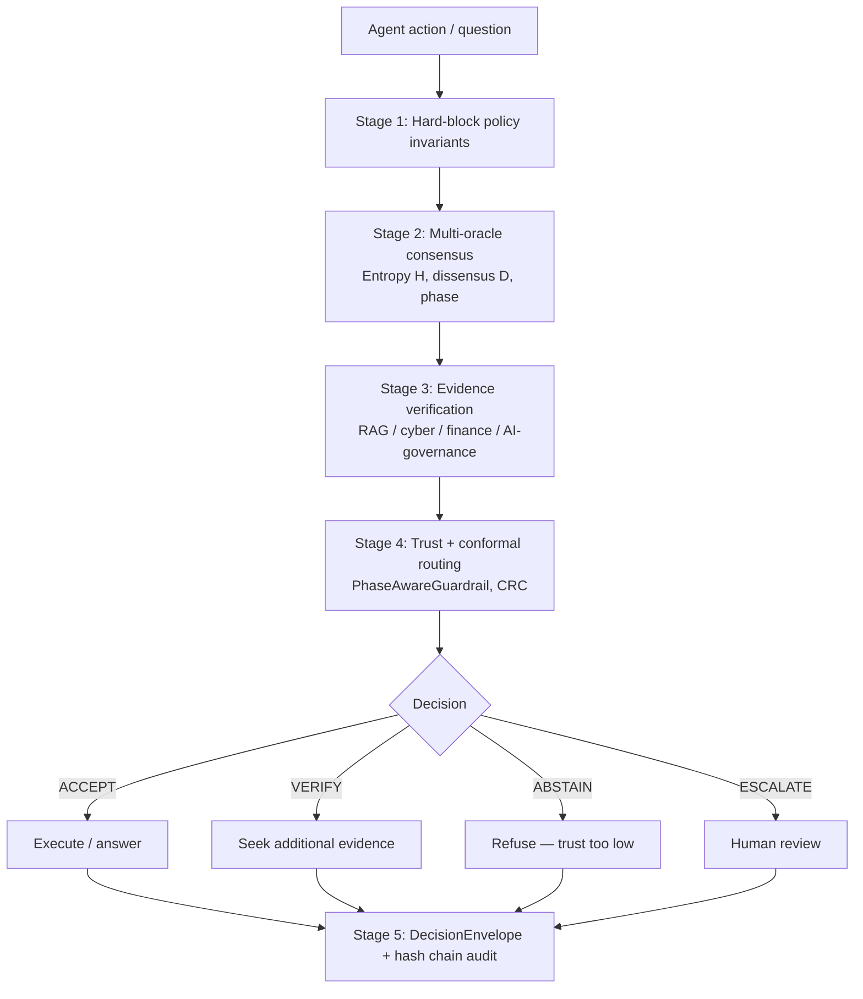

# REMORA: Policy-Gated Multi-Oracle Assurance for Agentic AI

REMORA is a pre-execution governance layer for autonomous AI agents. Before any
proposed action runs, REMORA gates it through deterministic hard-block policy
invariants and a multi-oracle consensus pipeline, returning one of four outcomes:
**ACCEPT** (assurance conditions met, execution permitted), **VERIFY** (plausible
but validation required, held pending), **ABSTAIN** (trust too low to decide,
blocked), or **ESCALATE** (human review required, routed to a person). Every
decision is recorded in an immutable `DecisionEnvelope` with a SHA-256
tamper-evident hash chain. The architecture is bounded by documented assumptions:
results come from controlled simulators and internal benchmarks, not live
deployments.

## Headline findings

All claims are bounded by documented assumptions and internally replicated.
External replication is pending. See [docs/02-evidence-and-claims.md](docs/02-evidence-and-claims.md)
for the full evidence, artifact, caveat, and reproduce map. The caveat is part
of the claim — quote the caveat with the number, or do not quote the number.

- **0% unsafe execution** on a 700-task adversarial tool-call benchmark (Wilson
  95% CI [0.00%, 0.55%] — "at most ~1 in 180", not "never"). The benchmark is a
  deterministic simulator; no real shell/network/database mutations occur.
  Architectural caveat: the hard-block policy rules alone account for 100% of
  this reduction. The multi-oracle consensus machinery contributes calibration
  and routing quality for VERIFY/ABSTAIN decisions but does not drive the safety
  floor. Do not cite this result as evidence for the consensus layer.
- **88.0% selective accuracy** at 23.2% coverage on a stratified held-out split
  (N_accepted=25; Wilson CI [70.0%, 95.8%]; one-sided p=1.45×10⁻⁵ vs. 46.3%
  base rate). The decision threshold τ\*=0.2032 was locked on the training split
  before the held-out set was touched. The lower bound of 70.0% is the honest
  floor; the CI is wide because N_accepted=25. Read as directional confirmation,
  not a tight accuracy estimate.
- **Critical-phase trust inversion** (N=32 critical-phase items): trust
  anti-correlates with correctness — low-trust items 71.4% correct (N=21),
  high-trust items 27.3% correct (N=11). Small sample; published as a negative
  result. REMORA routes around this failure mode via `PhaseAwareGuardrail`. See
  [NEGATIVE_RESULTS.md](NEGATIVE_RESULTS.md).

## Architecture



Stage 1 always runs first. Hard-block policy invariants are deterministic and
cannot be overridden by any probabilistic oracle result. This is why the 0%
unsafe execution result is an architectural property of the policy layer, not of
the consensus machinery.

Details: [docs/01-architecture.md](docs/01-architecture.md) and
[docs/07-api-reference.md](docs/07-api-reference.md).

## Benchmark detail

### Selective accuracy (N500 artifact, 544 questions)

The label `N500` is historical; the committed artifact evaluates 544 questions.
Baseline majority accuracy: 41.18%. Results use `neg_temperature` signal.

| Coverage | k selected | Correct | Accuracy |
|----------|-----------|---------|----------|
| 10%      | 54        | 44      | 81.5%    |
| 15%      | 82        | 71      | 86.6%    |
| 18%      | 98        | 87      | 88.8%    |
| 20%      | 109       | 94      | 86.2%    |

Best operating point (18% coverage, k=98): accuracy 88.8%, Wilson CI [81.0%, 93.6%].

### Selective trust curve (Result 1, 302-item artifact)

Top-25% coverage (neg_temperature signal): k=76 selected, correct=72, accuracy=94.7%.

### Tool-call safety benchmarks

Two benchmark versions: v1 (252 tasks) and v2 (700 tasks). v2 adds harder
failure modes not present in v1.

**v1 (252 tasks):** v1 does not demonstrate unsafe-execution reduction —
all baselines including single-model heuristic show 0% unsafe execution.
This is a ceiling effect in the v1 benchmark design, not evidence of safety.

| Baseline | Accuracy | Mean utility | Unsafe rate |
|----------|---------|--------------|-------------|
| remora_temperature_gate_heuristic | 0.9524 | 0.6762 | 0.0000 |
| remora_full_policy_gate           | 0.7619 | 0.5690 | 0.0000 |

**v2 (700 tasks):** v2 introduces adversarial failure modes. REMORA's full
policy gate reduces unsafe execution to 0.0000; the heuristic alone does not.
This benchmark confirms the architectural claim that hard-block policy invariants
drive the safety floor.

| Baseline | Accuracy | Mean utility | Unsafe rate |
|----------|---------|--------------|-------------|
| remora_temperature_gate_heuristic | 0.7000 | 0.2700 | 0.1000 |
| remora_full_policy_gate           | 0.9000 | 0.6200 | 0.0000 |

Statistical significance: paired bootstrap CI and permutation p-value are
reported in `results/toolcall_benchmark_v2_significance.json`. The unsafe
execution reduction vs. single-model heuristic: Δ=0.20, 95% CI [0.17, 0.23],
one-sided p < 0.0001.

## Reproduce

```bash
# Install
python -m pip install -e ".[dev]"

# Run full deterministic test suite (no API keys required)
make test

# Held-out selective accuracy (headline claim 2)
python experiments/end_to_end_n500_v3.py

# Tool-call safety benchmark (headline claim 1)
python experiments/generate_toolcall_benchmark_v2.py
python experiments/evaluate_toolcall_benchmark_v2.py

# Full quality gate: lint + tests + all claim consistency checks
make audit

# Safety replay arena (96 episodes, no API keys)
make replay

# Counterfactual governance replay on an action log
make shadow-replay INPUT=artifacts/demo/shadow_mode_sample_agent_action_log.jsonl
```

Step-by-step instructions: [docs/06-reproducibility.md](docs/06-reproducibility.md).
All benchmark claims link to committed result artifacts under `results/` and `artifacts/`.

## Limitations

- **Simulator-scoped safety.** The 0% unsafe execution result comes from a
  deterministic synthetic benchmark. No real shell, network, or database
  mutations occur. Controlled benchmarks do not prove field deployment safety.
- **Small held-out accepted set.** N_accepted=25 yields a Wilson CI of
  [70.0%, 95.8%]. This is a directional confirmation, not a tight accuracy
  estimate. The 88.0% point estimate should always be quoted with its CI.
- **Entropy backend mismatch.** All reported benchmarks use
  `TokenFingerprintBackend` (sorted SHA-256 tokens), not the NLI Semantic
  Entropy backend described in the paper. The NLI backend exists as a drop-in
  but was not used for any reported result. See
  [NEGATIVE_RESULTS.md](NEGATIVE_RESULTS.md) finding #3.
- **No external replication.** All benchmarks are internally run. External
  replication is pending.
- **AROMER is experimental.** The closed-loop learning layer has no external
  validation. Episode labels are partly self-labeled. Do not cite AROMER numbers
  as evidence for the core system.
- **Tamper-evident, not tamper-proof.** The hash chain detects modification but
  preventing tampering requires external append-only (WORM) storage.
- **Not a replacement for domain authority.** REMORA governs execution
  permission, not truth. It does not make models truthful and is not a universal
  AI safety solution.

Full negative results: [NEGATIVE_RESULTS.md](NEGATIVE_RESULTS.md).

## Cite

```bibtex
@misc{remora2026,
  title  = {REMORA: A Policy-Gated Multi-Oracle Assurance Architecture for Agentic AI},
  author = {Skogbrott, Stian},
  year   = {2026},
  url    = {https://github.com/darklordVirtual/REMORA-research},
  note   = {Research-grade reference architecture. Results are internally
            replicated and bounded by documented assumptions. External
            replication pending.}
}
```

## License / Contributing

Apache-2.0. See [LICENSE](LICENSE) and [docs/10-contributing.md](docs/10-contributing.md).

Contributions are welcome. Before submitting: run `make audit`, ensure all claims
link to artifacts on disk, and do not remove negative results or caveats. See
[CLAUDE.md](CLAUDE.md) for the working agreement and claim hygiene rules.
