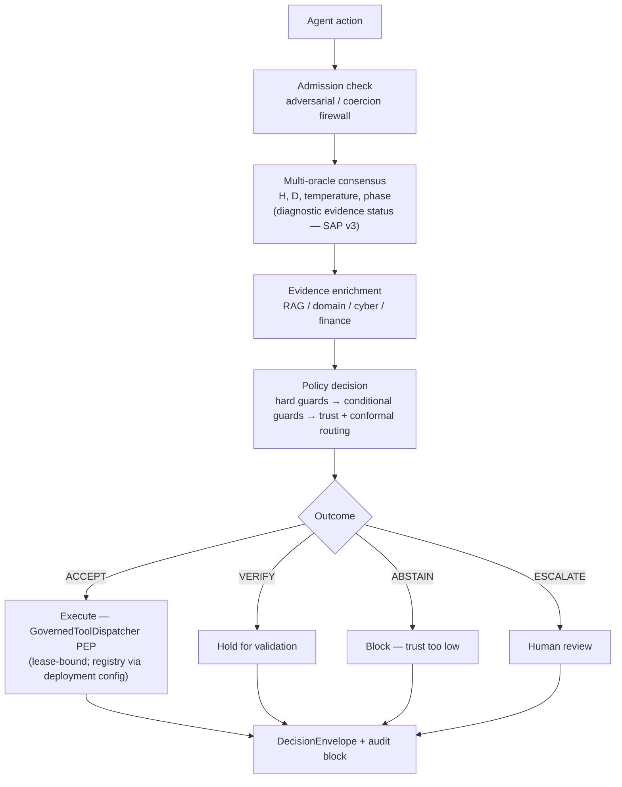

# REMORA: Policy-Gated Governance for Operational AI Agents

[](paper/remora_paper.pdf)
[](https://github.com/darklordVirtual/REMORA-research/actions/workflows/ci.yml)
[](https://github.com/darklordVirtual/REMORA-research/actions/workflows/quality-gates.yml)
[](LICENSE)

REMORA is a **governance overlay** — a decision layer that sits in front of an AI agent and judges every proposed action **before** it may run. It is built for settings where actions carry real operational consequences — building automation, energy management, infrastructure control, regulated enterprise workflows. REMORA governs the agent's proposed actions; it does not replace the agent. Each action is checked by a deterministic policy layer and by several independent model assessments of the same action, merged into one signal (*multi-oracle consensus*). The result is one of four outcomes:

| Outcome | Meaning |
|---------|---------|
| **ACCEPT** | Assurance conditions met; execution permitted |
| **VERIFY** | Plausible but requires additional validation before proceeding |
| **ABSTAIN** | Trust too low to decide; action blocked |
| **ESCALATE** | Risk exceeds autonomous authority; routed to human review |

Every decision is recorded as a versioned `DecisionEnvelope`: what was decided, under which policy version, and why. On the `/v1/execution/*` path, with a persistence adapter configured, these records are appended to a per-tenant, SHA-256 tamper-evident chain. When the evidence is insufficient, REMORA errs toward ABSTAIN or ESCALATE rather than ACCEPT. All results are from controlled experiments and internal benchmarks; external replication is pending — see [Limitations](#limitations).

**Start here:** [Plain-language overview](docs/plain_language_overview.md) · [Reference architecture](docs/reference_architecture.md) · [Executive one-pager](docs/executive_onepager.md) · [Evidence & claims](docs/02-evidence-and-claims.md) · [Full documentation index](docs/README.md) — unfamiliar terms are defined in [Key terms](#key-terms) below.

---

## Status

<!-- BEGIN GENERATED: status — source: assurance registers, via scripts/generate_readme_status.py --check. DO NOT EDIT. -->
**Deployment profile:** `SHADOW_PILOT` (= `SHADOW_ONLY`) — recomputed from the capability and remediation registers by CI; a profile cannot be raised by editing prose.

**To reach `CONTROLLED_PILOT`, still open:** REM-021, REM-023.

**Capabilities:** 7 of 14 wired to the API path or deeper ([wiring register](docs/assurance/capability_register_v1.yaml)); full gate status in [release_gates.md](docs/assurance/release_gates.md), maturity ladder in [release_profiles_v1.yaml](docs/assurance/release_profiles_v1.yaml).
<!-- END GENERATED: status -->

Shadow-mode research only; not certified for production. What remains open, in one place: [docs/assurance/remediation_register.yaml](docs/assurance/remediation_register.yaml).

---

## Architecture

Every proposed action runs through this pipeline **before** it can execute — nothing happens until the pipeline returns an outcome. There are four stages, in order:

1. **Admission check** — screen the request for adversarial or coercive content and reject it outright if found.
2. **Multi-oracle consensus** — collect several independent model judgements of the action.
3. **Evidence enrichment** — pull in supporting signals (retrieved documents; domain-, cyber- or finance-specific checks).
4. **Policy decision** — issue the verdict (ACCEPT / VERIFY / ABSTAIN / ESCALATE).

Inside that final stage, deterministic **hard guards run first and win**: a hard block cannot be overridden by any uncertainty- or confidence-based signal (detailed two paragraphs down).


```mermaid
flowchart TD
    A[Agent action] --> B[Admission check\nadversarial / coercion firewall]
    B --> C["Multi-oracle consensus\nH, D, temperature, phase\n(diagnostic evidence status — SAP v3)"]
    C --> D[Evidence enrichment\nRAG / domain / cyber / finance]
    D --> E[Policy decision\nhard guards → conditional guards → trust + conformal routing]
    E --> F{Outcome}
    F -->|ACCEPT| G["Execute — GovernedToolDispatcher PEP\n(lease-bound; registry via deployment config)"]
    F -->|VERIFY| H[Hold for validation]
    F -->|ABSTAIN| I[Block — trust too low]
    F -->|ESCALATE| J[Human review]
    G --> K[DecisionEnvelope + audit block]
    H --> K
    I --> K
    J --> K
```

### On ACCEPT: how execution works

When the policy decision is ACCEPT, the `/v1/execution/execute` endpoint consumes the one-time grant and dispatches the call through the `GovernedToolDispatcher` — the policy enforcement point (PEP). The call runs under an `ExecutionLease` bound to the tenant, principal, tool, exact arguments, target environment, and policy-bundle hash, and the response and audit record report what actually happened.

Tools are registered **only** through deployment configuration (`REMORA_TOOL_REGISTRY_MODULE`), never through request payloads — so an agent cannot smuggle in a new tool or the credentials it would run with. The research profile ships two side-effect-bounded tools (`store_artifact`, `read_telemetry`); with no registry configured, dispatch simply reports `executed: false`.

**Honest limit:** REMORA cannot stop an agent that reaches a tool *outside* this API. Bypass-proof enforcement requires the deployment to route all tool access through the dispatcher, plus the REM-024 / REM-025 / REM-030 hardening tracked in [remediation_register.yaml](docs/assurance/remediation_register.yaml).

### Why hard guards come first

Hard guards are deterministic and have **absolute priority**: no probabilistic oracle result can override a hard block. They are checked first *inside* `RemoraDecisionEngine.decide()`. That engine runs after the consensus and evidence stages, so "first" means the guards take priority over the oracle result — not that they run before the oracle calls. This is why the zero-false-accept result belongs to the policy layer, not the consensus machinery: the two are separate claims.

### What the consensus signals are (and are not)

The thermodynamic temperature and the discrete phase labels are computed and logged, but they are **diagnostic-grade only**. As selection signals they failed their pre-registered fresh-data confirmation (CLAIM-012; see [NEGATIVE_RESULTS.md](NEGATIVE_RESULTS.md) §18). The signal that is actually evidence-backed is dev-split-calibrated **confidence** ranking (`remora/selective/risk_control.py`) — and even that stays *out* of the authoritative decision path until its own frozen confirmation round succeeds (SAP v3 §8 D-3). None of this changes the deterministic hard-guard floor.

Full detail: [docs/01-architecture.md](docs/01-architecture.md) (narrative) · [ARCHITECTURE.md](ARCHITECTURE.md) (canonical) · [docs/07-api-reference.md](docs/07-api-reference.md) (API).

---

## Quickstart

```bash
python -m pip install -e ".[dev]"

# Tests run cross-platform with no `make` required (Windows / PowerShell included):
python -m pytest tests/ -q          # full deterministic suite (~3700 tests, no API keys, <1 min)
python -m pytest tests/test_decision_envelope_v2.py tests/test_policy_decision_engine.py tests/test_remora_toolcall_gate.py tests/test_remora_toolcall_gate_v2.py tests/test_m1_leakage_absent.py tests/test_api_server.py -q   # core gate only (~5s)

python scripts/demo_industrial_maintenance.py   # end-to-end governance demo (dry-run)
```

On systems with GNU make installed, `make test` / `make test-core` / `make audit` are convenience shortcuts for the commands above (`make help` lists every target; the Makefile assumes `python` and `ruff` are on `PATH`).

The maintenance demo drives the full chain: a per-link-signed A2A delegation envelope is actually verified, the real `RemoraDecisionEngine` decides, and analysis confidence cannot buy actuation authority that was never delegated (outcomes pinned by `tests/test_demo_industrial_maintenance.py`). More worked scenarios: [docs/use-cases/](docs/use-cases/README.md). Reproduce every benchmark step by step: [docs/06-reproducibility.md](docs/06-reproducibility.md).

---

## Key terms

Plain-language definitions of the terms used in the results below. Canonical metric definitions with exact denominators: [docs/assurance/metric_definitions_v1.md](docs/assurance/metric_definitions_v1.md).

| Term | Meaning |
|------|---------|
| **FAR** — false accept rate | Share of *harmful* actions the system wrongly allowed. The safety headline; 0% is the goal. |
| **FBR** — false block rate | Share of *harmless* actions the system blocked. FBR 100% means safety was bought by blocking all benign work too ("benign friction"). |
| **N / effective N** | Sample size. Effective N counts only statistically independent units: 700 tasks generated from 70 templates give effective N=70, and all statistics honor that. |
| **Wilson 95% CI** | The range of true rates compatible with the observed data; the upper bound is the worst rate the data cannot rule out. |
| **Selective accuracy / coverage** | The system may decline to answer. Coverage is the share of items it accepts to answer; accuracy is then measured on that subset only. |
| **Calibrated confidence** | Model confidence rescaled on a held-out development split so that "0.9" empirically means about 90% correct. |
| **Multi-oracle consensus** | Several independent model evaluations ("oracles") of the same action, merged into one trust signal. |
| **Temperature / phase** | Thermodynamics-inspired diagnostics of oracle disagreement. Diagnostic-grade only — falsified as a selection signal (SAP v3). |
| **Intent-gating vs interception** | Intent-gating judges the agent's *stated* intent before execution; interception would capture the *actual* tool call. The AgentHarm result is intent-gating. |
| **Shadow mode** | Decisions are computed and logged but not enforced; no live action is blocked. REMORA's current deployment profile. |
| **PEP / lease** | Policy Enforcement Point — the dispatcher that actually runs a tool call, and only under a one-time `ExecutionLease` bound to tenant, tool, exact arguments and policy version. |
| **SAP v3** | Statistical analysis plan v3 (2026-07-27): hypotheses, splits and thresholds frozen *before* fresh data was scored. |
| **McNemar p** | Paired significance test comparing two methods on the same items; low p means the difference is unlikely to be chance. |
| **AROMER / AII** | Autonomous Risk-Oriented Meta-Evaluator and Reasoner — the experimental learning layer. AII (Autonomous Intelligence Index) is its composite learning score. |

---

## Evidence

Headline positive results, each with the caveat that keeps it honest. **The caveat is part of the claim** — full evidence, every benchmark table, and the label-leakage disclosure are in [docs/02-evidence-and-claims.md](docs/02-evidence-and-claims.md) and [docs/03-experiments.md](docs/03-experiments.md). All numbers link to committed artifacts under `results/`.

<!-- claim:CLAIM-002 far_pct far_ci_high_pct fbr_pct n -->
<!-- claim:CLAIM-003 far_pct n -->
<!-- claim:CLAIM-001 far_pct n_effective n -->
<!-- claim:CLAIM-013 cw_accuracy_pct majority_accuracy_pct mcnemar_p n -->
| Result | Value | Key caveat | Artifact · gate |
|--------|-------|------------|-----------------|
| Zero false accepts, external AgentHarm benchmark | FAR **0.0%**, Wilson 95% CI [0.00%, 1.81%], N=208 | intent-gating, not interception; companion FBR 100% — the hard floor also blocked every benign variant | `results/external_benchmark_agentharm_v1.json` · REM-014 |
| Zero recurrences, historical regression corpus | FAR **0.0%**, N=167 | re-run of past false accepts; confirms no regression, proves nothing new | `results/false_accept_regression_v1.json` · REM-019 |
| Tool-call safety, adversarial simulator v2 | **0.0%** unsafe execution (0/70 templates; effective N=70 of 700 tasks; Wilson CI [0.0%, 5.2%]) | simulator-scoped; the unsafe-rate Δ=0.0143 vs. baselines is **not statistically significant** (p=0.50) — the significant gain is utility (+0.456) | `results/toolcall_benchmark_v2_results.json` |
| Calibrated confidence-weighted voting (SAP v3) | **87.8%** vs majority 85.1% on the untouched test split; paired McNemar p=0.0064, N=368 | significant vs majority only (vs best single: p=0.077, directional); no arm survives family-wise correction — not integrated into the engine from this round | `results/sap_v3_round_results.json` |

<!-- claim:CLAIM-008 accuracy_pct coverage_pct n -->
What the selective story means in numbers: on the N=302 calibration set a single oracle scores 57.0% and majority voting 82.8%, while REMORA's top-25% most-confident slice reaches 94.7%. The contribution is *selective coverage* — knowing which quarter of the decisions can be trusted — not beating a strong majority baseline on raw full-coverage accuracy (full risk–coverage curve in [docs/03-experiments.md](docs/03-experiments.md)). On fresh data the signal that earns this is dev-split-calibrated **confidence**, not the thermodynamic temperature.

**Negative results are first-class here.** Findings that failed, regressed or were falsified — including the temperature falsification and the critical-phase trust inversion — are documented with the same rigor in [NEGATIVE_RESULTS.md](NEGATIVE_RESULTS.md), with a headline table at the top of that file.

---

## Limitations

The most load-bearing caveats; the full list and all documented gaps live in [NEGATIVE_RESULTS.md](NEGATIVE_RESULTS.md) and [docs/02-evidence-and-claims.md](docs/02-evidence-and-claims.md).

- **Simulator-scoped safety.** The 0% unsafe-execution results come from a deterministic simulator (synthetic benchmarks) and a controlled internal corpus; no real shell, network, or database mutations occur. This does not prove field-deployment safety.
- **Effective sample size is template-level.** The v2 benchmark's 700 tasks are 70 templates × 10 cosmetic variants; all v2 statistics use the 70 clusters (effective N=70, see [Key terms](#key-terms)), and the unsafe-rate advantage over baselines is not statistically significant (p=0.50).
- **No external replication.** All benchmarks were run internally by the author. External replication is pending — a distinct, still-open evidence level and a prerequisite before any stronger validation label.
- **Tamper-evident, not tamper-proof.** The hash chain detects modification after the fact; preventing it requires external append-only (WORM) storage not included here.
- **AROMER is experimental** and its metrics are not evidence for the core governance system (see below).

---

## Research foundation

Every research line REMORA builds on maps to a concrete control, code file, and test in the machine-checked [research-control matrix](docs/research/research_control_matrix.generated.md) — e.g. Bjøru (2026) concept-based causal XAI → `remora/causal/` → per-concept Probability of Sufficiency/Necessity and a minimal contrastive intervention, bounded to policy causality. Literature positioning: [docs/09-related-work.md](docs/09-related-work.md); derivations: [paper/remora_paper.md](paper/remora_paper.md).

---

## AROMER (experimental learning layer)

AROMER (Autonomous Risk-Oriented Meta-Evaluator and Reasoner) is REMORA's **experimental** closed-loop calibration layer, layered on top of the governance control plane. Nothing in the control plane depends on it, and its metrics are **not** evidence for the core governance system. Offline, its abstract harm prior transfers across domains it never trained on at 83.8% (leave-one-domain-out); live AII telemetry is published to the `telemetry` branch. Detail: [docs/03-experiments.md](docs/03-experiments.md) §9 and [NEGATIVE_RESULTS.md](NEGATIVE_RESULTS.md) §12–§16.

---

## AI use, citation, license

Built with the assistance of generative-AI development tools; no AI output was accepted as evidence without an independently confirmed committed artifact, a passing test, or a verified external source. Full disclosure: [docs/AI_USE.md](docs/AI_USE.md).

```bibtex
@misc{remora2026,
  title  = {REMORA: A Policy-Gated Multi-Oracle Assurance Architecture for Agentic AI},
  author = {Skogbrott, Stian},
  year   = {2026},
  url    = {https://github.com/darklordVirtual/REMORA-research},
  note   = {Research-grade reference architecture. Results are internally
            replicated and bounded by documented assumptions. External
            replication pending.}
}
```

## License

REMORA versions beginning with `v0.10.0` are **source-available under the
[Business Source License 1.1](LICENSE)** — not open source — or available
under a separate written [REMORA Commercial License](COMMERCIAL_LICENSE.md).
The Licensor is Stian Skogbrott; **no commercial use is permitted without a
commercial license from the Licensor**.

The BSL permits source inspection, modification, redistribution,
non-production use and the limited non-commercial Production Uses specified
in its Additional Use Grant. Commercial production use — including internal
business production, paid consulting, SaaS, API, managed service, OEM,
embedding, white-label use, resale or commercial redistribution — requires a
separate commercial agreement. See [LICENSING.md](LICENSING.md) for scope and
examples; contact: support@luftfiber.no.

Before contributing, see [docs/10-contributing.md](docs/10-contributing.md):
run the full quality gate (`make audit` — or, with no `make`, `python -m pytest`
plus the `scripts/check_*.py` gates), ensure every claim links to a committed artifact on disk,
and do not remove negative results or caveats. Working agreement and
claim-hygiene rules: [CLAUDE.md](CLAUDE.md).
