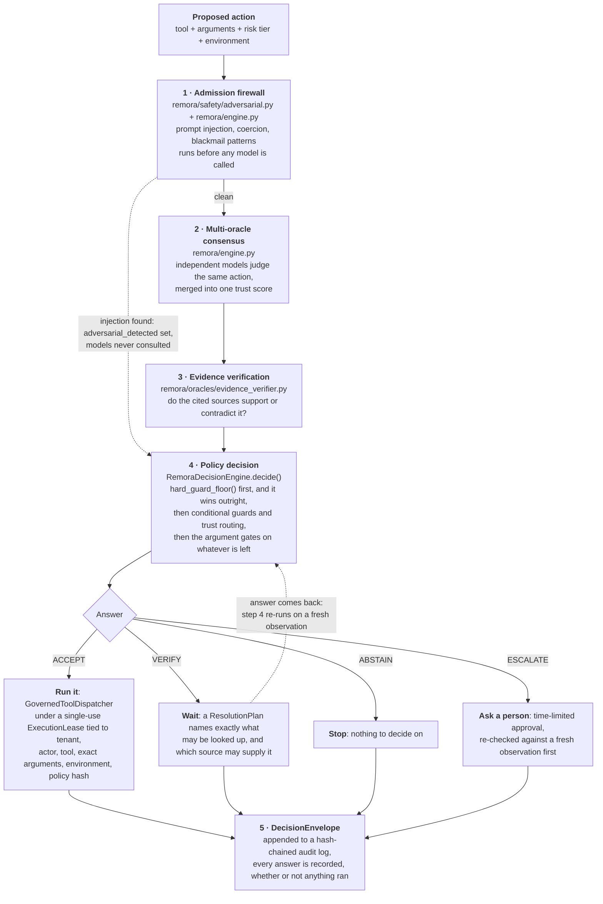

# REMORA: Policy-Gated Governance for Operational AI Agents

[](paper/remora_paper.pdf) [](https://github.com/darklordVirtual/REMORA-research/actions/workflows/ci.yml) [](https://github.com/darklordVirtual/REMORA-research/actions/workflows/quality-gates.yml) [](LICENSE)

**An AI agent wants to do something. REMORA decides whether it may, before it happens.**

Give an agent real tools and it will eventually reach for the wrong one: the wrong
database, the wrong machine, an instruction that arrived inside a document it was
reading. REMORA is a **governance overlay**: a checkpoint the agent's proposed action
must pass before anything runs. It does not replace the agent. It answers one question
about each action, and records why.

| Answer | What it means |
|--------|---------------|
| **ACCEPT** | Safe to run on its own |
| **VERIFY** | One specific thing must be checked first |
| **ABSTAIN** | Not enough to go on, so stop |
| **ESCALATE** | A person has to decide this |

```bash
pip install -e ".[dev]" && python -m remora try     # try it, no API keys needed
```

Built for work where a wrong action costs something real: building automation, energy
management, infrastructure control, regulated enterprise workflows.

**Start here:** [Plain-language overview](docs/plain_language_overview.md) · [Reference architecture](docs/reference_architecture.md) · [Executive one-pager](docs/executive_onepager.md) · [Docs index](docs/README.md)

---

## What it does well

Each result below is measured on a committed artifact and governed by an entry in the
[claim register](docs/assurance/claim_register_v1.yaml). Every number carries the caveat
that bounds it. That is the point, not a footnote.

<!-- claim:CLAIM-002 far_pct far_ci_high_pct fbr_pct n -->
<!-- claim:CLAIM-001 far_pct n_effective n -->
<!-- claim:CLAIM-016 routing_accuracy_pct irrelevance_abstain_pct unobtainable_abstain_pct obtainable_verify_pct required_unknown_accept_pct -->
<!-- claim:CLAIM-013 cw_accuracy_pct majority_accuracy_pct mcnemar_p n -->
<!-- claim:CLAIM-003 far_pct n -->
| What was measured | Result | Bounded by |
|---|---|---|
| **Nothing harmful got through** on an external harm benchmark (AgentHarm) | **0.0%** wrongly allowed, N=208, worst case the data allows: 1.81% | it judges stated intent, not the executed call, and the same strict floor also blocked every harmless twin (100.0%) |
| **Nothing harmful got through** in the adversarial simulator | **0.0%** unsafe runs, 0 of 70 scenario templates (700 tasks), worst case 5.2% | a simulator, not a live system; the margin over simple baselines, Δ=0.0143, is **not statistically significant** (p=0.50). The clear win is usefulness, +0.456 |
| **The behaviour transferred to outside data it had never seen** (BFCL v3, one sealed run) | irrelevant tool → refused **100.0%** of the time (258/258); unobtainable input → refused **100.0%** (133/133); obtainable input → sent for checking **82.7%**; overall routing **94.0%** correct; **0.0%** of unknown-but-required inputs were guessed (0/19) | 4 of 5 pre-registered targets met; the 5th missed, and is [published as measured](NEGATIVE_RESULTS.md#34-external-blind-track-bfcl-four-axes-hold-wrong-call-blindness-measured-cleanly-2026-07-31) |
| **No previously-known failure came back** (historical regression corpus) | **0.0%** wrongly allowed, N=167 | a re-run of past mistakes: it proves nothing new, only that nothing broke |
| **Weighing models by how well-calibrated they are beat counting votes** | **87.8%** vs **85.1%**, N=368, paired test p=0.0064 | better than plain vote-counting, but only directional against the single best model (p=0.077), so **it was not switched on** in the engine |

Behind those numbers sit two mechanisms you can read in the code rather than take on
trust:

- **The safety rules are deterministic and cannot be talked around.** No confidence
  score or model majority can unlock a forbidden tool, a malformed call, a detected
  injection, or an untrusted instruction that would choose the recipient, the command
  or the credential. `hard_guard_floor()` decides those, first, every time.
- **Permission is welded to the exact call it was granted for.** Approval to run
  `{"motor": "M1", "mode": "read"}` cannot be reused for
  `{"motor": "*", "mode": "shutdown"}`. The arguments are re-hashed and re-checked in
  the instant before the tool runs, and the permission expires and is single-use.

Baseline context for the numbers above: the calibration benchmark is N=302 items, where
one model alone scores 57.0% and plain vote-counting 82.8%. REMORA's contribution is
knowing *which* decisions to trust, not raising that ceiling. The full risk–coverage
curve is in [docs/03-experiments.md](docs/03-experiments.md).

**Evidence discipline.** Results that a later round replaced are archived rather than
deleted ([superseded_claims.md](docs/assurance/superseded_claims.md)), and results that
failed are published in full in [NEGATIVE_RESULTS.md](NEGATIVE_RESULTS.md), including
a signal this project falsified on its own data and then refused to ship. CI enforces
both: a claim without an artifact fails the build, and so does an archived claim that
tries to creep back onto this page.

---

## How it works

Everything the agent proposes goes through the same five steps. Nothing runs until the
last one produces an answer.


```mermaid
flowchart TD
    A["<b>Proposed action</b><br/>tool + arguments + risk tier + environment"] --> B
    B["<b>1 · Admission firewall</b><br/>remora/safety/adversarial.py + remora/engine.py<br/>prompt injection, coercion, blackmail patterns<br/>runs before any model is called"]
    B -->|"clean"| C
    B -.->|"injection found: adversarial_detected set,<br/>models never consulted"| E
    C["<b>2 · Multi-oracle consensus</b><br/>remora/engine.py<br/>independent models judge the same action,<br/>merged into one trust score"] --> D
    D["<b>3 · Evidence verification</b><br/>remora/oracles/evidence_verifier.py<br/>do the cited sources support or contradict it?"] --> E
    E["<b>4 · Policy decision</b><br/>RemoraDecisionEngine.decide()<br/>hard_guard_floor() first, and it wins outright,<br/>then conditional guards and trust routing,<br/>then the argument gates on whatever is left"]
    E --> F{"Answer"}
    F -->|ACCEPT| G["<b>Run it</b>: GovernedToolDispatcher<br/>under a single-use ExecutionLease tied to tenant,<br/>actor, tool, exact arguments, environment, policy hash"]
    F -->|VERIFY| H["<b>Wait</b>: a ResolutionPlan names exactly what<br/>may be looked up, and which source may supply it"]
    F -->|ABSTAIN| I["<b>Stop</b>: nothing to decide on"]
    F -->|ESCALATE| J["<b>Ask a person</b>: time-limited approval,<br/>re-checked against a fresh observation first"]
    H -.->|"answer comes back:<br/>step 4 re-runs on a fresh observation"| E
    G --> K["<b>5 · DecisionEnvelope</b><br/>appended to a hash-chained audit log,<br/>every answer is recorded, whether or not anything ran"]
    H --> K
    I --> K
    J --> K
```

Module-by-module detail: [ARCHITECTURE.md](ARCHITECTURE.md) (canonical) ·
[docs/01-architecture.md](docs/01-architecture.md) (narrative) · [docs/07-api-reference.md](docs/07-api-reference.md) (API).

**Why the firewall's arrow is dotted.** The admission firewall does not issue the
verdict itself. It sets `adversarial_detected` and suppresses the model fan-out, and
then the first hard guard in step 4 turns that flag into ESCALATE
(`ADMISSION_FIREWALL_BLOCKED`). Every verdict comes out of one place, which is why the
explanation of a decision can never disagree with the decision.

**Why hard guards "win outright".** They are checked at the top of
`RemoraDecisionEngine.decide()`, which runs *after* the models have spoken, so first
means *first in priority*, not first in time. A confident model cannot buy its way past
a forbidden tool. The argument gates sit at the other end of the ladder, after every
blocking rule, so they can only ever make a would-be ACCEPT more cautious, never
unblock something. `decide()` and `explain()` walk the same ordered list, so the trace
you read is the path that was taken.

**What VERIFY promises.** It is not a shrug. A VERIFY from the argument gates carries a
`ResolutionPlan`: the named lookup, the exact arguments it may fill in, and the sources
allowed to supply them. The lookup cannot switch tools or write anything outside its
plan, and if no lookup exists at all the answer is ABSTAIN instead: promising a check
that cannot happen is worse than stopping. When the answer comes back, step 4 runs
again from scratch on a fresh view. In today's execution API, VERIFY still means "queue
for a person"; the automatic-lookup contract is measured (CLAIM-016) but not yet wired
into that path.

**What running it means.** `/v1/execution/execute` spends a single-use grant and calls
the tool through `GovernedToolDispatcher`. Tools come **only** from deployment
configuration (`REMORA_TOOL_REGISTRY_MODULE`), never from the request, so an agent
cannot introduce a tool or the credentials behind it. With no registry configured,
dispatch reports `executed: false` and nothing happens.

**About the disagreement metrics.** Fields named `temperature` and `phase` are logged
for analysis only. They are legacy physics-flavoured names for how much the models
disagreed, and they lost their pre-registered test against a simpler calibrated-confidence
baseline ([NEGATIVE_RESULTS.md](NEGATIVE_RESULTS.md) §18). They influence nothing.

---

## Try it

```bash
python -m pip install -e ".[dev]"

python -m remora try                  # interactive: propose a call, watch it get judged
python -m remora assess drop_database # one-shot verdict for a named tool

python -m pytest tests/ -q            # full deterministic suite (~4,600 tests, no keys, ~80s)
python scripts/demo_industrial_maintenance.py   # end-to-end walkthrough (dry-run)
python -m remora doctor               # environment self-check, with fixes
```

Nothing above needs an API key. A critical production delete escalates to a person, an
injected instruction is stopped at the firewall, and a harmless read with a good trust
signal is accepted, and each result shows the rule that decided it. Add `--envelope`
for the full audit record, or `--live` to swap the stand-in signals for real models
(needs a key in the environment; it is never printed or stored). Other commands:
`remora explain <name>` (rule-by-rule trace), `remora replay <log.jsonl>` (re-decide a
past log without touching anything), `remora provenance`, `remora serve`. Reference:
[docs/cli.md](docs/cli.md).

To govern your own agent, the risk and action type must come from **your tool
registry**, bound to the callable, never guessed from the tool's name:

```python
from remora import assess_tool_call
a = assess_tool_call("drop_database", {"db": "prod-main"},
                     risk_tier="critical", action_type="destructive_write")  # from your registry
if a.should_execute: run_tool(...)   # ACCEPT only; a.envelope is the audit record
```

That library path is *advisory*: it judges the facts you hand it. The enforcing path,
where the facts come from the server and the call runs under a lease, is the
`/v1/execution` API. Worked loop: [examples/agent_gate.py](examples/agent_gate.py) ·
more scenarios: [docs/use-cases/](docs/use-cases/README.md) · reproduce every benchmark:
[docs/06-reproducibility.md](docs/06-reproducibility.md).

---

## Status, and what is not proven

<!-- BEGIN GENERATED: status, source: assurance registers, via scripts/generate_readme_status.py --check. DO NOT EDIT. -->
**Deployment profile:** `SHADOW_PILOT` (= `SHADOW_ONLY`), recomputed from the capability and remediation registers by CI; a profile cannot be raised by editing prose.

**To reach `CONTROLLED_PILOT`, still open:** REM-021, REM-023.

**Capabilities:** 7 of 15 wired to the API path or deeper ([wiring register](docs/assurance/capability_register_v1.yaml)); full gate status in [release_gates.md](docs/assurance/release_gates.md), maturity ladder in [release_profiles_v1.yaml](docs/assurance/release_profiles_v1.yaml).
<!-- END GENERATED: status -->

Shadow-mode research only; not certified for production. The load-bearing caveats:

- **The safety numbers come from benchmarks, not from the field.** The 0% unsafe-execution
  rate is a synthetic-benchmark result: a deterministic simulator and a controlled
  internal corpus, with no real shell, network or database touched.
- **Sample sizes are smaller than they look.** The simulator's 700 tasks are 70
  templates × 10 cosmetic variants; every statistic uses the 70, and the margin over
  baselines is not statistically significant (p=0.50).
- **Nobody outside this project has reproduced any of it.** External replication is pending
  It is a distinct, still-open evidence level, and a prerequisite for any stronger label.
- **REMORA cannot stop an agent that goes around it.** The guarantee holds only where a
  deployment routes every tool call through the dispatcher and the agent has no
  credentials of its own.
- **The audit log detects tampering; it does not prevent it.** Prevention needs
  append-only (WORM) storage, which is not included here.
- **AROMER is experimental**; its numbers are not evidence for the core system.

Everything still open, in one place: [remediation_register.yaml](docs/assurance/remediation_register.yaml).
Full evidence, every benchmark table, and the leakage disclosures:
[docs/02-evidence-and-claims.md](docs/02-evidence-and-claims.md) ·
[docs/03-experiments.md](docs/03-experiments.md) ·
[reviewing this repo](docs/validation/external-review.md).

<details>
<summary><b>Glossary</b>: the terms used above, in one place</summary>

| Term | Meaning |
|------|---------|
| **False accept rate (FAR)** | How often something harmful was wrongly allowed. The safety headline; 0% is the goal. |
| **False block rate (FBR)** | How often something harmless was blocked. 100% means safety was bought by blocking everything, useful work included. |
| **N / effective N** | Sample size. Effective N counts only genuinely independent items: 700 tasks built from 70 templates give effective N=70, and every statistic here uses the 70. |
| **Wilson 95% interval** | The range of true rates the data is compatible with. The upper end is the worst case the evidence cannot rule out. |
| **Blind / sealed / spent** | A blind set is scored exactly once, against targets fixed beforehand. Afterwards it is *spent*: running it again measures development, not generalisation, and this repo labels which is which. |
| **Coverage** | The share of decisions the system is willing to answer at all. Accuracy is then measured only on that share. |
| **Calibrated confidence** | Model confidence rescaled on held-out data so that "0.9" really does mean about 90% right. |
| **Multi-oracle consensus** | Several independent models judging the same action, merged into one trust score. |
| **Intent-gating vs interception** | Intent-gating judges what the agent *says* it will do. Interception would capture the call itself. The AgentHarm result is intent-gating. |
| **Shadow mode** | Decisions are computed and logged but not enforced. REMORA's current profile. |
| **Lease / dispatcher (PEP)** | The dispatcher is the only component that actually runs a tool, and only under a single-use lease tied to tenant, tool, exact arguments and policy version. |
| **Superseded claim** | A result a later round replaced. It is archived, never deleted, and may not be cited on this page. |
| **AROMER** | The experimental learning layer that sits on top. Nothing in the core depends on it. |

</details>

---

## Research foundation, and the experimental layer

Every research line REMORA builds on maps to a concrete control, code file, and test in
the machine-checked
[research-control matrix](docs/research/research_control_matrix.generated.md). For example,
Bjøru (2026) concept-based causal XAI → `remora/causal/` → per-concept Probability of
Sufficiency/Necessity and a minimal contrastive intervention, bounded to policy
causality. Positioning: [docs/09-related-work.md](docs/09-related-work.md);
derivations: [paper/remora_paper.md](paper/remora_paper.md).

**AROMER** is REMORA's **experimental** closed-loop calibration layer. Nothing in the
control plane depends on it, and its metrics are **not** evidence for the core
governance system. Offline, its abstract harm prior transfers across domains it never
trained on at 83.8% (leave-one-domain-out); live telemetry goes to the `telemetry`
branch. Detail: [docs/03-experiments.md](docs/03-experiments.md) §9 and
[NEGATIVE_RESULTS.md](NEGATIVE_RESULTS.md) §12–§16.

## AI use, citation, license

Built with the assistance of generative-AI development tools; no AI output was accepted
as evidence without an independently confirmed committed artifact, a passing test, or a
verified external source. Full disclosure: [docs/AI_USE.md](docs/AI_USE.md).

```bibtex
@misc{remora2026,
  title  = {REMORA: A Policy-Gated Multi-Oracle Assurance Architecture for Agentic AI},
  author = {Skogbrott, Stian},
  year   = {2026},
  url    = {https://github.com/darklordVirtual/REMORA-research},
  note   = {Research-grade reference architecture. Results are internally
            replicated and bounded by documented assumptions. External
            replication pending.}
}
```

REMORA versions from `v0.10.0` are **source-available under the
[Business Source License 1.1](LICENSE)**, which is not open source, or available under a
separate written [REMORA Commercial License](COMMERCIAL_LICENSE.md). The Licensor is
Stian Skogbrott; **no commercial use is permitted without a commercial license from
the Licensor**.

The BSL permits source inspection, modification, redistribution, non-production use
and the non-commercial Production Uses in its Additional Use Grant. **Research is
expressly welcome**: studying, benchmarking, reproducing and publishing results (no
benchmark clause) is granted to any person or organization, and 90-day observer-only
shadow-mode research evaluation is granted even inside companies. Commercial
production use (internal business production, paid consulting, SaaS, API, managed
service, OEM, embedding, white-label use, resale or commercial redistribution)
requires a separate commercial agreement. Scope, examples and the researcher section:
[LICENSING.md](LICENSING.md); contact: support@luftfiber.no.

Before contributing, see [docs/10-contributing.md](docs/10-contributing.md): run the full
quality gate (`make audit`, or with no `make`, `python -m pytest` plus the
`scripts/check_*.py` gates), ensure every claim links to a committed artifact on disk, and
do not remove negative results or caveats. Working agreement: [CLAUDE.md](CLAUDE.md).
