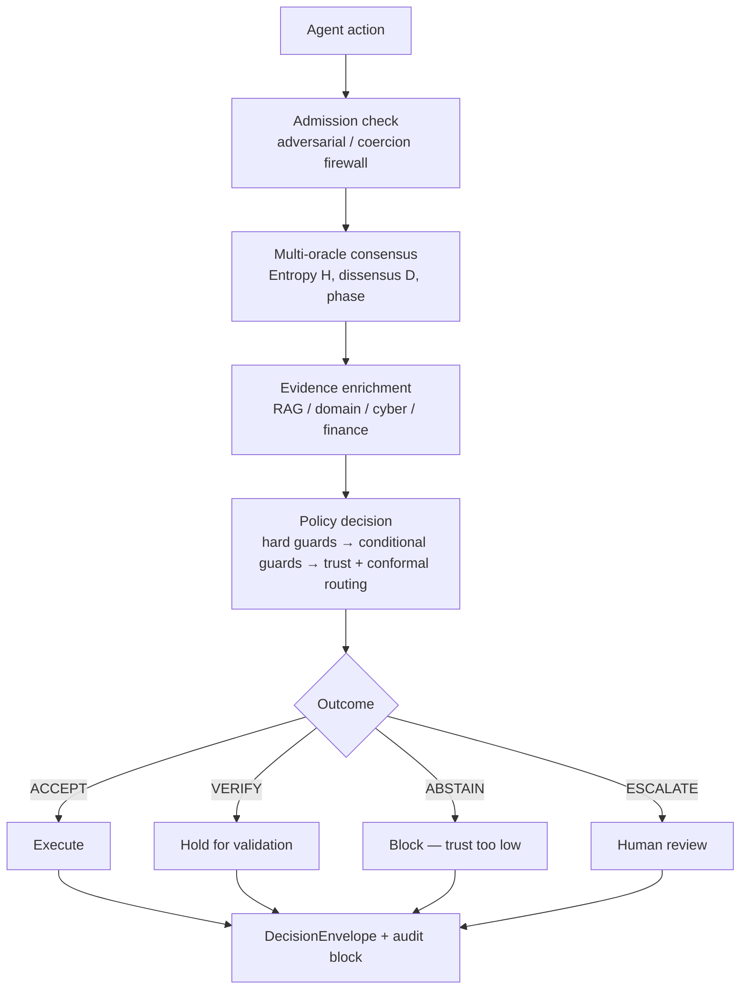

# REMORA: Policy-Gated Governance for Operational AI Agents

REMORA is a pre-execution governance overlay for AI agents operating where actions carry real operational consequences — building automation, energy management, infrastructure control, regulated enterprise workflows. It governs proposed agent actions; it does not replace the agent. Before any action executes, REMORA evaluates it through a deterministic policy layer and a multi-oracle consensus pipeline and returns one of four outcomes:

| Outcome | Meaning |
|---------|---------|
| **ACCEPT** | Assurance conditions met; execution permitted |
| **VERIFY** | Plausible but requires additional validation before proceeding |
| **ABSTAIN** | Trust too low to decide; action blocked |
| **ESCALATE** | Risk exceeds autonomous authority; routed to human review |

Every decision produces a versioned `DecisionEnvelope` with a policy-version stamp and a structured audit block (on the `/v1/execution/*` path with a persistence adapter configured, envelopes are appended to a per-tenant, SHA-256 tamper-evident chain). The architecture stays conservative under uncertainty: when evidence is insufficient it errs toward ABSTAIN or ESCALATE rather than ACCEPT. Results are from controlled experiments and internal benchmarks; external replication is pending — see [Limitations](#limitations).

**Start here:** [Reference architecture](docs/reference_architecture.md) · [Executive one-pager](docs/executive_onepager.md) · [Evidence & claims](docs/02-evidence-and-claims.md) · [Full documentation index](docs/README.md)

---

## Status

<!-- BEGIN GENERATED: status — source: assurance registers, via scripts/generate_readme_status.py --check. DO NOT EDIT. -->
**Deployment profile:** `SHADOW_PILOT` (= `SHADOW_ONLY`) — recomputed from the capability and remediation registers by CI; a profile cannot be raised by editing prose.

**To reach `CONTROLLED_PILOT`, still open:** REM-021, REM-023.

**Capabilities:** 6 of 12 wired to the API path or deeper ([wiring register](docs/assurance/capability_register_v1.yaml)); full gate status in [release_gates.md](docs/assurance/release_gates.md), maturity ladder in [release_profiles_v1.yaml](docs/assurance/release_profiles_v1.yaml).
<!-- END GENERATED: status -->

Shadow-mode research only; not certified for production. What remains open, in one place: [docs/assurance/remediation_register.yaml](docs/assurance/remediation_register.yaml).

---

## Architecture

The pipeline runs synchronously before any action executes: a deterministic admission check runs first, then multi-oracle consensus and evidence enrichment, then the policy decision — inside which deterministic hard guards are evaluated, with absolute priority, before any uncertainty-based routing.


```mermaid
flowchart TD
    A[Agent action] --> B[Admission check\nadversarial / coercion firewall]
    B --> C[Multi-oracle consensus\nEntropy H, dissensus D, phase]
    C --> D[Evidence enrichment\nRAG / domain / cyber / finance]
    D --> E[Policy decision\nhard guards → conditional guards → trust + conformal routing]
    E --> F{Outcome}
    F -->|ACCEPT| G[Execute]
    F -->|VERIFY| H[Hold for validation]
    F -->|ABSTAIN| I[Block — trust too low]
    F -->|ESCALATE| J[Human review]
    G --> K[DecisionEnvelope + audit block]
    H --> K
    I --> K
    J --> K
```

**Hard guards are deterministic and have absolute priority: no probabilistic oracle result can override a hard block.** They run first *inside* `RemoraDecisionEngine.decide()`, which runs after the consensus and evidence machinery — priority over the oracle result, not temporal precedence over the oracle calls. This is why the zero-false-accept safety result is a property of the policy layer, not of the consensus machinery; the two are distinct claims.

Full detail: [docs/01-architecture.md](docs/01-architecture.md) (narrative) · [ARCHITECTURE.md](ARCHITECTURE.md) (canonical) · [docs/07-api-reference.md](docs/07-api-reference.md) (API).

---

## Quickstart

```bash
python -m pip install -e ".[dev]"

make test        # full deterministic suite (~3500 tests, no API keys, <1 min)
make test-core   # envelope + policy engine + gate + API only (~5s)

python scripts/demo_industrial_maintenance.py   # end-to-end governance demo (dry-run)
```

The maintenance demo drives the full chain: a per-link-signed A2A delegation envelope is actually verified, the real `RemoraDecisionEngine` decides, and analysis confidence cannot buy actuation authority that was never delegated (outcomes pinned by `tests/test_demo_industrial_maintenance.py`). More worked scenarios: [docs/use-cases/](docs/use-cases/README.md). Reproduce every benchmark step by step: [docs/06-reproducibility.md](docs/06-reproducibility.md).

---

## Evidence

Headline results, each with the caveat that keeps it honest. **The caveat is part of the claim** — full evidence, every benchmark table, and the label-leakage disclosure are in [docs/02-evidence-and-claims.md](docs/02-evidence-and-claims.md) and [docs/03-experiments.md](docs/03-experiments.md). All numbers link to committed artifacts under `results/`.

<!-- claim:CLAIM-002 far_pct far_ci_high_pct fbr_pct n -->
<!-- claim:CLAIM-003 far_pct n -->
<!-- claim:CLAIM-004 accuracy_pct coverage_pct ci_low_pct ci_high_pct n -->
<!-- claim:CLAIM-001 far_pct n_effective n -->
<!-- claim:CLAIM-005 low_trust_correct_pct high_trust_correct_pct n -->
| Result | Value | Key caveat | Artifact · gate |
|--------|-------|------------|-----------------|
| Zero false accepts, external AgentHarm | FAR **0.0%**, Wilson 95% CI [0.00%, 1.81%], N=208 | intent-gating, not interception; companion FBR 100% (a hard floor bought at maximal benign friction) | `results/external_benchmark_agentharm_v1.json` · REM-014 |
| Zero recurrences, historical regression | FAR **0.0%**, N=167 | historical false-accept corpus re-run; confirms no regression | `results/false_accept_regression_v1.json` · REM-019 |
| Selective accuracy, held-out split | **88.0%** @ 23.2% coverage; N=25, Wilson CI [70.0%, 95.8%] | small accepted set — directional confirmation, always quote with the CI | `results/selective_n500_holdout_results.json` |
| Tool-call safety, adversarial simulator v2 | **0.0%** unsafe execution (0/70 templates; effective N=70 of 700 tasks; Wilson CI [0.0%, 5.2%]) | simulator-scoped; the unsafe-rate Δ=0.0143 vs. baselines is **not statistically significant** (p=0.50) — the significant gain is utility (+0.456) | `results/toolcall_benchmark_v2_results.json` |
| Critical-phase trust inversion (negative result) | low-trust **71.4%** vs high-trust **27.3%** correct, N=32 | small sample; a documented failure mode routed around via `PhaseAwareGuardrail` | [NEGATIVE_RESULTS.md](NEGATIVE_RESULTS.md) |

<!-- claim:CLAIM-008 accuracy_pct coverage_pct n -->
On the N=302 calibration set, single-oracle accuracy is 57.0% and majority-vote 82.8%, and the top-25% slice reaches 94.7% accuracy: REMORA's contribution is *selective coverage*, not beating a strong majority baseline on raw full-coverage accuracy (full curve in [docs/03-experiments.md](docs/03-experiments.md)).

---

## Limitations

The most load-bearing caveats; the full list and all documented gaps live in [NEGATIVE_RESULTS.md](NEGATIVE_RESULTS.md) and [docs/02-evidence-and-claims.md](docs/02-evidence-and-claims.md).

- **Simulator-scoped safety.** The 0% unsafe-execution results come from a deterministic simulator (synthetic benchmarks) and a controlled internal corpus; no real shell, network, or database mutations occur. This does not prove field-deployment safety.
- **Effective sample size is template-level.** The v2 benchmark's 700 tasks are 70 templates × 10 cosmetic variants; all v2 CIs and p-values are computed over the 70 clusters (effective N=70), and the unsafe-rate advantage over baselines is not statistically significant (p=0.50).
- **No external replication.** All benchmarks were run internally by the author. External replication is pending — a distinct, still-open evidence level and a prerequisite before any stronger validation label.
- **Tamper-evident, not tamper-proof.** The hash chain detects modification after the fact; preventing it requires external append-only (WORM) storage not included here.
- **AROMER is experimental** and its metrics are not evidence for the core governance system (see below).

---

## Research foundation

Every research line REMORA builds on maps to a concrete control, code file, and test in the machine-checked [research-control matrix](docs/research/research_control_matrix.generated.md) — e.g. Bjøru (2026) concept-based causal XAI → `remora/causal/` → per-concept Probability of Sufficiency/Necessity and a minimal contrastive intervention, bounded to policy causality. Literature positioning: [docs/09-related-work.md](docs/09-related-work.md); derivations: [paper/remora_paper.md](paper/remora_paper.md).

---

## AROMER (experimental learning layer)

AROMER is REMORA's **experimental** closed-loop calibration layer, layered on top of the governance control plane. Nothing in the control plane depends on it, and its metrics are **not** evidence for the core governance system. Offline, its abstract harm prior transfers across domains it never trained on at 83.8% (leave-one-domain-out); live AII telemetry is published to the `telemetry` branch. Detail: [docs/03-experiments.md](docs/03-experiments.md) §9 and [NEGATIVE_RESULTS.md](NEGATIVE_RESULTS.md) §12–§16.

---

## AI use, citation, license

Built with the assistance of generative-AI development tools; no AI output was accepted as evidence without an independently confirmed committed artifact, a passing test, or a verified external source. Full disclosure: [docs/AI_USE.md](docs/AI_USE.md).

```bibtex
@misc{remora2026,
  title  = {REMORA: A Policy-Gated Multi-Oracle Assurance Architecture for Agentic AI},
  author = {Skogbrott, Stian},
  year   = {2026},
  url    = {https://github.com/darklordVirtual/REMORA-research},
  note   = {Research-grade reference architecture. Results are internally
            replicated and bounded by documented assumptions. External
            replication pending.}
}
```

Apache-2.0 — see [LICENSE](LICENSE) and [docs/10-contributing.md](docs/10-contributing.md). Before contributing: run `make audit`, ensure every claim links to a committed artifact on disk, and do not remove negative results or caveats. Working agreement and claim-hygiene rules: [CLAUDE.md](CLAUDE.md).
