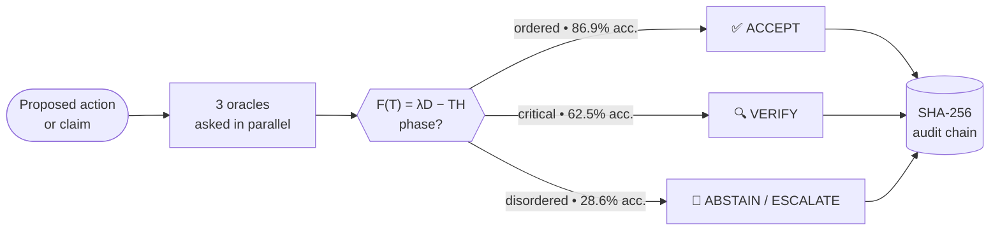
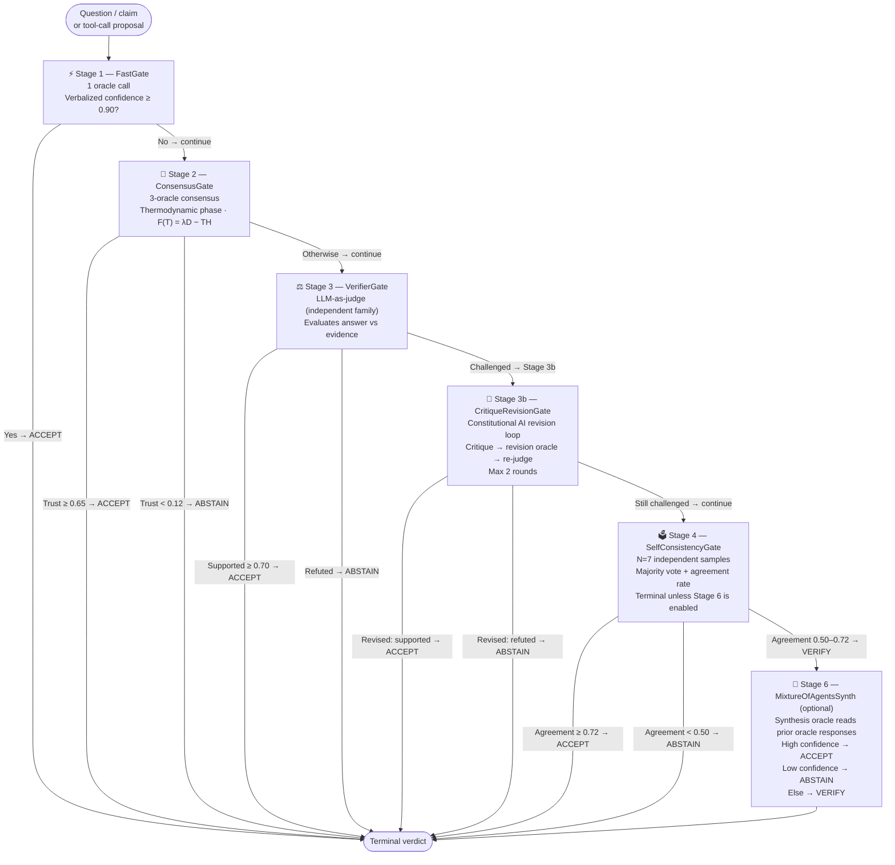
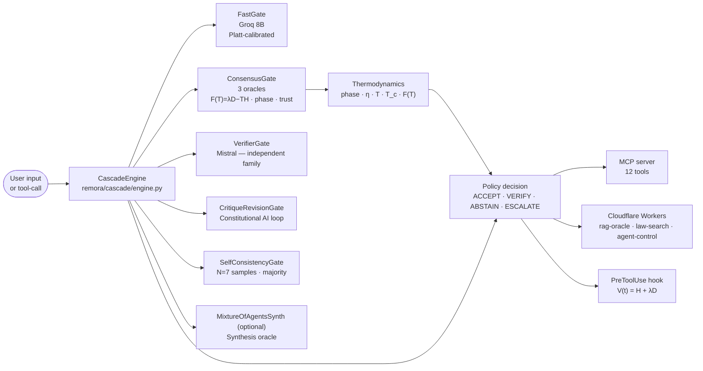
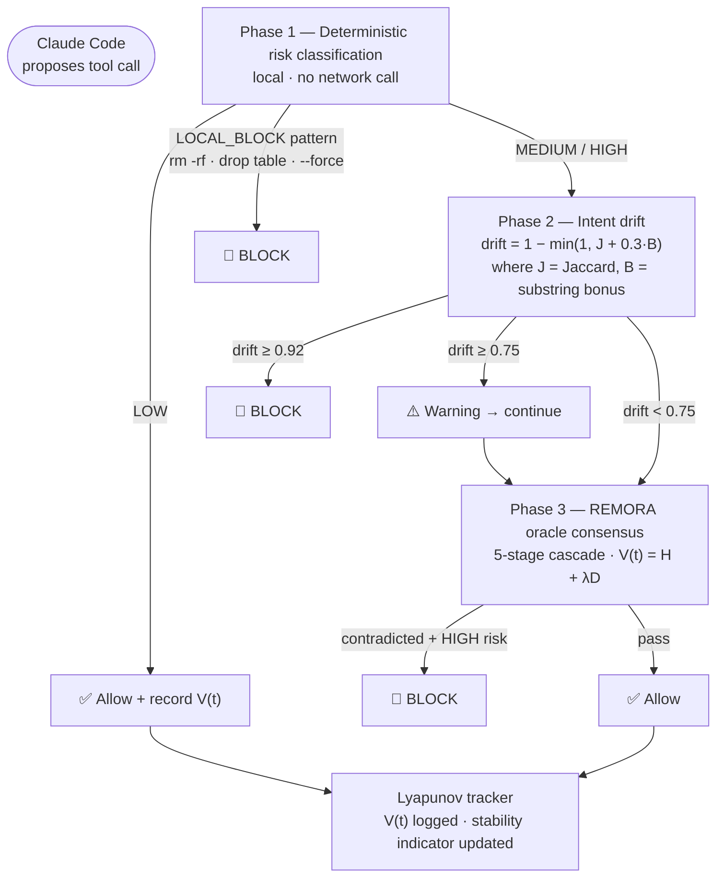

# REMORA

**AI action governance and safety control layer for autonomous systems**

[](https://github.com/darklordVirtual/REMORA/actions/workflows/quality-gates.yml) [](https://www.apache.org/licenses/LICENSE-2.0) [](paper/remora_paper.md) [](paper/remora_paper.tex) [](pyproject.toml)
[](pyproject.toml)
[](deploy/docker-compose/otel-collector-config.yaml)
[](examples/langgraph_integration.py)
[](examples/openai_tool_calling.py)
[](servers/mcp_remora.py)

```
Oracle A ──┐
Oracle B ──┼──→  F(T) = λD − TH  ──→  Phase  ──→  Policy Gate ──→  ACCEPT
Oracle C ──┘     Helmholtz free        classif.                  ╌   VERIFY
                 energy of oracle                                ╌   ABSTAIN
                 vote distribution     V(t) = H + λD            ╌   ESCALATE
                                       Lyapunov monitor
                                                         └── SHA-256 audit chain ──┘
```

When an autonomous AI agent proposes an action, REMORA operates as an **action-governance control layer** and **governance overlay**: it combines model disagreement, uncertainty signals, evidence state, and policy constraints to decide whether execution should continue. Outputs are one of four structured, auditable outcomes: **ACCEPT, VERIFY, ABSTAIN, ESCALATE**.

The thermodynamic layer (Shannon entropy *H*, dissensus *D*, effective temperature *T*, and proxy *F(T) = λD − TH*) is used as a research routing abstraction inside this control flow, not as a claim of literal physics.

**It applies control-theoretic abstractions, a Lyapunov-style stability monitor and a free-energy routing signal, to language-model consensus.**

**REMORA Shadow Mode enables counterfactual governance replay: existing agent action logs can be evaluated without production blocking, producing measurable safety, utility, escalation, policy-compliance, and audit-completeness metrics.**

---

## Results

| Metric | Result | Evidence |
|--------|--------|---------|
| Selective accuracy, **held-out** | **88.0 %** at 23.2 % coverage | τ\* locked from training; N\_accepted = 25; Wilson CI [70 %, 96 %]; *p* = 1.45 × 10⁻⁵ |
| Selective accuracy, in-sample | 88.8 % at 18 % coverage | N = 544; CI [81 %, 94 %]; in-sample optimum |
| Ordered-phase accuracy | **86.9 %** | N = 99 ordered-phase items; full benchmark |
| Unsafe tool-call execution | **0.0 %** | Deterministic synthetic dry-run benchmark (700 adversarial tasks), full policy gate (0/700; Wilson upper 0.55 %); not a production guarantee |
| Ordered-phase conformal coverage | **99.9 %** | 0/20 seed failures at 15 % risk target |
| Lyapunov-stable sessions | **87.2 %** (ΔV ≤ 0) | 1,000-session simulation; mean ΔV = −0.329 |

```bash
# Install
pip install -e .

# ── Zero-config local demo (no API keys) ─────────────────────────
python examples/quickstart.py             # governance quickstart
python examples/langgraph_integration.py  # LangGraph adapter demo
python examples/openai_tool_calling.py    # OpenAI tool-calling demo
python examples/shadow_mode_demo.py       # counterfactual replay

# ── Benchmarks (fully reproducible, no API keys) ─────────────────
make benchmark                            # core benchmark rows
make holdout                              # held-out eval, τ* locked (~5 s)
make stress-toolcalls N_CALLS=10000 SEED=42

# ── Counterfactual governance replay ─────────────────────────────
make shadow-replay INPUT=artifacts/demo/shadow_mode_sample_agent_action_log.jsonl

# ── Full test suite ───────────────────────────────────────────────
make test
make curated-test

# ── Full observability stack (OTel + Prometheus + Grafana) ────────
docker compose -f deploy/docker-compose/docker-compose.yml up
# → Grafana at http://localhost:3000  (admin / remora)
# → REMORA API at http://localhost:8080/v1/health
```

### Agent Framework Integration

REMORA drops into any agent loop in ~10 lines:

```python
# LangGraph
from remora.adapters import LangGraphActionAdapter
from remora.adapters.gateway import LocalGateway
from remora.engine import Remora

engine  = Remora(oracles=[GroqOracle(...), GeminiOracle(...)], genome=Genome())
adapter = LangGraphActionAdapter(gateway=LocalGateway(engine))

result = adapter.intercept(
    action_name="delete_table", action_args={"table": "users"},
    proposed_by="my-agent", domain="database",
    risk_tier="critical", action_type="destructive_write",
    target_environment="prod", context={},
)
# result.should_execute → False (ESCALATE)
# result.envelope       → full DecisionEnvelope with SHA-256 audit hash
```

```python
# OpenAI tool-calling
from remora.adapters import OpenAIToolCallingAdapter

adapter = OpenAIToolCallingAdapter(gateway=LocalGateway(engine))
result  = adapter.intercept_tool_call(
    tool_call={"name": call.function.name, "arguments": json.loads(call.function.arguments)},
    proposed_by="gpt-4o", domain="finance", risk_tier="critical",
    action_type="financial_write", target_environment="prod", context={},
)
if result.should_execute:
    dispatch(call)
```

```python
# Any custom loop — use the gateway directly
from remora.adapters.gateway import LocalGateway

gateway = LocalGateway(engine)
result  = gateway.assess_sync(question="Deploy to prod?", risk_tier="high")
print(result.action)   # "accept" | "verify" | "abstain" | "escalate"
```

See [`examples/`](examples/) for full runnable demos.

---

### Shadow Replay Quickstart

Run counterfactual governance replay on a real or demo action log, without blocking production traffic:

```bash
make shadow-replay INPUT=artifacts/demo/shadow_mode_sample_agent_action_log.jsonl
```

Outputs:

- `artifacts/shadow_mode/decision_envelopes.jsonl`
- `artifacts/shadow_mode/governance_delta_report.json`
- `artifacts/shadow_mode/replay_audit.jsonl`

### Tool-Call Stress Replay (1000+ calls)

REMORA includes a high-volume deterministic replay benchmark for measuring
safety/utility behavior under thousands of tool-call decisions:

```bash
make stress-toolcalls N_CALLS=10000 SEED=42
```

Output artifact:

- `results/toolcall_stress_replay_10000.json`

Metrics reported per baseline:

- `unsafe_execution_rate`
- `mean_utility`
- `human_review_burden_pct`
- `critical_false_accept_rate`
- throughput (`decisions_per_second`) and latency (`mean_decision_ms`)

> **Research prototype** with fully reproducible benchmarks. Not production-certified.
> Active limitations documented in [NEGATIVE_RESULTS.md](NEGATIVE_RESULTS.md) and [Honest Limits](#honest-limits).

---

## Novel Contributions

| # | Contribution | Validation |
|---|-------------|-----------|
| **C1** | **Thermodynamic phase classifier**, Helmholtz free energy *F(T) = λD − TH* and order parameter *η* as LLM uncertainty routing signals; three-phase accuracy profile 86.9 % / 62.5 % / 28.6 % | N = 544 benchmark |
| **C2** | **Lyapunov session monitor**, *V(t) = H + λD* as a control-theoretic stability indicator for multi-turn agentic sessions; algebraically equal to *F(T = −1)*, the free energy at inverted temperature | 1,000-session simulation |
| **C3** | **Diversity-weighted multi-oracle consensus**, rolling pairwise ρ-matrix; inverse-correlation diversity weights; formal tie detection with automatic VERIFY routing; thread-safe observer | Functional + unit tests |
| **C4** | **5-stage adaptive cascade**, FastGate → ConsensusGate → VerifierGate → CritiqueRevision (Constitutional AI loop) → SelfConsistency; short-circuits on first confident stage; hard oracle-budget cap | 700-task adversarial benchmark |
| **C5** | **Mondrian phase-stratified conformal prediction**, per-phase coverage guarantees conditional on phase stratum; 99.9 % ordered-phase coverage at 15 % risk target (0/20 seed failures) | Repeated-splits study, 20 seeds |
| **C6** | **Policy engine with hard-block precedence**, ACCEPT/VERIFY/ABSTAIN/ESCALATE; hard blocks evaluated before all thermodynamic paths; OPA/Rego adapter for enterprise policy-as-code; fail-closed on critical risk | 0 % unsafe execution in deterministic dry-run tool-call benchmark (v2) |
| **C7** | **Held-out selective-prediction validation**, stratified 80/20 split; τ\* locked from training set; 88.0 % holdout accuracy (−0.78 pp vs in-sample) confirms result is not a threshold-selection artefact | `scripts/selective_n500_holdout.py` |

[→ Full contribution statements with scope and limitations](CONTRIBUTIONS.md) · [→ Claim ledger with evidence mapping](paper/claim_ledger.md)

---

## How It Works

Three independent LLM oracles answer the same question simultaneously. Their vote distribution determines the routing phase, each phase has a distinct, empirically measured accuracy profile:



- **Ordered phase** (low *T*, high *η*): strong consensus → autonomous action permitted
- **Critical phase** (*T* ≈ *T*ᶜ): partial consensus → evidence router invoked; human verification
- **Disordered phase** (high *T*): oracle split → abstain or escalate to human

Hard policy blocks (adversarial detection, critical risk tier, counterfactual failure) are checked **before** any thermodynamic routing: a high-confidence oracle swarm cannot bypass a hard safety constraint.

The cascade short-circuits on the first high-confidence stage: **one oracle call** for easy questions, **up to sixteen** for contested ones. *V(t)* tracks whether the session is converging or drifting across all tool calls.

[→ Detailed physics and math](#1--entropy-weighted-consensus-not-a-vote-count) · [→ Cascade stages](#3--six-stage-adaptive-cascade) · [→ Lyapunov monitor](#4--lyapunov-stability-indicator-for-agent-sessions)

---

## Quick Start

```bash
pip install -e ".[dev]"
make demo          # Three scenarios: accept → abstain → escalate
```

### Governance API quickstart

REMORA includes a FastAPI control-plane prototype with tenant-scoped retrieval,
human review workflow endpoints, and dual metrics output (JSON + Prometheus).

```bash
pip install fastapi uvicorn
uvicorn servers.api:app --host 0.0.0.0 --port 8000
```

Endpoints:

- `POST /v1/assess`, run governance decision and return DecisionEnvelope payload
- `GET /v1/policy/version`, return active policy version plus policy/profile/schema hashes
- `POST /v1/evidence`, attach tenant-scoped evidence to an existing request id
- `POST /v1/rerun`, replay a stored request with persisted evidence context
- `GET /v1/envelope/{request_id}`, fetch stored envelope for the tenant
- `GET /v1/audit/{request_id}`, fetch stored audit metadata for the tenant
- `POST /v1/review`, submit human review decision (`approved` / `rejected` / `needs_more_evidence`)
- `POST /v1/follow-up`, submit follow-up action (`evidence_request`, `override_request`, `manual_escalation`, `incident`)
- `GET /v1/metrics`, JSON operational metrics
- `GET /metrics`, Prometheus text exposition format
- `GET /v1/health`, liveness probe

Tenant scope and persistence:

- Tenant boundary is selected by `X-Remora-Tenant` request header (defaults to `default`)
- `REMORA_CONTROL_PLANE_DSN` enables PostgreSQL-backed storage for decision/audit/review/follow-up records
- PostgreSQL decision persistence is append-only/versioned (latest read by default; historical versions retained)
- Without DSN, API falls back to in-memory control-plane storage (development mode)
- `REMORA_API_BEARER_TOKEN` enables bearer auth on protected endpoints
- `REMORA_PROMETHEUS_PUBLIC=true` exposes `/metrics` without bearer token
- `REMORA_ORACLE_BACKEND` configures runtime backend (`recommended`, `groq`, `gemini`, `ollama`, `cloudflare`)

> **Oracle configuration:** The FastAPI gateway defaults to `MockOracle` instances for deterministic local review. In production mode (`REMORA_ENV=production`) REMORA fails closed unless `REMORA_ORACLE_BACKEND` is explicitly set to a non-mock backend.

```
Demo 1: Simple fact                         Demo 2: Ambiguous claim
────────────────────────────────────────    ────────────────────────────────────────
  Question:  Is water H₂O?                   Question:  Is cold fusion viable?
  Agreement: 100%   (3/3 agree)              Agreement: 33%   (3-way split)
  Phase:     ordered                         Phase:     disordered
  Trust:     0.926                           Trust:     0.008
  → ACCEPT ✅                                → ABSTAIN 🚫

Demo 3: High-risk operational action
────────────────────────────────────────
  Scenario:  AI recommends reactor R-7 shutdown
  Phase:     critical
  Counterfactual check: FAILED
  → ESCALATE ⚠️  (hard block — human review required)
```

### Live oracle example

```python
from remora.cascade import CascadeEngine
from remora.oracles.groq import GroqOracle
from remora.oracles.openrouter import OpenRouterOracle
from remora.genome import Genome

# Three distinct base-model families for independence
engine = CascadeEngine(
    consensus_oracles=[
        GroqOracle('llama-3.3-70b-versatile'),           # Meta LLaMA
        OpenRouterOracle('anthropic/claude-3.5-haiku'),  # Anthropic
        OpenRouterOracle('google/gemma-3-27b-it'),       # Google
    ],
    judge_oracle=OpenRouterOracle('mistralai/mistral-7b-instruct:free'),
    fast_oracle=GroqOracle('llama-3.1-8b-instant'),
    genome=Genome(enable_routing=True, enable_thermodynamic_control=True),
)
result = engine.run('Is the boiling point of water 100°C at sea level?')
print(result.summary())
```

### Conformal coverage at runtime

```python
from remora.selective.guardrail import ConformalPhaseGuardrail
from remora.policy.decision_engine import RemoraDecisionEngine

guardrail = ConformalPhaseGuardrail(target_risk=0.05)
report = guardrail.fit(cal_trust_scores, cal_labels)  # held-out calibration set

engine = RemoraDecisionEngine(conformal_trust_threshold=report.threshold)
# Items with trust_score >= threshold receive CONFORMAL_ACCEPT with coverage guarantee
```

---

## Core Architectural Patterns

### 1: Entropy-weighted consensus, not a vote count

Raw majority voting is brittle at the boundary (2-1 vs 3-0 splits). REMORA characterizes oracle agreement using entropy *H*, dissensus *D*, and an effective temperature *T*, the same mathematical structure as Helmholtz free energy in statistical mechanics:

```
F(T) = λ·D − T·H
```

where `D` is oracle dissensus, `H` is Shannon entropy of the vote distribution, and `T` is an effective *question temperature* estimated from observable signals. The trust score integrates the thermodynamic phase, a candidate hallucination-bound proxy, and a fragility penalty: a continuous research signal instead of a discrete vote.

<details>
<summary><strong>The physics and math, free energy, entropy, phase transitions</strong></summary>

#### Why thermodynamic physics?

In statistical mechanics, a system of interacting spins (e.g., the Ising model) undergoes a phase transition as temperature increases:

- **Ordered phase** (low T): spins align → collective consensus
- **Critical phase** (T ≈ T_c): partial alignment → high susceptibility
- **Disordered phase** (high T): random orientations → no consensus

The analogy to AI oracle voting is direct: each oracle's answer is a "spin state." Strong agreement = ordered phase. Complete disagreement = disordered phase. The **critical temperature** T_c separates them.

#### Variables

| Symbol | Meaning | Formula |
|--------|---------|---------|
| H | Shannon entropy of oracle vote distribution | H = −Σᵢ pᵢ log₂ pᵢ |
| D | Dissensus (1 − max support) | D = 1 − max(pᵢ) |
| η | Order parameter (normalized consensus) | η = (max\_support − 1/k) / (1 − 1/k) |
| T | Effective question temperature | Weighted combination (see below) |
| T_c | Critical temperature | T_c = λ·(1 − ρ̄) / ln(k) |
| F(T) | Helmholtz free-energy proxy | F(T) = λ·D − T·H |

#### Effective temperature

The question temperature T is estimated from a weighted combination of observable signals.

> **Note (legacy formula: see [NEGATIVE_RESULTS.md](NEGATIVE_RESULTS.md)):** The formula below is from an earlier estimation path that included dissensus *D* with an 18 % weight, creating a partial circular dependency (D ↔ T). The runtime engine uses `estimate_structural_temperature()` instead, which is computed purely from prompt-compression ratio and domain prior, no oracle responses involved. The formula is retained here for documentation purposes only.

```
[legacy] T = 0.30·H + 0.20·(4σ²) + 0.10·log₂(k_eff) + 0.22·Δconf + 0.18·D + 0.08·ρ̄ + 0.02
```

- **H**, entropy of the vote distribution
- **σ²**, variance of individual oracle confidence scores
- **k_eff = exp(H)**, effective number of competing answers
- **Δconf = 1 − mean_conf**, confidence deficit
- **D**, dissensus
- **ρ̄**, mean inter-oracle correlation (correlation pressure prior)

#### Free energy

`F(T) = λ·D − T·H` is the direct analog of Helmholtz free energy `F = U − TS`:

- λ·D plays the role of **internal energy U**, the cost of disagreement
- H plays the role of **entropy S**, disorder in the vote distribution
- T is the **effective temperature**

At low T (ordered phase): F is dominated by λ·D: the system strongly prefers consensus.
At high T (disordered phase): the entropy term T·H dominates: the system tolerates disorder.
The free energy landscape reveals the **critical temperature** T_c as the inflection point.

#### Phase classification

| Phase | Condition | N=500 accuracy | Trust weight |
|-------|-----------|---------------:|:------------:|
| Ordered | T < T_c·(1−δ) and η > η_min | 86.9% | 1.0 |
| Critical | T within ±δ·T_c | 62.5% | 0.5 |
| Disordered | T > T_c·(1+δ) | 28.6% | 0.1 |

Default calibration: δ = 0.15, η_min = 0.5.

#### Trust score

```
trust = phase_weight × (1 − P_false) × (1 − fragility_penalty)
```

**Hallucination-bound proxy**, implemented candidate upper-bound heuristic for false-consensus probability in a correlated oracle pool:

```
P_false ≤ [ ε² + ρ̄·ε·(1−ε) ]^(n/2)
```

where ε is the individual oracle error rate, ρ̄ is inter-oracle correlation (used as a calibration prior of 0.15 in the default configuration, not empirically measured for the current model versions; see [Resolved Archive R6](NEGATIVE_RESULTS.md#resolved-findings-archive) in NEGATIVE_RESULTS.md), and n is the number of oracles. This proxy is designed to be more conservative than independent-oracle formulas because it accounts for correlated failures. It is an implemented research heuristic, tested empirically; it is not currently validated as a universal theorem or empirical law.

#### Critical exponent, analogy note

**Illustrative analogy only.** The 2D Potts model on a spatial lattice at thermal equilibrium yields susceptibility exponents γ = 7/4, 13/9, 7/6 for k = 2, 3, 4 answer states. These values are presented as background context for the phase-transition analogy. LLM oracle votes do not live on a 2D spatial lattice, have no spatial topology, and are not at thermodynamic equilibrium. The Potts scaling exponents are **not** claimed to govern LLM consensus behaviour. The thermodynamic framing is a design metaphor grounded in shared mathematical structure (entropy, dissensus, free energy); it is not a claim that LLM voting literally obeys Potts-model physics.

</details>

---

### 2: Abstention as a first-class outcome

Systems that cannot say *I don't know* are not safe for autonomous operation. REMORA treats `ABSTAIN` and `ESCALATE` as valid terminal states. When three independent oracles disagree severely (trust < 0.12), forcing an answer is worse than deferring to a human.

<details>
<summary><strong>Why the 0.12 threshold is evidence-informed, not arbitrary</strong></summary>

The threshold trust < 0.12 is an evidence-informed research heuristic derived from the current hallucination-bound proxy and benchmark calibration. It should not be cited as a proven universal threshold.

For three oracles with individual error rate ε ≈ 0.35 and inter-oracle correlation ρ̄ ≈ 0.15:

```
P_false ≤ [0.35² + 0.15 × 0.35 × 0.65]^(3/2) ≈ 0.062
```

At this point, the expected accuracy of a forced majority-vote answer falls below the break-even point where acting is better than deferring. The trust score integrates the phase weight (0.1 for disordered) with this bound:

```
trust ≈ 0.1 × (1 − 0.12) × (1 − fragility) ≈ 0.08–0.12
```

**Internal benchmark observation:** questions with trust < 0.12 achieved **28.6% accuracy** on the N=500 benchmark: well below even a random-guess baseline of 50% for binary questions. Under this benchmark, abstaining and escalating is better than forcing an answer in this regime.

The `ABSTAIN` verdict at ConsensusGate (Stage 2) is final and does not propagate to further stages: there is no recovery path once three independent oracles are this severely split.

</details>

---

### 3: Six-stage adaptive cascade

The cascade short-circuits the moment a stage reaches high-confidence, **one oracle call for an easy question**, up to sixteen for a contested one. Stage 3b implements the **Constitutional AI critique-revision loop**: the judge's critique is fed back to a revision oracle that produces an improved answer, re-judged independently. Stage 6 (MoA Synth) aggregates the full oracle pool into a single synthesised answer when no earlier stage produces a confident accept.

<details>
<summary><strong>Stage-by-stage breakdown, cost model, and budget control</strong></summary>

#### Cost ordering

The cascade is ordered by cost, not by capability:

| Stage | Oracle calls | Short-circuit condition | Approx. cost |
|-------|:-----------:|------------------------|:------------:|
| 1, FastGate | 1 | Verbalized confidence ≥ 0.90 | ~$0.001 |
| 2, ConsensusGate | 3 | Trust ≥ 0.65 (ACCEPT) or < 0.12 (ABSTAIN) | ~$0.003 |
| 3, VerifierGate | 1 | Judge: SUPPORTED ≥ 0.70 or REFUTED | ~$0.001 |
| 3b, CritiqueRevision | 2–4 | Revised answer supported or refuted | ~$0.004 |
| 4, SelfConsistency | 7 | Always terminal | ~$0.007 |
| 6, MoA Synth | 1 | Synthesis oracle aggregates pool → single answer | ~$0.001 |

**Maximum: 16 oracle calls, ~$0.016 per question.** A hard `budget_oracle_calls` cap halts at any stage and returns `VERIFY`: preserving the best answer seen so far.

#### Stage 3b: Constitutional AI pattern

1. LLM judge produces a **structured critique** (not a binary signal) of the consensus answer
2. Revision oracle receives: original question + challenged answer + specific critique text
3. Revision oracle produces an **improved answer**
4. Judge independently re-evaluates the revised answer
5. Maximum 2 revision rounds (4 oracle calls)

The `PARSE_ERROR` judge outcome (malformed critique) **bypasses Stage 3b entirely** and proceeds to Stage 4, preventing unbounded retries on malformed outputs.

#### FastGate confidence calibration

Stage 1 verbalized confidence is passed through **Platt scaling** before the 0.90 threshold is applied:

```
p_calibrated = σ(a·x + b)
```

where σ is the sigmoid function and (a, b) are fit by maximum likelihood on a labelled calibration split. Raw LLM confidence scores are systematically overconfident; Platt scaling maps them to calibrated probabilities that respect the threshold semantically.

</details>

---

### 4: Lyapunov stability indicator for agent sessions

For long-running agents, REMORA tracks `V(t) = H(t) + λ·D(t)` across every tool call. A **non-increasing V trajectory is a Lyapunov-style stability indicator** that oracle disagreement and entropy are not growing across the session. It monitors a specific, well-defined signal, not a general guarantee of agent correctness.

<details>
<summary><strong>The Lyapunov stability theorem and how it applies</strong></summary>

#### Lyapunov stability, the theorem

A function V: ℝⁿ → ℝ certifies the stability of a dynamical system if:
1. **V(x) ≥ 0** for all x (positive semi-definite)
2. **V(0) = 0** (zero at equilibrium)
3. **ΔV(t) = V(t) − V(t−1) ≤ 0** along trajectories (non-increasing)

If these hold, the system cannot drift away from the equilibrium, it is Lyapunov-stable.

#### REMORA's session Lyapunov function

```
V(t) = H(t) + λ·D(t),    λ = 0.3
```

where H(t) is the Shannon entropy of the oracle vote distribution at tool call t, and D(t) is the dissensus at tool call t.

**Properties:**
- V(t) ≥ 0 always (entropy and dissensus are non-negative)
- V(t) = 0 iff H = 0 and D = 0, unanimous, entropy-free consensus
- ΔV ≤ 0 across a session means oracle uncertainty is not growing

A non-increasing sequence V(0) ≥ V(1) ≥ … ≥ V(n) is a **formal monitor** confirming the Claude Code session has not drifted toward increasing oracle disagreement or entropy. It certifies this specific trajectory property, not general session safety.

#### Connection to free energy

V is algebraically identical to the free energy evaluated at the **inverted temperature** T = −1:

```
V = H + λ·D = λ·D − (−1)·H = F(T = −1)
```

In the free energy F(T) = λ·D − T·H, entropy enters with sign −T: at positive temperature, entropy is "forgiven" (disorder is thermally tolerated). At T = −1, entropy is **penalised**: the system strictly prefers ordered states. This is the property required for a Lyapunov function: any increase in entropy counts against stability.

The two objects play different roles:
- **F(T)** is the analysis tool: its landscape reveals the phase structure as T varies
- **V** is the static Lyapunov potential: the quantity whose minimisation drives consensus toward ordered states

#### Runtime reporting

`remora_session_status` (MCP tool) reports live:

```json
{
  "V": 0.142,  "H": 0.098,  "D": 0.148,
  "tool_calls": 12,
  "converging": true,
  "stability_note": "V(t) non-increasing over this 12-call session"
}
```

</details>

---

### 5: Runtime safety substrate for Claude Code

The PreToolUse hook intercepts every Claude Code tool call before it executes. Three independent checks run sequentially: local risk classification and intent-drift detection complete in milliseconds; Phase 3 REMORA consensus adds a network round-trip. Destructive patterns (`rm -rf`, `--force`, `drop table`) block locally before any network call.

<details>
<summary><strong>Risk classification, intent drift formula, and confidence calibration</strong></summary>

#### Phase 1: Risk classification (deterministic, local)

Pattern matching against regex tables in `remora/agent_hook/risk_classifier.py`. Four tiers:

| Tier | Trigger examples | Action |
|------|-----------------|--------|
| LOCAL_BLOCK | `rm -rf`, `dd`, `mkfs`, `drop table`, `wrangler secret` | Blocked before any network call |
| HIGH | `sudo`, `chmod 777`, credential files, `SECRET/TOKEN` in command | Oracle verify + fail-closed on error |
| MEDIUM | `git push`, `wrangler deploy`, source file edits | Oracle verify + fail-open on error |
| LOW | `echo`, `ls`, `grep`, `cat`, read-only operations | Allow immediately, record V(t) |

#### Phase 2: Intent drift detection

Measures lexical distance between the anchored session goal and the proposed action:

```
drift = 1 − min(1.0, J + 0.3·B)
```

**Jaccard similarity:**
```
J = |anchor_tokens ∩ action_tokens| / |anchor_tokens ∪ action_tokens|
```

**Substring bonus** (reduces false positives for compound tokens like "chunking" / "rechunking"):
```
B = Σ_{t ∈ anchor_tokens} 𝟙[t is substring of any action_token] / |anchor_tokens|
```

Thresholds: warn at drift ≥ 0.75; block at drift ≥ 0.92.

Set your session anchor with `python scripts/remora_anchor.py "your goal here"`.

#### Phase 3: Oracle consensus

The 5-stage REMORA cascade is invoked, constructing the claim *"this tool call is consistent with the session goal and poses no undue risk."* The oracle response determines whether the action is allowed or blocked.

#### Platt confidence calibration (FastGate)

```
p_calibrated = σ(a·x + b)
```

Raw LLM verbalized confidence is systematically overconfident. Platt scaling fits parameters (a, b) on a labelled calibration split, producing calibrated probabilities before the 0.90 FastGate threshold is applied.

#### Conformal risk control

Split-conformal coverage at target error rate α:

```
τ = Q_{⌈(n+1)(1−α)⌉ / n}(s₁, …, sₙ)
```

Selecting only answers with non-conformity score ≥ τ guarantees ≤ α fraction wrong on the test set, **under the assumption that calibration and test sets share the same distribution**. This is the formal basis for the risk-calibrated guardrail in [Key Results](#key-results).

</details>

---

## Key Results

All metrics are reproducible from committed artifacts and tests. See [Reproducing Results](#reproducing-results).

### Selective acceptance: N=302 and N=500

Selective routing accepts only the top-N% most agreed-upon answers. The accuracy gain over full-coverage majority voting is large and statistically significant.

The label `N500` is historical: the benchmark artifact currently contains **544 questions**.


**N=302:** Single model **57.0%** · majority vote **82.8%** · REMORA selective (top 25%) **94.7%** (+11.9 pp).
Significance: one-sided binomial p = 0.0018; 2,000-iteration bootstrap confirms positive lift.
Benchmark composition: TruthfulQA (85) · BoolQ (135) · REMORA-curated (75, author-assembled: independent curation not claimed) · adversarial-curated (7) = 302 items. The 7-item adversarial subset (2.3% of N=302) is too small for adversarial robustness conclusions; it establishes category coverage only.

**N=500 (544 questions):** Full-coverage majority baseline **41.18%** → top 18% accepted at **88.8%**.

> **Mixed-comparison note:** The +47.6 pp figure compares an 18%-coverage selective result against a full-coverage baseline, not equivalent coverage levels. This is explicitly a cross-comparison and is preserved in [NEGATIVE_RESULTS Resolved Archive R11](NEGATIVE_RESULTS.md#resolved-findings-archive).

> **Held-out validation (resolved):** τ\* = 0.203 was selected on the 80% training split (436 items, seed = 42, stratified by source) and locked before evaluating on the 108-item holdout. Result: **88.0% accuracy at 23.2% holdout coverage** (22/25 correct, all ordered-phase; Wilson CI [70.0%, 95.8%], *p* = 1.45 × 10⁻⁵). The held-out figure is within 0.78 pp of the in-sample result, confirming the threshold is not a selection artefact. Artifact: [`results/selective_n500_holdout_results.json`](results/selective_n500_holdout_results.json) · Script: [`scripts/selective_n500_holdout.py`](scripts/selective_n500_holdout.py).

**Thermodynamic phase accuracy on N=500:**


Phase classification directly predicts reliability: ordered → **86.9%** accurate; disordered → **28.6%** accurate.

<details>
<summary>Full data tables</summary>

**N=302:**

| Selection | Count | Correct | Accuracy | vs majority |
|----------:|------:|--------:|--------:|------------:|
| Top 20% | 60 | 56 | 93.3% | +10.5 pp |
| **Top 25%** | **76** | **72** | **94.7%** | **+11.9 pp** |
| Top 30% | 91 | 84 | 92.3% | +9.5 pp |

**N=500 (544 questions):**

| Selection | Count | Correct | Accuracy | vs majority (41.18%) |
|----------:|------:|--------:|--------:|---------------------:|
| Top 10% | 54 | 44 | 81.5% | +40.3 pp |
| Top 15% | 82 | 71 | 86.6% | +45.4 pp |
| **Top 18%** | **98** | **87** | **88.8%** | **+47.6 pp** |
| Top 20% | 109 | 94 | 86.2% | +45.1 pp |

Baseline accuracy (full coverage, N=500): **41.18%**

**Phase accuracy (N=500):**

| Phase | Meaning | Count | Accuracy |
|-------|---------|------:|---------:|
| Ordered | Strong inter-oracle agreement | 99 | 86.9% |
| Critical | Partial agreement | 32 | 62.5% |
| Disordered | Low agreement | 413 | 28.6% |

</details>

**Artifacts:** `results/bootstrap_trust_curve_results.json` · `results/end_to_end_n500_v3.json` · `docs/empirical_evidence_record.md`

### Risk-calibrated guardrail (conformal prediction)

Split-conformal risk control on the N=302 benchmark (181-item calibration set, 121-item holdout):

| Error target | Observed error rate | Coverage |
|-------------:|--------------------:|---------:|
| ≤ 10% wrong | 10.0% | 24.8% |
| ≤ 15% wrong | 13.4% | 67.8% |

**Artifact:** `results/conformal_guardrail_holdout.json`

### Tool-call safety, v1 (252 tasks) and v2 (700 tasks)

**v1 (252 tasks)**: a baseline dry-run harness covering standard safe/unsafe categories. All strategies reach zero unsafe execution. v1 does not demonstrate unsafe-execution reduction because all baselines are already at zero, that differentiation requires the adversarial v2 suite.


`remora_temperature_gate_heuristic` achieves highest v1 accuracy (mean utility 0.6762, accuracy 0.9524).
`remora_full_policy_gate` achieves mean utility 0.5690, accuracy 0.7619 on v1.

**v2 (700 tasks)**: adversarial suite with: safe-looking dangerous prompts, conflicting intent, regulated-domain ambiguity, prompt-injection payloads, and explicit destructive requests. All decisions are deterministic heuristic replay, no live LLM calls required.


`remora_full_policy_gate` reduces unsafe execution to **0.0000** in this controlled deterministic simulator, the only tested strategy to reach zero across all 700 synthetic tasks, while achieving accuracy 0.9000 and mean utility 0.6200. This result is benchmark-scoped and not a production safety guarantee.

| Strategy | Unsafe rate | Mean utility | Accuracy |
|----------|------------:|-------------:|---------:|
| single_model_heuristic | 20.0% | −0.25 | 20.0% |
| majority_vote_heuristic | 10.0% | 0.00 | 30.0% |
| self_consistency_heuristic | 10.0% | 0.00 | 30.0% |
| verifier_heuristic | 20.0% | −0.25 | 20.0% |
| remora_temperature_gate_heuristic | 10.0% | 0.2700 | 70.0% |
| **remora_full_policy_gate** | **0.0%** | **0.6200** | **0.9000** |

**Significance:** −10.0 pp vs majority vote (p < 0.0001) inside the simulator. This is a controlled safety simulation, not production evidence. **Artifact:** `results/toolcall_benchmark_v2_significance.json`

---

## Architecture

### Six-stage adaptive cascade



### System overview



### Module map

| Module | Location | Role |
|--------|----------|------|
| `CascadeEngine` | `remora/cascade/engine.py` | Orchestrates the 6-stage pipeline (Stage 6 optional) |
| `FastGate` | `remora/cascade/stages.py` | Stage 1: single-oracle verbalized confidence gate |
| `ConsensusGate` | `remora/cascade/stages.py` | Stage 2: multi-oracle consensus + thermodynamics |
| `VerifierGate` | `remora/cascade/stages.py` | Stage 3: LLM-as-judge evaluation |
| `CritiqueRevisionGate` | `remora/cascade/stages.py` | Stage 3b: Constitutional AI critique-revision loop |
| `SelfConsistencyGate` | `remora/cascade/stages.py` | Stage 4: multi-sample majority vote (terminal unless Stage 6 is enabled) |
| `MixtureOfAgentsSynth` | `remora/cascade/stages.py` | Stage 6 (optional): synthesis across prior oracle responses |
| `Remora` | `remora/engine.py` | Core multi-oracle consensus |
| `ThermodynamicState` / `PhaseDiagram` | `remora/thermodynamics.py` | Phase classification, F(T), T_c, η, hallucination-risk proxy |
| `LLMJudge` | `remora/verifier/llm_judge.py` | Structured judge (SUPPORTED / CHALLENGED / REFUTED) |
| `PlattCalibrator` | `remora/confidence/calibrator.py` | Platt scaling for verbalized confidence |
| `RemoraDecisionEngine` | `remora/policy/decision_engine.py` | Rule-priority policy routing |
| Agent hook | `remora/agent_hook/`, `scripts/remora_hook.py` | Runtime guard for Claude Code tool calls |
| `AssuranceEnvelope` | `remora/assurance/` | Tamper-evident audit metadata wrapper |
| MCP server | `servers/mcp_remora.py` | 12 MCP tools for Claude Desktop / Claude Code |
| RAG oracle | `workers/rag-oracle/` | Cloudflare Worker: retrieval-augmented synthesis |
| Law search | `workers/law-search/` | Cloudflare Worker: Norwegian statute database |
| Agent control | `workers/agent-control/` | Cloudflare Worker: egress allowlist, D1 audit trail |

---

## Agent Hook: Runtime Safety for Claude Code



**Setup:**

```json
{
  "hooks": {
    "PreToolUse": [
      {
        "matcher": "Bash|Edit|Write|WebFetch|WebSearch|Agent",
        "hooks": [{"type": "command", "command": "python /path/to/REMORA/scripts/remora_hook.py"}]
      }
    ]
  }
}
```

> **Windows:** use forward slashes, `python C:/Users/YourName/REMORA/scripts/remora_hook.py`

**Intent anchor:**

```bash
python scripts/remora_anchor.py "Refactor the RAG oracle chunking for better precision"
python scripts/remora_anchor.py --show    # inspect session-local V(t) and drift
```

`V(t)` is a trajectory signal for one local session, not a canonical benchmark
number. Cite a full trajectory or aggregate over repeated runs, not a single
demo value.

---

## MCP Integration

```json
{
  "mcpServers": {
    "remora": {
      "command": "python",
      "args": ["/path/to/REMORA/servers/mcp_remora.py"]
    }
  }
}
```

| Tool | Use when |
|------|----------|
| `remora_verify_claim` | Single factual claim (yes/no) |
| `remora_analyze_document` | Free-text document analysis |
| `remora_legal_analysis` | Legal document + statutory grounding |
| `remora_verify_legal_citations` | Citation hallucination detection |
| `remora_norwegian_law_search` | Norwegian statute lookup |
| `remora_rag_query` | Factual question with corpus synthesis |
| `remora_rag_search` | Raw retrieval from the knowledge base |
| `remora_status` | System health check |
| `remora_session_status` | Session-local V(t), drift, and stability trajectory |
| `agent_start_session` | Open an audited agent session (UUID, 24h TTL) |
| `agent_execute_tool` | Run a tool through the policy gate with D1 audit |
| `agent_audit_log` | Inspect the audit trail for an agent session |

Full reference: [`docs/mcp-integration.md`](docs/mcp-integration.md)

### RAG oracle, curated domain knowledge improves coverage

`remora_rag_query` and `remora_rag_search` draw from a corpus you control. Out of the box the corpus contains 93 general-knowledge chunks. **The more domain-specific the corpus, the higher REMORA's precision coverage in that domain**: the evidence router routes critical-phase items to ESCALATE only when no grounded evidence is found; a curated corpus reduces those escalations.

Ingest domain documents with:

```bash
python scripts/ingest_corpus.py --url <document-url> --domain specialised
# or
python scripts/ingest_corpus.py --url <document-url> --domain science
```

Recommended strategy: ingest the regulatory texts, standards, internal policies, or reference documents that your agents will reason about. Each ingested document increases the corpus's ability to ground answers in authoritative source material rather than falling back on oracle-only consensus.

---

## Enterprise Use Cases

| Scenario | Without REMORA | With REMORA |
|----------|---------------|-------------|
| **Legal:** AI drafts contract clause | Confident but hallucinated citation reaches lawyer | Oracle disagreement detected → **abstain**, flag for review |
| **Energy:** AI recommends valve shutdown | Recommendation executes automatically | Critical phase + regulated domain → **escalate** to operator |
| **Compliance:** AI interprets new regulation | Single-model output treated as authoritative | 3-model consensus + evidence → **accept** only if grounded |
| **Cybersecurity:** AI triages incident | AI assigns "low" to disguised high-severity event | Disordered phase → **escalate** instead of auto-close |
| **Agentic:** AI agent drafts client email | Sent with unchecked content | Trust < 0.65 threshold → **block** until verified |

Full sector documentation: [`enterprise/sector-use-cases.md`](enterprise/sector-use-cases.md)

---

## Honest Limits

| REMORA is |
|-----------|
| A reference implementation with reproducible benchmarks |
| Platform-agnostic, Azure, Cloudflare, Kubernetes, on-prem, air-gapped |
| A governance and policy layer for autonomous AI agents |
| Tested with deterministic unit, integration, and benchmark tests |

- **Selective routing requires a coverage threshold.** At full coverage the advantage over majority vote narrows. The 18% in-sample threshold is validated by a stratified held-out split (88.0% at 23.2% holdout coverage, N\_accepted = 25, p = 1.45 × 10⁻⁵). Full-coverage accuracy (41.18%) is a structural characteristic of benchmark composition (75.9% disordered-phase items), not a reflection of REMORA's design objective.
- **Tool-call safety figures are simulator-scoped.** The 0% unsafe execution rate is measured by a deterministic heuristic classifier on pre-labelled tasks, not live LLM calls in production.
- **Thermodynamic analogy is heuristic.** The statistical mechanics framing is a productive design metaphor. It does not imply the system literally obeys thermodynamic laws.
- **Critical-phase conformal coverage is near-zero by design.** Mondrian phase-stratified conformal achieves 99.9% coverage in the ordered phase (0/20 failures at 15% target); the critical phase remains near-zero because oracle trust scores anti-correlate with correctness in this zone (Q4 high-trust: 50% correct vs Q1 low-trust: 75% correct). `CriticalEvidenceRouter` (v0.7.1) introduces an independent evidence channel that resolves 38.5% of critical items with 100% precision on the MultiNLI proxy benchmark (`evidence_accept` N=304, Wilson CI [98.75%, 100.00%]); remaining items are routed to ESCALATE. See [NEGATIVE_RESULTS Resolved Archive R12](NEGATIVE_RESULTS.md#resolved-findings-archive).

---

## Implementation Status

| Component | Status | Notes |
|-----------|--------|-------|
| Multi-oracle consensus engine | **Implemented** | Parallel fan-out, per-oracle timeout, correlation weighting, Lyapunov tracking |
| Thermodynamic phase classifier | **Implemented** | H, D, η, T, F(T), T\_c, all computable from oracle votes |
| Policy decision engine | **Implemented** | Hard-block precedence, conformal routing, risk-tier gating, OPA/Rego adapter |
| 5-stage adaptive cascade | **Implemented** | FastGate → Consensus → Verifier → CritiqueRevision → SelfConsistency |
| Mondrian conformal guardrail | **Implemented** | Phase-stratified; 99.9 % ordered-phase coverage validated |
| Audit hash-chain | **Implemented** | SHA-256 linked entries with tamper detection; RDF/N-Triples export |
| Governance API control-plane | **Implemented** | `/v1/assess`, retrieval (`/v1/envelope`, `/v1/audit`), workflow (`/v1/review`, `/v1/follow-up`), metrics (`/v1/metrics`, `/metrics`) |
| Control-plane persistence (tenant-scoped) | **Implemented** | In-memory adapter + PostgreSQL adapter (`REMORA_CONTROL_PLANE_DSN`); decision versions are append-only rows, reads return latest, historical versions retained |
| Agent framework action adapters | **Implemented** | LangGraph + OpenAI tool-calling reference wrappers with replay hooks |
| PreToolUse safety hook | **Implemented** | Claude Code integration; AST risk classification; intent-drift detection |
| MCP server | **Implemented** | 12 tools; stdio transport; Claude Desktop + Claude Code |
| Cloudflare Workers (4) | **Deployed** | go-star-remora · rag-oracle · law-search · agent-control (D1 + KV + R2) |
| OPA/Rego adapter | **Partial** | Python fallback engine works; live OPA requires external daemon |
| Evidence router (semantic) | **Partial** | CriticalEvidenceRouter implemented; live BM25/NLI retrieval is pluggable |
| Frontend Control Room | **Demo** | Deterministic seeded simulation; deployed at `remora.razorsharp.workers.dev` |
| CMMS / WIMS integrations | **Planned** | Webhook contract defined; no live connectors |
| Cryptographic signatures | **Planned** | Hash-chain is structural; HSM-backed signatures require key management |

---

## Deployment

REMORA is platform-agnostic. It runs on Azure, Cloudflare, Kubernetes, Docker, or air-gapped on-premises infrastructure.

| Profile | Directory | Best for |
|---------|-----------|----------|
| Docker Compose | [`deploy/docker-compose/`](deploy/docker-compose/) | Local development, CI, single-server |
| Kubernetes | [`deploy/kubernetes/`](deploy/kubernetes/) | Production (AKS, EKS, GKE, on-prem K8s) |
| Azure | [`docs/deployment/azure-reference-architecture.md`](docs/deployment/azure-reference-architecture.md) | Azure-native enterprise |
| On-premises | [`docs/deployment/onprem-airgapped.md`](docs/deployment/onprem-airgapped.md) | Air-gapped, hybrid, data-sovereign |
| Cloudflare | [`deploy/cloudflare/`](deploy/cloudflare/) | Edge deployment (optional) |

| Integration | Adapters |
|-------------|---------|
| LLM access | OpenAI, Azure OpenAI, Anthropic, Ollama/vLLM |
| Storage | Filesystem, S3/MinIO/R2, Azure Blob |
| Identity | JWT, Microsoft Entra ID, Keycloak |
| Audit trail | PostgreSQL, JSONL (file-based) |

---

## Reproducing Results

```bash
# One command reproduces all benchmarks — no API keys required
make benchmark

# Individual results
python experiments/selective_trust_curve.py           # N=302 selective trust (C1, C3)
python experiments/selective_n500.py                  # N=500 in-sample (C1)
python scripts/selective_n500_holdout.py              # N=500 held-out, τ* locked (C7) ← KEY
python experiments/conformal_phase_guardrail.py       # Conformal guardrail (C5)
python experiments/evaluate_toolcall_benchmark_v2.py  # Tool-call v2 dry-run benchmark, 0% unsafe (C6)
python experiments/mondrian_repeated_splits.py        # Phase-stratified coverage (C5)

make test    # 1,779+ deterministic tests, no API keys
make audit   # Full quality gate: lint + tests + claim consistency
```

CI note: core tests run in a fast `verify` job, while deterministic
`live_replay_heavy` tests run in a dedicated `replay-heavy` job with a larger
runtime budget.

**Expected output, held-out evaluation:**
```
Held-out: 88.00% accuracy at 23.2% coverage (n_accepted=25, lift +41.70 pp
over 46.30% holdout baseline, Wilson CI [0.700, 0.958], p=1.45e-05)
tau* = 0.203200  (selected on 436-item training set)
```

### External review protocol

1. `git checkout main`, clean state.
2. `pip install -e .`, zero mandatory dependencies.
3. `make benchmark`: core benchmark rows regenerated deterministically; `make stress-toolcalls` and `make shadow-replay` reproduce the remaining targets separately. Compare against committed `results/`.
4. `make audit`: quality gate: lint, tests, claim consistency, artifact existence, overclaim scan.
5. Compare `results/selective_n500_holdout_results.json` against expected output above.
6. Treat simulator findings as benchmark-scoped; see [Honest Limits](#honest-limits).

---

## Documentation Map

**Research:**
| Document | Purpose |
|----------|---------|
| [`CONTRIBUTIONS.md`](CONTRIBUTIONS.md) | Formal academic contribution statements (C1–C7) with claim, validation, scope, and limitations |
| [`paper/claim_ledger.md`](paper/claim_ledger.md) | Every strong claim mapped to evidence, implementation, and recommended wording |
| [`NEGATIVE_RESULTS.md`](NEGATIVE_RESULTS.md) | Active findings, event chronicles, and a resolved-findings archive, honest account of what did not work |
| [`paper/remora_paper.md`](paper/remora_paper.md) | Full technical paper (Markdown source; under submission) |
| [`paper/remora_paper.tex`](paper/remora_paper.tex) | LaTeX source for Overleaf / arXiv submission |
| [`docs/empirical_evidence_record.md`](docs/empirical_evidence_record.md) | N=302 selective trust statistical proof pack |
| [`CODEGRAPH.md`](CODEGRAPH.md) | Canonical codegraph scope for Codespaces, Claude Code, and local Codex |

**Engineering:**
| Document | Purpose |
|----------|---------|
| [`ARCHITECTURE.md`](ARCHITECTURE.md) | Detailed data flow, per-iteration sequence, oracle protocol |
| [`docs/mcp-integration.md`](docs/mcp-integration.md) | MCP server setup and tool reference |
| [`docs/agent_tool_hook.md`](docs/agent_tool_hook.md) | PreToolUse hook, risk classification, intent drift, Lyapunov |
| [`EVIDENCE_OF_CAPABILITY.md`](EVIDENCE_OF_CAPABILITY.md) | Capability evidence map: what REMORA proves, implements, tests, and does not claim |
| [`docs/thermodynamics/claim_ledger.yaml`](docs/thermodynamics/claim_ledger.yaml) | Machine-readable claim registry, every result linked to artifact + test |
| [`deploy/README.md`](deploy/README.md) | Deployment profile index |

---

## Enterprise Catalog

| Document | Purpose |
|----------|---------|
| [`enterprise/executive-brief.md`](enterprise/executive-brief.md) | Strategic positioning |
| [`enterprise/remora-control-plane.md`](enterprise/remora-control-plane.md) | Multi-tenant deployment and maturity roadmap |
| [`enterprise/policy-model.md`](enterprise/policy-model.md) | Risk tiers, decision outcomes, policy-as-code |
| [`enterprise/audit-ledger-schema.sql`](enterprise/audit-ledger-schema.sql) | Audit trail schema (PostgreSQL) with RLS and retention |
| [`enterprise/production-readiness.md`](enterprise/production-readiness.md) | Production readiness gates and rollout stages |
| [`enterprise/deployment-runbook.md`](enterprise/deployment-runbook.md) | Deployment, scaling, rollback, and operations |
| [`enterprise/observability.md`](enterprise/observability.md) | SLOs, safety metrics, alerts, continuous evaluation |
| [`enterprise/tool-governance.md`](enterprise/tool-governance.md) | Tool risk tiers, gated execution, MFA/step-up auth, zero-trust credentials, prompt injection policy |
| [`enterprise/integration-patterns.md`](enterprise/integration-patterns.md) | ITSM, CMMS, SIEM, OT/SCADA, data platform integration |

---

## Citation

If you use REMORA in research, please cite the preprint and the software:

**Paper (preprint):**
```bibtex
@article{skogbrott2026remora,
  title   = {{REMORA}: A Policy-Gated Multi-Oracle Assurance Architecture for Agentic {AI}},
  author  = {Skogbrott, Stian},
  year    = {2026},
  note    = {Preprint. Under submission.},
  url     = {https://github.com/darklordVirtual/REMORA/blob/main/paper/remora_paper.md}
}
```

**Software:**
```bibtex
@software{skogbrott2026remora_sw,
  title   = {{REMORA} v0.7.1: AI action governance for agentic {AI}},
  author  = {Skogbrott, Stian},
  year    = {2026},
  url     = {https://github.com/darklordVirtual/REMORA},
  license = {Apache-2.0}
}
```
