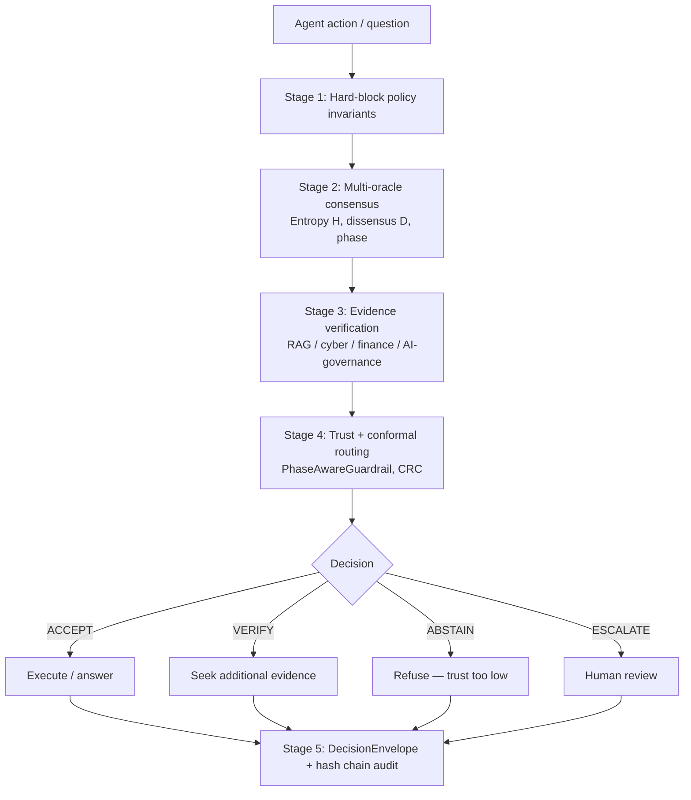

# How does REMORA work end to end?

The system turns AI reliability into a routing problem: accept what is strong,
verify what is uncertain, abstain when trust is too low, escalate what is too
risky, and never let agent memory or tool calls drift outside their authority
boundaries without review.

→ [02-evidence-and-claims.md](02-evidence-and-claims.md) for what the architecture
produces in benchmarks.
→ [07-api-reference.md](07-api-reference.md) for the public interfaces.

---

## Five-stage pipeline



Stage 1 always runs first. Hard-block policy rules are deterministic and cannot
be overridden by any probabilistic oracle result. This is why the 0% unsafe
execution claim is an architectural property of the policy layer, not of the
consensus machinery — see `02-evidence-and-claims.md` §1 architectural caveat.

---

## Key modules

| Module | Purpose | Primary file |
|---|---|---|
| `remora/engine.py` | Orchestrates the five stages | `remora/engine.py` |
| `remora/policy/decision_engine.py` | Hard-block invariants + routing logic | `remora/policy/decision_engine.py` |
| `remora/policy/invariants.py` | Deterministic safety rules | `remora/policy/invariants.py` |
| `remora/cascade/` | Multi-oracle cascade + consensus | `remora/cascade/stages.py` |
| `remora/selective/guardrail.py` | Phase-aware trust routing | `remora/selective/guardrail.py` |
| `remora/selective/conformal.py` | Conformal risk control | `remora/selective/conformal.py` |
| `remora/selective/crc.py` | Conformal risk control under shift | `remora/selective/crc.py` |
| `remora/lyapunov.py` | Session stability V(t) = H + λD | `remora/lyapunov.py` |
| `remora/audit/hash_chain.py` | SHA-256 hash-chain audit trail | `remora/audit/hash_chain.py` |
| `remora/governance/nested_governance.py` | Nested memory layers + forgetting | `remora/governance/nested_governance.py` |
| `remora/safety/` | Adversarial detection, file-risk classification | `remora/safety/adversarial.py` |
| `remora/toolcall/` | Tool-call schema validation and gating | `remora/toolcall/` |
| `remora/aromer/` | Closed-loop learning layer (EXPERIMENTAL) | `remora/aromer/` |
| `servers/mcp_remora.py` | MCP server exposing REMORA as Claude tools | `servers/mcp_remora.py` |

---

## Oracle → consensus → policy gate

```
Oracle A (LLaMA 3.3 70B)  ─┐
Oracle B (Claude 3.5 Haiku) ├─► ConsensusGate ─► PolicyObservation ─► RemoraDecisionEngine
Oracle C (Gemma 3 27B)     ─┘        │                                         │
                                      │                                         │
                              Entropy H, Dissensus D,                    Hard blocks run first
                              Temperature T, Phase                        (policy invariants)
                              (ordered / critical / disordered)
```

Three independent model families are used to reduce correlated failure risk.
The `OracleDiversityTracker` monitors pairwise correlation; it warns when
swarm convergence ρ > 0.60. See `remora/cascade/stages.py`.

**Consensus is not truth.** Oracle agreement is one input to the governance
decision. It is combined with evidence signals, policy constraints, and phase
classification before a routing verdict is issued.

---

## Governance layers (nested memory)

Inspired by Nested Learning (Behrouz et al., 2025), REMORA models long-running
agent sessions as a stack of layers with different update frequencies and trust
boundaries:

| Layer | Update frequency | Agent-writable | Retention |
|---|---|---|---|
| L0 Runtime context | per request | yes | short |
| L1 Trust evaluation | per decision | no | medium |
| L2 Evidence memory | per retrieval | no | medium |
| L3 Policy memory | reviewed change only | no | long |
| L4 Audit ledger | append-only | no | permanent |
| L5 Governance learning | reviewed change only | no | permanent |

Machine-readable profile: `enterprise/nested_governance_layers.yaml`.

Governance forgetting — when a temporary exception becomes normal behaviour, or
an agent begins ignoring `ABSTAIN` / `ESCALATE` — is detected by
`remora/governance/governance_forgetting.py`.

---

## Deployment modes

| Mode | What runs | Use case |
|---|---|---|
| Full REMORA | All five stages | Research / high-stakes deployment |
| Hard-blocks-only | Policy invariants only, no oracle calls | Low-cost fallback; degraded mode |
| Shadow mode | Full pipeline but no enforcement — decisions logged only | Parallel observation without intervention |

Mode degradation from full REMORA to hard-blocks-only must always be recorded
in `results/agentharm/mode_metadata.jsonl` and is never hidden from scoring.

---

## MCP integration

REMORA exposes its consensus and verification capabilities as an MCP server
(`servers/mcp_remora.py`). This allows AI assistants (Claude Desktop, Claude
Code) to call REMORA tools directly over JSON-RPC. The server connects to:

- Cloudflare Workers AI for oracle routing (optional — local Python fallback
  available without Cloudflare),
- Cloudflare D1 for the audit ledger,
- Cloudflare Vectorize for RAG evidence retrieval.

Cloudflare services are accelerators, not hard requirements.

---

## Known architectural risks

From `docs/architecture_risk_register.md`:

| Risk | Current status | Next acceptance gate |
|---|---|---|
| Live evidence quality — stale, noisy, or contradictory retrieval | Partial; live semantic retrieval is not the headline evidence result | Locked-corpus retrieval benchmark with contradiction false-accept rate |
| Oracle swarm cost and latency | Adaptive cascade short-circuits easy cases | Tiered gating policy for low/medium/high risk |
| Canonicalization brittleness — token-hash misses synonymy and negation | Lexical heuristic documented; NLI alternative exists as drop-in | NLI/cross-encoder clustering benchmark |
| Correlated oracle failure — agreement does not equal truth | Diversity weighting, phase classification, hard-block precedence | Multi-provider correlation benchmark on live cached outputs |
| Critical-phase trust inversion | `PhaseAwareGuardrail` implemented and tested internally | External benchmark phase-conditioned confidence curves |
| Simulator-scoped tool-call safety | Scoped honestly as simulator result | Live-agent shadow replay with cached model outputs |
| Audit tamper prevention — hash chains detect but do not prevent full-chain replacement | Hash-chain integrity implemented; append-only storage is external dependency | Append-only storage profile + replay verification test |

Do not infer from this architecture that REMORA proves correctness of arbitrary
agent actions, certifies deployment readiness, makes consensus equivalent to
truth, or eliminates the need for human approval in critical domains.
