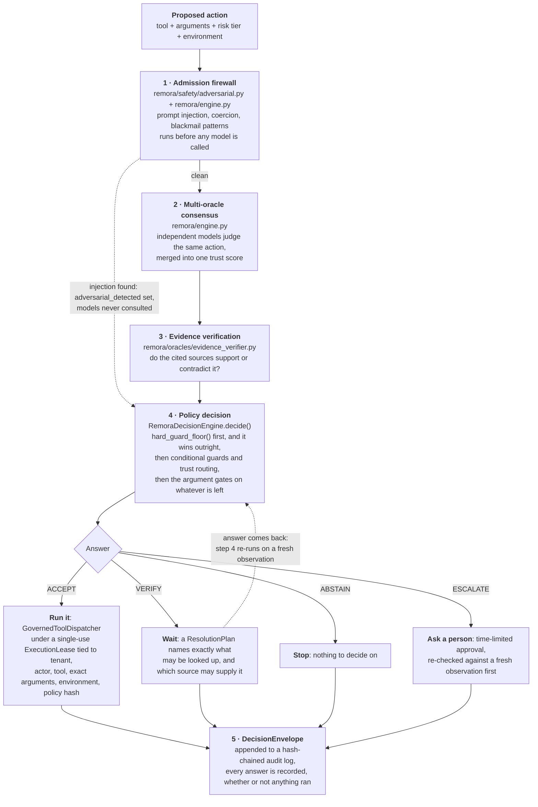

# How does REMORA work end to end?


> **Note on `enterprise/*` references:** paths under `enterprise/` name design
> artifacts maintained in the enterprise edition / main implementation repo; they
> are not bundled in this research repo. Descriptive references are retained; the
> files themselves live outside this repository.

> **Canonical architecture reference:** [`../ARCHITECTURE.md`](../ARCHITECTURE.md).
> This page is the end-to-end narrative; [`reference_architecture.md`](reference_architecture.md)
> details the assurance control plane. All three defer to `../ARCHITECTURE.md` for
> the authoritative component and data-flow description.

The system turns AI reliability into a routing problem: accept what is strong,
verify what is uncertain, abstain when trust is too low, escalate what is too
risky, and never let agent memory or tool calls drift outside their authority
boundaries without review.

→ [02-evidence-and-claims.md](02-evidence-and-claims.md) for what the architecture
produces in benchmarks.
→ [07-api-reference.md](07-api-reference.md) for the public interfaces.

---

## Which pipeline is the product?

REMORA serves two surfaces, and this page has historically led with the wrong
one. The **execution kernel** (`/v1/execution/*`) is the product: authoritative
context, a deterministic policy decision, a single-use grant, a PEP, an
execution lease, durable dispatch, effect verification. Its safety floor comes
from hard-block policy rules and does not consult a model at all.

The **five-stage pipeline below is the research surface** (`/v1/assess`).
Multi-oracle consensus, evidence verification and the uncertainty observables
contribute *routing quality* — separating the plausible-but-unverified from
the confidently-fine — and are explicitly optional. They are not prerequisites
for the execution kernel and cannot override its hard-guard floor. See
[`../README.md`](../README.md) and [`../DEVELOPER_OVERVIEW.md`](../DEVELOPER_OVERVIEW.md)
for that boundary, which the machine-checked
[product truth contract](product/product_truth_contract.yaml) enforces.

Read this page for how a decision is *reached*. Read
[deployment/execution-quickstart.md](deployment/execution-quickstart.md) for
how one is *enforced*.

---

## Five-stage pipeline (the `/v1/assess` research surface)


```mermaid
flowchart TD
    A["<b>Proposed action</b><br/>tool + arguments + risk tier + environment"] --> B
    B["<b>1 · Admission firewall</b><br/>remora/safety/adversarial.py + remora/engine.py<br/>prompt injection, coercion, blackmail patterns<br/>runs before any model is called"]
    B -->|"clean"| C
    B -.->|"injection found: adversarial_detected set,<br/>models never consulted"| E
    C["<b>2 · Multi-oracle consensus</b><br/>remora/engine.py<br/>independent models judge the same action,<br/>merged into one trust score"] --> D
    D["<b>3 · Evidence verification</b><br/>remora/oracles/evidence_verifier.py<br/>do the cited sources support or contradict it?"] --> E
    E["<b>4 · Policy decision</b><br/>RemoraDecisionEngine.decide()<br/>hard_guard_floor() first, and it wins outright,<br/>then conditional guards and trust routing,<br/>then the argument gates on whatever is left"]
    E --> F{"Answer"}
    F -->|ACCEPT| G["<b>Run it</b>: GovernedToolDispatcher<br/>under a single-use ExecutionLease tied to tenant,<br/>actor, tool, exact arguments, environment, policy hash"]
    F -->|VERIFY| H["<b>Wait</b>: a ResolutionPlan names exactly what<br/>may be looked up, and which source may supply it"]
    F -->|ABSTAIN| I["<b>Stop</b>: nothing to decide on"]
    F -->|ESCALATE| J["<b>Ask a person</b>: time-limited approval,<br/>re-checked against a fresh observation first"]
    H -.->|"answer comes back:<br/>step 4 re-runs on a fresh observation"| E
    G --> K["<b>5 · DecisionEnvelope</b><br/>appended to a hash-chained audit log,<br/>every answer is recorded, whether or not anything ran"]
    H --> K
    I --> K
    J --> K
```

**Why the firewall's arrow is dotted.** The admission firewall does not issue the
verdict itself. It sets `adversarial_detected` and suppresses the model fan-out, and
then the first hard guard in step 4 turns that flag into ESCALATE
(`ADMISSION_FIREWALL_BLOCKED`). Every verdict comes out of one place, which is why the
explanation of a decision can never disagree with the decision.

**Why hard guards "win outright".** The deterministic hard guards (schema,
forbidden-tool, tainted-argument, contradicting-evidence, counterfactual,
production-write) are checked at the top of `RemoraDecisionEngine.decide()`, which runs
*after* the models have spoken, so first means *first in priority*, not first in time.
A confident model cannot buy its way past a forbidden tool: no confidence score or
model majority can unlock a forbidden tool, a malformed call, a detected injection, or
an untrusted instruction that would choose the recipient, the command or the
credential. The argument gates sit at the other end of the ladder, after every blocking
rule, so they can only ever make a would-be ACCEPT more cautious, never unblock
something. `decide()` and `explain()` walk the same ordered list, so the trace you read
is the path that was taken. This is why the 0% unsafe execution claim is an
architectural property of the policy layer, not of the consensus machinery: see
`02-evidence-and-claims.md` §1 architectural caveat.

**What VERIFY promises.** It is not a shrug. A VERIFY from the argument gates carries a
`ResolutionPlan`: the named lookup, the exact arguments it may fill in, and the sources
allowed to supply them. The lookup cannot switch tools or write anything outside its
plan, and if no lookup exists at all the answer is ABSTAIN instead: promising a check
that cannot happen is worse than stopping. When the answer comes back, step 4 runs
again from scratch on a fresh view. In today's execution API, VERIFY still means "queue
for a person"; the automatic-lookup mechanism demonstrated by CLAIM-014 is not
yet wired into that path.

**What running it means.** `/v1/execution/execute` spends a single-use grant and calls
the tool through `GovernedToolDispatcher`. Permission is welded to the exact call it
was granted for: approval to run `{"motor": "M1", "mode": "read"}` cannot be reused for
`{"motor": "*", "mode": "shutdown"}` — the arguments are re-hashed and re-checked in
the instant before the tool runs, and the permission expires and is single-use. Tools
come **only** from deployment configuration (`REMORA_TOOL_REGISTRY_MODULE`), never from
the request, so an agent cannot introduce a tool or the credentials behind it. With no
registry configured, dispatch reports `executed: false` and nothing happens.

**About the disagreement metrics.** Fields named `temperature` and `phase` are logged
for analysis only. They are legacy physics-flavoured names for how much the models
disagreed, and they lost their pre-registered test against a simpler
calibrated-confidence baseline (`NEGATIVE_RESULTS.md` §18). They influence nothing.

---

## Key modules

| Module | Purpose | Key entry point |
|---|---|---|
| `remora/engine.py` | Orchestrates the five stages | `Remora` |
| `remora/reporting.py` | Assembles the decision report + `DecisionEnvelope` (dependency-injected) | `build_report()` |
| `remora/state.py` | Engine session-state contract (re-exported via `remora.engine`) | `RemoraState` |
| `remora/policy/decision_engine.py` | Hard-block invariants + routing logic | `RemoraDecisionEngine.decide()` |
| `remora/policy/invariants.py` | Deterministic safety rules | `CORE_INVARIANTS`, `assert_invariants()` |
| `remora/cascade/` | Multi-oracle cascade + consensus | `remora/cascade/stages.py` |
| `remora/selective/guardrail.py` | Phase-aware trust routing | `PhaseAwareGuardrail` |
| `remora/selective/conformal.py` | Split-conformal threshold calibration | `conformal_threshold()` |
| `remora/selective/crc.py` | Weighted empirical selective router (CRC-inspired; no theorem guarantee) | `WeightedEmpiricalSelectiveRouter` |
| `remora/lyapunov.py` | Session stability V(t) = H + λD (heuristic observable) | `LyapunovController` |
| `remora/audit/hash_chain.py` | SHA-256 hash-chain audit trail | `AuditHashChain` |
| `remora/governance/nested_governance.py` | Nested memory layers + forgetting | `NestedGovernanceModel` |
| `remora/safety/` | Adversarial detection, file-risk classification | `remora/safety/adversarial.py` |
| `remora/toolcall/` | Tool-call schema validation and gating | `remora/toolcall/remora_gate.py` |
| `remora/aromer/` | Closed-loop learning layer (EXPERIMENTAL) | `remora/aromer/orchestrator.py` |
| `servers/execution_api.py` | Enforcing `/v1/execution/*` surface (routes + orchestration; contracts in `servers/execution_contracts.py`) | `assess`/`approve`/`execute` |
| `remora/persistence/execution_state.py` | All-or-nothing review-state transaction adapter | `transaction_state()` |
| `remora/execution/authorization.py` | ToolSpec bundle verification + assessed-record read-back | `resolve_toolspec()` |
| `servers/mcp_remora.py` | MCP server exposing REMORA as Claude tools | profile-gated tool set (see `docs/integrations/mcp-integration.md`) |

---

## Oracle → consensus → policy gate

```
Oracle A (LLaMA 3.3 70B)  ─┐
Oracle B (Claude 3.5 Haiku) ├─► ConsensusGate ─► PolicyObservation ─► RemoraDecisionEngine
Oracle C (Gemma 3 27B)     ─┘        │                                         │
                                      │                                         │
                              Disagreement diagnostics:                  Hard guards first
                              H, D, temperature, phase                   (within decide())
                              (ordered / critical / disordered)
```

Three independent model families are used to reduce correlated failure risk.
The `OracleDiversityTracker` monitors pairwise correlation; it warns when
swarm convergence ρ > 0.60. See `remora/oracles/diversity.py`.

**Consensus is not truth.** Oracle agreement is one input to the governance
decision. It is combined with evidence signals, policy constraints, and phase
classification before a routing verdict is issued.

---

## Governance layers (nested memory)

Inspired by Nested Learning (Behrouz et al., 2025), REMORA models long-running
agent sessions as a stack of layers with different update frequencies and trust
boundaries:

| Layer | Update frequency | Agent-writable | Retention |
|---|---|---|---|
| L0 `runtime_context` | per request | yes | short |
| L1 `session_memory` | per session | yes | short |
| L2 `trust_memory` | per decision | no | medium |
| L3 `evidence_memory` | per retrieval | no | medium |
| L4 `project_memory` | reviewed change only | no | long |
| L5 `policy_memory` | reviewed change only | no | long |
| L6 `audit_ledger` | append-only | no | permanent |
| L7 `architecture_baseline` | reviewed change only | no | permanent |

Implementation: `remora/governance/nested_governance.py`; the machine-readable
layer profile is the `nested_governance_layers` section of
`artifacts/credibility-pack/claim-ledger.yaml` (no standalone `enterprise/`
directory exists in this repository).

Governance forgetting, when a temporary exception becomes normal behaviour, or
an agent begins ignoring `ABSTAIN` / `ESCALATE`, is detected by
`remora/governance/governance_forgetting.py`.

---

## Deployment modes

| Mode | What runs | Use case |
|---|---|---|
| Full REMORA | All five stages | Research / high-stakes deployment |
| Hard-blocks-only | Policy invariants only, no oracle calls | Low-cost fallback; degraded mode |
| Shadow mode | Full pipeline but no enforcement, decisions logged only | Parallel observation without intervention |

Mode degradation from full REMORA to hard-blocks-only must always be recorded
in `results/agentharm/mode_metadata.jsonl` and is never hidden from scoring.

---

## MCP integration

REMORA exposes its consensus and verification capabilities as an MCP server
(`servers/mcp_remora.py`). This allows AI assistants (Claude Desktop, Claude
Code) to call REMORA tools directly over JSON-RPC.

The server resolves a privacy profile at startup (`REMORA_MCP_PROFILE`):
`local` is the **default** — zero outbound network, endpoint variables
ignored, worker-backed tools refuse offline; `demo` requires explicit opt-in
and prints a disclosure that content leaves the machine; `enterprise`
requires explicit endpoints and refuses startup when incomplete. No profile
silently falls back to another. Under a remote profile the server connects to
Cloudflare Workers AI (oracle routing), D1 (audit ledger) and Vectorize (RAG
retrieval). See `docs/integrations/mcp-integration.md`.

---

## Known architectural risks

From `docs/methods/architecture_risk_register.md`:

| Risk | Current status | Next acceptance gate |
|---|---|---|
| Live evidence quality, stale, noisy, or contradictory retrieval | Partial; live semantic retrieval is not the headline evidence result | Locked-corpus retrieval benchmark with contradiction false-accept rate |
| Oracle swarm cost and latency | Adaptive cascade short-circuits easy cases | Tiered gating policy for low/medium/high risk |
| Canonicalization brittleness, token-hash misses synonymy and negation | Lexical heuristic documented; NLI alternative exists as drop-in | NLI/cross-encoder clustering benchmark |
| Correlated oracle failure, agreement does not equal truth | Diversity weighting, phase classification, hard-block precedence | Multi-provider correlation benchmark on live cached outputs |
| Critical-phase trust inversion | `PhaseAwareGuardrail` implemented and tested internally | External benchmark phase-conditioned confidence curves |
| Simulator-scoped tool-call safety | Scoped honestly as simulator result | Live-agent shadow replay with cached model outputs |
| Audit tamper prevention, hash chains detect but do not prevent full-chain replacement | Hash-chain integrity implemented; append-only storage is external dependency | Append-only storage profile + replay verification test |

Do not infer from this architecture that REMORA proves correctness of arbitrary
agent actions, certifies deployment readiness, makes consensus equivalent to
truth, or eliminates the need for human approval in critical domains.
