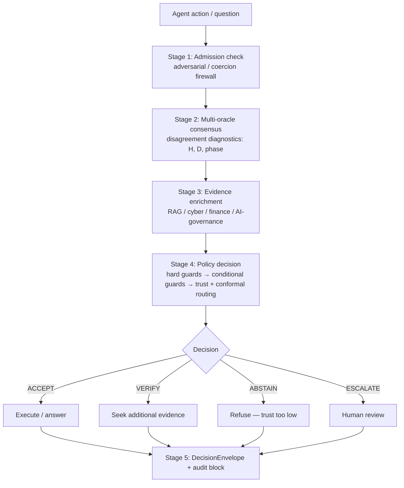

# How does REMORA work end to end?

> **Canonical architecture reference:** [`../ARCHITECTURE.md`](../ARCHITECTURE.md).
> This page is the end-to-end narrative; [`reference_architecture.md`](reference_architecture.md)
> details the assurance control plane. All three defer to `../ARCHITECTURE.md` for
> the authoritative component and data-flow description.

The system turns AI reliability into a routing problem: accept what is strong,
verify what is uncertain, abstain when trust is too low, escalate what is too
risky, and never let agent memory or tool calls drift outside their authority
boundaries without review.

→ [02-evidence-and-claims.md](02-evidence-and-claims.md) for what the architecture
produces in benchmarks.
→ [07-api-reference.md](07-api-reference.md) for the public interfaces.

---

## Five-stage pipeline


```mermaid
flowchart TD
    A[Agent action / question] --> B[Stage 1: Admission check\nadversarial / coercion firewall]
    B --> C[Stage 2: Multi-oracle consensus\ndisagreement diagnostics: H, D, phase]
    C --> D[Stage 3: Evidence enrichment\nRAG / cyber / finance / AI-governance]
    D --> E[Stage 4: Policy decision\nhard guards → conditional guards → trust + conformal routing]
    E --> F{Decision}
    F -->|ACCEPT| G[Execute / answer]
    F -->|VERIFY| H[Seek additional evidence]
    F -->|ABSTAIN| I[Refuse — trust too low]
    F -->|ESCALATE| J[Human review]
    G --> K[Stage 5: DecisionEnvelope + audit block]
    H --> K
    I --> K
    J --> K
```

The admission check (Stage 1) screens for adversarial and coercion patterns
before any oracle call. The remaining deterministic hard guards (schema,
forbidden-tool, tainted-argument, contradicting-evidence, counterfactual,
production-write) run first *inside* the policy decision (Stage 4) with absolute
priority — no probabilistic oracle result can override a hard block — even though
that decision is evaluated after the consensus and evidence machinery. This is
why the 0% unsafe execution claim is an architectural property of the policy
layer, not of the consensus machinery: see `02-evidence-and-claims.md` §1
architectural caveat.

---

## Key modules

| Module | Purpose | Key entry point |
|---|---|---|
| `remora/engine.py` | Orchestrates the five stages | `Remora` |
| `remora/reporting.py` | Assembles the decision report + `DecisionEnvelope` (dependency-injected) | `build_report()` |
| `remora/state.py` | Engine session-state contract (re-exported via `remora.engine`) | `RemoraState` |
| `remora/policy/decision_engine.py` | Hard-block invariants + routing logic | `RemoraDecisionEngine.decide()` |
| `remora/policy/invariants.py` | Deterministic safety rules | `CORE_INVARIANTS`, `assert_invariants()` |
| `remora/cascade/` | Multi-oracle cascade + consensus | `remora/cascade/stages.py` |
| `remora/selective/guardrail.py` | Phase-aware trust routing | `PhaseAwareGuardrail` |
| `remora/selective/conformal.py` | Split-conformal threshold calibration | `conformal_threshold()` |
| `remora/selective/crc.py` | Weighted empirical selective router (CRC-inspired; no theorem guarantee) | `WeightedEmpiricalSelectiveRouter` |
| `remora/lyapunov.py` | Session stability V(t) = H + λD (heuristic observable) | `LyapunovController` |
| `remora/audit/hash_chain.py` | SHA-256 hash-chain audit trail | `AuditHashChain` |
| `remora/governance/nested_governance.py` | Nested memory layers + forgetting | `NestedGovernanceModel` |
| `remora/safety/` | Adversarial detection, file-risk classification | `remora/safety/adversarial.py` |
| `remora/toolcall/` | Tool-call schema validation and gating | `remora/toolcall/remora_gate.py` |
| `remora/aromer/` | Closed-loop learning layer (EXPERIMENTAL) | `remora/aromer/orchestrator.py` |
| `servers/mcp_remora.py` | MCP server exposing REMORA as Claude tools | 14 registered tools |

---

## Oracle → consensus → policy gate

```
Oracle A (LLaMA 3.3 70B)  ─┐
Oracle B (Claude 3.5 Haiku) ├─► ConsensusGate ─► PolicyObservation ─► RemoraDecisionEngine
Oracle C (Gemma 3 27B)     ─┘        │                                         │
                                      │                                         │
                              Disagreement diagnostics:                  Hard guards first
                              H, D, temperature, phase                   (within decide())
                              (ordered / critical / disordered)
```

Three independent model families are used to reduce correlated failure risk.
The `OracleDiversityTracker` monitors pairwise correlation; it warns when
swarm convergence ρ > 0.60. See `remora/oracles/diversity.py`.

**Consensus is not truth.** Oracle agreement is one input to the governance
decision. It is combined with evidence signals, policy constraints, and phase
classification before a routing verdict is issued.

---

## Governance layers (nested memory)

Inspired by Nested Learning (Behrouz et al., 2025), REMORA models long-running
agent sessions as a stack of layers with different update frequencies and trust
boundaries:

| Layer | Update frequency | Agent-writable | Retention |
|---|---|---|---|
| L0 `runtime_context` | per request | yes | short |
| L1 `session_memory` | per session | yes | short |
| L2 `trust_memory` | per decision | no | medium |
| L3 `evidence_memory` | per retrieval | no | medium |
| L4 `project_memory` | reviewed change only | no | long |
| L5 `policy_memory` | reviewed change only | no | long |
| L6 `audit_ledger` | append-only | no | permanent |
| L7 `architecture_baseline` | reviewed change only | no | permanent |

Implementation: `remora/governance/nested_governance.py`; the machine-readable
layer profile is the `nested_governance_layers` section of
`artifacts/credibility-pack/claim-ledger.yaml` (no standalone `enterprise/`
directory exists in this repository).

Governance forgetting, when a temporary exception becomes normal behaviour, or
an agent begins ignoring `ABSTAIN` / `ESCALATE`, is detected by
`remora/governance/governance_forgetting.py`.

---

## Deployment modes

| Mode | What runs | Use case |
|---|---|---|
| Full REMORA | All five stages | Research / high-stakes deployment |
| Hard-blocks-only | Policy invariants only, no oracle calls | Low-cost fallback; degraded mode |
| Shadow mode | Full pipeline but no enforcement, decisions logged only | Parallel observation without intervention |

Mode degradation from full REMORA to hard-blocks-only must always be recorded
in `results/agentharm/mode_metadata.jsonl` and is never hidden from scoring.

---

## MCP integration

REMORA exposes its consensus and verification capabilities as an MCP server
(`servers/mcp_remora.py`). This allows AI assistants (Claude Desktop, Claude
Code) to call REMORA tools directly over JSON-RPC. The server connects to:

- Cloudflare Workers AI for oracle routing (optional, local Python fallback
  available without Cloudflare),
- Cloudflare D1 for the audit ledger,
- Cloudflare Vectorize for RAG evidence retrieval.

Cloudflare services are accelerators, not hard requirements.

---

## Known architectural risks

From `docs/methods/architecture_risk_register.md`:

| Risk | Current status | Next acceptance gate |
|---|---|---|
| Live evidence quality, stale, noisy, or contradictory retrieval | Partial; live semantic retrieval is not the headline evidence result | Locked-corpus retrieval benchmark with contradiction false-accept rate |
| Oracle swarm cost and latency | Adaptive cascade short-circuits easy cases | Tiered gating policy for low/medium/high risk |
| Canonicalization brittleness, token-hash misses synonymy and negation | Lexical heuristic documented; NLI alternative exists as drop-in | NLI/cross-encoder clustering benchmark |
| Correlated oracle failure, agreement does not equal truth | Diversity weighting, phase classification, hard-block precedence | Multi-provider correlation benchmark on live cached outputs |
| Critical-phase trust inversion | `PhaseAwareGuardrail` implemented and tested internally | External benchmark phase-conditioned confidence curves |
| Simulator-scoped tool-call safety | Scoped honestly as simulator result | Live-agent shadow replay with cached model outputs |
| Audit tamper prevention, hash chains detect but do not prevent full-chain replacement | Hash-chain integrity implemented; append-only storage is external dependency | Append-only storage profile + replay verification test |

Do not infer from this architecture that REMORA proves correctness of arbitrary
agent actions, certifies deployment readiness, makes consensus equivalent to
truth, or eliminates the need for human approval in critical domains.
