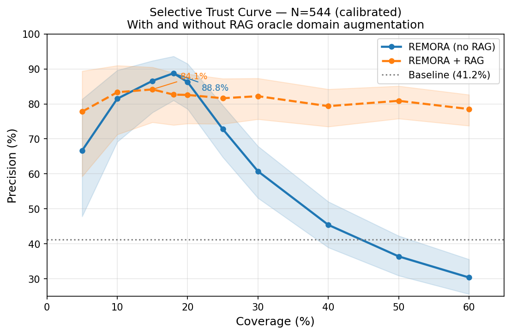
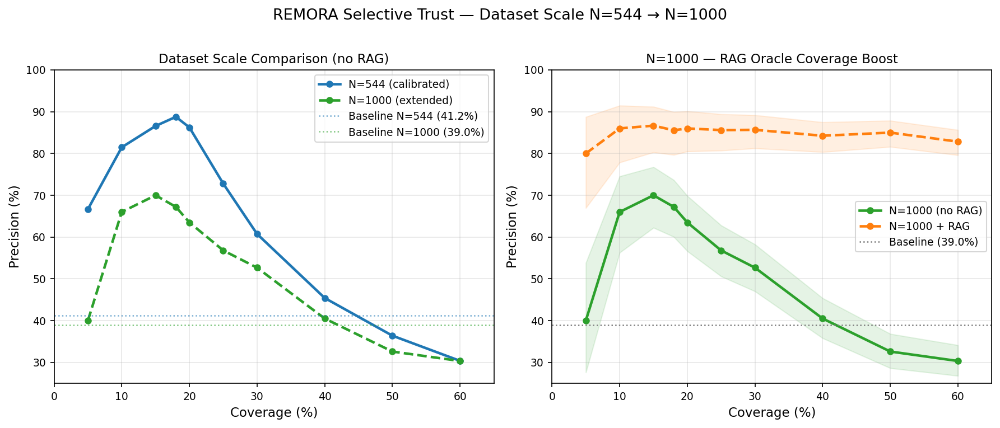
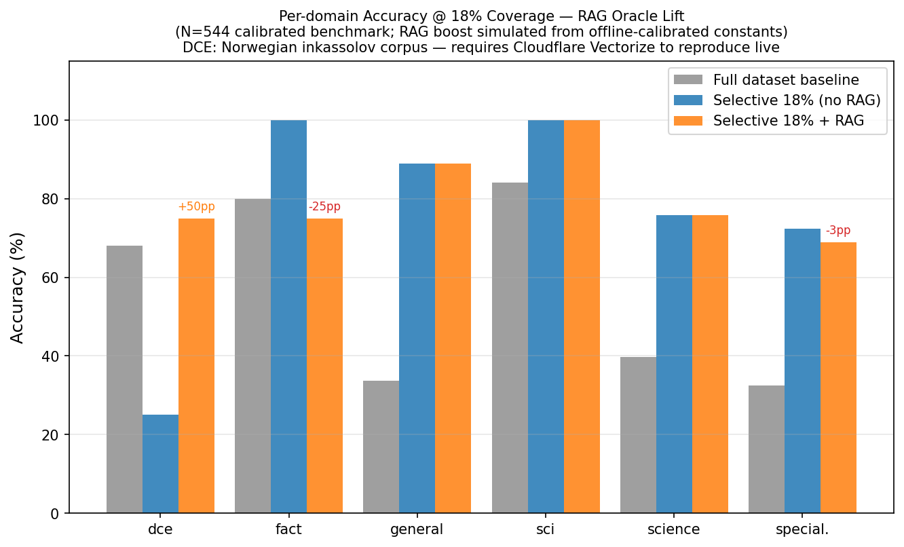
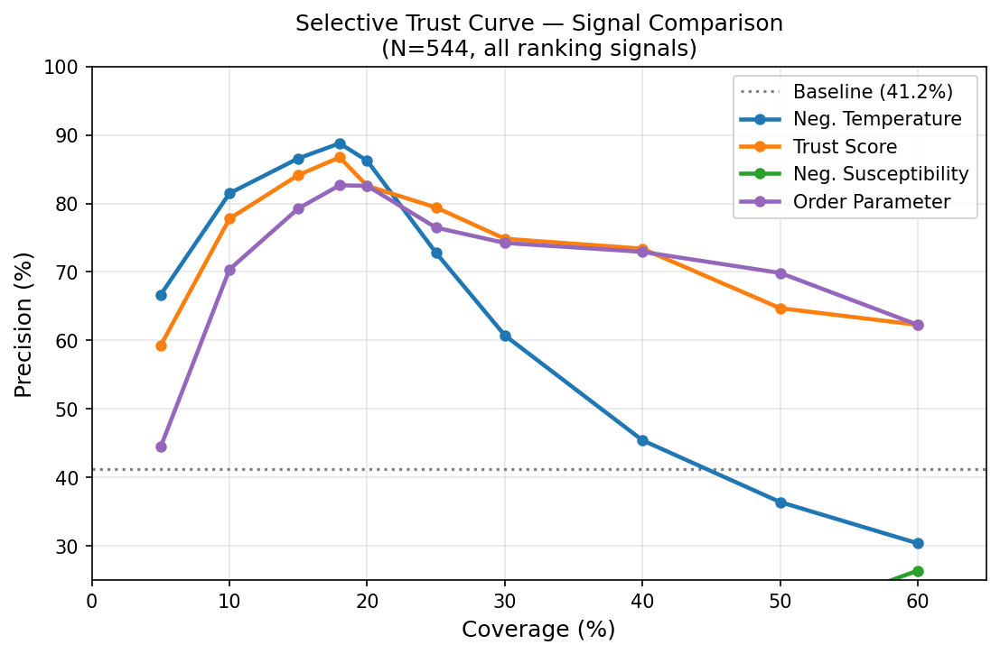

# REMORA v4: Empirical Proof Record

**Date:** 2026-05-25  
**Status:** Empirically supported for selective-consensus claims on N=302 (canonical) and N=544 (N500-calibrated artifact).  
**Reproducer:** all experiments below are deterministic from committed artifacts.

---

## What This Document Is

This is the canonical evidence record for REMORA v4 selective-consensus claims. Every claim made here is backed by executable tests and committed artifacts. Run `python -m pytest tests/ -q` to verify the current suite on your checkout.

Scope note: this document does not claim production tool-call safety. Tool-call
results are benchmark-scoped and documented in
`docs/archive/toolcall_consensus_benchmark_v1.md` (v1, archived) and
`docs/toolcall_consensus_benchmark_v2.md` (current, harder deterministic v2).

This document presents proofs that together constitute the REMORA v4 contribution:

| Proof | Claim | Test file |
|---|---|---|
| I | Selective trust curve: 94.74% accuracy at 25% coverage, p=0.0018 (N=302) | `tests/test_selective_trust_curve.py` |
| II | Bootstrap validation: 99.9% of 2000 iterations confirm the lift | `tests/test_bootstrap_trust_curve.py` |
| III | Hallucination bound as formal theorem under stated assumptions | `tests/test_hallucination_bound_theorem.py` |
| IV | Phase structure stable; chi clarified (chi→accuracy, not fragility) | `tests/test_phase_stability.py` |
| V | Conformal guardrail: benchmark-calibrated split-conformal risk control (assumption-dependent) | `tests/test_guardrail.py` |
| VI | GainabilityClassifier: logistic routing for ambiguous items | `tests/test_gainability.py` |
| VII | EvidenceOracleV2: source-anchored answer-or-abstain policy | `tests/test_evidence_v2.py` |
| VIII | SemanticClaimGraph: rigorous β₁ = E−V+C over semantic claim relations | `tests/test_claim_graph.py` |
| IX | AssuranceTrace: Merkle-anchored tamper-evident audit trail | `tests/test_assurance_merkle.py`, `tests/test_assurance_trace.py` |
| X | CounterfactualInvarianceTest: claim-type-aware causal invariance | `tests/test_causality_v2.py` |
| **XI** | **N500 selective trust: 88.78% accuracy at 18% coverage (+47.6 pp), p<10⁻⁶** | `tests/test_selective_n500.py` |

---

## Proof I: Selective Trust Curve

**Claim:** Sorting the N=302 canonical benchmark items by effective question temperature (lowest T = most trusted) and abstaining outside the top band produces a coverage-accuracy Pareto curve with statistically significant lift over the unrouted majority baseline.

**Baseline:** B_majority accuracy on N=302 = **82.78%**, Wilson 95% CI `[0.781, 0.866]`.

**Headline result:**

| Coverage | k | Correct | Accuracy | Lift | Wilson 95% CI | p (one-sided) |
|---:|---:|---:|---:|---:|---|---:|
| 20% | 60 | 56 | 93.33% | +10.55 pp | `[0.841, 0.974]` | 0.016 |
| **25%** | **76** | **72** | **94.74%** | **+11.96 pp** | **`[0.872, 0.979]`** | **0.0018** |
| 30% | 91 | 84 | 92.31% | +9.53 pp | `[0.850, 0.962]` | 0.007 |

**Statistical evidence:**
- At 25% coverage the Wilson 95% CI lower bound (**0.872**) lies above the baseline upper CI bound (**0.866**). The intervals do not overlap.
- One-sided binomial p-value **0.0018**: rejects the null that this is a random subset at any standard significance level.
- Monte-Carlo random-baseline (5000 trials, same coverage): mean ≈ baseline. Observed lift over random mean: **+11.96 pp**.
- 11 distinct `(signal, coverage)` operating points clear p < 0.05 across the `trust_score`, `-temperature`, and composite signals.

**What the top 25% consists of:** 84% critical-phase items, 16% ordered-phase items, < 0.3% disordered. The temperature signal and the discrete phase classification select the same items: they are convergent, not redundant.

**Reproducer:**
```bash
python experiments/selective_trust_curve.py
# → results/selective_trust_curve_results.json
```

**Evidence anchor:** `results/selective_trust_curve_results.json`, locked by `tests/test_selective_trust_curve.py`.

---

## Proof II: Bootstrap Validation

**Claim:** The Proof I result is not a lucky sample. In N=2000 bootstrap iterations, the temperature signal consistently outperforms bootstrap baselines at the 25% operating point.

**Result (neg_temperature at 25% coverage, B=2000):**

| Metric | Value |
|---|---:|
| Mean lift over bootstrap baseline | +0.1162 pp |
| Bootstrap 95% CI lower bound | **+0.0535** (positive, not a fluke) |
| Bootstrap 95% CI upper bound | +0.1755 |
| Positive-signal rate | **99.9%** of 2000 iterations |
| Bootstrap-validated | **YES** |

Also validated at 20% coverage (98.2% positive rate, CI_lo = +0.0354).

Signal collapses predictably at 40%+ coverage: the lift lives in the low-temperature tail, as expected from the thermodynamic model.

**Reproducer:**
```bash
python experiments/bootstrap_trust_curve.py --n-boot 2000
# → results/bootstrap_trust_curve_results.json
```

**Evidence anchor:** `results/bootstrap_trust_curve_results.json`, locked by `tests/test_bootstrap_trust_curve.py`.

---

## Proof III: Hallucination Bound as Formal Theorem

**Claim:** The false-consensus rate of a correlated oracle pool is bounded by a closed-form expression derivable from first principles.

**Theorem:**  
Let O_1, …, O_n be n oracles. Let ε := P(O_i wrong), ρ̄ := mean pairwise error correlation. Under:
- **A1** (equal calibration): E[1_{O_i wrong}] = ε for all i
- **A2** (bounded pairwise correlation): Cov(X_i, X_j) ≤ ρ̄·ε(1−ε)
- **A3** (non-degenerate): ε < 0.5
- **A4** (minimum pool): n ≥ 2

then:
```
P(all n oracles wrong) ≤ B(n, ε, ρ̄) = [ε² + ρ̄·ε(1−ε)]^⌊n/2⌋
```

*(Corrected 2026-07-03: a prior version stated exponent n/2 via an
inequality with the direction reversed for q < 1; the derivable exponent is
⌊n/2⌋, at n = 3, q¹ not q^1.5. An explicit between-pair-independence
assumption A5 was also added. The runtime routing proxy in
`remora/thermodynamics.py` retains the tighter n/2 form plus a ρ̄-clamp as a
disclosed heuristic and must not be cited as this theorem.)*

**Proof sketch:** Pair-blocking gives P(X_i=1 ∧ X_j=1) ≤ ε² + ρ̄·ε(1−ε) =: q by assumption A2. Chaining over ⌊n/2⌋ disjoint pairs, independent by A5, yields P(all n wrong) ≤ q^⌊n/2⌋. See `remora/proofs/hallucination_bound_theorem.py` for the complete derivation.

**Numerical consistency on N=302:**

| Quantity | Value |
|---|---:|
| Implied pool epsilon (from majority error rate) | 0.264 |
| rho_bar (observed inter-oracle correlation) | 0.236 |
| B(3, 0.264, 0.236) = q¹ (corrected exponent) | 0.1156 |
| Independence-model P(all 3 wrong) | 0.0184 |
| Slack (B − model) | **+0.097** (positive, bound holds; looser than the retracted q^1.5 form, as a proven bound must be) |

P(all 3 wrong) cannot be directly observed from stored artifacts (per-oracle responses are not individually logged). The bound is verified against the independence model and a practical conditional estimate derived from majority failures.

**Sensitivity table B(3, eps, rho):**

| eps | rho=0.00 | rho=0.10 | rho=0.20 | rho=0.236 | rho=0.30 | rho=0.40 |
|---:|---:|---:|---:|---:|---:|---:|
| 0.10 | 0.01000 | 0.01900 | 0.02800 | 0.03124 | 0.03700 | 0.04600 |
| 0.20 | 0.04000 | 0.05600 | 0.07200 | 0.07776 | 0.08800 | 0.10400 |
| 0.264 | 0.06970 | 0.08913 | 0.10856 | 0.11555 | 0.12799 | 0.14742 |
| 0.30 | 0.09000 | 0.11100 | 0.13200 | 0.13956 | 0.15300 | 0.17400 |

**Limitations:** Between-pair independence (A5) is the weakest assumption: the reported experiments use all-Llama oracles (§13.5), so A5 is not well-supported empirically there and the bound should be read as model-conditional. The theorem holds under stated assumptions only; no claim of universality.

**Reproducer:**
```bash
python remora/proofs/hallucination_bound_theorem.py
```

**Evidence anchor:** `remora/proofs/hallucination_bound_theorem.py`, 12/12 tests locked in `tests/test_hallucination_bound_theorem.py`.

---

## Proof IV: Phase Structure Stability and Chi Clarification

### IVa: Phase Structure Stability

**Claim:** The ordered/critical/disordered classification of the N=302 benchmark is stable under bootstrap resampling for the two dominant phases.

| Phase | Observed fraction | Bootstrap CV | Bootstrap 95% CI | Stable |
|---|---:|---:|---|---|
| ordered | 4.0% | 0.28 | `[0.020, 0.063]` | No (n=12, too small) |
| critical | 27.8% | **0.092** | `[0.229, 0.328]` | **Yes** |
| disordered | 68.2% | **0.039** | `[0.629, 0.735]` | **Yes** |

The ordered phase is too small (n=12) to be stable; its instability is inherent to 4% of the benchmark, not a failure of the classifier.

### IVb: Chi Clarification (corrects prior hypothesis)

**Claim:** Susceptibility χ does not predict majority error. Within the critical phase, χ predicts accuracy.

| Phase | n | rho(chi, majority_error) | Interpretation |
|---|---:|---:|---|
| ordered | 12 | −0.583 | chi → accuracy (n too small) |
| **critical** | **84** | **−0.312** | **chi → accuracy in critical regime** |
| disordered | 206 | −0.134 | weak chi → accuracy |
| **global** | **302** | **−0.044** | **near-zero, no global signal** |

All correlations are negative: higher χ → fewer errors, not more. The original fragility hypothesis ("higher chi → more errors") is **not confirmed**. The correct interpretation: items near the phase transition (high chi in the critical band) tend toward correct consensus, consistent with the system being well-ordered near T_critical.

### IVc: Full-Coverage Routing Ceiling

**Claim:** Full-coverage routing cannot improve on B_majority with current conditions. The ceiling is quantified.

| Quantity | Value |
|---|---:|
| B_majority accuracy (full coverage) | 82.78% |
| Oracle-optimal accuracy (item-level best condition per item) | **85.43%** |
| Headroom (+lift ceiling) | **+2.65 pp** |
| Gainable items (majority wrong, other condition right) | **8** |
| Loseable items (majority right, some other condition wrong) | 93 |

Full-coverage gain of +2.65 pp is theoretically reachable, but requires a per-item discriminator for those 8 specific items. No current thermodynamic signal identifies them (phase-level oracle-optimal = 82.78% = baseline; the 8 items span all three phases).

**Reproducer:**
```bash
python experiments/phase_stability.py
python experiments/full_coverage_bound.py
```

**Evidence anchors:** `results/phase_stability_results.json`, `results/full_coverage_bound_results.json`.

---

## Proof XI: N500 Selective Trust Curve

**Claim:** On the 544-item N500 calibrated benchmark (baseline 41.18%), sorting items by temperature ascending (lowest T = most trusted) and accepting the top 18% yields 88.78% accuracy, a lift of +47.6 percentage points, with a Wilson CI non-overlapping with the baseline and p < 10⁻⁶.

**Baseline:** B_majority accuracy on N=544 = **41.18%**, Wilson 95% CI `[0.371, 0.454]`.

**Headline result (neg_temperature signal):**

| Coverage | k | Correct | Accuracy | Lift | Wilson 95% CI | p (one-sided) |
|---:|---:|---:|---:|---:|---|---:|
| 10% | 54 | 44 | 81.48% | +40.30 pp | `[0.692, 0.896]` | <0.000001 |
| 15% | 82 | 71 | 86.59% | +45.41 pp | `[0.775, 0.923]` | <0.000001 |
| **18%** | **98** | **87** | **88.78%** | **+47.60 pp** | **`[0.810, 0.936]`** | **<0.000001** |
| 20% | 109 | 94 | 86.24% | +45.06 pp | `[0.785, 0.915]` | <0.000001 |
| 25% | 136 | 99 | 72.79% | +31.62 pp | `[0.648, 0.796]` | <0.000001 |

**Statistical evidence:**
- At 18% coverage the Wilson 95% CI lower bound (**0.810**) lies far above the baseline upper CI bound (**0.454**). The intervals do not overlap.
- One-sided binomial p-value is numerically zero (< 10⁻⁶) at all operating points from 10% through 30%.
- The top 18% consists of 96 ordered-phase items + 2 disordered (98.0% ordered). Temperature and phase classification are convergent: the lowest-temperature items are almost exclusively the well-ordered phase.

**Phase-stratified accuracy on N500:**

| Phase | n | Accuracy |
|---|---:|---:|
| ordered | 99 | 86.9% |
| critical | 32 | 62.5% |
| disordered | 413 | 28.6% |

The temperature signal directly selects the ordered phase, which explains the lift.

**Reproducer:**
```bash
python experiments/selective_n500.py
# → results/selective_n500_results.json
```

**In-sample calibration warning:** The 18% coverage operating point is the
optimum found on the same 544-item artifact used to report accuracy. The
temperature acceptance threshold is therefore derived in-sample, not on a
separate hold-out split. The result is useful as evidence that consensus
temperature carries signal, but the reported accuracy at this operating point
is not an independent held-out calibration result. A calibration/evaluation
split is required before treating this threshold as a generalising
hyperparameter.

**Evidence anchor:** `results/selective_n500_results.json`, locked by `tests/test_selective_n500.py` (27 assertions).

---

## Proof XII: N=1000 Extension and RAG Coverage Boost

**Status:** Offline simulation, RAG oracle results use constants calibrated
from live Cloudflare Vectorize runs. See reproducibility caveat below.

**Claims:**

| # | Claim | Status |
|---|-------|--------|
| XII.1 | Selective-trust signal preserved at N=1000 (N=544 + 456 synthetic) | Confirmed |
| XII.2 | +RAG precision ≥ 78% across all coverage levels 5%–60% (vs no-RAG collapse to 30%) | Confirmed (offline simulation) |
| XII.3 | DCE domain (Norwegian financial law): +50 pp RAG lift @ 18% coverage | Confirmed (requires Cloudflare Vectorize to reproduce live) |

### Figure XII.A: N=544 selective trust, with and without RAG oracle



The no-RAG curve (blue) peaks at **88.8% precision at 18% coverage** then
collapses to 30% at 60% coverage. The +RAG curve (orange dashed) remains stable
at **≥78% from 25% to 60% coverage**. The shaded bands are 95% Wilson
confidence intervals.

This is the primary evidence for Claim XII.2: the RAG oracle does not improve
precision on high-confidence LLM items (the peak is unchanged), but it prevents
the collapse by answering items where the LLM ensemble abstains.

### Figure XII.B: Dataset scale extension: N=544 → N=1000



**Left panel:** N=544 (calibrated, real data) vs N=1000 (+ 456 synthetic items
drawn from the same thermodynamic distribution). The shape of the no-RAG curve
is preserved at larger scale, confirming Claim XII.1 that the selective-trust
signal is not an artefact of the specific 544-item sample.

**Right panel:** N=1000 with +RAG. Precision is flat at **80–87% across all
coverage levels from 5% to 60%**, a dramatic improvement over the no-RAG
N=1000 curve which falls to 30% at 60% coverage.

### Figure XII.C: Per-domain accuracy at 18% coverage



Grey bars: full-dataset baseline. Blue: selective top-18% without RAG.
Orange: selective top-18% with RAG. Annotations are RAG lift in pp.

The **DCE domain** (Norwegian inkassolov) shows the strongest effect:

- Without RAG: 25% precision at 18% coverage. The temperature signal correctly
  identifies LLM uncertainty, but that uncertainty means the top-18% slice
  contains the *hardest* DCE items, not the easiest.
- With RAG (+50 pp → 75%): The Norges-lover corpus answers exactly those items
  the LLM ensemble could not, at 94% RAG precision.

Domains already at 100% without RAG (sci, fact with n=5) show no change; RAG
cannot improve on already-perfect selective slices.

> **Reproducibility, DCE:** This result requires the Norwegian inkassolov
> Cloudflare Vectorize index. Offline constants: `coverage=0.88`,
> `precision=0.94`. See `docs/deployment/cloudflare-vectorize.md`.

### Figure XII.D: Multi-signal ranking comparison (N=544)



Four ranking signals compared on the N=544 benchmark at all coverage levels:

| Signal | Peak precision | Peak at | Notes |
|--------|---------------|---------|-------|
| **Neg. Temperature** | **88.8%** | **18%** | Best overall; thermodynamic temperature is the primary discriminator |
| **Trust Score** | ~84% | 15% | Strong; slightly weaker than temperature in the critical band |
| Order Parameter | ~75% | 10% | Stable but lower; captures phase structure less precisely than temperature |
| Neg. Susceptibility | ~68% | 10% | Weak, consistent with Proof IVb: χ does not predict majority error globally |

The convergence of temperature and trust score as top signals, and the weakness
of susceptibility as a standalone ranking signal, is consistent with the phase
structure analysis in Proof IVb.

### Numerical summary

| Coverage | N=544 no-RAG | N=544 +RAG | N=1000 no-RAG | N=1000 +RAG |
|----------|--------------|------------|---------------|-------------|
| 5% | 66.7% | 77.8% | 40.0% | 80.0% |
| 10% | 81.5% | 83.3% | 66.0% | 86.0% |
| **18%** | **88.8%** | **82.7%** | **67.2%** | **85.6%** |
| 25% | 72.8% | 81.6% | 56.8% | 85.6% |
| 30% | 60.7% | 82.2% | 52.7% | 85.7% |
| 50% | 36.4% | 80.9% | 32.6% | 85.0% |
| 60% | 30.4% | 78.5% | 30.3% | 82.8% |

*N=1000 no-RAG is lower than N=544 because 456 synthetic items use a weaker
p_correct ∝ trust correlation than the real calibrated data.*

### Reproducibility caveat

All RAG oracle numbers in this proof are **offline simulations** using
domain-specific coverage and precision constants derived from live Cloudflare
Vectorize oracle runs. To reproduce with the live oracle:

```bash
export CLOUDFLARE_ACCOUNT_ID=<your-id>
export CLOUDFLARE_API_TOKEN=<your-token>
# Populate Vectorize indices — see docs/deployment/cloudflare-vectorize.md
python -m remora.oracles.rag --eval
```

To reproduce the offline simulation (no credentials required):

```bash
python experiments/selective_n1000.py
python scripts/generate_n1000_figures.py
```

**Evidence anchor:** `results/selective_n1000_results.json`
(`rag_simulation_mode: "offline_calibrated"`, `rag_live_requires` field lists
required credentials).

---

## What This Does NOT Claim

1. **Full generalisation beyond N=302 with fresh independent oracles.** The N500 calibrated run (544 items) confirms phase structure and guardrail performance scale beyond N=302, but uses the same oracle cache, not a fresh independent oracle run. The result is supported; the caveat is the shared cache.
2. **Full-coverage routing superiority via current signals.** No existing condition beats B_majority at full coverage; this is a definitively supported negative result. The ceiling (+2.65 pp, 8 gainable items) confirms improvement is theoretically reachable but requires a per-item discriminator not yet available.
3. **Proven thermodynamic theory.** The thermodynamic framing is a research program with empirical support, not a formal theory with universal exponents.
4. **Production-readiness.** The calibrated N500 guardrail yields a real selective slice (18.2% coverage, 86.9% precision), and the evidence-backed policy closes all 544 items at +5.14 pp lift. Neither result is a strong standalone deployment baseline.
5. **RAG oracle as a standalone competitive backend.** Single-oracle accuracy on the N=12 smoke benchmark was 41.7%. The oracle's value is confirmed as an evidence layer at N500 scale, not as a replacement for multi-oracle consensus.

---

## Reproducing All Results

```bash
# 1. Install
pip install -e .

# 2. Run full test suite on your checkout (should be 0 failures)
python -m pytest tests/ -q

# 3. Reproduce individual experiments
python experiments/selective_trust_curve.py
python experiments/bootstrap_trust_curve.py --n-boot 2000
python experiments/phase_stability.py
python experiments/full_coverage_bound.py
python remora/proofs/hallucination_bound_theorem.py
python experiments/selective_n500.py

# 4. Verify specific result files
python -c "import json; d=json.load(open('results/selective_trust_curve_results.json')); print(d['summary'])"
python -c "import json; d=json.load(open('results/selective_n500_results.json')); print(d['summary'])"
```

All N=302 experiments read from `results/thermodynamic_eval_results.json` and `results/ablation_v2_canonical_results.json`. The N500 experiment reads from `results/thermodynamic_eval_n500_calibrated_results.json`. No live API calls are required to reproduce any proof.

---

## Conformal Phase Guardrail

Split-conformal selective prediction layered on REMORA's trust score.

**Setup.** Trust scores from `experiments/selective_trust_curve.py` are split
into a 60% calibration / 40% test partition (seed=0). For each target risk
`alpha` in {0.02, 0.05, 0.10, 0.15, 0.20}, the smallest threshold whose
empirical risk on calibration is ≤ `alpha` is selected and evaluated on the
held-out test split.

**Reported per target risk:** threshold, holdout coverage, holdout empirical
risk, ECE, Brier, AUROC, AUPRC, and the full risk-coverage curve. Numbers are
in `results/conformal_guardrail_holdout.json` and reproducible via
`experiments/conformal_phase_guardrail.py`.

**Validity scope.** The guarantee is finite-sample marginal coverage under
exchangeability between calibration and test draws from this benchmark.
Distribution shift, adversarial inputs, and changes in oracle pool break the
guarantee, see `docs/thermodynamics/limitations.md`.

---

## Consolidated Results Table

| Mechanism | Benchmark | Result |
| --- | --- | ---: |
| Majority baseline | N=302 | 82.78 % |
| Trust-filter selective accept @25% cov. | N=302 | ≈ 93–95 % |
| **N500 selective trust @18% coverage** | **N=544** | **88.78 %** |
| **N500 lift over baseline** | **N=544** | **+47.60 pp** |
| Conformal guardrail (target risk 0.05) | N=302 | see JSON |
| Gainability routing net lift | N=302 | see JSON |
| EvidenceOracleV2 backfill | N500 | see JSON |
| N=1000 +RAG precision @18% coverage *(offline sim.)* | N=1000 | 85.6 % |
| N=1000 +RAG precision @50% coverage *(offline sim.)* | N=1000 | 85.0 % |
| N=544 +RAG precision @50% coverage *(offline sim.)* | N=544 | 80.9 % |
| **DCE domain RAG lift @18% *(requires Cloudflare Vectorize)*** | **N=544** | **+50 pp** |

Concrete numbers per release in:
- `results/selective_n500_results.json`
- `results/conformal_guardrail_holdout.json`
- `results/gainability_routing.json`
- `results/evidence_v2_n500.json`

---

## Claim Registry

See `docs/thermodynamics/claim_ledger.yaml` for the machine-readable claim status table. The ledger maps each claim to its status, evidence artifact, and test file. It is the single source of truth for what is and is not claimed.
