<table>
<colgroup>
<col style="width: 100%" />
</colgroup>
<thead>
<tr class="header">
<th>
<strong>REMORA</strong>

<strong>ENTERPRISE ARCHITECTURE</strong>

TOGAF® 10-aligned Architecture Definition &amp; Migration Plan

<strong> 
Policy-gated governance for operational AI agents</strong>

Baseline: REMORA-research @ a690e136b125402586c6865e514b3f3dbb1b9c7c 
Target: production-grade, externally verified governance platform

<table>
<colgroup>
<col style="width: 33%" />
<col style="width: 33%" />
<col style="width: 33%" />
</colgroup>
<thead>
<tr class="header">
<th><strong>CURRENT 
SHADOW_PILOT</strong></th>
<th><strong>DELIVERABLE 
Architecture pack</strong></th>
<th><strong>VERSION 
1.0 - 07.08.2026</strong></th>
</tr>
</thead>
<tbody>
</tbody>
</table></th>
</tr>
</thead>
<tbody>
</tbody>
</table>

Prepared for REMORA-research
Architecture owner: Stian Skogbrott

Independent architecture documentation. Not a TOGAF certification or endorsement by The Open Group.

<table>
<colgroup>
<col style="width: 50%" />
<col style="width: 50%" />
</colgroup>
<thead>
<tr class="header">
<th><strong>00</strong></th>
<th>
<strong>Dokumentkontroll og leserveiledning</strong>

Formål, kvalitet, kildeautoritet og avgrensning
</th>
</tr>
</thead>
<tbody>
</tbody>
</table>

Dette dokumentet er en samlet TOGAF-aligned enterprise architecture for REMORA-research. Det inneholder Baseline Architecture, Target Architecture, gap-analyse, Transition Architectures, implementeringsstyring og endringsmodell.

| **Felt**                | **Verdi**                                                                                             |
|-------------------------|-------------------------------------------------------------------------------------------------------|
| Dokumenttype            | Architecture Definition Document + Implementation & Migration Plan                                    |
| Versjon / dato          | 1.0 / 7. august 2026                                                                                  |
| Analysert repository    | darklordVirtual/REMORA-research                                                                       |
| Repository-baseline     | commit a690e136b125402586c6865e514b3f3dbb1b9c7c                                                       |
| Gjeldende releaseprofil | SHADOW_PILOT (= SHADOW_ONLY)                                                                          |
| Målarkitektur           | PRODUCTION-profil etter eksternt review, håndheving, durable controls og compliance-evidens           |
| Metode                  | TOGAF 10 ADM, Architecture Content concepts, ABB/SBB, Baseline/Target/Gap og Transition Architectures |
| Klassifisering          | Intern arkitektur-/produktdokumentasjon                                                               |

<table>
<colgroup>
<col style="width: 100%" />
</colgroup>
<thead>
<tr class="header">
<th>
<strong>METODE Fire sannhetsnivåer i dokumentet</strong>

[REPO] er direkte dokumentert i repository. [BASELINE] er arkitektens sammenstilling av repository-evidens. [TARGET] er anbefalt fremtidig arkitektur. [ASSUMPTION] må valideres i en konkret enterprise-deployment.
</th>
</tr>
</thead>
<tbody>
</tbody>
</table>

## Kildehierarki

1.  Maskinlesbare release-, capability- og remediation-registre for faktisk modenhet og åpne gates.

2.  Kanonisk ARCHITECTURE.md og API-referanse for komponenter, kontrakter og runtime-adferd.

3.  README og deployment-/assurance-dokumentasjon for status, begrensninger og brukerflate.

4.  TOGAF Series Guide som metodegrunnlag; kildeinnhold er parafrasert og ingen evalueringsside er gjengitt.

**Kildegrunnlag:** The Open Group TOGAF Series Guide G20F (2025); REMORA repository files listed in Appendix A.

<table>
<colgroup>
<col style="width: 50%" />
<col style="width: 50%" />
</colgroup>
<thead>
<tr class="header">
<th><strong>01</strong></th>
<th>
<strong>Ledelsessammendrag</strong>

Beslutningsgrunnlag for produktisering og enterprise-adopsjon
</th>
</tr>
</thead>
<tbody>
</tbody>
</table>

# Konklusjon

REMORA har en tydelig og differensiert kjernearkitektur: deterministiske hard guards bærer sikkerhetsgulvet, mens probabilistiske signaler forbedrer ruting mellom VERIFY og ABSTAIN. Systemet har en reell execution-state-machine, eksakt payload-binding, token/lease-mekanismer og atomisk audit-kjede i konfigurerte durable backends. Det er likevel korrekt klassifisert som SHADOW_PILOT, fordi ekstern review, produksjonsforankret identitet, varig lease/nonce-kontroll, ekte downstream-credentials, tool-interception-validering og compliance-/driftskontroller gjenstår.

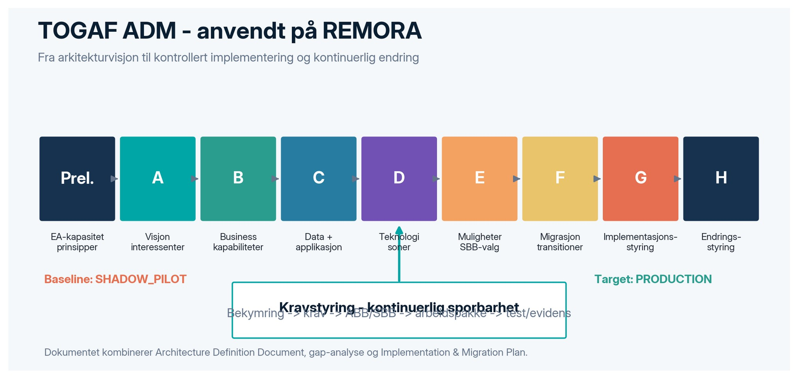

*Figur 1 - TOGAF ADM tilpasset REMORA-arkitekturen.*

| **Beslutningstema** | **Nå-situasjon**                                                                | **Anbefalt beslutning**                                                                     |
|---------------------|---------------------------------------------------------------------------------|---------------------------------------------------------------------------------------------|
| Produktposisjon     | Research-grade governance overlay med stabil SDK-/execution-kjerne              | Produktiser som kontrollplan for agenthandlinger - ikke som generell AI-sannhetsmotor       |
| Pilot               | Shadow-evaluering er støttet; produksjonshåndheving er ikke eksternt verifisert | Velg én lav-konsekvens, høy-volum handling og kjør T1 Controlled Pilot                      |
| Sikkerhetsmodell    | Fail-conservative policy floor, payload binding og audit er implementert/wired  | Gjør PEP uomgåelig, flytt credentials bak dispatcher og bind identitet til transport/IdP    |
| Data og audit       | SQLite/Postgres-path finnes; WORM/KMS/RLS mangler                               | Etabler durable multi-node state, RLS og uavhengig audit-ankring                            |
| Styring             | Claim/remediation-registre er sterke styringsartefakter                         | Gjør registrene til Architecture Repository + automated fitness functions                   |
| Kommersiell verdi   | Kan redusere risiko, review-friksjon og onboardingtid for agentiske systemer    | Selg kontrollert pilot med evidenspakke, ikke «produksjonssikkerhet» som ubegrenset påstand |

<table>
<colgroup>
<col style="width: 100%" />
</colgroup>
<thead>
<tr class="header">
<th>
<strong>PRIORITET Anbefalt 90-dagers leveranse</strong>

Lukk REM-021/REM-023, bind actor identity til OIDC/workload identity, gjør nonce/lease durable, koble ett ekte verktøy bak PEP, og lever OTel/SIEM + ekstern interception-test. Dette gir et troverdig grunnlag for Controlled Pilot.
</th>
</tr>
</thead>
<tbody>
</tbody>
</table>

## Forretningsmessig bruk

- Enterprise pilot: governance gate foran en avgrenset agentisk arbeidsflyt med tydelige exit-kriterier.

- Platform-as-a-control: felles policy- og auditlag for flere agentrammeverk og modellleverandører.

- Compliance evidence service: DecisionEnvelope, traceability og replay som grunnlag for internkontroll og regulatorisk dokumentasjon.

- OEM / SDK licensing: stabil, hash-pinnet SDK-overflate for produktleverandører som bygger egne agentprodukter.

<table>
<colgroup>
<col style="width: 50%" />
<col style="width: 50%" />
</colgroup>
<thead>
<tr class="header">
<th><strong>02</strong></th>
<th>
<strong>Arkitekturomfang og TOGAF-kartlegging</strong>

Scope, levels, partitions, stakeholders, views og artifacts
</th>
</tr>
</thead>
<tbody>
</tbody>
</table>

# Arkitekturomfang

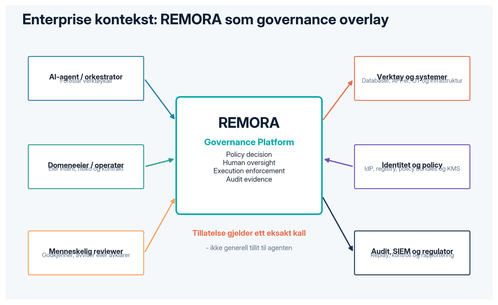

*Figur 2 - Enterprise context og sentrale eksterne aktører.*

| **Innenfor scope**                                      | **Utenfor scope / avhengighet**                                       |
|---------------------------------------------------------|-----------------------------------------------------------------------|
| Interception av foreslåtte tool calls                   | Generell kvalitet eller sannhet i språkmodellens tekstsvar            |
| Policy decision, evidence, uncertainty routing          | Modelltrening og modellleverandørens interne sikkerhetsmekanismer     |
| Human review, approval freshness og resolution          | Domeneautoritetens endelige faglige ansvar                            |
| PDP/PEP, token, lease og governed dispatch              | Verktøy agenten kan nå utenom integrasjonen                           |
| DecisionEnvelope, tenant chain, replay og evidens       | WORM/KMS/IdP/SIEM som enterprise-tjenester før target er implementert |
| Release gates, claim hygiene og architecture governance | Juridisk rådgivning eller sertifisering                               |

## TOGAF artifact map

| **ADM-fase**      | **Dette dokumentets leveranser**                             | **Repository-grounding**                         |
|-------------------|--------------------------------------------------------------|--------------------------------------------------|
| Preliminary       | Prinsipper, governance, Architecture Board, repository       | CLAUDE.md, registers, quality gates              |
| A - Vision        | Drivers, scope, stakeholders, value, success measures        | README, executive one-pager, status              |
| B - Business      | Capabilities, value streams, operating model, RACI           | TOGAF rollout plan, use cases, review operations |
| C - Data          | Entities, ownership, classification, lineage, retention      | DecisionEnvelope, PolicyObservation, stores      |
| C - Application   | Components, services, APIs, integrations, sequence           | ARCHITECTURE.md, API reference, servers/         |
| D - Technology    | Runtime, zones, trust boundaries, deployment, SRE            | deploy/, workers/, durable adapters              |
| E - Opportunities | ABB/SBB mapping, solution options, work packages             | Capability and remediation registers             |
| F - Migration     | Transition Architectures and prioritized roadmap             | release_profiles_v1.yaml                         |
| G - Governance    | Architecture Contract, compliance reviews, fitness functions | CI, tests, claim provenance                      |
| H - Change        | Change triggers, debt, versioning, lifecycle                 | CHANGELOG, registers, Phase H cadence            |
| Requirements      | Traceability and acceptance criteria                         | REM/CAP/claim IDs + evidence paths               |

<table>
<colgroup>
<col style="width: 100%" />
</colgroup>
<thead>
<tr class="header">
<th>
<strong>KONFORMITET TOGAF-anvendelse</strong>

ADM behandles som en iterativ referansemodell, ikke som en lineær waterfall-prosess. Strategic, Segment og Capability Architecture kan utvikles parallelt, men alle views skal være konsistente med samme baseline og kravregister.
</th>
</tr>
</thead>
<tbody>
</tbody>
</table>

<table>
<colgroup>
<col style="width: 50%" />
<col style="width: 50%" />
</colgroup>
<thead>
<tr class="header">
<th><strong>03</strong></th>
<th>
<strong>Preliminary Phase</strong>

EA capability, principles, governance model and repository
</th>
</tr>
</thead>
<tbody>
</tbody>
</table>

# Architecture principles

| **ID** | **Prinsipp**                               | **Konsekvens**                                                                                                |
|--------|--------------------------------------------|---------------------------------------------------------------------------------------------------------------|
| P-01   | Deterministisk sikkerhetsgulv først        | Ingen probabilistisk score, consensus eller læringsmodell kan nedgradere en hard blokkering.                  |
| P-02   | Deny-by-default for actuation              | Ukjent eller manglende autoritet er ikke tillatelse; muterende handlinger failer mot VERIFY/ABSTAIN/ESCALATE. |
| P-03   | Håndheving er uatskillelig fra utførelse   | Et verktøy skal ikke kunne kjøres uten gyldig, kortlivet, eksakt bundet autorisasjon.                         |
| P-04   | Agenten eier aldri downstream credentials  | Secrets og callables ligger bak PEP/dispatcher i kontrollert sone.                                            |
| P-05   | Identitet kommer fra autentisert transport | Tenant, principal og rolle leses fra verifiserte claims - ikke selvrapporterte headers.                       |
| P-06   | Alle beslutninger etterlater bevis         | DecisionEnvelope og audit events må persisteres; ikke-durable drift er development only.                      |
| P-07   | Policy er kode og versjonert               | Policies, contracts og releaseprofiler signeres, testes, promoveres og kan rulles tilbake.                    |
| P-08   | Eksperimentelle moduler isoleres           | AROMER, thermodynamics og research-only moduler får ikke autoriserende myndighet.                             |
| P-09   | Claims krever artifacts                    | Ingen arkitektur- eller resultatpåstand uten sporbar evidens og caveat.                                       |
| P-10   | Menneskelig oversight er en operasjon      | Review må ha SLA, severity, coverage, identity, freshness og audit - ikke bare UI.                            |

## Architecture governance model

| **Organ / rolle**         | **Ansvar**                                        | **Beslutningsmyndighet**                |
|---------------------------|---------------------------------------------------|-----------------------------------------|
| Executive Sponsor         | Finansiering, risikotoleranse og produktmål       | Godkjenner visjon og pilotomfang        |
| Architecture Review Board | Prinsipper, target, dispensasjoner og stage gates | Godkjenner arkitektur og avvik          |
| Enterprise Architect      | Helhet, views, traceability og roadmap            | Accountable for Architecture Definition |
| Security / Risk / DPO     | Threat model, controls, privacy, compliance       | Veto på sikkerhets-/privacy-gates       |
| Platform Owner            | PDP/PEP/API, identity, storage, SRE               | Leverer og drifter plattformen          |
| Policy & Assurance Owner  | Policy bundles, claim regime, review protocol     | Godkjenner policies og evidens          |
| Domain Owner              | Tool contracts, intent authority, business risk   | Godkjenner domeneonboarding             |
| Independent Reviewer      | Ekstern vurdering av safety design og claims      | Lukker REM-021-betingelsen              |

## Architecture Repository

- Architecture principles, vision, stakeholder map, requirements and Architecture Contract.

- Canonical schemas: DecisionEnvelope, execution lifecycle, policy bundles, tool contracts and intent authority.

- Capability, remediation, release profile, claim and risk registers.

- ADRs, threat model, compliance mappings, reference deployments and standards catalog.

- Automated fitness functions in CI and evidence artifacts from compliance reviews.

<table>
<colgroup>
<col style="width: 50%" />
<col style="width: 50%" />
</colgroup>
<thead>
<tr class="header">
<th><strong>04</strong></th>
<th>
<strong>Phase A - Architecture Vision</strong>

Drivers, stakeholders, business outcomes and success criteria
</th>
</tr>
</thead>
<tbody>
</tbody>
</table>

# Vision statement

<table>
<colgroup>
<col style="width: 100%" />
</colgroup>
<thead>
<tr class="header">
<th>
<strong>TARGET Målbilde</strong>

REMORA skal være et uomgåelig enterprise governance-lag som avgjør om et spesifikt agentkall kan utføres, avklarer usikkerhet med kontrollert review eller resolution, håndhever beslutningen foran reelle credentials og produserer uavhengig verifiserbar evidens for hele beslutning-til-effekt-kjeden.
</th>
</tr>
</thead>
<tbody>
</tbody>
</table>

## Strategiske drivere

| **Driver**                    | **Problem / mulighet**                                                | **Arkitektureffekt**                                           |
|-------------------------------|-----------------------------------------------------------------------|----------------------------------------------------------------|
| Agentisk automatisering       | LLM-agenter går fra rådgivning til side effects                       | Pre-execution interception og policy authority                 |
| Enterprise risk               | Feil handling kan ramme data, infrastruktur, økonomi eller OT         | Hard safety floor, human oversight og deny-by-default          |
| Regulatorisk evidens          | Logging, oversight, risikostyring og teknisk dokumentasjon må bevises | Envelope, audit, traceability og compliance pack               |
| Multi-model / multi-framework | Modeller og agentrammeverk endres raskt                               | Provider-neutral gateway, pluggable oracles, stable SDK        |
| Operasjonell skala            | Manuell kontroll av alle kall gir uakseptabel friksjon                | Selective routing, bounded resolution og severity-based review |
| Kommersialisering             | Research må pakkes til pilot, produkt og lisensierbar kontrollflate   | Releaseprofiler, reference deployment og Architecture Contract |

## Stakeholder concerns and viewpoints

| **Stakeholder**           | **Primær concern**                                   | **Relevant viewpoint**             |
|---------------------------|------------------------------------------------------|------------------------------------|
| Board / CRO / CISO        | Kan agenten påføre irreversibel skade?               | Risk, security, transition roadmap |
| Business / Product Owner  | Gir dette verdi uten å stoppe all automatisering?    | Capability, value stream, KPI      |
| Enterprise Architect      | Passer komponentene, ansvar og transitions sammen?   | All-domain integrated views        |
| Agent Developer           | Hvordan integreres dette med minst mulig kode?       | Application/API/SDK view           |
| Domain Owner              | Hvem bestemmer risk tier, intent og tool contract?   | Business/data authority view       |
| Reviewer / Operator       | Hva må vurderes, innen når, med hvilket ansvar?      | Human oversight operations view    |
| SRE / Platform            | Hvordan skaleres, degraderes og overvåkes tjenesten? | Technology/operations view         |
| Auditor / Regulator / DPO | Kan historikk, beslutning og effekt etterprøves?     | Data/audit/compliance view         |
| External Reviewer         | Er claims og control chain faktisk reproduserbar?    | Assurance/evidence view            |

## Provisoriske suksessmål

| **Mål**               | **T1 Controlled Pilot**                             | **T3 Production**                                         |
|-----------------------|-----------------------------------------------------|-----------------------------------------------------------|
| Interception coverage | 100% av pilotens in-scope tool calls                | 100% av alle godkjente action classes                     |
| Credential separation | Pilotagent har ingen downstream credentials         | Alle credentials kun i PEP/proxy                          |
| Decision persistence  | 100% durable audit for pilot tenant                 | Multi-node durable + WORM anchor                          |
| Payload integrity     | 0 executioner ved hash-/binding-mismatch            | Kontinuerlig negative testing og alerting                 |
| Human oversight       | 100% non-accept med owner, TTL og status            | Severity SLA, on-call, federated identity                 |
| External assurance    | REM-021 review completed                            | External verification/red team repeated per major release |
| Reliability           | Pilot SLO baselined og målt                         | HA, deadline, circuit breaker og approved fallback        |
| Compliance            | Data inventory + intended use + retention for pilot | DPIA/technical documentation where applicable             |

<table>
<colgroup>
<col style="width: 50%" />
<col style="width: 50%" />
</colgroup>
<thead>
<tr class="header">
<th><strong>05</strong></th>
<th>
<strong>Requirements Management</strong>

Sporbarhet fra concern til kontroll, test og evidens
</th>
</tr>
</thead>
<tbody>
</tbody>
</table>

# Kravmodell

<table>
<colgroup>
<col style="width: 100%" />
</colgroup>
<thead>
<tr class="header">
<th>
<strong>KRAV Single source of truth</strong>

Krav håndteres som en levende, versjonert kjede: Stakeholder Concern -&gt; Architecture Requirement -&gt; ABB -&gt; SBB -&gt; Work Package -&gt; Acceptance Test -&gt; Evidence Artifact -&gt; Release Gate.
</th>
</tr>
</thead>
<tbody>
</tbody>
</table>

| **ID** | **Requirement**                                                        | **Principle** | **Repo linkage**       | **Acceptance evidence**                  |
|--------|------------------------------------------------------------------------|---------------|------------------------|------------------------------------------|
| AR-001 | Alle in-scope actions må gå gjennom en uomgåelig PEP                   | P-03          | CAP-013 / REM-024      | Interception coverage test               |
| AR-002 | Hard guards kan ikke nedgraderes av adapters, OPA eller probabilistikk | P-01          | CAP-001/002            | Monotonicity + parity tests              |
| AR-003 | Full canonical tool call bindes til decision, token og lease           | P-03          | CAP-004                | Mutation/binding negative tests          |
| AR-004 | Grant og lease skal være kortlivet, one-time og audience-bundet        | P-03          | CAP-003/013            | Replay/expiry/audience tests             |
| AR-005 | Tenant/principal/role kommer fra verifisert identity context           | P-05          | CAP-009 / REM-023/024  | Cross-tenant + forged-header tests       |
| AR-006 | Decision/audit state skal være durable og atomisk                      | P-06          | CAP-005 / REM-025      | Restart, concurrency, chain verification |
| AR-007 | Review har severity, owner, TTL, freshness og re-gate                  | P-10          | CAP-007 / REM-042      | Expiry, re-gate, SLA telemetry           |
| AR-008 | Policy, tool contract og intent authority skal være versioned/signed   | P-07          | CAP-002/014            | Bundle signature and rollback test       |
| AR-009 | Experimental components kan ikke autorisere execution                  | P-08          | Module stability index | Import/dependency fitness function       |
| AR-010 | Claims og architecture status må kunne etterprøves                     | P-09          | CAP-META / REM-021     | Evidence path + independent review       |
| AR-011 | Produksjon skal ha HA, deadlines, CB og deterministic fallback         | P-02          | REM-028                | Chaos/degradation/SLO tests              |
| AR-012 | Audit events skal korreleres og sendes til SIEM                        | P-06          | REM-029                | OTel trace + immutable event test        |
| AR-013 | Tenant data isoleres i database og crypto domain                       | P-05          | REM-026                | Postgres RLS negative tests              |
| AR-014 | Software supply chain skal være attestert                              | P-07          | REM-027                | Lock/SBOM/provenance/signature gate      |
| AR-015 | Privacy og intended use dokumenteres per deployment                    | P-09          | REM-031                | DPIA/data map/retention verification     |

## Kravstyringsprosess

1.  Opprett eller endre krav via PR med stakeholder concern, owner, priority og acceptance criterion.

2.  Koble kravet til CAP-/REM-/claim-ID eller opprett ny registerpost.

3.  Vurder påvirkning på Business, Data, Application, Technology og Security views.

4.  Implementer med test/evidence; architecture compliance review verifiserer sporbarheten.

5.  Releaseprofil kan bare heves når maskinlesbare gates er oppfylt og ekstern evidens er tilgjengelig der påkrevd.

<table>
<colgroup>
<col style="width: 50%" />
<col style="width: 50%" />
</colgroup>
<thead>
<tr class="header">
<th><strong>06</strong></th>
<th>
<strong>Phase B - Business Architecture</strong>

Capabilities, value streams, operating model, services and organization
</th>
</tr>
</thead>
<tbody>
</tbody>
</table>

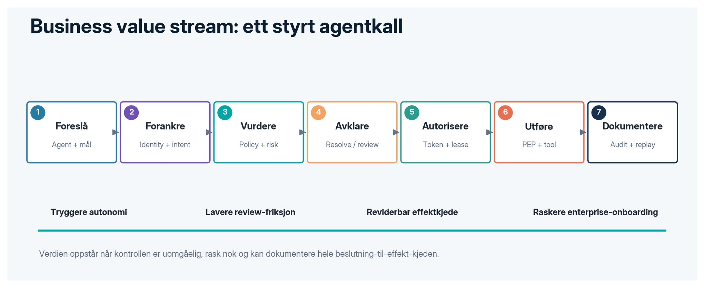

*Figur 3 - Business value stream for et styrt action-løp.*

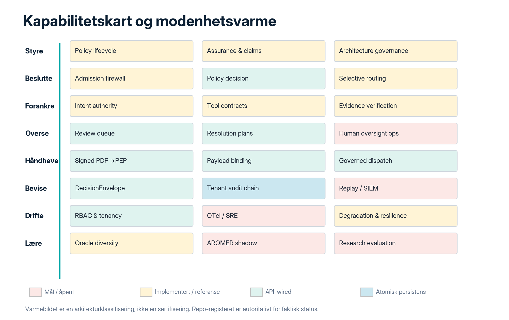

*Figur 4 - Business capability map og arkitekturmodenhet.*

## Business capabilities

| **ID / capability**              | **Outcome**                                                     | **Accountable owner**      |
|----------------------------------|-----------------------------------------------------------------|----------------------------|
| C-01 Policy Lifecycle            | Author, review, sign, promote, rollback policy bundles          | Policy & Governance        |
| C-02 Runtime Decisioning         | Bygge observation og avgjøre ACCEPT/VERIFY/ABSTAIN/ESCALATE     | Platform                   |
| C-03 Runtime Enforcement         | PEP, token/lease, dispatcher og credential boundary             | Platform/Security          |
| C-04 Intent & Tool Authority     | Eie intent source, tool contracts, risk classes og schemas      | Domain Owner               |
| C-05 Evidence & Resolution       | Hente authoritative evidence og løse bounded gaps               | Decision Science/Domain    |
| C-06 Human Oversight             | Review queue, severity, SLA, approval freshness og on-call      | Operations/Risk            |
| C-07 Audit & Replay              | Envelope, tenant chain, export, replay og external verification | Assurance/Platform         |
| C-08 Identity & Tenancy          | Principal, role, tenant mapping, isolation og key domains       | IAM/Platform               |
| C-09 Reliability & Observability | SLO, OTel, degradation, SIEM og incident response               | SRE/Security               |
| C-10 Assurance & Compliance      | Claims, release gates, independent review, DPIA/tech docs       | Assurance/DPO              |
| C-11 Developer Enablement        | SDK, adapters, templates, reference deployments                 | Platform Product           |
| C-12 Research & Learning         | Offline evaluation, oracle diversity, shadow learning           | Research - non-authorizing |

## Target operating model

| **Team type**               | **Permanent ownership**                                               | **Interaction mode**                        |
|-----------------------------|-----------------------------------------------------------------------|---------------------------------------------|
| Governance Platform Team    | API, PDP/PEP, storage, identity integration, SRE, SDK                 | Platform-as-a-product / self-service        |
| Policy & Assurance Team     | Policy-as-code, release gates, claims, external review, compliance    | Collaboration on new risk domains           |
| Decision Science Team       | Oracles, evidence, selective routing, evaluation                      | Service provider; no enforcement authority  |
| Stream-aligned Domain Teams | Agent workflows, tool contracts, intents, business outcomes           | Consume platform; own domain risk and tests |
| Security / IAM / DPO        | Identity, key management, threat model, privacy and incident response | Enabling + control function                 |
| Architecture Board          | Principles, target, dispensations, transitions                        | Governance checkpoint                       |

## Business services catalog

| **Service**              | **Consumer**             | **Service level / contract**                                   |
|--------------------------|--------------------------|----------------------------------------------------------------|
| Authorize Tool Call      | Agent runtime            | Returns one governed outcome; no side effect                   |
| Resolve Verification Gap | Policy engine / reviewer | Only whitelisted lookup and bounded writes                     |
| Review Decision          | Human reviewer           | Role, severity, TTL, identity and rationale required           |
| Execute Authorized Call  | Application / agent      | Exact payload, valid grant/lease and in-policy state           |
| Verify Audit Chain       | Auditor / SRE            | Records checked + chain integrity; empty chain is not evidence |
| Replay / Shadow Evaluate | Assurance / product team | No production effect; reproducible delta and metrics           |
| Publish Policy Bundle    | Policy owner             | Signed, versioned, tested, canary and rollback                 |
| Onboard Tool / Domain    | Domain owner             | Tool contract, risk classification, intent authority and tests |

<table>
<colgroup>
<col style="width: 50%" />
<col style="width: 50%" />
</colgroup>
<thead>
<tr class="header">
<th><strong>07</strong></th>
<th>
<strong>Phase C - Data Architecture</strong>

Canonical entities, ownership, lifecycle, classification and lineage
</th>
</tr>
</thead>
<tbody>
</tbody>
</table>

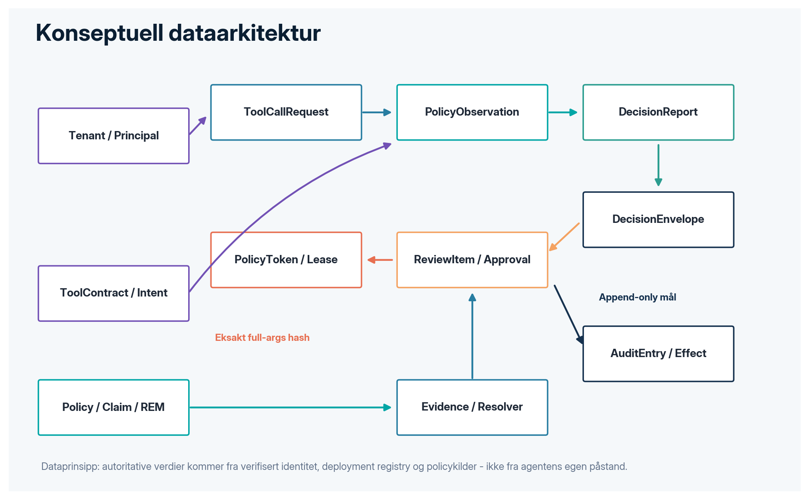

*Figur 5 - Konseptuell datamodell og autoritative relasjoner.*

# Canonical data entities

| **Entity**                 | **Key content**                                                     | **Authority**                         | **Retention target**           |
|----------------------------|---------------------------------------------------------------------|---------------------------------------|--------------------------------|
| ToolCallRequest            | Full tool name, exact arguments, tenant, target, intent_ref         | Agent input; untrusted until enriched | Short-lived + audit hash       |
| PolicyObservation          | Risk, action type, environment, evidence, security flags, call hash | Server-derived where trust-bearing    | Decision scope                 |
| DecisionReport             | Outcome, reasons, risk/confidence, source, resolution plan          | Policy engine                         | Persist with envelope          |
| DecisionEnvelope v2        | Request, assessment, gate, reviewer context, history, audit         | Canonical governance contract         | Per policy/legal schedule      |
| ReviewItem / Approval      | Queue state, severity, principal, rationale, TTL                    | Review service + authenticated user   | Operational + audit            |
| PolicyDecisionToken        | Signed PDP decision, expiry, jti, audience, observation hash        | PDP                                   | Seconds/minutes; consumed once |
| ExecutionLease             | Tenant, actor, tool, args hash, environment, policy hash, nonce     | PEP/dispatcher                        | Very short TTL; consumed once  |
| ToolContract               | Schema, effect, risk, required args, authority                      | Domain registry                       | Versioned while tool active    |
| IntentAuthority            | Signed work order/ticket-of-record reference                        | Enterprise source of record           | Business retention             |
| AuditEntry / EffectOutcome | State transition, intent/result, chain linkage                      | Execution API / dispatcher            | Immutable target + anchor      |
| Capability/REM/Claim       | Maturity, gap, evidence and caveat                                  | Architecture/assurance repository     | Permanent history              |

## Data classification

| **Class**    | **Examples**                                                           | **Required controls**                                                             |
|--------------|------------------------------------------------------------------------|-----------------------------------------------------------------------------------|
| Public       | Open-source docs, public architecture, generic policies                | Integrity, versioning, provenance                                                 |
| Internal     | Metrics, non-sensitive envelopes, architecture records                 | Authentication, tenant filtering, retention                                       |
| Confidential | Tool arguments, evidence, operator rationale, business intents         | Encryption, least privilege, minimization, audit                                  |
| Restricted   | Credentials, signing keys, regulated personal data, production targets | KMS/HSM, no envelope plaintext unless essential, strict access, regional controls |

## Lifecycle and lineage

1. Ingest: agent input is explicitly untrusted; unknown fields are rejected or treated as unknown, never safe.

2. Enrich: verified identity, intent authority, tool contract, registry metadata and evidence are joined server-side.

3. Decide: policy engine produces reasons, resolution plan and canonical decision contract.

4. Authorize: full call hash is bound to signed token/lease; grants are one-time and short-lived.

5. Effect: dispatcher records intent before side effect and outcome after side effect.

6. Persist: tenant chain is atomically appended; target adds WORM, KMS signature and external timestamp/anchor.

7. Observe: OTel/SIEM correlates decision_id, tenant_id, policy_version, tool and outcome.

8. Retain/Delete: policy depends on intended use, legal basis, incident hold and field minimization; AROMER memory has separate governance.

<table>
<colgroup>
<col style="width: 100%" />
</colgroup>
<thead>
<tr class="header">
<th>
<strong>BASELINE Gap</strong>

Current durable paths are conditional on configured SQLite/Postgres, while WORM anchoring, KMS/HSM, RLS, durable multi-process lease nonce and enforced retention remain target controls.
</th>
</tr>
</thead>
<tbody>
</tbody>
</table>

<table>
<colgroup>
<col style="width: 50%" />
<col style="width: 50%" />
</colgroup>
<thead>
<tr class="header">
<th><strong>08</strong></th>
<th>
<strong>Phase C - Application Architecture</strong>

Services, interfaces, interaction patterns and integration contracts
</th>
</tr>
</thead>
<tbody>
</tbody>
</table>

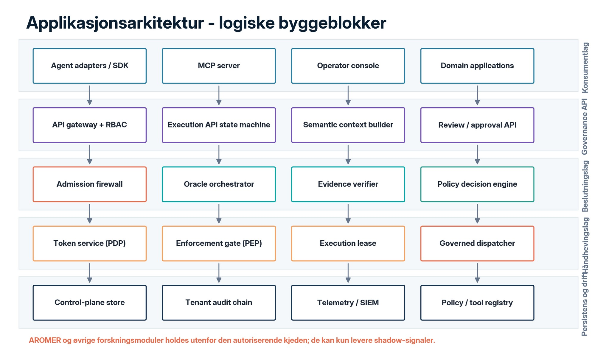

*Figur 6 - Logical application landscape.*

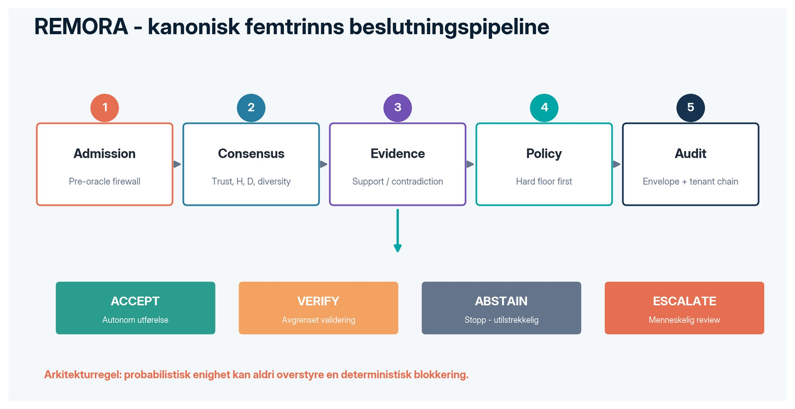

*Figur 7 - Canonical policy pipeline and outcomes.*

## Application component catalog

| **Component**            | **Responsibility**                                         | **Stability/status**    | **Primary SBB**                                       |
|--------------------------|------------------------------------------------------------|-------------------------|-------------------------------------------------------|
| Agent SDK / adapters     | Intercept framework tool calls; return ActionGateResult    | CORE                    | LocalGateway, LangGraph, OpenAI, MCP, CrewAI, AutoGen |
| Governance API           | Research assess, envelope retrieval, metrics and RBAC      | CORE                    | servers/api.py                                        |
| Execution API            | Assess/review/approve/re-gate/execute/audit state machine  | CORE / API-wired        | servers/execution_api.py                              |
| Admission Firewall       | Pre-oracle adversarial/coercion screening                  | CORE                    | remora/safety/adversarial.py                          |
| Oracle Orchestrator      | Pluggable, diverse backend consensus and diagnostics       | CORE + optional         | engine, correlation, oracles                          |
| Evidence Verifier        | Source support/contradiction; pluggable path               | Mixed / experimental    | evidence_verifier, evidence_v2/v3                     |
| Policy Engine            | Hard-floor-first decision ladder and explanation parity    | CORE / API-wired        | policy/decision_engine.py                             |
| Resolution Service       | Bounded lookup and full router re-entry                    | CORE                    | policy/resolution.py                                  |
| Review Service           | Queue, approval TTL, freshness re-gate, events             | CORE / API-wired        | governance/review_queue.py                            |
| Token / Enforcement Gate | Signed PDP-\>PEP token, expiry, jti, audience              | CORE / API-wired        | enforcement/token.py, gate.py                         |
| Lease / Dispatcher       | Exact args hash, nonce, policy hash, trusted tool registry | CORE / API-wired        | enforcement/lease.py                                  |
| Envelope / Audit         | Canonical contract, tenant chain and verification          | CORE / persisted atomic | governance/envelope.py, tenant_chain.py               |
| MCP Server               | Expose governed tools to compatible hosts                  | Interface               | servers/mcp_remora.py                                 |
| Edge Workers             | Agent control, RAG, law search, AROMER endpoints           | Reference / edge        | workers/                                              |
| AROMER                   | Shadow learning and transfer experiments                   | EXPERIMENTAL            | must remain non-authorizing                           |

## Key interface contracts

| **Interface**                  | **Input**                                   | **Output / guarantee**                                       |
|--------------------------------|---------------------------------------------|--------------------------------------------------------------|
| assess_tool_call / adapter     | Tool, exact args, risk/action metadata      | ActionGateResult; should_execute only on ACCEPT              |
| POST /v1/execution/assess      | ToolCallRequest + authorized context        | Decision + token on ACCEPT or review item                    |
| POST /v1/execution/approve     | Review item + authenticated principal + TTL | Recorded approval; no execution yet                          |
| POST /v1/execution/execute     | Same exact payload + grant                  | Fresh re-gate, one-time consume, lease and governed dispatch |
| GET /v1/execution/audit/verify | Tenant audit scope                          | chain_valid, records_checked, empty flag                     |
| DecisionEnvelope.to_dict       | Frozen nested governance contract           | Stable JSON-serializable decision record                     |
| Policy bundle / OPA adapter    | Full parity observation + monotone floor    | External decision may be stricter, never below floor         |

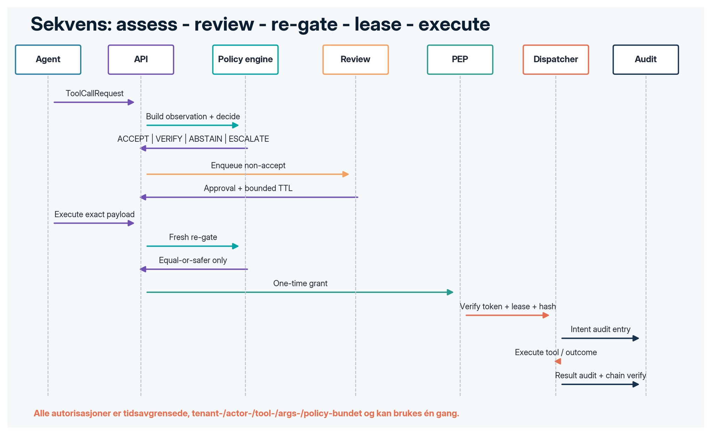

*Figur 8 - End-to-end interaction for reviewed execution.*

<table>
<colgroup>
<col style="width: 100%" />
</colgroup>
<thead>
<tr class="header">
<th>
<strong>ARCHITECTURE DECISION Critical integration rule</strong>

A direct ACCEPT path and a reviewed path must begge culminere in the same governed dispatcher and durable evidence chain. No legacy endpoint may become an alternate, less controlled execution route.
</th>
</tr>
</thead>
<tbody>
</tbody>
</table>

<table>
<colgroup>
<col style="width: 50%" />
<col style="width: 50%" />
</colgroup>
<thead>
<tr class="header">
<th><strong>09</strong></th>
<th>
<strong>Phase D - Technology Architecture</strong>

Runtime, deployment zones, platform services, SRE and standards
</th>
</tr>
</thead>
<tbody>
</tbody>
</table>

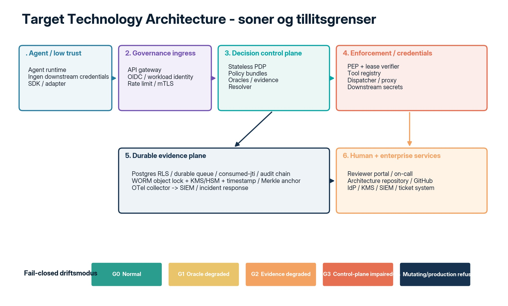

*Figur 9 - Target technology zones and trust boundaries.*

## Baseline technology view

| **Area**      | **Baseline \[REPO\]**                                                 | **Target requirement**                                                                        |
|---------------|-----------------------------------------------------------------------|-----------------------------------------------------------------------------------------------|
| Runtime       | Python package, FastAPI gateways, MCP, Cloudflare Workers             | Stateless PDP service + controlled PEP/proxy topology                                         |
| Persistence   | In-memory dev; SQLite single-node; Postgres adapter paths             | Postgres HA, RLS, transactional global ledgers, backups and DR                                |
| Execution     | Governed dispatcher and deployment-config tool registry are API-wired | Front real downstream credentials; no bypass; durable multi-process nonce                     |
| Identity      | Bearer token mappings; single-token mode has weaker separation        | OIDC/workload identity, MFA for reviewers, mTLS and immutable Principal                       |
| Cryptography  | HMAC reference implementations and hashes                             | KMS/HSM, asymmetric JWS/COSE, rotation, timestamping and anchor                               |
| Observability | Metrics and OTel helpers; no complete collector/SIEM deployment       | OTel collector, immutable SIEM events, alert rules and runbooks                               |
| Resilience    | Degradation ladder G0-G4 exists; HA controls open                     | Deadlines, queues, rate limit, circuit breakers, cached signed policy, deterministic fallback |
| Supply chain  | Captured environment snapshot; CI and workflows                       | Hash lock, SBOM, SLSA, Sigstore, image/dependency scanning                                    |
| Deployment    | Docker/reference/edge assets                                          | Approved cloud/on-prem patterns with network policies and secrets management                  |

## Technology standards catalog

| **Category**  | **Preferred target standard / pattern**                                   | **Rationale**                                |
|---------------|---------------------------------------------------------------------------|----------------------------------------------|
| Identity      | OIDC/OAuth2 workload identity; short-lived JWT; mTLS                      | Transport-bound identity and service trust   |
| Policy        | Versioned policy-as-code; signed bundles; OPA/Rego where parity is proven | Portable, testable and promotable policy     |
| Authorization | JWS/COSE token and lease; jti/nonce; audience; exact payload hash         | One-time, context-bound execution authority  |
| Persistence   | PostgreSQL with RLS and transactions; object-lock/WORM for anchors        | Multi-node state and tenant isolation        |
| Telemetry     | OpenTelemetry traces/metrics/logs + SIEM normalized events                | End-to-end correlation and incident response |
| Supply chain  | CycloneDX/SPDX, SLSA provenance, Sigstore signing                         | Verifiable build and dependency trust        |
| Deployment    | Containers, IaC, GitOps, policy canary and rollback                       | Repeatable and governed operation            |
| Time / audit  | Trusted timestamps and periodic signed Merkle roots                       | Independent tamper evidence                  |

## Non-functional requirements

| **Quality**     | **Requirement**                                                                         | **Measurement**                                   |
|-----------------|-----------------------------------------------------------------------------------------|---------------------------------------------------|
| Availability    | Defined SLO per deployment profile; no silent fail-open for mutating production actions | Uptime, error budget, degradation transitions     |
| Latency         | Separate deterministic decision latency from external oracle/evidence latency           | p50/p95/p99 by stage and outcome                  |
| Scalability     | Tenant-safe horizontal PDP scaling and bounded queues                                   | Load test with multi-tenant concurrency           |
| Recoverability  | Durable queue, grants, audit and policy state across restart/failover                   | Restart and failover tests                        |
| Security        | No execution without verified grant/lease; no agent credentials                         | Negative execution and credential inventory tests |
| Auditability    | All transitions correlated and independently verifiable                                 | Chain verify + exported replay                    |
| Maintainability | Stable SDK boundary; CORE/EXPERIMENTAL separation                                       | Semantic versioning, import fitness tests         |
| Portability     | Pluggable models and enterprise services                                                | Provider replacement tests                        |

<table>
<colgroup>
<col style="width: 50%" />
<col style="width: 50%" />
</colgroup>
<thead>
<tr class="header">
<th><strong>10</strong></th>
<th>
<strong>Cross-cutting Security Architecture</strong>

Threats, controls, trust boundaries and residual risk
</th>
</tr>
</thead>
<tbody>
</tbody>
</table>

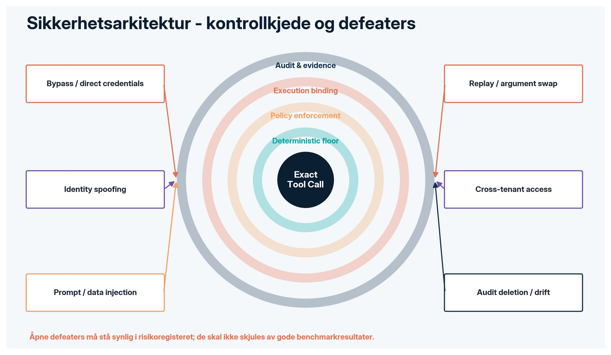

*Figur 10 - Defense-in-depth around the exact tool call.*

## Threat-control matrix

| **Threat**                    | **Scenario**                                            | **Control architecture**                                                        | **Link**          |
|-------------------------------|---------------------------------------------------------|---------------------------------------------------------------------------------|-------------------|
| T-01 Gate bypass              | Agent calls tool directly or holds credentials          | PEP/proxy is only credential holder; network deny; interception coverage        | REM-024/030       |
| T-02 Payload substitution     | Arguments changed after approval                        | Canonical full-args hash in observation, token and lease; recompute at dispatch | CAP-004/013       |
| T-03 Replay                   | Token/lease reused                                      | Expiry, jti, audience, nonce, atomic consumption; durable global ledger target  | CAP-003 / REM-025 |
| T-04 Identity/tenant spoofing | Headers override authenticated principal                | Identity from token/transport; OIDC/workload identity target                    | CAP-009 / REM-023 |
| T-05 Cross-tenant leakage     | Store query misses tenant boundary                      | Composite keys now; target Postgres RLS and crypto domains                      | REM-026           |
| T-06 Prompt/data injection    | Untrusted content controls recipient/command/credential | Admission firewall, taint flags, hard guards and path-level policy target       | P-01 / REM-044    |
| T-07 Oracle collusion/failure | Correlated models agree wrongly                         | Deterministic floor, diversity weighting, family separation, ABSTAIN            | Architecture core |
| T-08 Audit tampering          | History edited/deleted/spliced                          | Hash chain now; target WORM/KMS/time/Merkle anchor                              | CAP-005 / REM-025 |
| T-09 Policy drift             | Runtime policy differs from approved policy             | Signed policy hash bound to lease, GitOps promotion and rollback                | P-07              |
| T-10 Human review compromise  | Stale/unauthorized approval or fatigue                  | Role, TTL, re-gate, severity, SLA, OIDC/MFA and on-call                         | CAP-007 / REM-042 |
| T-11 Supply-chain compromise  | Dependency/image/workflow tampering                     | Hash lock, SBOM, provenance, signing and scanning                               | REM-027           |
| T-12 Availability attack      | External oracles block execution path                   | Deadline, circuit breaker, bounded queue, degradation ladder                    | REM-028/032       |

## Security invariants

- No non-ACCEPT decision can produce executable authority.

- No adapter, external PDP or model signal can reduce the severity set by the deterministic floor.

- No execution occurs when tenant, principal, tool, exact arguments, target environment or policy hash differs.

- No approval survives expiry or a stricter fresh decision.

- No production mode starts with non-durable execution state.

- No experimental learning signal changes core policy without separately reviewed policy promotion.

- No audit-chain validity claim is accepted without a positive record count.

<table>
<colgroup>
<col style="width: 100%" />
</colgroup>
<thead>
<tr class="header">
<th>
<strong>DEFEATER Residual risk</strong>

REMORA cannot control calls that bypass it, cannot make a downstream tool intrinsically safe, and does not convert benchmark results into field assurance. These limitations are architecture boundaries, not documentation footnotes.
</th>
</tr>
</thead>
<tbody>
</tbody>
</table>

<table>
<colgroup>
<col style="width: 50%" />
<col style="width: 50%" />
</colgroup>
<thead>
<tr class="header">
<th><strong>11</strong></th>
<th>
<strong>Phase E - Opportunities &amp; Solutions</strong>

ABB/SBB mapping, solution alternatives and work packages
</th>
</tr>
</thead>
<tbody>
</tbody>
</table>

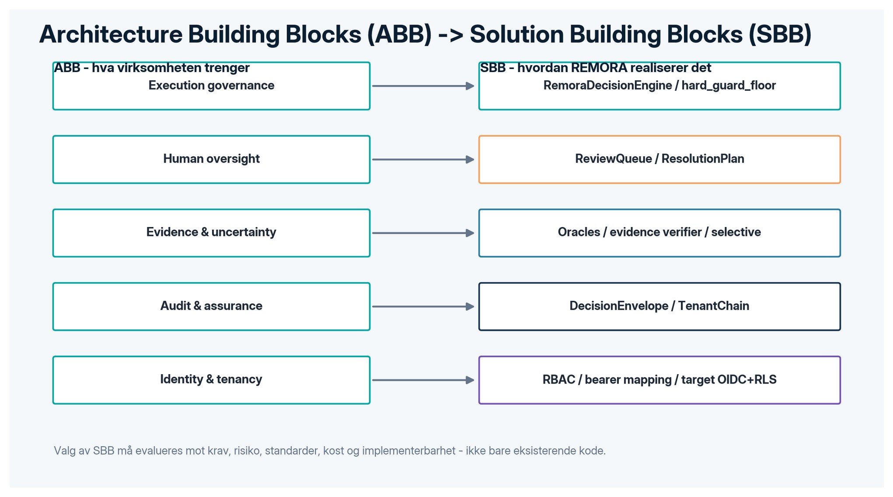

*Figur 11 - Mapping from enterprise needs (ABB) to REMORA solution components (SBB).*

## Solution options

| **Option**                 | **Description**                                                 | **Fordeler**                         | **Ulemper / beslutning**                               |
|----------------------------|-----------------------------------------------------------------|--------------------------------------|--------------------------------------------------------|
| A - In-process SDK         | Adapters call local REMORA engine in same process               | Lav latency, enkel utvikling         | Advisory/bypass risk; kun dev/reference                |
| B - Central PDP + app PEP  | Stateless decision service; app-side EnforcementGate/dispatcher | Skalerbart og sentral policy         | Krever sterk app-conformance og credentials-separasjon |
| C - Gateway/sidecar PEP    | Tool traffic går gjennom kontrollert proxy/sidecar              | Sterk uomgåelighet og observability  | Mer plattformarbeid; anbefalt target                   |
| D - Domain-local appliance | On-prem/air-gapped governance node                              | Data locality og lav WAN-avhengighet | Policy/distribution complexity; egnet regulated/OT     |
| E - Edge workers           | Edge API/RAG/law/search services                                | Global nærhet og enkel managed edge  | Ikke alene nok for credentials/tenant control          |

<table>
<colgroup>
<col style="width: 100%" />
</colgroup>
<thead>
<tr class="header">
<th>
<strong>BESLUTNING Recommended target pattern</strong>

Option C som autoriserende execution path, kombinert med B for central policy administration og D for domener som krever on-prem/air-gapped drift. Option A beholdes som developer experience, men får aldri produksjonsmyndighet alene.
</th>
</tr>
</thead>
<tbody>
</tbody>
</table>

## Prioritized work packages

| **WP** | **Work package**                         | **Scope**                                              | **Owner**          | **Transition** |
|--------|------------------------------------------|--------------------------------------------------------|--------------------|----------------|
| WP-01  | Independent architecture/safety review   | REM-021 + RBAC confirmation                            | Assurance Owner    | T1 gate        |
| WP-02  | Federated identity and principal binding | OIDC/workload JWT, MFA reviewer, mTLS                  | IAM/Platform       | T1             |
| WP-03  | Mandatory production PEP                 | Dispatcher fronts real credentials; bypass controls    | Platform/Security  | T1/T2          |
| WP-04  | Durable global execution state           | Nonce/lease/jti/queue/audit multi-node transactions    | Platform/Data      | T2             |
| WP-05  | Tenant isolation                         | Postgres RLS, crypto domains, negative tests           | Data/Security      | T2             |
| WP-06  | HA and latency control                   | Deadlines, CB, bounded queues, cached policy, fallback | SRE                | T2             |
| WP-07  | OTel/SIEM/incident response              | Immutable events, correlations, alerts and runbooks    | SRE/SOC            | T1/T2          |
| WP-08  | Supply-chain assurance                   | Hash lock, SBOM, SLSA, Sigstore, scans                 | DevSecOps          | T2/T3          |
| WP-09  | External interception validation         | Verified wrappers + external red team                  | Assurance/Security | T2             |
| WP-10  | Compliance evidence pack                 | Intended use, DPIA, minimization, retention, tech docs | DPO/Governance     | T3             |
| WP-11  | Operational human oversight              | Severity, SLA, on-call, identity and fatigue controls  | Operations/Risk    | T1/T2          |
| WP-12  | Trajectory governance                    | Session taint/path invariants after untrusted content  | Policy/Security    | T3             |

<table>
<colgroup>
<col style="width: 50%" />
<col style="width: 50%" />
</colgroup>
<thead>
<tr class="header">
<th><strong>12</strong></th>
<th>
<strong>Phase F - Migration Planning</strong>

Transition Architectures, dependencies, prioritization and release gates
</th>
</tr>
</thead>
<tbody>
</tbody>
</table>

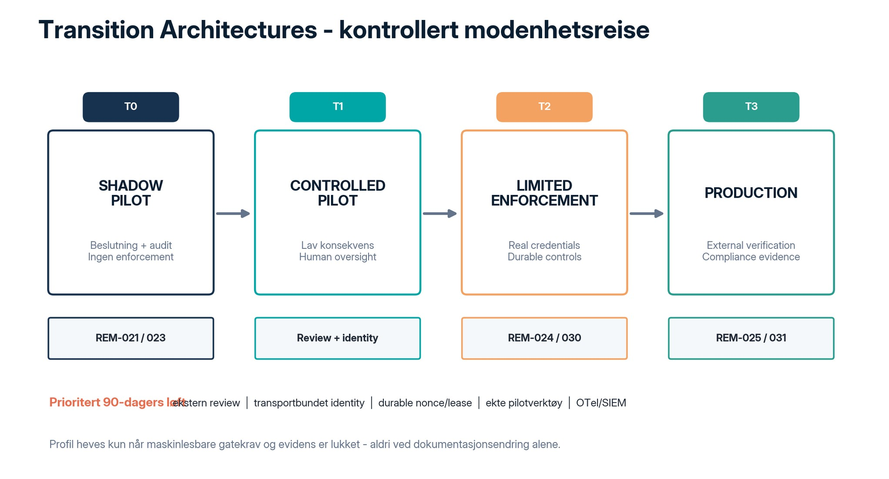

*Figur 12 - Transition Architecture roadmap aligned to repository release profiles.*

## Transition Architecture definitions

| **Transition**         | **Purpose**                                              | **Required architecture**                                                                                        | **Exit decision**                                      |
|------------------------|----------------------------------------------------------|------------------------------------------------------------------------------------------------------------------|--------------------------------------------------------|
| T0 SHADOW_PILOT        | Current baseline                                         | Assessments, envelopes, shadow replay, API-wired core; no production authority                                   | Maintain only for research/shadow; no stronger claim   |
| T1 CONTROLLED_PILOT    | Low-consequence action class                             | Independent review complete, RBAC confirmation, human approval for all non-accept, durable pilot state           | Demonstrate 100% interception and no agent credentials |
| T2 LIMITED_ENFORCEMENT | Defined action classes without per-action human approval | Production PEP, real tool credentials behind dispatcher, durable review/grants, external interception validation | Enforce only approved actions/tools/tenants            |
| T3 PRODUCTION          | General production operation                             | All P0-P3 gaps closed, externally verified engine, durable anchoring, compliance pack                            | Scale by domain onboarding and continual assurance     |

## Dependency chain and critical path

1. REM-021 independent review and REM-023 external RBAC confirmation unlock the governance basis for leaving shadow mode.

2. Transport-bound identity and mandatory PEP must exist before any real credential or side effect is placed behind REMORA.

3. Durable multi-node grant/lease/audit state and tenant isolation must precede horizontal production scaling.

4. OTel/SIEM and operational oversight must be live before broadening action classes or review volume.

5. External interception validation and supply-chain attestation are mandatory before limited enforcement is called production-like.

6. DPIA / intended-use / retention and technical documentation are deployment-specific gates for regulated use.

## Initial 90-day execution plan

| **Sprint window** | **Deliverables**                                                                       | **Gate evidence**                                  |
|-------------------|----------------------------------------------------------------------------------------|----------------------------------------------------|
| Weeks 1-2         | Freeze pilot action class; Architecture Contract; reviewer onboarding; identity design | Approved scope, threat model, review plan          |
| Weeks 3-5         | OIDC/workload identity; real tool registry; PEP/proxy; agent credentials removed       | Negative bypass tests, principal binding           |
| Weeks 6-7         | Durable nonce/lease and audit; OTel/SIEM; severity review workflow                     | Restart/failover, trace correlation, SLA telemetry |
| Weeks 8-9         | Shadow replay and controlled no-op/canary execution                                    | Interception coverage, payload binding evidence    |
| Weeks 10-11       | Independent review + external wrapper validation                                       | Signed findings and remediation evidence           |
| Week 12           | ARB gate decision: T1 enable / hold / rollback                                         | Compliance review, risk acceptance, runbook        |

<table>
<colgroup>
<col style="width: 100%" />
</colgroup>
<thead>
<tr class="header">
<th>
<strong>BUSINESS Commercial pilot packaging</strong>

Pilot statement of work should sell a governed integration and evidence outcome: scoped action class, architecture contract, deployment, shadow period, controlled enforcement, independent review and final assurance report. It should not promise zero risk or general production certification.
</th>
</tr>
</thead>
<tbody>
</tbody>
</table>

<table>
<colgroup>
<col style="width: 50%" />
<col style="width: 50%" />
</colgroup>
<thead>
<tr class="header">
<th><strong>13</strong></th>
<th>
<strong>Phase G - Implementation Governance</strong>

Architecture Contract, compliance reviews and executable fitness functions
</th>
</tr>
</thead>
<tbody>
</tbody>
</table>

# Architecture Contract - mandatory clauses

| **Clause**      | **Required content**                                                                 |
|-----------------|--------------------------------------------------------------------------------------|
| Scope           | Named tenants, agents, action classes, tools, environments and excluded paths        |
| Authority       | Owner of identity, intent, tool contract, risk classification, policy and review     |
| Interception    | Network/application proof that all in-scope calls traverse PEP; no agent credentials |
| Binding         | Exact canonical payload, tenant, actor, target, policy hash, expiry, jti/nonce       |
| Durability      | Required state backends, backups, transaction semantics and failure behavior         |
| Human oversight | Roles, severity, SLA, TTL, rationale, on-call and emergency procedures               |
| Observability   | Correlation IDs, telemetry, SIEM events, alert thresholds and retention              |
| Evidence        | Tests, artifacts, chain export, independent review and caveats                       |
| Change          | Policy/tool/schema versioning, canary, rollback and emergency freeze                 |
| Dispensation    | Time-boxed exception, risk owner, compensating control and expiry                    |
| Exit / rollback | Measurable stop conditions and safe return to shadow mode                            |

## Automated architecture fitness functions

| **ID** | **Invariant**                           | **Verification**                                                  |
|--------|-----------------------------------------|-------------------------------------------------------------------|
| FF-01  | No execution path without PEP/lease     | Static dependency + integration test                              |
| FF-02  | No authorization from unverified header | API security negative test                                        |
| FF-03  | Hard-floor monotonicity                 | Mutation and explain/decide parity tests                          |
| FF-04  | Exact payload binding                   | Argument/tool/tenant/env mutation matrix                          |
| FF-05  | One-time authority                      | Replay across workers/restarts                                    |
| FF-06  | Tenant isolation                        | RLS and cross-tenant negative tests                               |
| FF-07  | Durable production state                | Startup fails closed without durable stores                       |
| FF-08  | Audit chain integrity                   | Append race, restart, export and independent verify               |
| FF-09  | Experimental isolation                  | Import/dependency rule blocks research modules from authorization |
| FF-10  | Claims have evidence                    | Claim/register path and checksum validation                       |
| FF-11  | Supply chain attested                   | Lock/SBOM/provenance/signature gate                               |
| FF-12  | Operational oversight works             | Severity routing, TTL, SLA and on-call exercise                   |

## Architecture Compliance Review checkpoints

| **Checkpoint**              | **When**                     | **Decision**                                                  |
|-----------------------------|------------------------------|---------------------------------------------------------------|
| CR-0 Scope & Vision         | Before build                 | Approve scope, risks, target and owners                       |
| CR-1 Detailed design        | Before integration           | Approve data/application/technology/security views            |
| CR-2 Shadow readiness       | Before real logs             | Approve privacy, stores, telemetry and access                 |
| CR-3 Controlled enforcement | Before first side effect     | Verify PEP, credentials, identity, audit, rollback and review |
| CR-4 Expansion              | Before new tool/action class | Verify domain contract, tests and risk budget                 |
| CR-5 Production profile     | Before declaring production  | Verify all profile gates and external evidence                |

<table>
<colgroup>
<col style="width: 50%" />
<col style="width: 50%" />
</colgroup>
<thead>
<tr class="header">
<th><strong>14</strong></th>
<th>
<strong>Phase H - Architecture Change Management</strong>

Continuous architecture, change triggers, debt and lifecycle
</th>
</tr>
</thead>
<tbody>
</tbody>
</table>

# Change triggers

| **Trigger**               | **Required response**                                                  | **Governance path**                         |
|---------------------------|------------------------------------------------------------------------|---------------------------------------------|
| New model/oracle family   | Correlation, failure mode and cost/latency evaluation                  | Decision Science review + canary            |
| New tool/action class     | Tool contract, risk tier, intent authority, effect tests               | Domain onboarding + CR-4                    |
| Policy change             | Impact analysis, regression, signed bundle and rollback                | PR -\> CI -\> shadow -\> canary -\> promote |
| Schema/envelope change    | Version bump, migration, consumer compatibility                        | ADR + Architecture Board                    |
| Incident / near miss      | Freeze or degrade; preserve evidence; root cause; new fitness function | Incident response + urgent ARB              |
| Regulatory/privacy change | Update intended use, data map, retention, DPIA/technical docs          | DPO/Governance review                       |
| Scaling / topology change | Reassess tenant isolation, state consistency, SLO and failure modes    | Technology compliance review                |
| Research promotion        | Separate evidence that mechanism improves production control           | No direct promotion from experiment         |

## Architecture debt register

- Each debt item includes principle violated, risk, owner, compensating control, due date and target transition.

- A capability marked IMPLEMENTED_LIBRARY is not treated as integrated or deployed.

- Conditional durability is recorded as a deployment requirement, not summarized as universally durable.

- Legacy endpoints are reviewed for alternate execution paths and retired or made equally governed.

- Documentation drift is a defect; machine-generated status and contract tests remain authoritative.

## Cadence

| **Cadence**       | **Activity**                                                                       |
|-------------------|------------------------------------------------------------------------------------|
| Per PR            | Architecture fitness, claim provenance, API/schema contract and security tests     |
| Weekly pilot      | Operational metrics, review backlog, bypass attempts, chain health and incidents   |
| Monthly           | Capability/remediation register review and architecture debt prioritization        |
| Quarterly         | Architecture Board target/roadmap review; standards and threat model refresh       |
| Per major release | Independent assurance scope, red-team/interception validation and profile decision |

<table>
<colgroup>
<col style="width: 50%" />
<col style="width: 50%" />
</colgroup>
<thead>
<tr class="header">
<th><strong>15</strong></th>
<th>
<strong>Integrated Gap Analysis</strong>

Baseline-to-target gaps across all architecture domains
</th>
</tr>
</thead>
<tbody>
</tbody>
</table>

| **Domain**        | **Baseline**                                                   | **Gap**                                                                        | **Target action**                                          |
|-------------------|----------------------------------------------------------------|--------------------------------------------------------------------------------|------------------------------------------------------------|
| Governance        | Release/profile registers and evidence discipline exist        | Independent review not completed                                               | Complete REM-021; recurring external assurance             |
| Business          | Use cases and execution value stream clear                     | Operational oversight and enterprise ownership incomplete                      | RACI, severity/SLA/on-call, domain onboarding service      |
| Data              | DecisionEnvelope, tenant chain, conditional durable stores     | WORM/KMS/RLS/retention and durable lease nonce missing                         | Implement target evidence plane and privacy controls       |
| Application       | Execution API, token, lease and dispatcher API-wired           | Direct ACCEPT governed dispatch/legacy parity and external wrapping need proof | One canonical execution gateway; wrapper validation        |
| Technology        | Reference Docker/edge/runtime assets; degradation ladder       | HA, deadline, circuit breaker, distributed rate limiting open                  | Stateless PDP + resilient queues + approved fallback       |
| Identity          | Token-to-tenant/role mapping and RBAC tests                    | Transport-anchored actor, OIDC/MFA and key lifecycle incomplete                | Federated identity + workload identity + KMS               |
| Security          | Hard floor, payload binding and replay controls partly durable | Agent bypass, real credentials, global nonce and external red team open        | Mandatory proxy/PEP + network policy + external validation |
| Observability     | Metrics and OTel helpers                                       | No complete collector, immutable SIEM events or alerts                         | OTel/SIEM integration and incident runbooks                |
| Supply chain      | CI and provenance checks for result artifacts                  | No hash-locked install, SBOM, SLSA, signed images                              | Close REM-027                                              |
| Compliance        | Mappings/design documents exist                                | DPIA, intended use, enforced retention and tech pack deployment-specific       | Close REM-031 per pilot context                            |
| Research boundary | CORE/EXPERIMENTAL/RESEARCH_ONLY classification explicit        | Risk of marketing/architecture overclaim                                       | Automated dependency rules + evidence promotion process    |

## Capability status snapshot

| **Capability**             | **Repository status**                  | **Architecture implication**                             |
|----------------------------|----------------------------------------|----------------------------------------------------------|
| CAP-001 Decision engine    | WIRED_API_PATH                         | Keep as policy authority; external verification needed   |
| CAP-002 OPA delegation     | WIRED_REFERENCE_PATH                   | Expose only after parity/monotone-floor production tests |
| CAP-003 Signed token       | WIRED_API_PATH                         | Make all ledgers process-/node-durable                   |
| CAP-004 Payload binding    | WIRED_API_PATH                         | Unify all execution paths and schemas                    |
| CAP-005 Audit chain        | PERSISTED_ATOMIC (conditional backend) | Add WORM/KMS/time/anchor and production enforcement      |
| CAP-006 A2A envelope       | WIRED_REFERENCE_PATH                   | Replace HMAC reference with trust-anchored JWS/COSE      |
| CAP-007 Review queue       | WIRED_API_PATH                         | Operationalize severity, SLA, on-call and IdP            |
| CAP-008 Degradation ladder | WIRED_REFERENCE_PATH                   | Deploy long-lived recorder and SRE automation            |
| CAP-009 RBAC               | WIRED_API_PATH                         | OIDC/MFA and external design confirmation                |
| CAP-010 Concurrency        | IMPLEMENTED_LIBRARY                    | Production load and chaos testing                        |
| CAP-011 OTel               | IMPLEMENTED_LIBRARY                    | Collector/SIEM pipeline                                  |
| CAP-012 AROMER transfer    | IMPLEMENTED_LIBRARY / offline          | Remain shadow-only                                       |
| CAP-013 Governed dispatch  | WIRED_API_PATH                         | Real credentials, global nonce, external interception    |
| CAP-014 Effect consistency | IMPLEMENTED_LIBRARY / unmeasured       | Blind evaluation before runtime authority                |
| CAP-META Evidence regime   | IMPLEMENTED_LIBRARY                    | Broaden semantic claim coverage and external audit       |

<table>
<colgroup>
<col style="width: 50%" />
<col style="width: 50%" />
</colgroup>
<thead>
<tr class="header">
<th><strong>16</strong></th>
<th>
<strong>Architecture Risk Register</strong>

Prioritized residual risks, controls and decision owners
</th>
</tr>
</thead>
<tbody>
</tbody>
</table>

| **ID** | **Severity** | **Risk**                                          | **Likelihood** | **Treatment**                                          | **Owner**            |
|--------|--------------|---------------------------------------------------|----------------|--------------------------------------------------------|----------------------|
| R-01   | Critical     | Gate bypass / direct credentials                  | High           | Mandatory PEP/proxy + network controls                 | Platform/CISO        |
| R-02   | Critical     | External assurance absent                         | High           | REM-021 + external interception validation             | Assurance Owner      |
| R-03   | High         | Lease nonce not globally durable                  | High           | Transactional global nonce ledger                      | Platform/Data        |
| R-04   | High         | Tenant isolation not DB-enforced                  | High           | Postgres RLS + crypto domains                          | Data/CISO            |
| R-05   | High         | Audit is tamper-evident, not tamper-proof         | Med-High       | WORM, KMS/HSM, trusted time, Merkle anchor             | Assurance/Platform   |
| R-06   | High         | Identity not fully transport-bound                | High           | OIDC/workload identity/mTLS, MFA reviewers             | IAM                  |
| R-07   | High         | Tool interception unverified externally           | High           | Wrapper tests + external red team                      | Security/Assurance   |
| R-08   | High         | Availability/latency controls incomplete          | Medium         | Deadlines, CB, bounded queue, rate limit, fallback     | SRE                  |
| R-09   | High         | Human review fatigue / stale approvals            | Medium         | Severity, SLA, on-call, TTL, re-gate, metrics          | Operations/Risk      |
| R-10   | High         | Supply-chain compromise                           | Medium         | Lock/SBOM/SLSA/Sigstore/scanning                       | DevSecOps            |
| R-11   | Medium       | Prompt injection evolves beyond keyword detection | High           | Taint/trajectory policies, red-team corpus, layers     | Policy/Security      |
| R-12   | Medium       | Oracle correlation and shared failures            | Medium         | Diversity, provider separation, hard floor, abstention | Decision Science     |
| R-13   | Medium       | Experimental signal leaks into authority          | Medium         | Import boundaries, ADR and fitness function            | Enterprise Architect |
| R-14   | Medium       | Privacy/retention not enforced                    | Medium         | Data minimization, DPIA, retention/deletion controls   | DPO                  |
| R-15   | Medium       | Architecture status overclaim                     | Medium         | Machine-generated status, caveats, evidence review     | Product/Assurance    |

## Risk acceptance policy

- Critical/high risk that enables unauthorized side effects cannot be accepted for production; only avoided or reduced before gate.

- Benchmark uncertainty is reported with denominator, effective sample size, confidence bounds and external-validation status.

- Each accepted residual risk has named business owner, expiry, compensating control and rollback trigger.

- The Architecture Board may hold a transition even when feature implementation is complete if evidence or operations are incomplete.

<table>
<colgroup>
<col style="width: 50%" />
<col style="width: 50%" />
</colgroup>
<thead>
<tr class="header">
<th><strong>17</strong></th>
<th>
<strong>Organization, RACI and Operating Controls</strong>

Clear accountability for architecture and runtime decisions
</th>
</tr>
</thead>
<tbody>
</tbody>
</table>

| **Activity**               | **Exec** | **EA/ARB** | **Platform** | **Policy** | **Decision Sci** | **Domain** | **Security/IAM** | **SRE** | **Reviewer** | **DPO/Audit** |
|----------------------------|----------|------------|--------------|------------|------------------|------------|------------------|---------|--------------|---------------|
| Architecture Vision        | A        | R          | C            | C          | C                | C          | C                | C       | I            | C             |
| Policy principles / bundle | I        | A          | C            | R          | C                | C          | C                | I       | I            | C             |
| Tool contract / risk class | I        | C          | C            | C          | C                | A/R        | C                | I       | I            | C             |
| PDP/PEP implementation     | I        | C          | A/R          | C          | C                | C          | C                | C       | I            | I             |
| Identity / tenant control  | I        | C          | R            | I          | I                | C          | A                | C       | I            | C             |
| Human review operation     | I        | C          | C            | C          | I                | C          | C                | C       | A/R          | C             |
| Audit / SIEM / incident    | I        | C          | R            | C          | I                | I          | C                | A/R     | I            | C             |
| Independent review         | I        | C          | C            | C          | C                | C          | C                | I       | I            | A/R           |
| Release profile decision   | A        | R          | C            | C          | C                | C          | C                | C       | I            | C             |
| Privacy / intended use     | I        | C          | C            | C          | I                | C          | C                | I       | I            | A/R           |

RACI legend: A = Accountable, R = Responsible, C = Consulted, I = Informed.

## Operating control loops

| **Loop**          | **Inputs**                                                      | **Decision / output**                           |
|-------------------|-----------------------------------------------------------------|-------------------------------------------------|
| Policy loop       | Incidents, metrics, new risks, domain requirements              | Policy PR, regression, canary, promote/rollback |
| Review loop       | VERIFY/ESCALATE queue, severity, SLA, outcomes                  | Approval/rejection/resolution + feedback        |
| Assurance loop    | Claims, benchmarks, negative results, external findings         | Register updates, remediation, release gate     |
| SRE loop          | Latency, availability, degradation, chain errors, bypass alerts | Incident, capacity, fallback, freeze            |
| Architecture loop | Debt, standards, transitions, dispensations                     | Updated target, ADR, roadmap and contracts      |

<table>
<colgroup>
<col style="width: 50%" />
<col style="width: 50%" />
</colgroup>
<thead>
<tr class="header">
<th><strong>18</strong></th>
<th>
<strong>TOGAF Conformance and Completeness Matrix</strong>

Traceable coverage of ADM, domains and governance artifacts
</th>
</tr>
</thead>
<tbody>
</tbody>
</table>

# Completeness assessment

| **TOGAF element**       | **Expected content**                                           | **Status**                         | **Location**     |
|-------------------------|----------------------------------------------------------------|------------------------------------|------------------|
| Preliminary             | Architecture capability, principles, governance, repository    | Covered                            | §3               |
| Phase A                 | Vision, scope, stakeholders, value, requirements               | Covered                            | §4               |
| Phase B                 | Business capabilities, value stream, services, org/RACI        | Covered                            | §6, §17          |
| Phase C - Data          | Baseline/target entities, ownership, classification, lifecycle | Covered                            | §7               |
| Phase C - Application   | Components, services, interfaces, sequence, integration        | Covered                            | §8               |
| Phase D                 | Runtime, zones, platform, standards, NFRs                      | Covered                            | §9               |
| Phase E                 | ABB/SBB, alternatives, work packages                           | Covered                            | §11              |
| Phase F                 | Transition Architectures, dependencies, 90-day plan            | Covered                            | §12              |
| Phase G                 | Architecture Contract, compliance reviews, fitness functions   | Covered                            | §13              |
| Phase H                 | Change triggers, lifecycle, debt and cadence                   | Covered                            | §14              |
| Requirements            | Traceability model and requirement catalog                     | Covered                            | §5               |
| Gap analysis            | All domains plus capability snapshot                           | Covered                            | §15              |
| Risk                    | Architecture risk register and acceptance policy               | Covered                            | §16              |
| Implementation evidence | Requires actual enterprise deployment artifacts                | Not yet executable from repo alone | Transition gates |

<table>
<colgroup>
<col style="width: 100%" />
</colgroup>
<thead>
<tr class="header">
<th>
<strong>TRADEMARK Correctness caveat</strong>

TOGAF conformance here means the architecture work products are structured using ADM and content concepts. It does not mean The Open Group has certified, reviewed or endorsed REMORA or this document.
</th>
</tr>
</thead>
<tbody>
</tbody>
</table>

## Architecture viewpoints delivered

| **Viewpoint**              | **Primary stakeholders**        | **Model / artifact**                          |
|----------------------------|---------------------------------|-----------------------------------------------|
| Executive / Motivation     | Sponsor, Board, Product         | Vision, drivers, outcomes, roadmap            |
| Business Capability        | Business owners, EA             | Capability map, value stream, operating model |
| Information / Data         | Data owner, DPO, auditor        | Conceptual model, classification, lifecycle   |
| Application Cooperation    | Developers, platform architects | Component landscape and sequence              |
| Technology / Deployment    | SRE, security, infrastructure   | Zones, trust boundaries, standards            |
| Security / Risk            | CISO, CRO, auditors             | Threat-control matrix and risk register       |
| Implementation / Migration | Portfolio, delivery leads       | Work packages and transition gates            |
| Governance / Compliance    | ARB, assurance, auditors        | Contract, fitness functions, reviews          |

<table>
<colgroup>
<col style="width: 50%" />
<col style="width: 50%" />
</colgroup>
<thead>
<tr class="header">
<th><strong>A</strong></th>
<th>
<strong>Repository Evidence Map</strong>

Primary paths supporting the baseline architecture
</th>
</tr>
</thead>
<tbody>
</tbody>
</table>

| **Architecture topic**   | **Repository evidence**                                                          |
|--------------------------|----------------------------------------------------------------------------------|
| Architecture and purpose | ARCHITECTURE.md; docs/01-architecture.md; README.md                              |
| Decision pipeline        | remora/safety/adversarial.py; remora/engine.py; remora/policy/decision_engine.py |
| Governance contract      | remora/governance/envelope.py; docs/07-api-reference.md                          |
| Execution state machine  | servers/execution_api.py; tests/test_execution_api.py                            |
| PDP/PEP and token        | remora/enforcement/token.py; remora/enforcement/gate.py                          |
| Lease and dispatch       | remora/enforcement/lease.py; servers/tool_registry_research.py                   |
| Review and freshness     | remora/governance/review_queue.py; tests/test_review_queue.py                    |
| Audit chain              | remora/governance/tenant_chain.py; remora/audit/hash_chain.py                    |
| Identity/RBAC            | servers/api.py; tests/test_rbac_role_contract.py; tests/test_rbac_isolation.py   |
| Capabilities             | docs/assurance/capability_register_v1.yaml                                       |
| Release profiles         | docs/assurance/release_profiles_v1.yaml                                          |
| Gaps / remediations      | docs/assurance/remediation_register.yaml                                         |
| Assurance case           | docs/assurance/assurance_case_v1.md; claim_register_v1.yaml                      |
| Threat / security        | docs/assurance/threat_model_v1.md; security review artifacts                     |
| Deployment               | deploy/ (incl. docker-compose.test.yml); docs/deployment/; workers/                     |
| CI / governance          | Makefile; .github/workflows/ci.yml; quality-gates.yml                            |
| Module stability         | ARCHITECTURE.md Module Stability Index                                           |
| Research caveats         | NEGATIVE_RESULTS.md; superseded_claims.md                                        |
| Enterprise TOGAF plan    | docs/enterprise/togaf-enterprise-rollout-plan.md                                 |

## Baseline identifier

<table>
<colgroup>
<col style="width: 100%" />
</colgroup>
<thead>
<tr class="header">
<th>
<strong>EVIDENCE Immutable reference</strong>

All repository observations in this document are based on commit a690e136b125402586c6865e514b3f3dbb1b9c7c (master, 6 August 2026). Later repository changes must be treated as architecture change and re-baselined.
</th>
</tr>
</thead>
<tbody>
</tbody>
</table>

<table>
<colgroup>
<col style="width: 50%" />
<col style="width: 50%" />
</colgroup>
<thead>
<tr class="header">
<th><strong>B</strong></th>
<th>
<strong>Architecture Decision Register</strong>

Load-bearing decisions to approve or retain
</th>
</tr>
</thead>
<tbody>
</tbody>
</table>

| **ADR** | **Decision**                                                 | **Status**                       |
|---------|--------------------------------------------------------------|----------------------------------|
| ADR-001 | REMORA governs execution permission, not truth               | Accepted / repository core       |
| ADR-002 | Deterministic hard floor has absolute precedence             | Accepted / repository core       |
| ADR-003 | One canonical governed execution path                        | Target decision                  |
| ADR-004 | PEP/proxy is the only holder of downstream credentials       | Target decision                  |
| ADR-005 | Authorization is exact-call, time-bound and one-time         | Accepted + hardening target      |
| ADR-006 | Identity is transport-bound and tenant immutable             | Target decision                  |
| ADR-007 | DecisionEnvelope is canonical governance record              | Accepted / repository core       |
| ADR-008 | Production state must be durable, atomic and tenant-isolated | Target decision                  |
| ADR-009 | Audit anchoring is independent of the mutable control plane  | Target decision                  |
| ADR-010 | AROMER and research modules remain shadow-only               | Accepted boundary                |
| ADR-011 | Release profile is computed from machine-readable gates      | Accepted / repository governance |
| ADR-012 | External review is a hard transition gate                    | Accepted / profile semantics     |
| ADR-013 | Provider-neutral interfaces; model backend is replaceable    | Accepted design                  |
| ADR-014 | Pilot scope is low consequence and reversible first          | Migration decision               |
| ADR-015 | No architecture claim without evidence and caveat            | Accepted governance              |

<table>
<colgroup>
<col style="width: 50%" />
<col style="width: 50%" />
</colgroup>
<thead>
<tr class="header">
<th><strong>C</strong></th>
<th>
<strong>Glossary and References</strong>

Terminology, sources and legal/trademark note
</th>
</tr>
</thead>
<tbody>
</tbody>
</table>

| **Term**                | **Definition**                                                                     |
|-------------------------|------------------------------------------------------------------------------------|
| ABB                     | Architecture Building Block - required capability independent of implementation    |
| SBB                     | Solution Building Block - concrete component/product implementing one or more ABBs |
| ADM                     | TOGAF Architecture Development Method                                              |
| Baseline Architecture   | Current architecture at the analyzed commit and deployment profile                 |
| Target Architecture     | Future architecture required for production profile                                |
| Transition Architecture | Stable intermediate architecture delivering measurable value and gates             |
| PDP                     | Policy Decision Point - decides authorization outcome                              |
| PEP                     | Policy Enforcement Point - blocks or permits actual execution                      |
| DecisionEnvelope        | Canonical REMORA governance record with request, assessment, gate and audit        |
| PolicyObservation       | Structured input to the decision engine                                            |
| ResolutionPlan          | Bounded authoritative lookup permitted to close a VERIFY gap                       |
| ExecutionLease          | Short-lived exact-call authority consumed by governed dispatcher                   |
| SHADOW_ONLY             | No production enforcement; decisions are observed/counterfactually evaluated       |
| WORM                    | Write Once Read Many storage used for stronger audit retention                     |
| RLS                     | Database Row-Level Security for enforced tenant isolation                          |
| Fitness function        | Automated test that enforces an architecture principle continuously                |

## Primary references

1. The Open Group, TOGAF® Series Guide: Enabling Enterprise Agility, Document G20F, updated 2025. Used as high-level guidance for ADM agility, levels, transition architectures and minimal artifacts.

2. The Open Group, TOGAF® Standard, 10th Edition - referenced by the supplied Series Guide as the fundamental standard.

3. darklordVirtual/REMORA-research, commit a690e136b125402586c6865e514b3f3dbb1b9c7c, analyzed 7 August 2026.

4. REMORA canonical architecture, API reference, capability register, release profiles, remediation register and enterprise rollout plan as listed in Appendix A.

## Trademark and independence note

TOGAF® and ArchiMate® are trademarks of The Open Group. This document is independently produced, is not an official TOGAF deliverable template, and has not been reviewed, certified or endorsed by The Open Group. The supplied evaluation copy has not been redistributed or reproduced; only high-level methodological concepts are paraphrased.

# End of document

REMORA Enterprise Architecture v1.0
