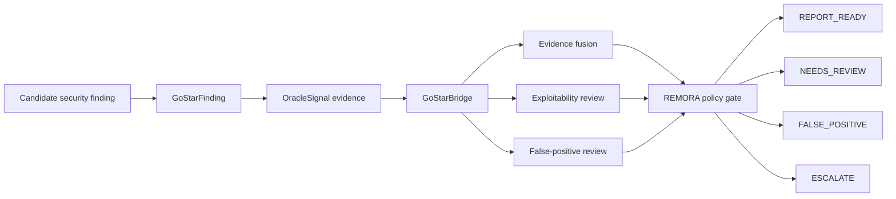

# GO-STAR Cybersecurity Integration

## What GO-STAR is

GO-STAR is a separate, closed-source cybersecurity research platform. Its
scanner internals are not part of the public REMORA repository. Public REMORA
does not require reviewers to inspect GO-STAR source code.

What REMORA publishes is the integration contract: how a security finding from
an external security platform can be routed through REMORA's governance layer
before it becomes a report, a dismissal, or an escalation.

In short:

```text
GO-STAR produces candidate security findings.
REMORA decides how those findings should be governed.
```

## Why this belongs in REMORA

Security tools often produce many alerts. Some are real vulnerabilities, some
are duplicates, some are false positives, and some are too ambiguous to close
without more evidence. A single model answer is not a safe authority boundary
for that decision.

REMORA treats a security finding as a governed action:

- reporting a vulnerability
- closing a finding as a false positive
- escalating a critical issue
- requesting more evidence before a decision

The goal is not to replace a security engineer. The goal is to make the
decision path explicit, auditable, and bounded by policy.

## Public integration contract

The public bridge is implemented in `remora/integrations/gostar.py`.

The bridge accepts:

- `GoStarFinding`: title, description, severity, CWE, affected path, and context
- `OracleSignal`: evidence from sources such as static analysis, code graph
  analysis, dependency intelligence, or dynamic testing
- optional MCP-backed evaluators for evidence fusion, exploitability, and
  false-positive review

The bridge returns:

- `SecurityGovernanceResult`
- a cybersecurity verdict
- a REMORA governance action (`ACCEPT`, `VERIFY`, `ABSTAIN`, or `ESCALATE`)
- a confidence score
- evidence summary
- provenance hash

## Governance flow



## Decision semantics

| Cybersecurity verdict | Meaning | REMORA governance behavior |
|---|---|---|
| `REPORT_READY` | Evidence is strong enough to prepare a report. | High-severity findings still route to `VERIFY` before external disclosure or operational action. |
| `NEEDS_REVIEW` | Evidence is incomplete, conflicting, or weak. | Human security review or additional evidence required. |
| `FALSE_POSITIVE` | Finding appears non-exploitable or unsupported. | Low-risk dismissals may be accepted; high/critical dismissals route to `VERIFY` to avoid silently dropping real bugs. |
| `ESCALATE` | Critical or ambiguous high-impact finding. | Human security owner involvement required. |

This is the key REMORA pattern: history and model judgment may recommend a
path, but policy decides whether that path is allowed.

## Optional MCP-backed evaluators

When available, GO-STAR exposes three REMORA-oriented evaluator tools:

- `remora_evidence_fusion`: asks whether multi-tool evidence confirms a real vulnerability
- `remora_exploitability`: asks whether a vulnerability is plausibly exploitable
- `remora_false_positive`: asks whether a finding should be treated as a false positive

The public REMORA bridge also has deterministic local behavior and mocked MCP
tests. That makes the integration reproducible without access to the private
GO-STAR repository.

## Minimal example

```python
from remora import GoStarBridge, GoStarFinding, OracleSignal, Severity

finding = GoStarFinding(
    finding_id="F-001",
    title="SQL injection in login handler",
    description="User input flows unsanitized into a SQL query.",
    severity=Severity.HIGH,
    cwe="CWE-89",
    file_path="app/login.py",
    oracle_signals=[
        OracleSignal(
            tool="semgrep",
            family="static",
            evidence_role="primary",
            confidence=0.90,
        ),
        OracleSignal(
            tool="codegraph",
            family="graph",
            evidence_role="corroborating",
            confidence=0.85,
        ),
    ],
)

result = GoStarBridge().govern(finding)
print(result.verdict.value)
print(result.governance_action)
print(result.provenance_hash)
```

## What is not claimed

This integration does not claim that:

- GO-STAR internals are publicly reproducible from this repository
- REMORA has independently validated GO-STAR scanner precision
- REMORA can prove exploitability without evidence
- a high-confidence LLM result can override policy
- a false-positive dismissal is safe for high/critical findings without review

The claim that is supported by public REMORA code is narrower:

> REMORA provides a testable bridge that converts external cybersecurity
> findings and multi-source evidence signals into explicit, auditable
> governance outcomes.

## Reviewer checklist

1. Inspect `remora/integrations/gostar.py`.
2. Run `python -m pytest tests/test_gostar_integration.py -q`.
3. Confirm high/critical false-positive dismissals route to review.
4. Confirm mocked MCP behavior is tested and deterministic.
5. Treat all GO-STAR scanner-performance claims as private or external unless
   linked to public artifacts.
