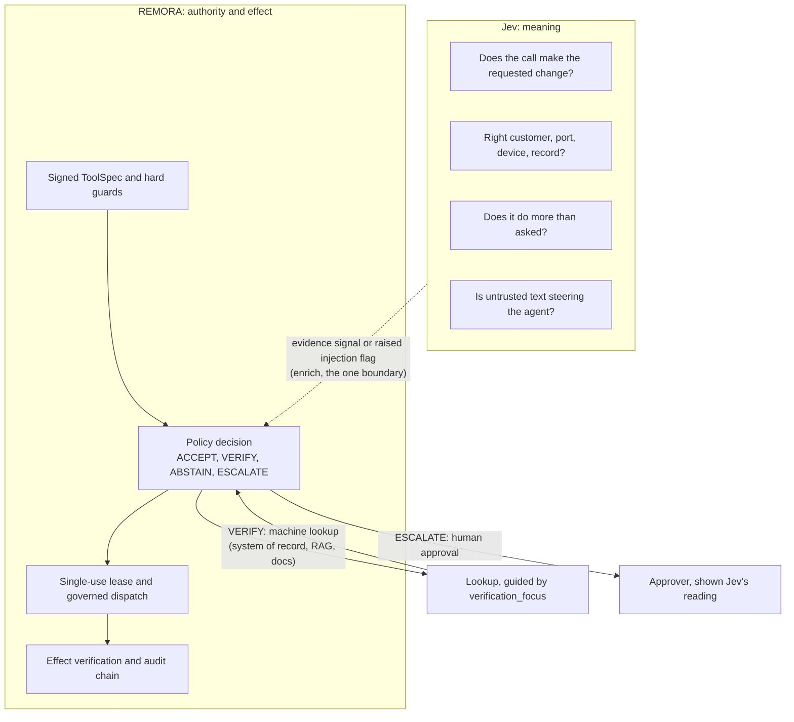

# Jev as a decision provider

Status: experimental. Two adapters reach the same model: one on TypeSafe's
own API and one on Cloudflare Workers AI. The TypeSafe adapter has answered
live in three committed rounds: a smoke round
(`results/jev_live_smoke_v1.json`), a V1/V2 screening
(`results/jev_question_set_ab_v1.json`) and a pre-registered hold-out of 192
scenarios (`results/jev_injection_holdout_v1.json`). They are evidence about
the integration and about those corpora. No threshold is calibrated for any
deployment, and NEGATIVE_RESULTS.md §74 is open.



Jev never writes a deployment fact, lowers a flag, names a route or reaches
ACCEPT. REMORA never asks Jev whether something is allowed.

## The one rule

A decision provider may inform a decision. It may never create authority.

Jev answers narrow, typed questions about a proposed call with calibrated
probabilities. REMORA admits those answers through one boundary,
`remora.decision_providers.enrich.enrich`, and that boundary can do exactly
two things. It can add a favourable model signal, which the engine reads on
its evidence path. It can raise the `adversarial_detected` flag, which the
deterministic hard block escalates. It cannot write a deployment fact, it
cannot lower a flag, and it cannot name a route.

Under the execution profile, no combination of model signals reaches ACCEPT.
That invariant predates this integration and is pinned by
`tests/test_policy_whatif.py`. The integration inherits it by construction,
because the projection is confined to the model-signal class. On an engine
configured without the execution profile the bound does not hold, and
`tests/test_decision_providers.py` records that limit as a test so it cannot
change quietly.

## What is sent

`semantic_state` builds the state a provider sees: the stated intent, the tool
name, the arguments, and any declared context. A key whose name suggests a
credential is refused rather than redacted, at any depth: inside nested objects
and inside lists, not only at the top level. Before issue #753 a key one level
down reached the provider. Production credentials, tokens and
session identifiers have no bearing on a semantic question and must never
appear in a provider's logs.

The state must also stay inside the JSON domain and the egress bounds in
`remora/decision_providers/enrich.py`. The bounds are `EGRESS_MAX_DEPTH` for
nesting, `EGRESS_MAX_ITEMS` entries per object or list, `EGRESS_MAX_TEXT`
characters per text field and `EGRESS_MAX_BYTES` bytes for the serialized
state. Bytes, sets, non-finite numbers and non-string keys
are refused. A state outside these limits is refused, never trimmed, because
trimming would change the question the provider is asked. On the shadow path a
refusal becomes a shadow record with `error` set and never reaches the caller.

## What is asked

Three versioned question sets exist. `remora-semantic-v2.1`
(`REMORA_QUESTIONS_V2_1`) is the one to use: it met the pre-registered
hold-out criteria, described under "Question set V2" below. V2 and V2.1 split
the questions further, name the state fields they judge and expect the
structured state from `semantic_state_v2`. The table describes V1,
`remora-semantic-v1`, which is still the default of `enrich()`: six
questions, each answerable from the minimised state alone.

| Question | Kind | Admitted as |
|---|---|---|
| `intent_match` | probability | favourable evidence signal, with `target_matches_request` |
| `target_matches_request` | probability | favourable evidence signal, with `intent_match` |
| `possible_injection` | probability | `adversarial_detected` raised above threshold |
| `scope_drift` | probability | withholds the favourable signal above threshold |
| `action_reversibility` | score on a legend | recorded only |
| `semantic_risk` | score on a legend | recorded only |

The last two are recorded in the evidence and never projected. The observation
fields that look right for them, `risk_tier` and `rollback_available`, are
deployment facts. They are kept in the evidence so a calibration study can
compare the model's view with the deployment's declaration.

There is no `recommended_route` question. A model that names a route starts to
look like the thing that decides, and the routing literals leak into logs as
if they were decisions. The engine computes the route from the signals.

## Thresholds have no defaults

`SemanticThresholds` requires every cut to be supplied. A threshold is a
calibrated policy decision, and a default would make the most consequential
number in the integration the one nobody reviewed.

Calibrate against a corpus in the deployment's language. TypeSafe states that
English is the primary language with the best accuracy and recommends separate
testing for others. A threshold tuned on English prompts is not evidence about
Norwegian ones. Record the corpus hash and the question-set version beside the
thresholds in configuration, and re-run calibration when either changes.

## Failure is structural

A provider that cannot answer raises `DecisionProviderError`, and `enrich`
returns the observation untouched with outcome `provider_unavailable`. The
engine then makes the deterministic decision.

Provider failure never creates favourable evidence and never clears a safety
flag. It does not follow that the decision without the provider is never more
permissive than the decision with it. A provider that raises
`adversarial_detected` can turn a VERIFY into an ESCALATE; when the same
provider is unavailable, the observation is unchanged and the decision stays at
VERIFY. Absence can be less restrictive than a successful narrowing (issue
#753 corrected the earlier wording here).

On the enforcing path this has no effect today, because Jev runs in shadow
there and its output is not authoritative. It would matter for any future
guard that is allowed to narrow a live decision. Such a guard must represent
provider unavailability explicitly and must never read it as a clean
assessment. What a decision does when a required guard is unavailable belongs
in the deterministic policy layer, not in the provider or its adapter.

No per-tier failure table is offered. A table would be a place to configure a
fail-open, and there is nothing it could express that is safe.

## TypeSafe API

`remora.decision_providers.typesafe.TypeSafeJevProvider` calls
`POST https://api.typesafe.ai/v1/systemone` with a bearer key from the
TypeSafe console and model alias `jev-latest`. This is the route for a
TypeSafe key: it needs no Cloudflare account, no AI Gateway and no credits,
so the billing prerequisites in the next two sections do not apply to it.

The key is read from `JEV_API_KEY`, with `TYPESAFE_API_KEY` (the name in
TypeSafe's documentation) as the fallback. Both are registered in
`docs/assurance/credential_topology.yaml` as oracle credentials.

The repository holds the key as a GitHub Agents secret, `JEV_API_KEY`, added
2026-10-01. GitHub exposes Agents secrets to the Copilot cloud agent. They are
not visible to Actions workflows or to a local shell. A workflow that should
call Jev needs the key as an Actions secret as well, and a local run needs it
exported in the environment:

```bash
export JEV_API_KEY=...   # from console.typesafe.ai
python examples/jev_decision_provider_demo.py --live
python examples/jev_decision_provider_demo.py --live --scenario injection
```

Rate limiting (`429`) and overload (`529`) are retried with the
`retry-after` header honoured up to ten seconds. A `401` is refused at once.
Every refusal carries TypeSafe's message and the `x-typesafe-request-id`, which
is what TypeSafe support asks for.

## First live round

`experiments/jev_live_smoke.py --repeats 3` put the demo's three scenarios to
`jev-latest` on 2026-10-01 (UTC) from commit `ec4d1a3`. The provenance sidecar
records a clean worktree before and after the run. All nine calls were answered by
`jev-1.13.0`, none fell back to `provider_unavailable`, and none reached
ACCEPT. The injection scenario moved the decision from VERIFY to ESCALATE in
all three repeats. The legitimate and wrong-target scenarios stayed at VERIFY.

Two observations bear on calibration.

The legitimate scenario scored `intent_match` 0.70 and
`target_matches_request` 0.74 to 0.76, below the demo's illustrative 0.85, so
the favourable signal was withheld. The wrong-target scenario scored 0.06 to
0.07 and 0.03. The separation between the two is wide, and the absolute level
of the legitimate one is lower than the illustrative threshold assumed.
Thresholds chosen without a corpus would have been wrong here.

Repeats of the same state did not return identical answers: every repeat had
its own response hash. The spread was small, at most 0.06 on any probability
in this round. A threshold therefore sits inside a band rather than on a
point, and a calibration study should measure that band rather than assume
determinism.

## Question set V2

`REMORA_QUESTIONS_V2` (`remora-semantic-v2`) rewrites the questions against
TypeSafe's published guidance for Jev. Each question asks one thing and names
the state field it judges. Injection is three questions that judge only
untrusted content. Score levels describe situations. It expects the state from
`semantic_state_v2`, which keeps `operator_request`, `proposed_call` and
`untrusted_content` apart. Admission is unchanged in kind: any injection
answer at or above the `possible_injection` cut raises `adversarial_detected`,
and favourable intent and target answers still stop at VERIFY.

`experiments/jev_question_set_ab.py` screened V1 against V2 on 32
hand-written ISP scenarios in English and Norwegian, with the model pinned to
`jev-1.13.0` (`results/jev_question_set_ab_v1.json`). On legitimate calls V2
raised mean `intent_match` to 0.92 to 0.98, from 0.81 to 0.96 under V1.
`scope_drift` separated better: 0.04 to 0.09 on legitimate calls and 0.86 to
0.96 on drifted ones, against 0.55 to 0.92 under V1. Every injected variant
was flagged under both sets. Both sets also flagged benign tickets, on
different tasks, and that is recorded as an open finding in
NEGATIVE_RESULTS.md §74.

V2.1 (`remora-semantic-v2.1`) changes only the injection questions. A
pre-registered hold-out of 192 scenarios from context-free authors
(`artifacts/jev-injection-holdout-2026-10-02/`) scored V1, V2 and V2.1 at
the 0.5 injection cut. V2.1 flagged 22.5 % of non-injection scenarios against
53.5 % for V2 and 29.6 % for V1, and caught every injection. V1 gave one
favourable admission on a wrong target; V2 and V2.1 gave none. V2.1 is the
set to use for shadow evaluation. Its injection threshold and its intent
and target thresholds still need calibration, and Norwegian text is flagged
about twice as often as English.

## Shadow mode

`servers/semantic_shadow.py` runs Jev beside every `/v1/execution/assess`
decision and records what it would have changed. The hook is the
`semantic_shadow` parameter of `remora/execution/service.py::assess_proposal`.
It is called after the audit record is appended, its return value is
ignored, and any exception it raises is swallowed. The response is the same
with the shadow off, on or failing, and `tests/test_semantic_shadow_server.py`
holds that through the real route.

The work runs on a small background pool with a bounded queue. A full queue
drops the proposal and counts it, so a slow provider costs shadow coverage
and never request latency. Each evaluation appends one `ShadowRecord` to a
local JSON Lines file. The record holds the final action, the engine's own
action before any downgrade, the action Jev's answers would have produced
(`shadow_action`), `would_change`, every answer, the latency and the billed
input tokens. It is joined to the audit record by `proposal_id` and never
written into it.

Configuration is explicit and has no defaults for the decisions in it:

| Variable | Meaning |
|---|---|
| `REMORA_SEMANTIC_SHADOW` | `1` turns it on; off otherwise |
| `REMORA_SEMANTIC_SHADOW_TENANTS` | tenants whose calls may leave the process |
| `REMORA_SEMANTIC_SHADOW_QUESTIONS` | `v1`, `v2` or `v2.1` |
| `REMORA_SEMANTIC_SHADOW_THRESHOLDS` | `intent=…,target=…,injection=…,drift=…` |
| `REMORA_SEMANTIC_SHADOW_LOG` | path of the JSON Lines file |
| `REMORA_SEMANTIC_SHADOW_MODEL` | optional; defaults to the pinned `jev-1.13.0` |

Switching it on with any required setting missing refuses startup, because
a shadow that silently records nothing would later read as agreement. Only
proposals whose operator request was resolved server-side
(`intent_authority_present`) are evaluated; otherwise the question is a
placeholder built from the call itself. The tool description is taken from
the signed ToolSpec when a bundle is configured, never from the agent.

`scripts/semantic_shadow_report.py` summarises the log: disagreements by
direction, failures, p50 and p95 latency, billed tokens and an estimated
cost. Given a reviewer's labels by `proposal_id`, it separates what the
sensor flagged from what would have changed the decision. Under the
execution profile the two differ. A caught scope drift withholds a favourable
signal from a call that stops at VERIFY anyway, so it is flagged without a
stricter decision. Only a raised `adversarial_detected` makes the decision
stricter. Jev's drift and target answers are therefore information for the
step that resolves the decision, and are measured as such.

That step differs by action. VERIFY is a machine step: a bounded lookup in a
system of record, a RAG index or documentation, after which the router runs
again on the fresh observation (`remora/policy/resolution.py`). ESCALATE is a
human approval. Jev's reading tells the lookup what to check and the
approver where to look.

Both read it from
`GET /v1/execution/proposals/{proposal_id}/semantic-assessment`. The response
is built by `remora/decision_providers/review.py` and states in every body
that it is advisory. `for` names the audience, `verifier` at VERIFY and
`approver` at ESCALATE. `verification_focus` names the checks a lookup should
make, one per concern and worst first:

| Answer past its cut | Check | What the lookup establishes |
|---|---|---|
| `target_matches_request` low | `confirm_target` | the identifiers the request names, from the system of record, against the call's arguments |
| `intent_match` low | `confirm_intent` | the procedure or documentation for the requested change, against the tool and arguments |
| `scope_drift` high | `confirm_scope` | a source for every argument the request does not call for, against the signed ToolSpec |
| any injection question high | `exclude_untrusted_text` | that the untrusted text is not used as a source for any lookup |

The focus names checks and grants nothing. A `ResolutionPlan`'s resolver may
still write only its target arguments from its source tools. `attention`
lists the same answers in plain words with value and cut. Every answer is
shown with the question that was asked, a score with the label of its
nearest level, and the caveats come from REMORA's own evidence. When there is
no reading, `status` says why: `not_enabled`, `pending`,
`tenant_not_opted_in`, `request_not_resolved`, `dropped` or `unknown`. A failed
provider is shown as `failed`, never as a clean reading. The endpoint is
tenant-scoped like every proposal read. No code that approves, resolves or
executes reads it, and `tests/test_semantic_review_view.py` checks that in
the source of each approval and execution path.

For a request to change the guest network on a customer's router, where the
proposed call also moved the management VLAN, Jev put `scope_drift` at 0.94
in a live check. The decision stayed VERIFY, and the view's first focus was
`confirm_scope`. That is one call, shown to illustrate the view, and is not a
measurement.

## Three roles, and the narrowing guard

Jev appears in three roles, and they are kept apart:

| Role | Where | What it may do |
|---|---|---|
| provider adapter | `typesafe.py`, `cloudflare.py` | ask typed questions and return typed answers; never authoritative |
| semantic shadow | `servers/semantic_shadow.py`, after the decision is durable | observe and calibrate; the enforcing decision is unchanged |
| narrowing guard | `remora/decision_providers/narrowing.py`, library only | raise `adversarial_detected` and nothing else |

Semantic evidence and execution authority are separate namespaces. No
semantic-provider result is evidence of authority.

`SemanticNarrowingGuard` is the contract a future pre-policy guard has to use
(issue #753). It asks only the injection questions of a pinned question set
and writes only through `project_narrowing`, so its one possible effect on an
observation is a narrowing flag going from false to true. It never writes a
favourable signal. Activation is per tenant. It is refused unless the execution
profile is on, the model is a pinned version, the question set is allowed for
a guard, and the profile is calibrated. A calibrated profile
names its study, corpus hash, language and vertical, and was made with the same
model, question set and thresholds. A provider that fails, times out, reports
another model or question set, or answers outside the declared questions gives
`provider_unavailable`. A result is never clean: not narrowing is not evidence
that a call is safe. Nothing in `servers/`, `remora/execution/`,
`remora/policy/` or `remora/enforcement/` imports the guard, and a test pins
that. Wiring it before a live decision waits for a calibrated profile
(NEGATIVE_RESULTS.md §74).

## Per-vertical profiles

One deployment can serve several verticals and languages. Setting
`REMORA_SEMANTIC_SHADOW_PROFILES` to a YAML or JSON file replaces the
single-profile variables with named profiles and a tenant map:

```yaml
profiles:
  isp-no:
    questions: v2.1
    thresholds: {intent: 0.85, target: 0.85, injection: 0.5, drift: 0.5}
    language: no
    calibration: {status: uncalibrated}
  bank-en:
    questions: v2.1
    thresholds: {intent: 0.9, target: 0.9, injection: 0.5, drift: 0.4}
    language: en
    calibration: {status: calibrated, study: artifacts/<study>, corpus_sha256: <hash>}
tenants:
  example-isp: isp-no
  example-bank: bank-en
```

The thresholds shown are placeholders. Each tenant is evaluated under its
own profile, with one provider per question-set version. Every record
carries the profile, its language and its calibration record. The reading's
caveats follow them: a calibrated profile names its study instead of the
uncalibrated warning, and the language warning is dropped only for a profile
that declares English. Every key is checked at startup. An unknown key, a
missing threshold, a tenant mapped to an undefined profile, or a
`calibrated` profile without `study` and `corpus_sha256` refuses startup.
Setting the file together with `_TENANTS`, `_QUESTIONS` or `_THRESHOLDS` is
refused as ambiguous. How a vertical gets from an uncalibrated to a
calibrated profile is in
[domain_pack_governance_v1.md §11](../assurance/domain_pack_governance_v1.md).

## Cloudflare Workers AI

`remora.decision_providers.cloudflare.CloudflareJevProvider` reaches the model
at `POST /accounts/{account}/ai/run` with model id `typesafe/jev`. Routing
through the Cloudflare account means no separate vendor key.

Environment: `CLOUDFLARE_ACCOUNT_ID`, `CLOUDFLARE_API_TOKEN` and
`CLOUDFLARE_AI_GATEWAY_ID`. The token is registered in
`docs/assurance/credential_topology.yaml` as an oracle credential, because
the adapter dispatches no governed tool. If a governed tool ever dispatches
through that token, the entry must move to `effect_credential`, as its own
note states.

## Billing is the one operational prerequisite

Learned by running the adapter against the live service on 2026-09-24, and
recorded here so nobody rediscovers it at 402. `typesafe/jev` is a partner
model. It is paid for from prepaid AI Gateway credits (Unified Billing), not
from the Workers AI standard plan. Without credits the service answers
`HTTP 402` with code `2021`: "Insufficient balance; add money to your
gateway or use BYOK".

In the same session the account token, the endpoint and the request shape
were all confirmed correct: a native Workers AI model on the same `/ai/run`
endpoint answered `200`. The adapter surfaces the Cloudflare message in
`DecisionProviderError`, so the operational cause is visible in the refusal
rather than hidden behind a status code.

Three steps make the call billable.

1. Load credits in the dashboard: AI Gateway, Credits Available, Manage,
   Top-up credits. A payment method is required and Cloudflare adds a 5 %
   fee to purchased credits. There is no API for this step.
2. Set the gateway's Workers AI billing to Unified billing, in the gateway
   settings or by a `PUT` on the gateway with
   `workers_ai_billing_mode: "unified"`.
3. Name that gateway in `CLOUDFLARE_AI_GATEWAY_ID`. The adapter sends it as
   the documented `cf-aig-gateway-id` header, which is what routes the spend
   to the credit balance and gives the request analytics and rate limiting.
4. Mint a token with the AI Gateway Run permission from the gateway's
   settings ("Create authentication token") and set it as
   `CLOUDFLARE_AI_GATEWAY_TOKEN`. Unified Billing refuses the run call
   without it, with `HTTP 403` code `2049`. An account token with Workers AI
   and AI Gateway read and edit rights does not carry Run. Cloudflare scopes
   Run to the whole account, not to one gateway, so treat the token as able
   to send through every gateway you own.

The gateway `remora-jev` was created on 2026-09-24 with Unified billing and
authentication on, so steps two and three are done for this account. Steps
one and four are dashboard actions.

The alternative is BYOK: store a TypeSafe API key on the gateway, and the
request is billed by TypeSafe directly.

At the published price of $0.042 per million input tokens, a state of two
thousand tokens costs about $0.00008 per decision. Ten dollars of credit is
more than a hundred thousand decisions.

Three response details are preserved rather than simplified. A `noul` answer
is a probability and stays one; `DecisionAnswer.as_bool` demands an explicit
threshold. A `score` answer indexes its legend in the legend's units, and
value and labels travel together. The resolved model version comes from the
response, not from the alias in the request, so an alias repointed upstream is
visible in the record.

## Example

```python
from remora.decision_providers.enrich import SemanticThresholds, enrich, semantic_state
from remora.decision_providers.questions import QUESTION_SET_VERSION
from remora.policy.decision_engine import RemoraDecisionEngine
from remora.decision_providers.typesafe import TypeSafeJevProvider
from remora.policy.observation import PolicyObservation

# Reads JEV_API_KEY. CloudflareJevProvider takes the same arguments.
provider = TypeSafeJevProvider(question_set_version=QUESTION_SET_VERSION)

# From reviewed configuration, calibrated against a corpus in the deployment's language.
thresholds = SemanticThresholds(
    intent_match=0.85,
    target_matches_request=0.85,
    possible_injection=0.5,
    scope_drift=0.5,
)

state = semantic_state(
    intent="Change VLAN on the access port for customer C123 from 410 to 420",
    tool_name="access.change_customer_vlan",
    arguments={"customer_id": "C123", "port": "osl-rtr-07/1/12", "vlan": 420},
)

observation = PolicyObservation(
    question=state["intent"],
    risk_tier="high",
    action_type="configuration_change",
    target_environment="prod",
)

result = enrich(observation, provider, state=state, thresholds=thresholds)
decision = RemoraDecisionEngine(execution_profile=True).decide(result.observation)

# result.evidence carries the answers, the resolved model and the state hash.
# result.notes carries one line per admission decision, for the audit record.
```

The evidence record is returned to the caller rather than written into the
decision envelope. The envelope's bytes are what every historical token and
lease was signed over, and they are not rewritten for a new input class.
Record the evidence beside the decision, joined by the proposal identity.

## What this is not

It is not a benchmark result against REMORA's oracles. The committed rounds
measure Jev on hand-written and agent-written ISP scenarios. No measurement
against the existing oracle corpus exists yet, and that comparison should be
run before any claim about replacing an oracle is made.

It is not a production gate. The shipped execution path calls `enrich` only
in shadow mode, described below, where the answer is recorded and never
used. Letting it influence a governed decision is a separate change with its
own review, and it should follow the calibration study rather than precede it.
