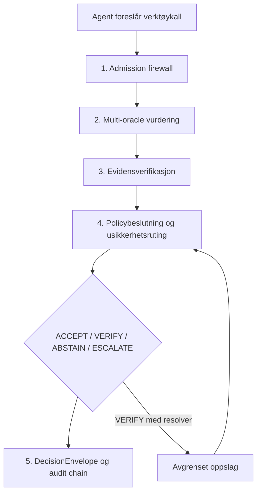

# REMORA Research – norsk forskningsmonografi

> **Status:** Kodeforankret konsolideringsdokument for ekstern gjennomgang.  
> **Referansegren:** `master`  
> **Kontrollpunkt ved utarbeidelse:** `7891825e94c95de3fede944debfc3c31471acc57`  
> **Språk:** Norsk  
> **Formål:** Én systematisk, etterprøvbar beskrivelse av REMORA slik systemet faktisk er implementert og dokumentert i repositoryet.

---

## Dokumentets autoritet og leseregler

Denne monografien beskriver REMORA som et **styrings- og kontrollag før utførelse av agenthandlinger**. Dokumentet er ikke i seg selv autoritativt for målte resultater. Ved konflikt gjelder følgende rangering:

1. kjørende kode og maskinlesbare skjemaer,
2. automatiske tester og committed resultatartefakter,
3. maskinlesbare assurance-registre,
4. denne monografien,
5. eldre eller historiske dokumenter.

Alle vesentlige utsagn er merket med én eller flere kildekategorier:

- **[KODE]** implementert i repositoryet,
- **[TEST]** dekket av automatiske tester eller CI-gate,
- **[ARTEFAKT]** målt og lagret som resultatartefakt,
- **[LITTERATUR]** forankret i ekstern faglitteratur,
- **[HYPOTESE]** foreslått forklaring eller fremtidig forskningsretning, ikke etablert resultat.

Påstander om benchmarkresultater skal alltid kontrolleres mot `docs/assurance/claim_register_v1.yaml` og den artefakten registeret peker på. Supersederte resultater skal ikke presenteres som nåværende evidens.

---

# 1. Introduksjon

## 1.1 Problemstilling

Agentiske AI-systemer skiller seg fra tradisjonelle språkmodeller ved at de ikke bare produserer tekst, men kan foreslå og utføre handlinger gjennom verktøy, API-er, databaser, kontrollsystemer og andre operative grensesnitt. Feil kan derfor få direkte fysisk, økonomisk, sikkerhetsmessig eller regulatorisk effekt.

REMORA adresserer følgende styringsproblem:

> Gitt en konkret foreslått agenthandling, hvilke kontroller må være oppfylt før handlingen kan utføres autonomt, og hvordan kan beslutningen dokumenteres slik at den kan granskes, gjentas og utfordres i ettertid?

REMORA svarer med nøyaktig ett av fire utfall:

| Utfall | Operativ betydning |
|---|---|
| `ACCEPT` | Handlingen kan utføres autonomt under gjeldende kontrollbetingelser. |
| `VERIFY` | En navngitt og avgrenset opplysning må valideres før ny vurdering. |
| `ABSTAIN` | Systemet mangler tilstrekkelig grunnlag og stopper. |
| `ESCALATE` | Menneskelig beslutning eller godkjenning kreves. |

**[KODE]** Utfallene implementeres i policy- og rapporteringslaget, særlig `remora/policy/decision_engine.py`, `remora/policy/report.py` og governance-kontraktene.  
**[KODE]** REMORA styrer utførelsestillatelse, ikke sannheten i en generell påstand.

## 1.2 Hvorfor agentisk AI trenger assurance

En modell kan være høykompetent og samtidig:

- velge feil verktøy for oppgaven,
- bruke korrekte argumenter i feil kontekst,
- følge instruksjoner som kom fra ubetrodd innhold,
- handle på utdatert eller ufullstendig tilstand,
- uttrykke høy selvsikkerhet uten at beslutningsgrunnlaget er tilstrekkelig,
- produsere en plausibel forklaring som ikke samsvarer med den faktiske kontrollflyten.

REMORA behandler derfor ikke modellens egen sikkerhet eller forklaring som tilstrekkelig autoritet. Tillit flyttes fra modellens svar til en **etterprøvbar beslutningsprosess rundt svaret**.

## 1.3 Designmål

De sentrale designmålene er:

1. **Pre-execution kontroll:** Beslutningen tas før verktøyet får effekt.
2. **Deterministisk sikkerhetsgulv:** Enkelte forhold kan aldri overstyres av sannsynlighet, konsensus eller modellselvsikkerhet.
3. **Konservativ usikkerhet:** Manglende grunnlag skal føre mot `VERIFY`, `ABSTAIN` eller `ESCALATE`, ikke automatisk utførelse.
4. **Eksakt binding:** En tillatelse gjelder bestemt tenant, aktør, verktøy, argumentsett, miljø og policytilstand.
5. **Én beslutningskilde:** Avgjørelse og forklaring skal bygge på samme ordnede regelstige.
6. **Reviderbarhet:** Hvert utfall skal kunne spores til observasjon, regler, evidens og artefakter.
7. **Falsifiserbar forskning:** Negative og supersederte resultater skal bevares og skilles fra aktive påstander.

---

# 2. Forskningsgrunnlag

## 2.1 Tverrfaglig fundament

REMORA er ikke en direkte implementasjon av én artikkel. Arkitekturen er en syntese av flere forsknings- og ingeniørtradisjoner:

- selektiv prediksjon og abstention,
- konformal risikokontroll,
- fleragent- og ensemblevurdering,
- kalibrering og korrelasjonsjustering,
- policy enforcement og reference monitor-prinsipper,
- zero-trust-lignende eksplisitt autorisasjon,
- provenance og tamper-evident logging,
- adversarial input-håndtering,
- assurance cases og evidensstyring,
- causal og counterfactual testing som avgrensede støttekomponenter.

Innovasjonen ligger hovedsakelig i **integrasjonen og operationaliseringen**: ideene er oversatt til kode, beslutningskontrakter, tester, benchmarkprotokoller, claim-registre og CI-gates.

## 2.2 Hva som faktisk er implementert

Følgende forskningsideer er konkret representert i kode:

| Konsept | Implementasjon | Status |
|---|---|---|
| Selektiv beslutning/ruting | `remora/selective/`, policy engine | Aktiv |
| Konformal risikokontroll | `remora/selective/conformal.py`, `crc.py` | Aktiv, men må skilles fra sikkerhetsgulvet |
| Fleroracle-konsensus | `remora/engine.py`, `remora/correlation.py` | Aktiv |
| Uenighetsmål | `remora/thermodynamics.py`, `remora/statphys/` | Diagnostikk/ruting; ikke sikkerhetsbevis |
| Evidensverifikasjon | `remora/oracles/evidence_verifier.py`, `evidence_v2.py`, `evidence_v3.py` | Aktiv, hovedsakelig leksikalsk |
| Policy-gating | `remora/policy/decision_engine.py`, `invariants.py` | Aktiv og sikkerhetskritisk |
| Bounded resolution | `remora/policy/resolution.py` | Implementert kontrakt og re-entry |
| Audit envelope | `remora/governance/envelope.py` | Aktiv |
| Hashkjede | `remora/audit/hash_chain.py` | Aktiv, tamper-evident |
| Execution lease | governance/execution-komponenter og API | Aktiv på håndhevende sti |
| Shadow replay | `remora/shadow/replay.py` | Aktiv |
| Causal skjema/støtte | `remora/causal/` | Avgrenset; ikke full kausal identifikasjon |
| Adaptivt AROMER-lag | `remora/aromer/` | Eksperimentelt, shadow-only |

## 2.3 Hva som er nytt, og hva som ikke bør overdrives

REMORA bør ikke påstå at det har oppfunnet konformal prediksjon, ensemblemetoder, policy enforcement eller hashkjeder. Forskningsbidraget må formuleres mer presist:

- en samlet pre-execution assurance-arkitektur,
- en hard-block-first beslutningsstige,
- et eksplisitt fireveis handlingsrom,
- bounded verification med `ResolutionPlan` og full re-entry,
- eksakt binding mellom beslutning og verktøykall,
- maskinlesbar claim governance som kobler dokumentasjon til artefakter,
- empirisk demonstrasjon av at strukturell gyldighet og oppgavekorrekthet er uavhengige akser.

**[HYPOTESE]** Den overordnede syntesen kan være et selvstendig forskningsbidrag. Dette krever ekstern fagfellevurdering og uavhengig replikasjon før det kan hevdes sterkt.

---

# 3. Systemarkitektur

## 3.1 Den operative femstegsprosessen

### Steg 1: Admission firewall

**[KODE]** `remora/safety/adversarial.py` og `remora/engine.py` undersøker adversarial, coercive eller injeksjonslignende innhold før oracle fan-out. Firewall setter observasjonsflagget `adversarial_detected`; den avgir ikke selv endelig utfall.

**Designbegrunnelse:** Det skal finnes ett sted som produserer verdict. Derfor konverterer policyens første harde regel flagget til `ESCALATE`.

### Steg 2: Multi-oracle-konsensus

**[KODE]** Flere oracle-backender vurderer samme foreslåtte handling. `remora/correlation.py` kan nedvekte korrelerte orakler, slik at gjentatt eller nært beslektet enighet ikke teller som uavhengig evidens.

**Begrensning:** Flere modeller er ikke automatisk flere uavhengige kilder. Konsensus er et rutingssignal, ikke et sikkerhetsbevis.

### Steg 3: Evidensverifikasjon

**[KODE]** Evidenskomponentene vurderer støtte og kontradiksjon mot tilgjengelig kildegrunnlag. Nåværende relasjonsdeteksjon beskrives i arkitekturen som hovedsakelig leksikalsk, med tokenoverlapp og negasjonsheuristikk.

**Begrensning:** Dette er ikke generell semantisk eller kausal verifikasjon. NLI-backend er undersøkt, men full benchmarkparitet er fortsatt et åpent arbeid.

### Steg 4: Policy og usikkerhetsruting

Policy engine kjører en prioritert beslutningsstige:

1. deterministiske hard guards,
2. betingede risiko- og miljøregler,
3. trust/phase/conformal-ruting,
4. argument- og grounding-gates på resterende fall-through.

Harde regler kan ikke overstyres av modellflertall eller confidence.

### Steg 5: DecisionEnvelope og audit

Alle utfall registreres, også der ingen handling utføres. En `DecisionEnvelope` bindes til beslutningsgrunnlag og inngår i en SHA-256-basert kjede.

## 3.2 Autoritativ tilstand

Autoritativ tilstand er informasjon som kommer fra en definert system-of-record eller validator, ikke fra modellens fritekstlige antakelse. REMORA modellerer blant annet:

- state coverage,
- tenant-binding,
- freshness,
- kilde- eller validatoridentitet,
- hash/binding til observasjonen,
- om argumentverdier er bekreftet,
- om verktøyets effekt er read/write/destructive.

Den sentrale innsikten er at **ukjent tilstand er et løsningsproblem, ikke en dom**. Dersom en avgrenset autoritativ lookup finnes, kan systemet produsere `VERIFY` med plan. Dersom ingen slik lookup finnes, skal systemet ikke love verifikasjon; det skal `ABSTAIN` eller `ESCALATE`.

## 3.3 Orkestrering og separasjon av ansvar

REMORA skiller mellom:

- modellvurdering,
- evidensvurdering,
- policyavgjørelse,
- utførelseshåndheving,
- logging og replay.

Dette reduserer risikoen for at samme modell både foreslår handling, vurderer sin egen handling og autoriserer utførelsen.

## 3.4 Execution path versus advisory path

Bibliotekfunksjoner kan vurdere opplysninger som kalleren leverer. Dette er en advisory path. Den sterkere garantien finnes i execution API-et, der:

- verktøy kommer fra deployment-konfigurasjon,
- agenten kan ikke registrere egne verktøy gjennom requesten,
- utførelsen krever en single-use lease,
- argumentene rehashes og kontrolleres rett før kall,
- manglende registry betyr at verktøyet ikke utføres.

Dette skillet er avgjørende: et policybibliotek kan ikke beskytte en agent som kan gå utenom det.

---

# 4. Implementasjon

## 4.1 Moduloversikt

| Domene | Sentrale filer | Ansvar |
|---|---|---|
| Kjerneorkestrering | `remora/engine.py`, `remora/state.py` | Samler observasjoner og oracle-responser |
| Policy | `remora/policy/decision_engine.py` | Produserer endelig utfall |
| Observasjon | `remora/policy/observation.py` | Kanonisk input til policy |
| Regler | `remora/policy/invariants.py` | Maskinelle sikkerhetsinvarianter |
| Resolution | `remora/policy/resolution.py` | Bounded lookup og full re-entry |
| Governance | `remora/governance/envelope.py` | DecisionEnvelope-kontrakt |
| Forklaring | `remora/governance/explainer.py` | Lesbar forklaring fra beslutningstrace |
| Audit | `remora/audit/hash_chain.py`, `remora/governance/audit_chain.py` | Hashkjede og integritetskontroll |
| Execution gate | `remora/adapters/action_gate.py`, serverkomponenter | Håndheving før effekt |
| Evidens | `remora/oracles/evidence_verifier.py` | Støtte/kontradiksjon |
| Selektiv ruting | `remora/selective/` | Kalibrering og risikobasert avståelse |
| Replay | `remora/shadow/replay.py` | Ny vurdering av historiske observasjoner uten utførelse |
| API | `servers/api.py` | Governance- og execution-endepunkter |
| Eksperimentelt adaptivt lag | `remora/aromer/` | Shadow-only lærings-/målelag |

## 4.2 PolicyObservation

`PolicyObservation` er grensesnittet mellom probabilistiske komponenter, autoritativ state og deterministisk policy. Repoets siste dokumentasjonsrevisjon korrigerte feltantallet fra 57 til 67. Feltantallet er mindre viktig enn funksjonen: policyen skal motta eksplisitte, navngitte signaler fremfor å trekke skjulte antakelser fra fritekst.

Kategorier inkluderer typisk:

- handlings- og miljømetadata,
- schema- og registry-status,
- adversarial signaler,
- evidensstatus,
- trust- og uenighetsmål,
- argumentkompletthet,
- argumentvalidering og grounding,
- resolver- og validator-tilgjengelighet,
- drift-, rollback- og kritikalitetsforhold.

## 4.3 Deterministisk gulv

Arkitekturen oppgir åtte forhold i `hard_guard_floor()`:

1. admission/adversarial flagg,
2. ugyldig schema,
3. forbudt verktøy,
4. coercion,
5. blackmail-mønster,
6. mislykket counterfactual kontroll,
7. kontradisert evidens,
8. tainted argument.

Tainted argument kan gi strengere utfall når ubetrodd innhold kontrollerer mottaker, kommando eller credential, eller når risikoen er kritisk.

Produksjonsskriving, utilgjengelig rollback, usikker state transition og critical phase er betingede gates, ikke del av det absolutte gulvet.

## 4.4 Argument- og grounding-gates

Argument-gates kjøres etter alle blokkerende regler. De kan derfor gjøre et mulig `ACCEPT` mer konservativt, men aldri åpne en handling som allerede er blokkert.

De tre sentrale spørsmålene er:

- Mangler et påkrevd argument, og finnes en autoritativ resolver?
- Er et styrende argument validert mot system-of-record?
- Er argumentverdiene knyttet til denne oppgaven, eller bare strukturelt gyldige?

Dette skiller syntaktisk og strukturell gyldighet fra semantisk oppgavekorrekthet.

## 4.5 ResolutionPlan og re-entry

Et `VERIFY` fra argumentlaget kan bære en `ResolutionPlan` som avgrenser:

- hvilket oppslag som tillates,
- hvilke argumentfelt som kan fylles,
- hvilke kilder som kan brukes,
- hvilken validator som er bundet,
- at resolveren ikke kan bytte verktøy eller utføre vilkårlige writes.

Når resultatet kommer tilbake, kjøres hele routeren på nytt med en fersk observasjon. Systemet patcher ikke bare det gamle utfallet.

## 4.6 Forklaring

REMORA forsøker ikke å eksponere en språkmodells private interne resonnering. Forklarbarheten er ekstern og prosessbasert:

- hvilke observasjoner forelå,
- hvilke regler ble evaluert,
- hvilken regel avgjorde utfallet,
- hvilke alternative steg ble ikke nådd,
- hvilken evidens og policyversjon var bundet,
- hva må eventuelt verifiseres.

Dette er en reviderbar begrunnelseskjede, ikke et bevis på modellens indre kausale tankeprosess.

---

# 5. Usikkerhetsruting

## 5.1 Hvorfor dette er den vanskeligste delen

Sikkerhetsregler kan være klare når input er eksplisitt farlig eller strukturelt ugyldig. De vanskeligste tilfellene er handlinger som er plausible, velutformede og kanskje støttet av konsensus, men hvor systemet ikke vet om grunnlaget er godt nok for autonom utførelse.

Ruting må balansere:

- false accepts,
- false blocks,
- unødvendig menneskelig friksjon,
- manglende coverage,
- kalibreringsfeil,
- domain shift,
- korrelerte model-feil,
- verifikasjon som faktisk kan gjennomføres.

## 5.2 Kalibrering og selective prediction

REMORA inneholder mekanismer for å velge hvilke saker systemet bør besvare autonomt. Dette inkluderer konformal og CRC-relatert kode, phase-aware guardrails og kalibrerte signaler.

Viktig negativt resultat: temperatur-/uenighetssignalet som så lovende ut på gjenbrukt datasett, generaliserte ikke på ferske data. Claim-registeret markerer derfor den tidligere selektive temperaturpåstanden som supersedert av en senere falsifikasjon.

**Konsekvens:** `temperature` og `phase` må behandles som diagnostiske eller rutingsrelaterte signaler, ikke som autoritativ sikkerhet.

## 5.3 De fire utfallene som kontrollrom

`ACCEPT`, `VERIFY`, `ABSTAIN` og `ESCALATE` er ikke bare etiketter. De representerer fire forskjellige kontrollstrategier:

- `ACCEPT`: systemet har tilstrekkelig dokumentert grunnlag for autonom handling.
- `VERIFY`: gapet er navngitt, resolveren finnes, og verifikasjonen er bounded.
- `ABSTAIN`: gapet kan ikke lukkes med tilgjengelig autoritet.
- `ESCALATE`: risikoen eller policyen krever menneskelig beslutningsmyndighet.

## 5.4 Korrekt kall, feil mål

Den forseglede, ID-disjunkte BFCL v4-evalueringen møtte alle fem
forhåndsregistrerte mål. På wrong-call-aksen ble 28 av 258 velutformede, men
feilaktige verktøykall akseptert (10,9 %, mål ≤20 %). Samlet merket routing
accuracy var 91,2 % på 1 170 episoder.

Dette viser et generelt resultat:

> En gate som bare vurderer om et kall er gyldig og godt forankret, kan fortsatt akseptere et gyldig kall som tjener feil oppgave.

Resultatet bekrefter hele den nåværende rutingkjeden på ny ekstern data. Det
isolerer ikke effekten av `tool_matches_goal`, fordi BFCL ikke leverer en
autoritativ `TaskIntent`/`ToolContract`-pakke eller en uavhengig verifiserbar
tilstandstabell for wrong-argument-aksen.

---

# 6. DecisionEnvelope

## 6.1 Filosofi

DecisionEnvelope er systemets kanoniske revisjonsobjekt. Hensikten er å dokumentere ikke bare *hva* systemet besluttet, men *hvilke kontroller og bindinger som gjorde beslutningen gyldig på det tidspunktet*.

## 6.2 Struktur

Den konkrete schema-definisjonen skal leses i `remora/governance/envelope.py`. Konseptuelt binder envelope minst:

- beslutningsutfall,
- reason code og trace,
- observasjons- og policyidentitet,
- verktøy og eksakte argumenter,
- tenant og aktør,
- risikonivå og miljø,
- evidens- og validatorreferanser,
- tidsinformasjon,
- kryptografiske hashes,
- eventuell execution lease eller resolution plan,
- forrige audit-hash.

## 6.3 Audit trail

Auditkjeden er **tamper-evident**, ikke tamper-proof. Endring eller sletting kan oppdages ved kjedeverifikasjon, men fysisk eller administrativ hindring av manipulering krever append-only/WORM-lagring utenfor kjerneløsningen.

## 6.4 Kausal beslutningskjede

REMORA dokumenterer en operasjonell årsakskjede:

`observasjon → regelutfall → ruting → beslutning → eventuell utførelse`

Dette er nyttig for ansvarlighet og feilanalyse, men må ikke omtales som full kausal identifikasjon i vitenskapelig forstand. Systemet kan dokumentere at en bestemt regel var beslutningsgivende i programflyten. Det beviser ikke nødvendigvis at en ekstern faktor forårsaket utfallet i verden.

## 6.5 Reproduserbarhet

En beslutning kan replayes dersom relevante observasjoner, policyversjoner og avhengigheter er bevart. Shadow replay kan kjøre ny policy på historiske logger uten å gjenta den operative handlingen.

Full bit-for-bit-reproduksjon av probabilistiske modellresponser krever i tillegg versjonert modell, prompt, provider, samplingparametere og eventuelt seed. Derfor er den deterministiske policytracen mer reproduserbar enn selve oracle-responsen.

---

# 7. Validering

## 7.1 Test- og gatefilosofi

Repositoryet bruker omfattende automatiserte tester og dokumentasjonsgates. CI kontrollerer blant annet:

- kodekvalitet og typing,
- deterministiske tester,
- claim provenance,
- at artefakter finnes,
- at supersederte tall ikke gjenoppstår,
- at papir- og markdownversjoner er synkronisert,
- at dokumentregister og indeks er konsistente,
- at negative resultater har status,
- at kjente feil ikke reintroduseres.

Testantall er et bevegelig mål og skal ikke hardkodes i denne monografien uten claim-anchor eller generert felt. Seneste dokumenterte PR-kontroll rapporterte 4515 tester og femten gates, men dette er et øyeblikksbilde, ikke en varig egenskap.

## 7.2 Aktive hovedresultater

Følgende resultater er aktive i claim-registeret ved kontrollpunktet:

| Område | Resultat | Viktigste begrensning |
|---|---|---|
| Intern adversarial tool-call simulator | 0,0 % unsafe execution, effektiv N=70 | Syntetisk, ingen reell effekt, CI-øvre grense 5,2 % |
| Ekstern AgentHarm | 0/208 harmful tillatt | Intent-gating; benign twins blokkeres også, FBR=100 % |
| Historisk regresjonskorpus | 0/167 kjente tidligere feil tillatt | Beviser bare fravær av regresjon på kjente feil |
| BFCL v4 blind routing | 91,2 % merket routing accuracy, fem av fem mål møtt | Wrong-call ACCEPT 10,9 %; ingen autoritativ tilstandstabell eller semantisk kontraktspakke |
| Kalibreringsvektet konsensus | 87,8 % mot majority 85,1 %, N=368 | Ikke slått på som standard; bare retningsgivende mot beste enkeltmodell |

Alle tall må siteres sammen med caveat og artefakt.

## 7.3 Ablasjoner

Ablasjoner brukes for å skille hvilke komponenter som faktisk bidrar. Den viktigste arkitektoniske konklusjonen er:

- det deterministiske policygulvet bærer sikkerhetsresultatet,
- consensus/entropy/phase bidrar primært til rutingskvalitet,
- strukturell validering alene løser ikke task–tool mismatch,
- flere registry-signaturer uten nye autoritative signaler endrer ikke nødvendigvis utfallet.

## 7.4 Negative resultater

`NEGATIVE_RESULTS.md` er en førstegangs forskningsartefakt, ikke en restliste. Seksjoner er klassifisert som:

- `open`,
- `accepted`,
- `superseded`.

Sentrale negative funn inkluderer:

- temperature-signalets manglende generalisering,
- AgentHarm-protokollens manglende evne til å måle resolverfriksjon,
- registry-utvidelse uten resultatforbedring,
- blind track som ikke testet påstått hypotese,
- wrong-call-blindsonen,
- NLI/fingerprint-backend-disagreement.

Negative resultater skal ikke «repareres» ved å tune på et brukt eller forseglet datasett. De skal enten aksepteres, supersederes av korrekt ny protokoll eller stå åpne.

## 7.5 Begrensninger

De viktigste validitetsbegrensningene er:

1. Ingen uavhengig full replikasjon.
2. Begrenset field evidence.
3. Syntetiske og internt konstruerte benchmarkkomponenter.
4. Effective N er ofte lavere enn rå task count.
5. Flere resultater måler intent eller routing, ikke reell utførelse.
6. Evidensverifikasjon er ikke generell semantisk sannhetsverifikasjon.
7. En agent som kan gå utenom dispatcher faller utenfor garantien.
8. Auditkjeden er ikke WORM-lagring.
9. AROMER er eksperimentelt og kan ikke brukes som sikkerhetsbevis for kjernen.

---

# 8. Sikkerhet og governance

## 8.1 Threat model

REMORA antar at en agent kan:

- foreslå feil eller skadelige verktøykall,
- bli påvirket av prompt injection eller indirekte instrukser,
- presentere høy confidence uten tilstrekkelig grunnlag,
- bruke feil argumenter eller feil mottaker,
- forsøke å gjenbruke en tidligere godkjenning,
- operere med ufullstendig eller ukjent state.

REMORA beskytter ikke mot:

- verktøykall som går utenom kontrollpunktet,
- kompromittert deployment-infrastruktur,
- administrator som kan endre både kode og auditlager,
- feil i autoritative datakilder,
- fysiske effekter som ikke er modellert i tool metadata.

## 8.2 Fail-closed

Fail-closed betyr her at manglende eller inkonsistent grunnlag ikke skal bli til autonom utførelse. Det betyr ikke at alle feil alltid blir `ESCALATE`; `ABSTAIN` er ofte det riktige utfallet når systemet mangler en ansvarlig resolution path.

## 8.3 Policy gates

Policyen består av:

- absolutte hard guards,
- kontekstuelle gates,
- uncertainty/trust-ruting,
- argument- og grounding-gates,
- execution-time binding og leasekontroll.

Et eksternt PDP/OPA-lag kan brukes, men må ikke kunne svekke det deterministiske gulvet.

## 8.4 Enterprise deployment

Repositoryets genererte status klassifiserer løsningen som `SHADOW_PILOT` / `SHADOW_ONLY`. Sterkere profil krever åpne remediation-items og uavhengig review.

En forsvarlig enterprise-innføring bør følge denne rekkefølgen:

1. shadow logging uten effekt,
2. replay og observability,
3. menneskegodkjenning for alle ikke-trivielle handlinger,
4. bounded VERIFY-oppslag,
5. kontrollert pilot med reversible reads/lavrisiko-handlinger,
6. gradvis utvidelse basert på dokumentert field evidence.

Produksjonskrav inkluderer separat credential boundary, WORM/append-only audit, tenant-isolasjon, policy-signering, driftsmonitorering, rollback og ekstern sikkerhetsgjennomgang.

---

# 9. Forskningsbidrag

## 9.1 Bidrag som kan forsvares nå

REMORA demonstrerer:

1. En implementert pre-execution governance overlay med fireveis ruting.
2. Et deterministisk sikkerhetsgulv som har prioritet over probabilistiske signaler.
3. Eksakt binding mellom tillatelse og foreslått verktøykall.
4. Bounded resolution med navngitt validator og full re-entry.
5. En DecisionEnvelope som kobler avgjørelse, forklaring og audit.
6. En forskningspraksis der claims bindes til artefakter og negative resultater bevares.
7. Empirisk dokumentasjon av at call validity og task correctness er uavhengige egenskaper.

## 9.2 Designvalg, ikke empiriske sannheter

Følgende er arkitekturvalg:

- fire utfall fremfor binært allow/deny,
- hard-block-first-prioritet,
- multi-oracle som rådgivende lag,
- full re-entry etter resolution,
- DecisionEnvelope som governance-kontrakt,
- hashkjede som auditmekanisme,
- claim register og dokumentasjonsgates.

De kan være gode valg uten at hvert valg er bevist optimalt.

## 9.3 Empirisk demonstrert

Innenfor de angitte protokollene er følgende målt:

- null observerte false accepts på enkelte simulator-, AgentHarm- og regresjonssett,
- fem av fem forhåndsregistrerte BFCL v4-rutingmål møtt,
- stor feil på wrong-call-aksen,
- forbedring fra argument-grounding på utviklingsdata med autonomy-kostnad,
- kalibreringsvektet konsensus som slår majority i én evaluering,
- temperaturbasert selector som ikke generaliserte.

## 9.4 Fortsatt hypoteser og åpne spørsmål

- task–tool semantic compatibility på ny forseglet data,
- blind bekreftelse av grounding,
- autonomy for derived values med eksplisitt derivation receipt,
- contextual harm over trajectories,
- NLI-backendparitet på rapporterte benchmarker,
- production validator quality,
- ekstern replikasjon,
- field evidence fra operative miljøer,
- autoritativ tool metadata gjennom hele advisory path.

## 9.5 Den største innsikten

> REMORA flytter tillit fra modellens svar til den etterprøvbare beslutningsprosessen som leder frem til svaret og handlingen.

Den praktiske konsekvensen er at intelligens ikke bare ligger i evidensen eller modellen, men i **prosessen som omgir beslutningen**: autoritet, binding, verifikasjon, policy, utførelse og audit.

---

# 10. Vedlegg

## A. Sentrale API- og kodeinnganger

- `remora.assess_tool_call(...)`: advisory vurdering.
- `RemoraDecisionEngine.decide(obs)`: kanonisk policyavgjørelse.
- `RemoraDecisionEngine.explain(obs)`: regel-for-regel trace.
- `/v1/execution/...`: håndhevende API-sti.
- `GovernedToolDispatcher`: kontrollert tool dispatch.
- `DecisionEnvelope`: audit- og governance-kontrakt.
- `ResolutionPlan`: avgrenset verifikasjonskontrakt.

Detaljer skal kontrolleres mot `docs/07-api-reference.md`, `docs/cli.md`, serverkode og aktuelle schemafiler.

## B. Konfigurasjon

Sikkerhetsrelevant konfigurasjon omfatter blant annet:

- tool registry,
- risk tier og action type,
- policyversjon/hash,
- tenant og actor binding,
- validator registry,
- trusted evidence sources,
- deployment profile,
- tool registry module for execution server,
- auditlagring og chain head.

Konfigurasjon skal komme fra deployment authority, ikke fra agentens request.

## C. Datasett og resultatområder

- `results/`: aktive og historiske resultatartefakter.
- `experiments/`: generering og evaluering.
- `data/`: committed fixtures og datasettmateriale.
- `artifacts/`: credibility packs, AROMER-artifakter og ablasjoner.
- `eval_pack/`: replikasjons-/evalueringspakke.

Blind/sealed datasett er spent etter første kjøring og kan ikke legitimt brukes som nytt generaliseringsbevis.

## D. Matematiske størrelser

REMORA bruker blant annet:

- entropi `H`,
- dissensus `D`,
- trust-score,
- phase-klassifisering,
- korrelasjons-/diversitetsvekter,
- konformale risikogrenser,
- CRC-relaterte estimater,
- Wilson-intervaller,
- parvise signifikanstester.

Fysikkrelaterte navn er metaforiske navn for uenighet og regimeklassifisering, ikke påstand om at agentisk beslutningstaking følger en fysisk termodynamisk lov.

## E. Autoritative repositoryreferanser

### Arkitektur og bruk

- `README.md`
- `ARCHITECTURE.md`
- `docs/01-architecture.md`
- `docs/reference_architecture.md`
- `docs/07-api-reference.md`
- `docs/cli.md`

### Evidens og governance

- `docs/assurance/claim_register_v1.yaml`
- `docs/02-evidence-and-claims.md`
- `docs/03-experiments.md`
- `docs/06-reproducibility.md`
- `docs/assurance/artifact_manifest_v1.md`
- `docs/assurance/remediation_register.yaml`
- `docs/assurance/capability_register_v1.yaml`
- `docs/assurance/release_profiles_v1.yaml`
- `NEGATIVE_RESULTS.md`

### Kode

- `remora/policy/decision_engine.py`
- `remora/policy/observation.py`
- `remora/policy/invariants.py`
- `remora/policy/resolution.py`
- `remora/governance/envelope.py`
- `remora/governance/explainer.py`
- `remora/audit/hash_chain.py`
- `remora/engine.py`
- `remora/correlation.py`
- `remora/oracles/evidence_verifier.py`
- `remora/adapters/action_gate.py`
- `remora/shadow/replay.py`
- `servers/api.py`

## F. Krav til fremtidige endringer i monografien

En endring i dette dokumentet skal ikke introdusere et nytt kvantitativt resultat uten:

1. aktiv claim i claim-registeret,
2. committed artefakt,
3. reproduksjonskommando eller eksplisitt historisk importstatus,
4. caveat i samme avsnitt eller tabellrad,
5. test eller CI-gate som reduserer risikoen for dokumentasjonsdrift.

Ved kodeendringer som påvirker policyrekkefølge, DecisionEnvelope, ResolutionPlan, execution lease eller deployment profile skal denne monografien gjennomgås som en sikkerhetsrelevant artefakt.

---

# Konklusjon

REMORA er best forstått som et forskningsdrevet, policy-gated kontrollsystem for agenthandlinger. Systemets sterkeste dokumenterte egenskap er ikke at flere modeller «tenker bedre sammen», men at operative avgjørelser blir underlagt en deterministisk sikkerhetsgrense, autoritativ state, eksplisitt usikkerhetsruting, eksakt utførelsesbinding og revisjonsspor.

Prosjektets mest verdifulle forskningsinnsikt er samtidig en begrensning: et strukturelt perfekt verktøykall kan fortsatt tjene feil mål. Derfor er fremtidig fremgang mindre et spørsmål om større modeller og mer et spørsmål om bedre autoritet, task–tool-semantikk, validatorer, grounding og feltvalidering.
