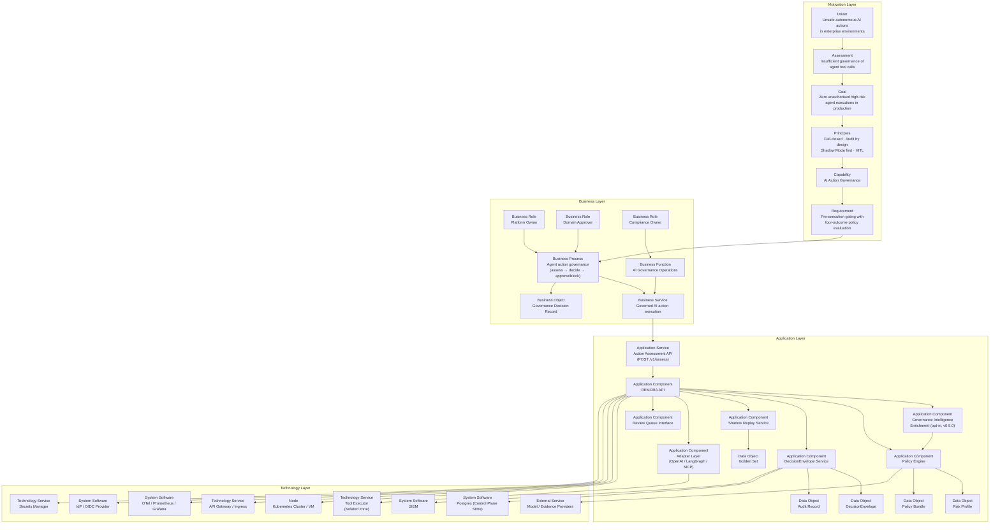
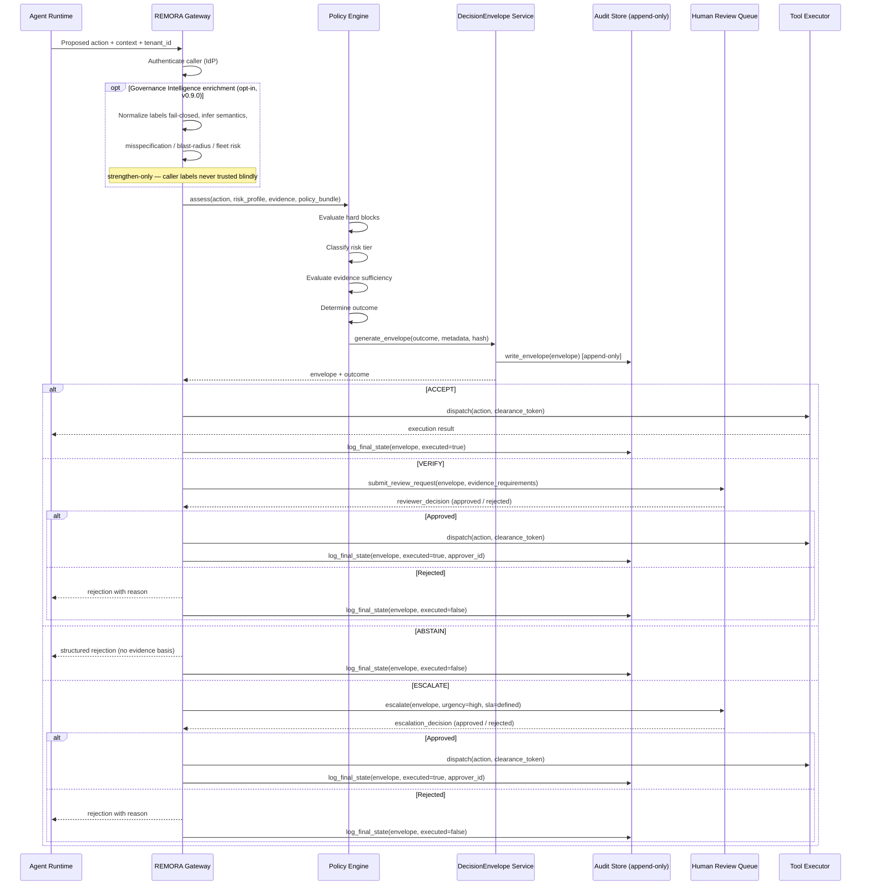
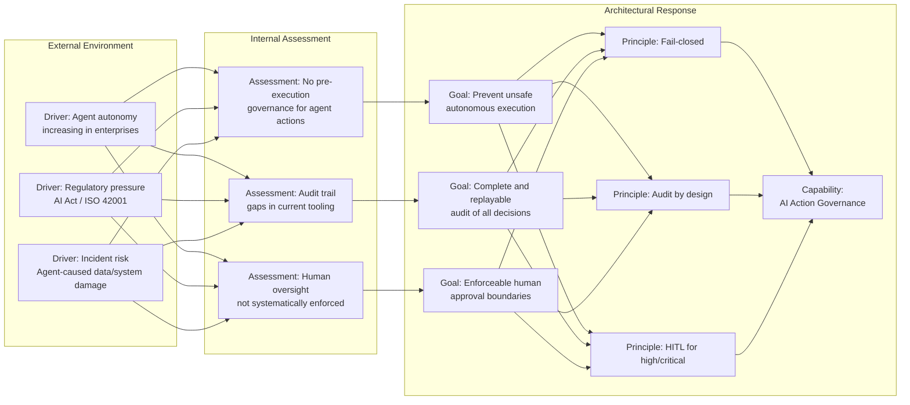
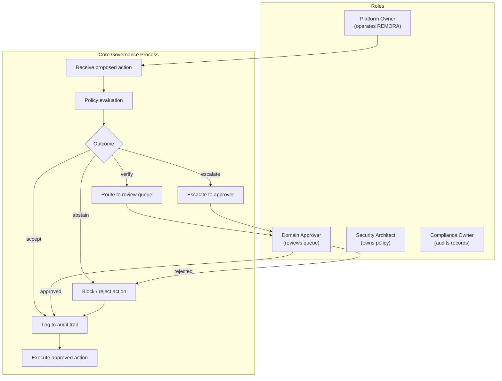
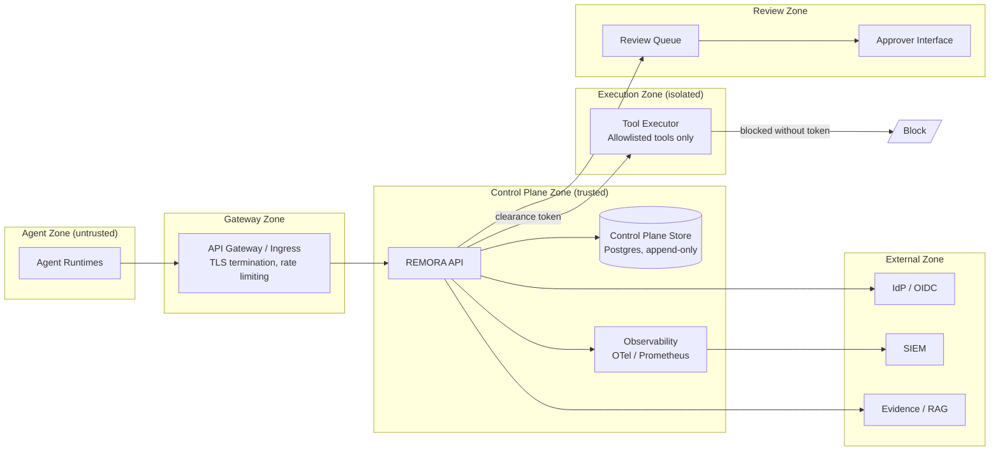

# ArchiMate-Style View — REMORA Governance Capability

**Status:** draft — not independently audited.
**Notation:** ArchiMate 3.x layer structure (Motivation, Business, Application, Technology)
expressed in Mermaid flowcharts. For native ArchiMate tooling, these diagrams should be
recreated in Archi or equivalent.
**Audience:** Enterprise architects, modelling teams.
**Companion:** [`solution_building_block.md`](solution_building_block.md),
[`deployment_architecture.md`](deployment_architecture.md)

---

## 1. Full Layered Overview

This diagram shows the complete ArchiMate-style view across all four layers.

---

## 2. Decision Flow (Sequence View)

---

## 3. Motivation View

---

## 4. Business Layer Detail

---

## 5. Application Layer — Component Relationships

| From | Relationship Type | To | Notes |
|---|---|---|---|
| Agent runtime | `TriggeringRelationship` | REMORA Adapter | Sends proposed action |
| REMORA Adapter | `ServingRelationship` | REMORA API | Wraps action as API call |
| REMORA API | `CompositionRelationship` | Policy Engine | API orchestrates policy evaluation |
| REMORA API | `CompositionRelationship` | Governance Intelligence Enrichment | Opt-in pre-policy enrichment (v0.9.0): fail-closed normalization, semantics, misspecification / blast-radius / fleet-risk signals, strengthen-only |
| Governance Intelligence Enrichment | `FlowRelationship` | Policy Engine | Enriched PolicyObservation; engine remains sole decision authority |
| Policy Engine | `AssignmentRelationship` | DecisionEnvelope Service | Engine produces envelope |
| DecisionEnvelope Service | `AssociationRelationship` | Control Plane Store | Envelope written append-only |
| DecisionEnvelope Service | `FlowRelationship` | SIEM | Audit events forwarded |
| Policy Engine | `AccessRelationship` | Evidence Connectors / RAG | Evidence retrieved for VERIFY |
| REMORA API | `AssociationRelationship` | IdP / OIDC | Caller and approver authenticated |
| Review Queue Interface | `ServingRelationship` | Domain Approver | Human review is served |
| Tool Executor | `TriggeringRelationship` | Target System | Approved action executes |
| Shadow Replay Service | `AccessRelationship` | Control Plane Store | Reads envelopes for replay |

---

## 6. Technology Layer — Network Topology

