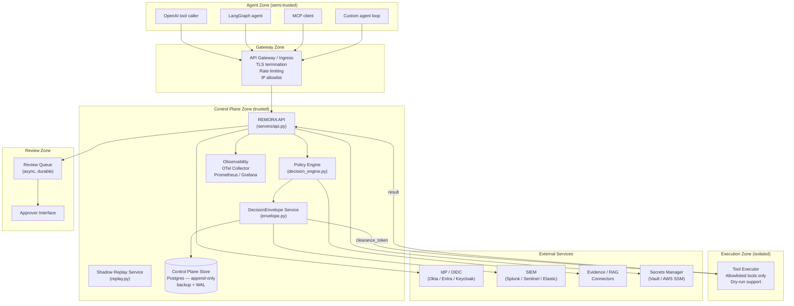
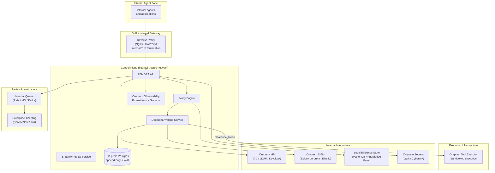
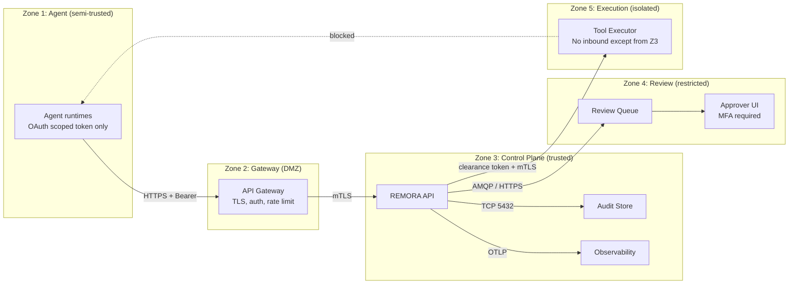
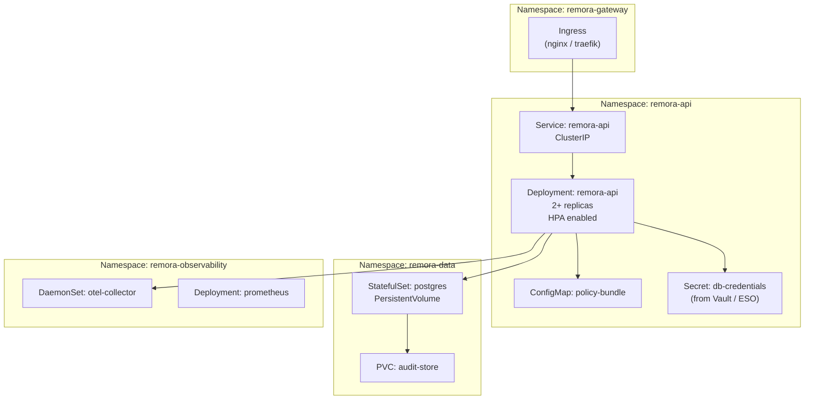

# Deployment Architecture — REMORA Enterprise

**Status:** draft — not independently audited. These are reference blueprints;
adapt to your organisation's infrastructure, security requirements, and cloud provider.
**Audience:** Infrastructure architects, platform engineers, security architects.
**Repository evidence:** `servers/api.py`, `remora/adapters/action_gate.py`,
`enterprise/deployment-runbook.md`, `enterprise/observability.md`,
`enterprise/remora-control-plane.md`, `examples/openai_tool_calling.py`,
`examples/langgraph_integration.py`, `servers/mcp_remora.py`
**Companion documents:**
- [`docs/deployment/azure-reference-architecture.md`](../deployment/azure-reference-architecture.md)
- [`docs/deployment/onprem-airgapped.md`](../deployment/onprem-airgapped.md)
- [`enterprise/deployment-runbook.md`](../../enterprise/deployment-runbook.md)

---

## 1. Architecture Principles for Deployment

These principles must be satisfied by any deployment topology:

| Principle | Requirement |
|---|---|
| Separation of zones | Agent runtimes, REMORA control plane, tool execution, and review must be in distinct network zones |
| Tool Executor isolation | Tool Executor must only accept requests carrying a valid REMORA clearance token; no direct agent access |
| Audit store durability | Control Plane Store must be durable, backed up, and append-only |
| Fail-closed on degradation | If the governance service is unavailable, agent actions must not proceed autonomously |
| Secrets management | API keys, token secrets, and database credentials must be in a dedicated secrets manager |
| Observability by default | All components must emit structured telemetry from day one |

---

## 2. Cloud / Hybrid Reference Architecture

This pattern is appropriate for organisations running agent workloads in a cloud
environment (AWS, Azure, GCP, or Cloudflare Workers AI) with an enterprise IdP.



### Component Requirements (Cloud)

| Component | Minimum Spec | Recommended Config |
|---|---|---|
| REMORA API | 2 vCPU, 2 GB RAM | 2+ replicas; rolling update; health check on `/v1/health` |
| Control Plane Store | Postgres 14+ | Managed service with automated backups; WAL enabled; point-in-time recovery |
| Review Queue | Any durable queue | SQS / PubSub / RabbitMQ; dead-letter queue configured |
| Observability | OTel Collector | Forward metrics to Prometheus; traces to Jaeger/Tempo; logs to SIEM |
| API Gateway | TLS 1.2+ | mTLS between gateway and REMORA API; rate limiting; WAF |
| Tool Executor | Isolated container | No inbound internet access; clearance token validation required |
| Secrets Manager | Cloud-native | Vault (HashiCorp) or cloud-native (AWS SSM / Azure Key Vault) |

---

## 3. On-Premises / Air-Gapped Architecture

This pattern is appropriate for organisations with strict data residency requirements,
air-gapped environments, or regulated sectors that prohibit external AI service calls.



### Air-Gapped Considerations

| Concern | Mitigation |
|---|---|
| External model providers | Use on-premises LLM (Ollama, vLLM, or enterprise inference server) |
| External evidence / RAG | Use local vector database (Qdrant, pgvector) loaded with approved knowledge |
| External IdP | Use on-prem Active Directory with OIDC bridge (Keycloak) |
| Package updates | Mirror required Python packages in an internal artifact registry |
| Time synchronisation | Ensure NTP is configured — audit timestamps require accurate clock |

---

## 4. Network Zoning Detail



### Firewall Rules Summary

| Source Zone | Destination Zone | Port / Protocol | Purpose |
|---|---|---|---|
| Agent (Z1) | Gateway (Z2) | 443 / HTTPS | Agent to governance API |
| Gateway (Z2) | Control Plane (Z3) | 443 / mTLS | Gateway to REMORA API |
| Control Plane (Z3) | Audit Store (Z3) | 5432 / TCP | Envelope writes |
| Control Plane (Z3) | Review Zone (Z4) | 443 / HTTPS or AMQP | Queue submission |
| Control Plane (Z3) | Execution (Z5) | 443 / mTLS | Approved action dispatch |
| Control Plane (Z3) | External / Internal IdP | 443 / HTTPS | OIDC token validation |
| Control Plane (Z3) | SIEM | 514 / syslog or 8088 / HTTPS | Audit event forwarding |
| All zones | Secrets Manager | 443 / HTTPS | Secrets retrieval |
| **Denied** | Agent (Z1) → Execution (Z5) | All | Direct bypass prevention |
| **Denied** | Execution (Z5) → Control Plane (Z3) | All except response | Lateral movement prevention |

---

## 5. Kubernetes Deployment Pattern

This section describes the target Kubernetes deployment. Note that no Kubernetes
manifests are shipped in the current repository — this is a reference pattern.



### Recommended Resource Limits

| Component | CPU Request | CPU Limit | Memory Request | Memory Limit |
|---|---|---|---|---|
| REMORA API (per replica) | 250m | 1000m | 256Mi | 512Mi |
| Postgres | 500m | 2000m | 1Gi | 4Gi |
| OTel Collector (per node) | 100m | 500m | 128Mi | 256Mi |

### Health and Readiness Probes

```yaml
# REMORA API
livenessProbe:
  httpGet:
    path: /v1/health
    port: 8000
  initialDelaySeconds: 10
  periodSeconds: 30
readinessProbe:
  httpGet:
    path: /v1/health
    port: 8000
  initialDelaySeconds: 5
  periodSeconds: 10
```

---

## 6. Fail-Closed Production Conditions

As implemented in `servers/api.py`, REMORA will refuse to enter production enforcement
mode unless all three conditions are satisfied at startup:

| Condition | Check | Consequence if missing |
|---|---|---|
| Authentication enabled | `REMORA_AUTH_ENABLED=true` and valid token configured | Stays in development mode; blocks production start |
| Persistent store connected | Postgres reachable and schema initialised | Fails to start; structured error logged |
| Non-mock oracle backend | `REMORA_ORACLE_BACKEND` is not `mock` | Stays in development mode; blocks production start |

These checks should be monitored via `/v1/health` and alerted on in the SIEM.

---

## 7. Observability Stack

Key metrics to instrument and alert on:

| Metric | Type | Alert Threshold | Source |
|---|---|---|---|
| `remora_decisions_total` | Counter (by outcome) | N/A (trend) | Policy Engine |
| `remora_decision_latency_ms` | Histogram (p50/p95/p99) | p99 > 500ms | REMORA API |
| `remora_escalation_rate` | Gauge | > 15% sustained | Policy Engine |
| `remora_audit_completeness` | Gauge | < 99% | Envelope Service |
| `remora_hash_chain_failures` | Counter | > 0 | Replay Engine |
| `remora_bypass_attempts` | Counter | > 0 | Tool Executor / SIEM |
| `remora_store_write_failures` | Counter | > 0 | Envelope Service |
| `remora_review_queue_depth` | Gauge | > SLA threshold | Review Queue |
| `remora_review_sla_breaches` | Counter | > 0 | Review Queue |
| `remora_mode` | Enum (shadow/enforcing) | Unexpected change | API |

See `enterprise/observability.md` for the complete observability specification.

---

## 8. Secrets Management

| Secret | Purpose | Rotation |
|---|---|---|
| `REMORA_API_TOKEN` | Authenticates agent-to-REMORA API calls | Rotate every 90 days; invalidate immediately on suspected compromise |
| `REMORA_DB_PASSWORD` | Control Plane Store connection | Rotate every 90 days |
| `REMORA_ORACLE_API_KEY` | External evidence/model service | Rotate per provider policy |
| `REMORA_IDP_CLIENT_SECRET` | OIDC client secret for IdP integration | Rotate every 180 days |

All secrets must be stored in a dedicated secrets manager (HashiCorp Vault, AWS SSM,
Azure Key Vault, or equivalent). They must never be present in environment variable
files committed to source control, Kubernetes ConfigMaps, or log output.

**Critical:** The CLAUDE.md non-negotiable prohibits printing or writing values of
`CF_AIG_TOKEN`, `CF_AI_GATEWAY_KEY`, `CLOUDFLARE_API_TOKEN`, `OPENAI_API_KEY`,
`HF_TOKEN`, or `GROQ_API_KEY`. Apply the same principle to all REMORA secrets.

---

## 9. High Availability and Disaster Recovery

| Component | HA Pattern | RTO Target | RPO Target |
|---|---|---|---|
| REMORA API | 2+ replicas, rolling update | < 30 seconds | N/A (stateless) |
| Control Plane Store | Postgres streaming replication + automated backups | < 5 minutes | < 1 minute |
| Review Queue | Durable queue with dead-letter queue | < 1 minute | Zero (durable) |
| Observability | DaemonSet + remote write | < 5 minutes | < 5 minutes |

**Note:** Current repository does not ship HA/DR configuration. This is a documented
gap in `enterprise/production-readiness.md` Stage 4. Teams deploying to production
must implement HA/DR as part of infrastructure provisioning.
