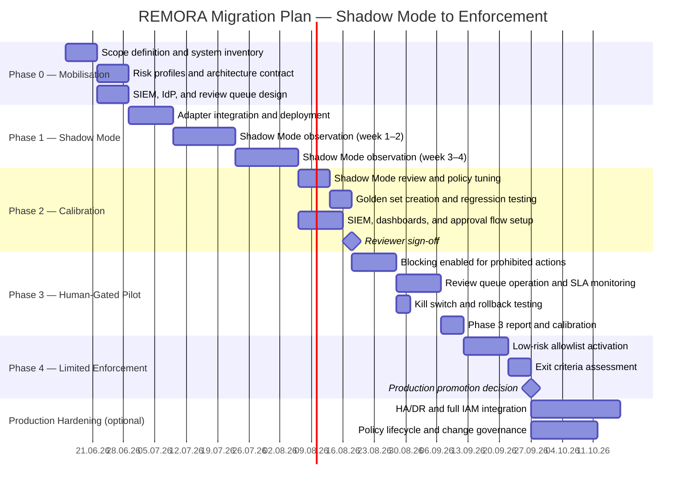
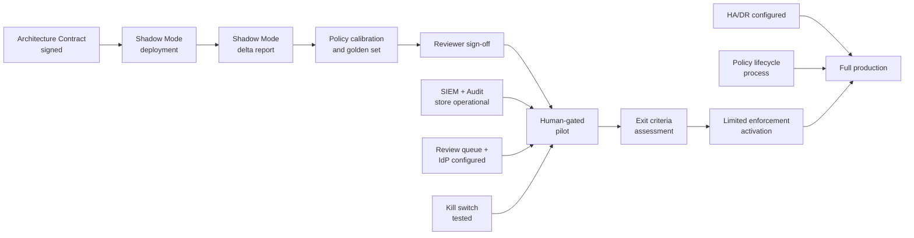

# Migration Plan — REMORA from Shadow Mode to Production Enforcement

**Status:** draft — not independently audited. Timeline is indicative; calibrate to
organisation's specific context, team capacity, and workflow complexity.
**Audience:** Programme managers, enterprise architects, platform owners.
**Repository evidence:** `enterprise/production-readiness.md` (Stage 0–4),
`enterprise/deployment-runbook.md`
**Companion documents:** [`enterprise_pilot_playbook.md`](enterprise_pilot_playbook.md),
[`risk_register.md`](risk_register.md), [`architecture_contract_template.md`](architecture_contract_template.md)

---

## 1. Migration Roadmap (Gantt)

This plan covers a single agent workflow from mobilisation to limited enforcement.
Parallel onboarding of additional workflows can begin during the Calibration phase.



---

## 2. Indicative Timeline

| Phase | Indicative Duration | Cumulative | Key Gate |
|---|:---:|:---:|---|
| Phase 0 — Mobilisation | ~2 weeks | ~2 weeks | Signed Architecture Contract |
| Phase 1 — Shadow Mode | ~4 weeks | ~6 weeks | Shadow Mode governance delta report |
| Phase 2 — Calibration | ~2 weeks | ~8 weeks | Reviewer sign-off; golden set passing |
| Phase 3 — Human-Gated Pilot | ~4 weeks | ~12 weeks | Zero critical autonomous executions |
| Phase 4 — Limited Enforcement | ~3 weeks | ~15 weeks | All exit criteria met |
| Production Hardening (if required) | ~4 weeks | ~19 weeks | Full production readiness checklist |

**Total to limited enforcement:** approximately 15 weeks for a single, moderately complex workflow.

Factors that extend this timeline:
- Complex multi-tool workflows with poorly understood action patterns
- IdP/OIDC integration requiring significant infrastructure work
- Regulatory review requirements (e.g., mandatory DPIA under AI Act)
- Organisations without an existing SIEM or review queue infrastructure

Factors that compress this timeline:
- Simple single-tool workflows with well-defined risk profiles
- Existing enterprise gateway infrastructure that can host REMORA
- Well-staffed review queues with fast approval SLAs

---

## 3. Transition Architectures

### T0 — Shadow Mode (Observe Only)

No blocking. All proposed actions are evaluated and logged, but the agent runtime
receives ACCEPT and proceeds regardless of the policy outcome.

```
Agent Runtime
    │
    ▼
REMORA Adapter (observe-only mode)
    │── assess(action) ──► Policy Engine ──► DecisionEnvelope ──► Audit Store
    │
    ▼
Tool Executor (unblocked — no clearance token required)
    │
    ▼
Target System
```

**Characteristics:**
- Zero operational risk
- Full governance visibility
- Agent behaviour is unchanged
- Audit trail is built from day one

---

### T1 — Human-Gated

Blocking is enabled for explicitly prohibited action types. All VERIFY and ESCALATE
outcomes are routed to the human review queue. Tool Executor requires a clearance token
for all action types.

```
Agent Runtime
    │
    ▼
REMORA Adapter (enforcing mode)
    │── assess(action) ──► Policy Engine
                                │
               ┌────────────────┼──────────────────┐
               ▼                ▼                  ▼
           ACCEPT           VERIFY /           ABSTAIN
               │           ESCALATE                │
               │               │                   ▼
               │               ▼              Structured
               │         Review Queue          Rejection
               │               │
               │        Human Approver
               │               │
               │    ┌──────────┴────────────┐
               │    │ Approved              │ Rejected
               ▼    ▼                       ▼
    Tool Executor (clearance token)    Structured Rejection
               │
               ▼
        Target System
```

**Characteristics:**
- Blocking for prohibited action types only
- Human approval required for all VERIFY / ESCALATE
- All mutable actions in dry-run or sandbox
- Review queue SLA must be operational

---

### T2 — Limited Low-Risk Enforcement

Low-risk, explicitly allowlisted actions are auto-accepted. High- and critical-risk
actions remain on the human-gated path. Read-only operations are fully automated.

```
Agent Runtime
    │
    ▼
REMORA Adapter (enforcing mode)
    │── assess(action) ──► Policy Engine
                                │
         ┌──────────────────────┼──────────────────┐
         ▼                      ▼                  ▼
    ACCEPT (low-risk       VERIFY / ESCALATE   ABSTAIN
    allowlist only)         (human-gated)           │
         │                      │                   ▼
         ▼                Review Queue         Structured
  Tool Executor                 │               Rejection
  (direct dispatch)      Human Approver
                                │
                     ┌──────────┴──────────┐
                     │ Approved            │ Rejected
                     ▼                     ▼
              Tool Executor           Structured
              (clearance token)        Rejection
```

---

### T3 — Full Production (Target State)

Full enforcement with automated accept for allowlisted actions, mandatory human
approval for high/critical, complete audit trail, SIEM integration, and policy
lifecycle governance.

*(This transition architecture is not time-bounded — it represents the target state
after production hardening is complete.)*

---

## 4. Dependency Map



---

## 5. Rollback Procedures

### Immediate Rollback (< 5 minutes)

Trigger: False accept rate spike, review queue overload, security incident,
operational impact from incorrect block.

```
1. Set REMORA_MODE=shadow in environment configuration
2. Restart API (rolling restart if Kubernetes)
3. Confirm /v1/health reports shadow mode active
4. Notify enterprise architect and security architect
5. Do not re-enable enforcement without sign-off
```

### Partial Rollback (specific action type)

Trigger: A specific action type is producing incorrect decisions.

```
1. Remove the action type from the allowlist / blocking policy
2. Run policy regression test against golden set
3. Deploy updated policy bundle
4. Monitor for 24h before re-enabling
```

### Full Rollback (remove REMORA from workflow)

Trigger: Fundamental integration failure or irreconcilable policy conflict.

```
1. Disable adapter integration for affected workflow
2. Ensure Tool Executor reverts to direct-access mode
3. Preserve all audit store data — do not delete
4. Document root cause; schedule remediation review
5. Maintain Shadow Mode observation if possible
```

---

## 6. Production Readiness Stages

Mapping to `enterprise/production-readiness.md`:

| Stage | Description | This Plan Phase |
|---|---|---|
| Stage 0 | Development / local | Pre-Phase 0 |
| Stage 1 | Shadow Mode / observe only | Phase 1 |
| Stage 2 | Human-gated / no autonomous execution | Phase 3 |
| Stage 3 | Limited enforcement / low-risk only | Phase 4 |
| Stage 4 | Full production / all controls operational | Production Hardening |
