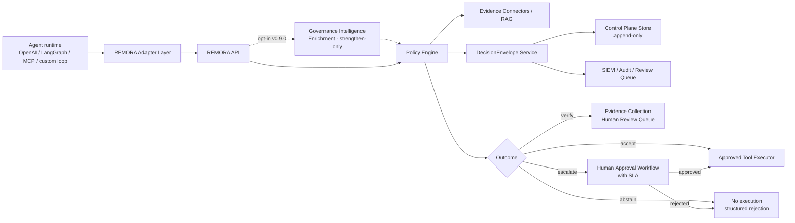

# Solution Building Block — REMORA Governance Control Plane

**Status:** draft — not independently audited.
**TOGAF Type:** Solution Building Block (SBB) — concrete software realising the ABB.
**Realises:** [`architecture_building_block.md`](architecture_building_block.md)
**Repository evidence:** `servers/api.py`, `remora/adapters/action_gate.py`,
`remora/policy/decision_engine.py`, `remora/governance/envelope.py`,
`remora/shadow/replay.py`, `remora/adapters/storage/control_plane.py`,
`examples/openai_tool_calling.py`, `examples/langgraph_integration.py`,
`servers/mcp_remora.py`

---

## 1. Name

**REMORA Governance Control Plane**

---

## 2. Component Inventory

### 2.1 API Gateway / REMORA API

**File:** `servers/api.py`

The single entry point for all governance requests. Provides:
- `/v1/assess` — evaluate a proposed action and return a `DecisionEnvelope`
- `/v1/health` — health check for monitoring and load balancer integration
- `/v1/control-plane/*` — tenant-scoped control plane management endpoints
- Authentication enforcement (fail-closed: production mode requires valid auth)
- Tenant routing and request validation
- Fail-closed production mode: auth, persistent store, and non-mock oracle backend
  must all be present before production mode is activated

### 2.2 Policy Engine

**Files:** `remora/policy/decision_engine.py`, `remora/policy/observation.py`, `remora/policy/report.py`

Implements the conservative decision tree:
1. Hard blocks evaluated first (action type, environment, policy flags)
2. Risk profile classification
3. Evidence sufficiency evaluation
4. Uncertainty and context signals
5. Final routing to ACCEPT / VERIFY / ABSTAIN / ESCALATE

The engine is deterministic for a given policy bundle and observation set, enabling
replay reproducibility.

#### 2.2.1 Governance Intelligence Enrichment (opt-in, v0.9.0)

**Files:** `remora/governance_intelligence/` (normalization, action semantics,
misspecification, causal consequence, policy generalization, enrichment)

Deterministic pre-policy enrichment that hardens the engine against mislabelled
or underspecified caller metadata: fail-closed normalization (unknown stays
unknown), action-semantics extraction from the proposed action itself,
misspecification-risk inference, blast-radius/expected-loss signals, and
fleet-level policy-generalization risk. Signals merge under a strengthen-only
rule; a 2,160-combination property test verifies enrichment never converts a
rejection into an acceptance. Entry point: `remora.policy.enrich_then_decide()`.
Benchmark artifact: `artifacts/governance_intelligence/evaluation_results.json`
(0.0% unsafe accepts, 100% legitimate-read acceptance, 50 deterministic tasks).

### 2.3 DecisionEnvelope Service

**File:** `remora/governance/envelope.py`

Produces the canonical audit contract for every decision. Current fields include
decision outcome, action description, risk level, evidence signals, policy context,
and hash chain linkage.

**Implemented in `AuditBlock` (v0.8.0+):** `schema_version`, `timestamp_utc`
(timezone-aware), `tenant_id`, `actor_identity`, `policy_bundle_hash`,
`tool_args_hash`, `data_classification`, `retention_policy`, plus per-tenant
hash chaining (`previous_hash`) and optional HMAC signing
(`REMORA_ENVELOPE_SIGNING_KEY`).

**Remaining gaps (roadmap, documented in the AuditBlock docstring):**
- `approver_identity` OIDC binding — human approval non-repudiation
- Detached KMS/HSM signature for high-assurance environments
- RFC 3161 trusted timestamping

### 2.4 Shadow Mode / Replay Engine

**Files:** `remora/shadow/replay.py`, `scripts/shadow_replay.py`

Provides:
- Observe-only mode for safe pre-enforcement adoption
- Hash chain generation and verification (`verify_envelope_hash_chain()`)
- Governance delta report generation from logged action sequences
- Replay of past decisions from stored envelopes for audit and calibration

### 2.5 Adapter Layer

**Files:**
- `remora/adapters/action_gate.py` — generic action gate adapter
- `examples/openai_tool_calling.py` — OpenAI tool-call interception
- `examples/langgraph_integration.py` — LangGraph node integration
- `servers/mcp_remora.py` — MCP (Model Context Protocol) server integration

Each adapter intercepts proposed actions before dispatch and routes them through
the REMORA API. The gateway pattern ensures REMORA operates transparently from
the agent runtime's perspective.

### 2.6 Control Plane Store

**File:** `remora/adapters/storage/control_plane.py`

Tenant-scoped persistent storage for:
- Decision envelopes (append-only)
- Policy bundles (versioned)
- Approval records
- Shadow Mode action logs
- Golden sets for regression

Designed for append-only writes on audit records. Supports Postgres in production;
in-memory store for development and testing.

### 2.7 Enterprise Policy and Controls

**Files:**
- `enterprise/policy-model.md` — risk tier definitions and policy routing rules
- `enterprise/risk-profiles.yaml` — LOW / MEDIUM / HIGH / CRITICAL risk profiles
- `enterprise/human-approval-workflow.md` — approval flow, roles, SLA definitions
- `enterprise/observability.md` — metrics, SLOs, and monitoring design
- `enterprise/threat-model.md` — threat model for the governance control plane

---

## 3. Component Interaction Diagram



---

## 4. API Contract Summary

### `POST /v1/assess`

**Request:**
```json
{
  "action": {
    "type": "tool_call",
    "tool": "write_file",
    "arguments": { "path": "/etc/hosts", "content": "..." }
  },
  "context": {
    "tenant_id": "org-123",
    "environment": "production",
    "risk_hint": "high"
  }
}
```

**Response:**
```json
{
  "outcome": "escalate",
  "envelope_id": "env-abc123",
  "reason": "Production write on sensitive system path",
  "policy_version": "v2.1.0",
  "required_approver_role": "platform-owner",
  "hash": "sha256:..."
}
```

### `GET /v1/health`

Returns operational status, mode (shadow / enforcing), and store connectivity.

---

## 5. Fail-Closed Production Conditions

As implemented in `servers/api.py`, REMORA will not enter production enforcement mode unless:

1. Authentication is enabled and a valid token is provided
2. A persistent (non-in-memory) store is configured and reachable
3. A non-mock oracle backend is configured

If any condition is unmet, the API either refuses to start in production mode or
degrades to Shadow Mode and logs a structured warning.

---

## 6. Runtime Integration Patterns

| Runtime | Integration Pattern | File |
|---|---|---|
| OpenAI tool calling | Pre-dispatch hook wraps `tool_calls` loop | `examples/openai_tool_calling.py` |
| LangGraph | REMORA node inserted before tool execution node | `examples/langgraph_integration.py` |
| MCP (Model Context Protocol) | REMORA runs as MCP server; tools are proxied | `servers/mcp_remora.py` |
| Custom agent loop | Generic `ActionGate.assess()` call before any tool dispatch | `remora/adapters/action_gate.py` |

---

## 7. Enterprise Gaps and Remediation Plan

| Gap | Current State | Impact | Remediation |
|---|---|---|---|
| Envelope `schema_version` missing | Not present in current `DecisionEnvelope` | Cannot track schema changes in long-lived audit stores | Add versioned schema field; bump on breaking changes |
| `tenant_id` not in envelope | Tenant routing exists in API but not recorded in envelope | Multi-tenant audit attribution fails | Add mandatory `tenant_id` to `DecisionEnvelope` |
| `actor_identity` not in envelope | Caller identity not persisted in decision record | Cannot attribute decisions to service principals | Bind OIDC token claims to envelope at decision time |
| `policy_bundle_hash` not in envelope | Policy version is stored separately | Cannot prove which policy governed a specific decision | Sign and hash policy bundle at load time; embed in envelope |
| `approver_identity` in approval records | Partial implementation | Non-repudiation for human approvals is weak | Bind OIDC identity of approver to approval record |
| Data classification absent | No field in envelope or control plane store | GDPR retention and access control cannot be applied | Add `data_classification` and `retention_policy` to envelope |
| No detached signature | Hash chain is software-only | Tamper-evidence can be defeated by storage-layer compromise | Evaluate HSM/KMS signing for critical decision classes |
| No complete cloud/on-prem reference architecture | Deployment blueprints exist but are not consolidated | Enterprise architects lack a single-source reference | See [`deployment_architecture.md`](deployment_architecture.md) |
| No OIDC/SAML integration in reference implementation | Documented as requirement but not shipped in core | Production identity binding requires additional integration work | Documented in `enterprise/production-readiness.md` Stage 4 |
| Tool allowlist not enforced centrally | Documented in `enterprise/tool-governance.md` | Agents could call unlisted tools | Implement allowlist enforcement in API gateway layer |
