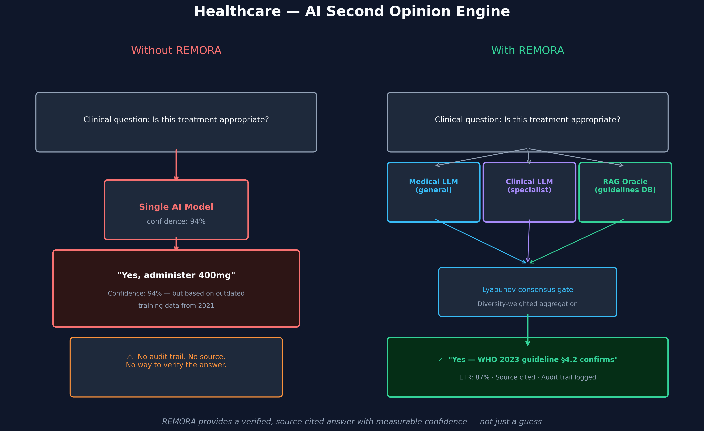

# Healthcare — AI Second Opinion Engine

> **Who this is for:** Hospital administrators, clinical informaticists,
> health technology officers, and anyone evaluating AI for clinical decision support.

---

## The scenario

A hospital uses an AI assistant to help clinicians check treatment decisions —
dosages, drug interactions, contraindications.

A doctor asks: *"Is 400mg ibuprofen appropriate for this patient given their kidney history?"*

The AI answers immediately with 94 % confidence: *"Yes."*

**The problem:** That confidence number does not mean the answer is correct.
It means the model is statistically consistent with patterns in its training data —
data that may be three years old and does not reflect updated guidelines.

---

## What goes wrong without REMORA

Without a verification layer:

- **Single model, single opinion.** No cross-checking.
- **Outdated knowledge.** If guidelines changed after the training cutoff, the AI doesn't know.
- **No source.** The AI cannot tell you *where* it got the answer from.
- **No audit trail.** If the decision causes harm, there is no record of what information was used.
- **Overconfidence.** 94 % confidence can mean "I've seen something like this before" — not "I checked the current guideline."

---

## How REMORA handles it

REMORA replaces the single AI with an evidence-gathering system:

**Step 1 — Router gate**
Before doing anything expensive, REMORA checks: do our medical oracles already agree strongly on this question? If yes, it returns immediately. If there is any uncertainty, it escalates.

**Step 2 — Specialist oracles**
Three different AI oracles assess the question independently:
- A general medical LLM (broad knowledge)
- A clinical specialist LLM (trained on medical literature)
- A RAG oracle that retrieves from the clinical guidelines database in real time

**Step 3 — Conflict detection**
REMORA measures how much the oracles agree. If one says "yes" and another says "check the kidney function first", that disagreement is captured — not smoothed over.

**Step 4 — Evidence fusion**
The final answer requires:
- Most oracles agree
- The answer is backed by retrieved source (guideline text, article)
- No serious contradictions in the evidence

**Step 5 — Audit trail**
Every answer is logged: which oracles were consulted, what sources were retrieved, what the confidence level was, and what the Effective Truth Rate (ETR) score is.

---

## What the answer looks like

**Without REMORA:**
> *"Yes — 400mg ibuprofen is appropriate."*
> Confidence: 94 % | Source: none | Audit: none

**With REMORA:**
> *"Caution advised. WHO 2023 guideline §4.2 recommends dose reduction for patients with GFR < 30. Current dosage may exceed safe threshold."*
> ETR: 87 % | Source: WHO Essential Medicines 2023, §4.2 | Audit: logged

---

## The measurable value

| Metric | Without REMORA | With REMORA |
|--------|---------------|-------------|
| Source citation | Never | Every answer |
| Audit trail | None | Full log |
| Outdated data risk | High | Low (RAG retrieves current) |
| Abstention when uncertain | Never | Yes — flags for human review |
| Calibrated confidence | No | ETR score on every answer |

---

## Important limitation

REMORA is a **decision support tool**, not a replacement for clinical judgment.
Its value is in making the AI's reasoning transparent and checkable —
not in automating clinical decisions without human oversight.

*For technical details, see [`remora/oracles/cloudflare_rag.py`](../../remora/oracles/cloudflare_rag.py)
and the [RAG oracle documentation](../rag_oracle.md).*
