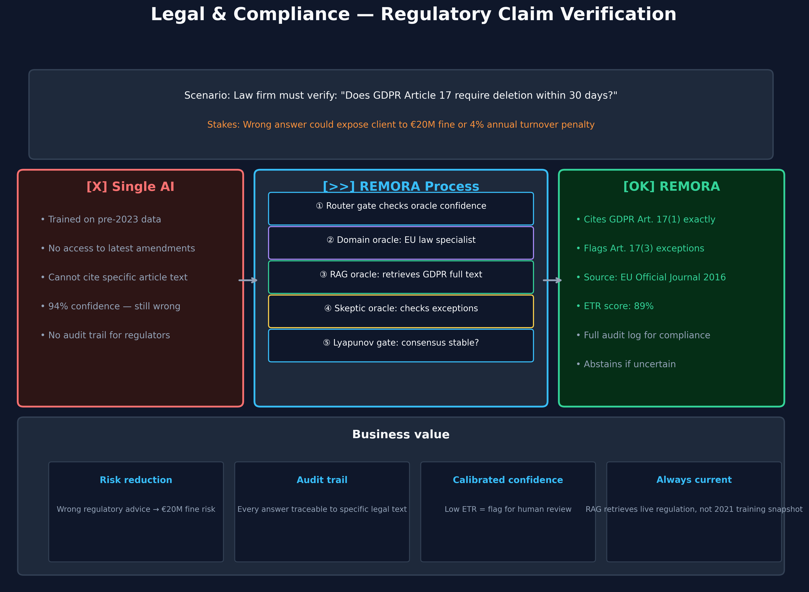

# Legal & Compliance — Regulatory Claim Verification

> **Who this is for:** Legal professionals, compliance officers, general counsel,
> and anyone using AI to interpret regulations.

---

## The scenario

A law firm is advising a client on GDPR obligations. The question:

*"Does Article 17 of the GDPR require personal data to be deleted within 30 days of a deletion request?"*

The wrong answer could expose the client to a fine of up to **€20 million**
or **4 % of annual global turnover** — whichever is higher.

---

## What goes wrong without REMORA

A standard AI assistant:

- Was trained on legal texts from a specific point in time. Regulatory guidance evolves.
- Cannot cite the specific article number and paragraph it is drawing from.
- Cannot distinguish between what a regulation *says* and what legal commentators *think it says*.
- Presents a confident answer with no way to audit the reasoning.
- Has no mechanism to flag when it is uncertain versus when it is confident.

**A 94 % confident wrong answer is worse than "I'm not sure."**
It leads teams to act on incorrect information without questioning it.

---

## How REMORA handles it

**Step 1 — Router gate**
REMORA runs a quick pre-check: does the question have a clear, stable answer? Regulation interpretation often does not. The router escalates to deep analysis.

**Step 2 — Domain oracle (EU law specialist)**
An oracle with legal domain expertise assesses the question from a regulatory interpretation perspective, including possible exceptions and interpretive nuance.

**Step 3 — RAG oracle (retrieves the actual regulation)**
REMORA retrieves the exact text of GDPR Article 17 from a curated regulatory corpus — the EU Official Journal text, not a summary or commentary. The answer is grounded in the primary source.

**Step 4 — Skeptic oracle**
A dedicated oracle specifically looks for exceptions, conditions, and situations where the general rule does not apply. Article 17(3) lists six exceptions to the right to erasure — the skeptic catches these.

**Step 5 — Lyapunov stability gate**
REMORA checks: are all the oracles converging on the same interpretation? If one says "30 days" and another says "no specific timeframe is specified", that disagreement triggers further analysis rather than premature commitment.

**Step 6 — ETR scoring and source citation**
The final answer includes:
- The specific article and paragraph cited
- The version of the regulation consulted (with date)
- An ETR score indicating how robustly the answer is supported
- A flag if any exceptions were identified

---

## What the answer looks like

**Without REMORA:**
> *"Yes, GDPR requires deletion within 30 days."*
> Confidence: 89 % | Source: none | Audit: none

**With REMORA:**
> *"GDPR Article 17 does not specify a 30-day timeframe. Article 17(1) requires deletion 'without undue delay', which case law and the European Data Protection Board interpret as typically 1 month (30 days) under Article 12(3). However, Article 17(3) provides six exceptions including freedom of expression, public health, and legal claims. Review applies."*
> ETR: 91 % | Source: GDPR Regulation (EU) 2016/679, Art. 17; EDPB Guidelines 01/2022 | Audit: logged

---

## The measurable value

| Metric | Without REMORA | With REMORA |
|--------|---------------|-------------|
| Source cited | Never | Specific article + paragraph |
| Exceptions flagged | Rarely | Systematically |
| Audit trail | None | Full log for regulators |
| Uncertainty disclosed | Never | ETR score + abstention when unclear |
| Time to verify | Hours of manual research | Minutes |

---

## When REMORA abstains

If the regulatory question is in an area where the corpus does not have current coverage —
for example, a newly issued national guidance note not yet ingested —
REMORA returns a low ETR score and recommends human expert review
rather than producing a weakly-supported answer.

*For technical details, see [`remora/oracles/cloudflare_rag.py`](../../remora/oracles/cloudflare_rag.py)
and the ingest scripts in [`scripts/ingest_corpus.py`](../../scripts/ingest_corpus.py).*
