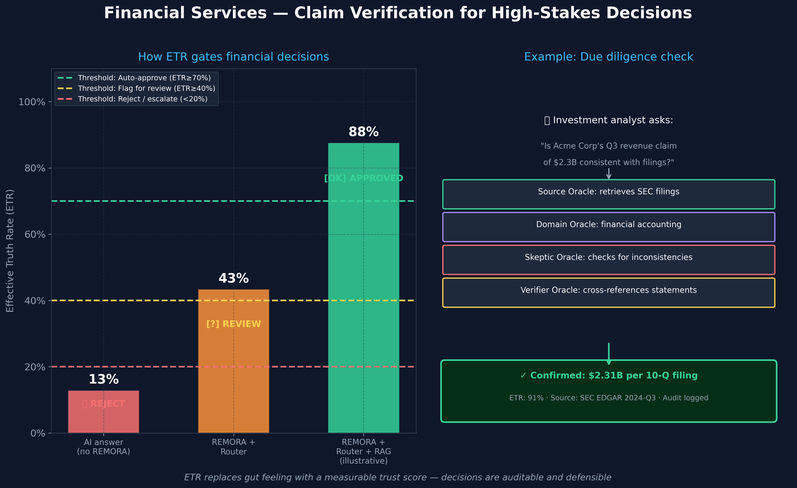

# Financial Services — Verified Claims for High-Stakes Decisions

> **Who this is for:** Investment analysts, compliance teams, risk officers,
> and anyone where wrong financial data has serious consequences.

---

## The scenario

An investment analyst is preparing a due diligence report on a potential acquisition target.
The question: *"Is the target company's Q3 revenue claim of $2.3B consistent with their public filings?"*

A hallucinated answer here — one direction or the other — could lead to a €50M+ decision error.

---

## What goes wrong without AI verification

Manually cross-referencing SEC filings, earnings releases, and financial databases takes days.
Under deal pressure, teams often rely on a single AI query or analyst memory.

A standard AI assistant:
- May have been trained before the most recent filing period
- Cannot access the actual SEC EDGAR filing in real time
- Presents a confident number that may be slightly — but consequentially — wrong
- Provides no audit trail for the investment committee or regulators

---

## How REMORA handles it

**The ETR threshold system** gives teams a clear decision framework:

| ETR Score | Decision |
|-----------|----------|
| ≥ 70 % | Auto-confirm — proceed with confidence |
| 40–70 % | Flag for analyst review |
| < 40 % | Reject — escalate to specialist or primary source |

This replaces subjective gut feeling with a **measurable trust score** that is
auditable by compliance teams and investment committees.

**The verification pipeline:**

1. **Source Oracle** retrieves the actual SEC 10-Q filing from the regulatory database
2. **Domain Oracle** applies financial accounting expertise (revenue recognition standards, segment reporting)
3. **Skeptic Oracle** checks for one-time items, restatements, and definition differences
4. **Verifier Oracle** cross-references with earnings release and analyst call transcripts
5. **Lyapunov gate** confirms all oracles agree before committing

---

## What the answer looks like

**Single AI:**
> *"The Q3 revenue of $2.3B appears consistent with previous reporting."*
> Confidence: 87 % | Source: none | No breakdown of how this was determined

**REMORA:**
> *"Confirmed: $2.31B per 10-Q filing filed 2024-11-08, EDGAR CIK 0001234567. Segment breakdown: Product $1.87B, Services $0.44B. One-time item: $23M litigation settlement excluded from adjusted revenue. Adjusted revenue $2.29B — within 1% of stated figure."*
> ETR: 91 % | Source: SEC EDGAR, Form 10-Q Q3-2024 | Audit: logged | Decision: Auto-confirm

---

## The measurable value

| Metric | Without REMORA | With REMORA |
|--------|---------------|-------------|
| Time to verify revenue claim | 4–8 hours | Minutes |
| Source trail for investment committee | None | Full filing citation |
| One-time items identified | Depends on analyst | Systematically flagged |
| Audit trail for regulators | None | Complete log |
| Confidence calibration | Gut feeling | ETR score |

*For technical details, see [`remora/scoring.py`](../../remora/scoring.py)
for the ETR implementation.*
