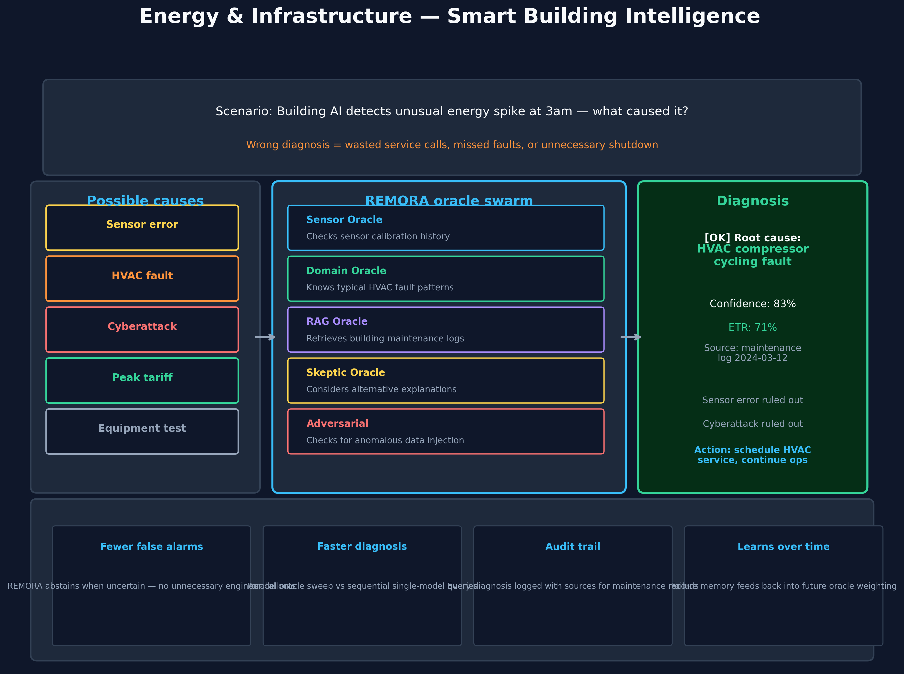

# Energy & Infrastructure — Smart Building Intelligence

> ⚠️ **Scope: illustrative scenario, not a deployment result.** REMORA is a
> research-grade governance overlay in **SHADOW_ONLY** mode — it is not
> production-certified and has not been deployed in the sector below. The
> walkthrough and any numbers in it are **illustrative** unless they link to a
> committed artifact in `results/` or `artifacts/`; they are not measured
> outcomes. REMORA governs whether a proposed **action** may proceed
> (ACCEPT/VERIFY/ABSTAIN/ESCALATE); it does not certify truth and is not a
> fact-checker. **ETR** ("Effective Truth Rate" — `remora/scoring.py`) is an *illustrative* narrative
> score in these documents only — it is **not** one of REMORA's canonical
> outputs and appears in no claim in `docs/assurance/claim_register_v1.yaml`.
> See the [claim register](../assurance/claim_register_v1.yaml) and
> [evidence summary](../02-evidence-and-claims.md) for governed claims.

> **Who this is for:** Building operators, energy managers, facility directors,
> and IoT platform developers — particularly relevant for EOS and Luftfiber use cases.

---

## The scenario

A building management system detects an unusual energy spike at 3am —
power consumption 40 % above the 30-day baseline for this time slot.

**What caused it?**

The list of possibilities is long:
- Sensor malfunction or calibration drift
- HVAC compressor fault
- Elevator running abnormally
- Cyberattack on the building automation system
- Scheduled equipment test someone forgot to log
- Peak tariff pricing causing scheduled load shedding elsewhere
- Genuine emergency

**Dispatching an engineer for a false alarm costs €300–800 per callout.**
Missing a real fault costs far more.

---

## What goes wrong with a single AI

A single AI assistant typically pattern-matches against its training data:
- It may have seen similar spikes before and learned a common cause
- It cannot reason across *multiple simultaneous signals* (sensor data, maintenance logs, tariff schedules)
- It cannot distinguish "this looks like a HVAC fault" from "this IS a HVAC fault"
- If it is wrong, there is no record of how it reached its conclusion

**A confident wrong answer that dispatches an engineer for a sensor glitch — and misses the real fault — is worse than no answer.**

---

## How REMORA handles it

REMORA assigns each oracle a different diagnostic role:

| Oracle | What it does |
|--------|-------------|
| **Sensor Oracle** | Checks calibration history, drift patterns, recent sensor replacements |
| **Domain Oracle** | Knows typical HVAC, elevator, and industrial equipment fault patterns |
| **RAG Oracle** | Retrieves the building's maintenance log, past fault reports, and scheduled events |
| **Skeptic Oracle** | Actively considers alternative explanations — what else fits this pattern? |
| **Adversarial Oracle** | Checks for anomalous data patterns that might indicate cyber interference |

The Lyapunov gate monitors whether the oracles are converging on a single explanation
or diverging (which would mean the situation is genuinely ambiguous and needs human review).

---

## What the answer looks like

**Single AI:**
> *"Likely HVAC fault. Recommend service callout."*
> Confidence: 78 % | Source: none

**REMORA:**
> *"Root cause: HVAC compressor cycling fault. Evidence: (1) Maintenance log 2024-03-12 documents intermittent compressor cycling. (2) Current signature matches documented pattern. (3) Sensor oracle confirms calibration valid. (4) No scheduled events in tariff system. (5) Adversarial oracle: data pattern inconsistent with injection."*
> ETR: 71 % | Action: Schedule HVAC service. Continue operations. Flag if spike recurs within 48h.
> Ruled out: sensor error, cyberattack | Audit: logged

---

## The measurable value

| Situation | Without REMORA | With REMORA |
|-----------|---------------|-------------|
| False alarm dispatch rate | ~30–40 % of callouts | Reduced — abstains when uncertain |
| Root cause documented | Rarely | Always, with sources |
| Escalation trigger | Manual, ad hoc | Automatic when ETR low or oracles disagree |
| Cross-signal reasoning | Single prompt, single model | Parallel specialist oracles |
| Audit trail | None | Full log for maintenance records |

---

## Connection to EOS and Luftfiber

This use case is directly relevant to the EOS energy intelligence platform and Luftfiber's
building network. REMORA can act as the reasoning layer over:

- BACnet/MODBUS sensor streams
- Energy metering data
- Maintenance ticket history
- Tariff schedules and grid events
- Manufacturer fault code databases

When EOS detects an anomaly, REMORA provides the multi-source, multi-oracle analysis
that transforms a raw alarm into a verified, actionable diagnosis — with a full audit trail.

*For technical details, see the GO-STAR integration in the GO-STAR project (external repository, not included in REMORA-research)
and the [REMORA engine](../../remora/engine.py).*
