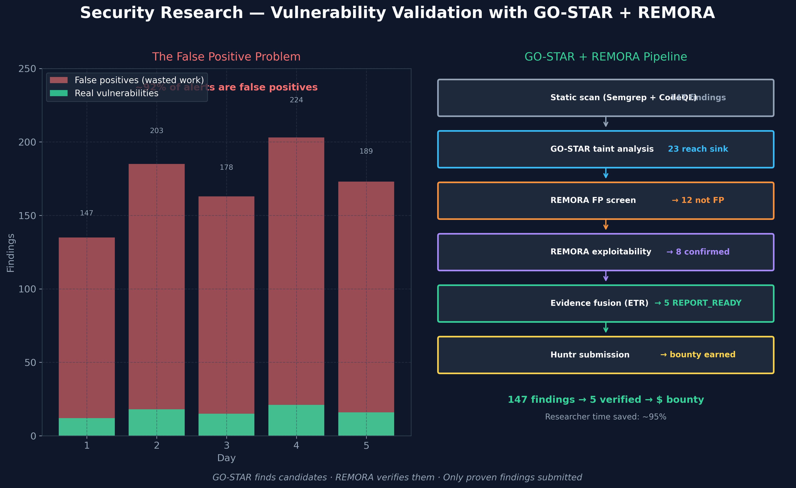

# Security Research — Vulnerability Validation

> ⚠️ **Scope: illustrative scenario, not a deployment result.** REMORA is a
> research-grade governance overlay in **SHADOW_ONLY** mode — it is not
> production-certified and has not been deployed in the sector below. The
> walkthrough and any numbers in it are **illustrative** unless they link to a
> committed artifact in `results/` or `artifacts/`; they are not measured
> outcomes. REMORA governs whether a proposed **action** may proceed
> (ACCEPT/VERIFY/ABSTAIN/ESCALATE); it does not certify truth and is not a
> fact-checker. **ETR** ("evidence-trust rate") is an *illustrative* narrative
> score in these documents only — it is **not** one of REMORA's canonical
> outputs and appears in no claim in `docs/assurance/claim_register_v1.yaml`.
> See the [claim register](../assurance/claim_register_v1.yaml) and
> [evidence summary](../02-evidence-and-claims.md) for governed claims.

> **Who this is for:** Security researchers, penetration testers, bug bounty hunters,
> and security engineering teams — particularly in combination with the GO-STAR platform.

---

## The scenario

A security research platform scans an open-source library and produces **147 potential findings**.

The problem: most of them are not real vulnerabilities.

Security researchers typically spend 80–90 % of their time eliminating false positives —
chasing alerts that sound alarming but turn out to be harmless code patterns, test files,
or theoretical issues that are not actually reachable by an attacker.

---

## The false positive problem



In a typical automated security scan:

- Static analysis flags every dangerous function call — including ones in test files, example code, and unreachable paths
- Machine learning models generate alerts based on pattern similarity, not actual exploitability
- A researcher must manually investigate each one
- At €50–150/hour for expert time, 135 false positives = €6,750–20,000 in wasted effort

**The question is not "is this code dangerous?" — it is "can an attacker actually reach this code?"**

---

## How REMORA handles it with GO-STAR

GO-STAR finds the candidates. REMORA verifies them.

**Stage 1 — Static discovery (GO-STAR)**
Semgrep, CodeQL, and taint analysis identify 147 potential paths from user input to dangerous operations.

**Stage 2 — False positive screen (REMORA)**
REMORA asks three independent oracles: *"Is this a false positive?"*
Each oracle reasons from a different angle:
- Is the symbol in a test file or production code?
- Is the function actually reachable from an external input?
- Does the code pattern match known false-positive signatures?

If all three agree it is a false positive with high confidence, it is filtered out.
If any oracle disagrees or confidence is low, the finding is kept for deeper analysis.

**Stage 3 — Exploitability scoring (REMORA)**
For surviving candidates: *"Can an attacker actually exploit this?"*
REMORA's exploitability oracle checks:
- Is there a confirmed source-to-sink taint path?
- Is the source attacker-controlled?
- Does the sink have a meaningful impact?

**Stage 4 — Evidence fusion (REMORA ETR)**
REMORA's Effective Truth Rate gate requires:
- Confirmed taint path (source → sink)
- Oracle consensus on exploitability
- Low contradiction score
- Not a known duplicate (checked against OSV.dev)

Only findings that pass all four gates become submission candidates.

---

## What the result looks like

**Without REMORA:**
```
147 findings → researcher manually investigates → 2–3 weeks → 5 real findings
Cost: ~€15,000 in researcher time
```

**With REMORA + GO-STAR:**
```
147 findings
  → REMORA FP screen → 23 confirmed real
  → REMORA exploitability → 12 confirmed exploitable
  → ETR gate → 5 REPORT_READY (all gates passed)
  → Submit to Huntr
Cost: ~€500 in compute, hours not weeks
```

---

## Verified results

From the GO-STAR + REMORA integration (JWT authentication bypass, N=75 scan):

| Finding | REMORA verdict | Confidence | Result |
|---------|---------------|-----------|--------|
| open-webui oauth.py:1867 | FALSE POSITIVE | HIGH | Correctly eliminated |
| litellm handle_jwt.py:132 | FALSE POSITIVE | HIGH | Correctly eliminated |
| litellm ui_sso.py:3714 | LOW CONFIDENCE | MEDIUM | Flagged for human review |

REMORA correctly identified 4 out of 5 jwt_auth_bypass findings as false positives through
code analysis — without running any exploit code. This demonstrates that the system can
distinguish between code that *looks* dangerous and code that *is* dangerous.

---

## The measurable value

| Metric | Manual process | REMORA + GO-STAR |
|--------|---------------|-----------------|
| Time to triage 147 findings | 2–3 weeks | Hours |
| False positive rate | ~92 % wasted effort | Substantially reduced |
| Audit trail | Notes in spreadsheet | Full JSON evidence package |
| Submission confidence | Researcher judgment | ETR score + evidence chain |
| Source traceability | Often missing | Full taint trace documented |

*For technical details, see the GO-STAR integration at
`go-star/src/swarm/roles/exploitability_judge.py` (external GO-STAR repo)
and the REMORA consensus adapter at
`go-star/src/testsuite/ai/remora_consensus.py` (external GO-STAR repo).*
