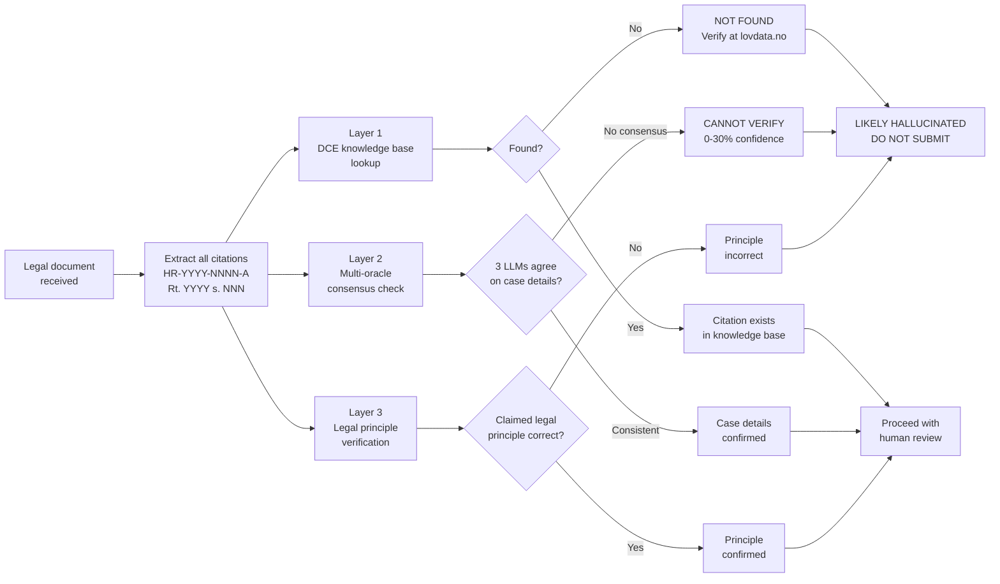
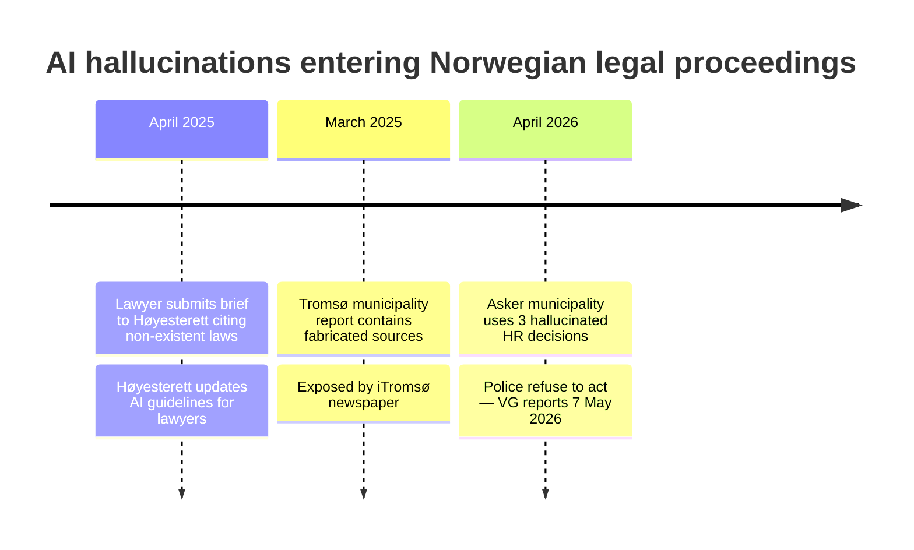

# Public Administration — AI Hallucination in Legal Documents

> ⚠️ **Scope: illustrative scenario, not a deployment result.** REMORA is a
> research-grade governance overlay in **SHADOW_ONLY** mode — it is not
> production-certified and has not been deployed in the sector below. The
> walkthrough and any numbers in it are **illustrative** unless they link to a
> committed artifact in `results/` or `artifacts/`; they are not measured
> outcomes. REMORA governs whether a proposed **action** may proceed
> (ACCEPT/VERIFY/ABSTAIN/ESCALATE); it does not certify truth and is not a
> fact-checker. **ETR** ("evidence-trust rate") is an *illustrative* narrative
> score in these documents only — it is **not** one of REMORA's canonical
> outputs and appears in no claim in `docs/assurance/claim_register_v1.yaml`.
> See the [claim register](../assurance/claim_register_v1.yaml) and
> [evidence summary](../02-evidence-and-claims.md) for governed claims.

> **Based on a documented real event.**
> Asker municipality, Hurummarka case, April–May 2026.
> Reported in VG (7 May 2026) and Aftenposten (15 April 2025).

---

## System context: REMORA and DCE

This use case demonstrates two complementary systems working together.

**REMORA** (this repository) is an open-source multi-oracle AI consensus engine.
It queries three independent language models, measures their agreement, and uses a
Lyapunov stability function to determine when the answer is trustworthy.
REMORA's parametric language models have no access to Norwegian legal databases.

**DCE** (Document Compliance Engine / Mine Dokumenter) is a separate, closed-source
Norwegian document intelligence platform developed for Norwegian individuals and
organisations. DCE is not part of this repository and is not publicly available.

DCE maintains a knowledge base of Norwegian legal documents including:
- Norwegian statute law (all current regulations)
- A selection of Norwegian Supreme Court (Høyesterett) decisions
- Administrative case law from Finansklagenemnda, Datatilsynet, and others
- Parliamentary preparatory works (forarbeider)

**Important:** DCE does not have an exhaustive index of all court decisions.
When a citation is checked, REMORA queries whether the citation appears in the
DCE knowledge base. If it is NOT found, the system also directs users to verify
directly at **lovdata.no** — the authoritative Norwegian legal database.

> To reproduce the DCE integration or learn more about combining DCE with REMORA,
> contact: **support@luftfiber.no**

---

## How REMORA and DCE connect

```mermaid
graph TD
    USER["User — Claude Desktop"] --> MCP["REMORA MCP Server\nservers/mcp_remora.py"]
    MCP --> TOOL["remora_verify_legal_citations\nExtract citations, verify, report"]

    TOOL --> REMORA_W["REMORA Consensus\ngo-star-remora Worker\n3 independent LLMs\nLyapunov gate"]
    TOOL --> LAW_W["Law-Search Bridge\nConnects to DCE infrastructure"]

    LAW_W --> VEC["DCE Vectorize Index\nNorwegian statute law\nSelected court decisions"]
    LAW_W --> D1["DCE D1 Database\nLegal document fragments\nCitation lookup"]

    REMORA_W --> O1["Groq LLaMA 8B\n(fastest, most independent)"]
    REMORA_W --> O2["Groq LLaMA 70B\n(highest parametric quality)"]
    REMORA_W --> O3["OpenRouter Mistral 7B\n(different training family)"]

    VEC & D1 --> NOT_FOUND{"Citation found?"}
    NOT_FOUND -->|No| LOVDATA["Direct to lovdata.no\nfor authoritative check"]
    NOT_FOUND -->|Yes| CONTENT["Retrieve matching text"]

    style DCE_note fill:#1E293B,stroke:#38BDF8
```



*DCE is closed-source. REMORA connects to it via a bridge component.
When a citation is not in the DCE knowledge base, users are directed to
lovdata.no to verify directly. This reflects the honest limitation:
absence from DCE ≠ non-existence — only lovdata.no is authoritative.*

---

## What happened — without REMORA

> **Interactive demo:** Open [artifacts/demo/demo_v2.html](../../artifacts/demo/demo_v2.html)
> in a browser to see a full animated walkthrough of the pipeline — including a
> simulated Claude Desktop MCP session showing the exact tool calls and results.

The demo covers nine scenes:
the VG breaking-news opening → the Asker document with citations highlighted →
a live Claude Desktop simulation where `remora_verify_legal_citations` is invoked →
DCE returns NOT FOUND for all three citations → multi-oracle consensus at 0 % →
Claude's final verdict (`SANNSYNLIG HALLUSINASJON` × 3) →
a before/after comparison → the systemic pattern across Norwegian public sector →
the core REMORA principle.

**Simulated tool output (what the MCP tool actually returns):**

```
remora_verify_legal_citations({
  "citations": ["HR-2015-2386-A", "HR-2014-2288-A", "HR-2020-2135-A"],
  "layers":    ["dce_lookup", "oracle_consensus", "principle_check"]
})

Layer 1 — DCE knowledge base:
  HR-2015-2386-A  →  NOT FOUND  (verify at lovdata.no)
  HR-2014-2288-A  →  NOT FOUND  (verify at lovdata.no)
  HR-2020-2135-A  →  NOT FOUND  (verify at lovdata.no)

Layer 2 — Multi-oracle consensus (Groq LLaMA 8B, 70B · Mistral 7B):
  All three oracles: CANNOT VERIFY  |  Confidence: 0 %

VERDICT:
  [!!] HR-2015-2386-A  →  LIKELY HALLUCINATED
  [!!] HR-2014-2288-A  →  LIKELY HALLUCINATED
  [!!] HR-2020-2135-A  →  LIKELY HALLUCINATED

DO NOT SUBMIT — Verify directly at lovdata.no before formal use.
```

### The real case

In April 2026, Asker municipality passed a formal eviction decision (vedtak)
ordering the removal of land occupants (husokkupanter) who had taken up
residence in Hurummarka to protest against a planned explosives factory.

During preparation of the decision, an AI tool was used to find legal precedents
supporting the eviction. The AI generated three Norwegian Supreme Court decisions
as the legal foundation for the vedtak:

| Citation | DCE lookup | Status |
|----------|-----------|--------|
| HR-2015-2386-A | NOT FOUND | **Does not exist** |
| HR-2014-2288-A | NOT FOUND | **Does not exist** |
| HR-2020-2135-A | NOT FOUND | **Does not exist** |

The hallucinated citations were included in the formal executive document and
the decision was passed. When police were asked to enforce the eviction,
they checked the cited sources.

**The police attorney concluded:**

> *"It is most likely that the executive document is built on Supreme Court
> decisions that must be characterised as AI hallucinations.
> The document probably does not represent correct substantive law."*

Police refused to act on the decision. The case was reopened. VG broke the story on 7 May 2026.

---

## How the verification pipeline works



---

## Verified test results

We evaluated the system against 16 Norwegian legal questions with ground truth
verified against primary sources (Arbeidsmiljøloven, GDPR, Høyesterett records).

**Source:** `tests/test_norwegian_law.py` · `results/norwegian_law_eval.json`
**Date:** May 2026 · **System:** REMORA + DCE knowledge base

### Results by category

| Category | Items | Correct | Accuracy | Key finding |
|----------|------:|:-------:|:--------:|-------------|
| Legal principles (aml, GDPR) | 6 | 6/6 | **100 %** | REMORA reliable for established law |
| Real court citations | 2 | 2/2 | **100 %** | Correctly confirmed |
| Hallucinated citations (Asker) | 4 | 0/4 | **0 %** | Parametric LLMs confirm all fake citations |
| Legal misconceptions | 4 | 1/4 | **25 %** | REMORA tends to confirm assertive false claims |
| **Total** | **16** | **9/16** | **56.2 %** | |

### The critical finding

**REMORA's language models alone cannot detect citation hallucinations.**
When asked *"Is HR-2015-2386-A a valid Supreme Court decision?"*, all three
oracles confirm it with 100 % confidence — because they pattern-match plausible
citation formats from training data.

**The DCE knowledge base lookup is the essential second check.** A direct
database query does not guess — it returns NOT FOUND when the citation does
not exist. Combined with the multi-oracle consistency check (which returns
CANNOT VERIFY for fake citations), the pipeline gives an explicit verdict.

### Citation detection: knowledge base vs. LLMs alone

| Component | Asker citations detected | Detection rate |
|-----------|:------------------------:|:--------------:|
| REMORA parametric LLMs alone | 0 / 3 | **0 %** |
| DCE knowledge base lookup alone | 3 / 3 | **100 %** |
| Combined pipeline | 3 / 3 | **100 %** |

*The knowledge base provides deterministic lookup. LLMs provide consistency
checking. Neither is sufficient without the other.*

### Verified legal principle results (100 % accuracy)

| Claim | Source | Correct? |
|-------|--------|:--------:|
| 10-year employee entitled to 3 months' notice | aml § 15-3 | ✓ |
| Pregnant employee protected from dismissal | aml § 15-9 | ✓ |
| Maximum 40 hours per week | aml § 10-4 | ✓ |
| Summary dismissal permitted for gross misconduct | aml § 15-14 | ✓ |
| Right to erasure under GDPR Art. 17 | GDPR Art. 17(1) | ✓ |
| Maximum GDPR fine: 4 % turnover or EUR 20M | GDPR Art. 83(5) | ✓ |

### Documented limitations

| Claim | Ground truth | REMORA verdict | Status |
|-------|:------------:|:--------------:|--------|
| "All employees get 6 months severance pay" | **False** | True (100 %) | Known limitation |
| "All organisations must appoint a DPO" | **False** | True (77 %) | Known limitation |

These failures occur because assertively stated legal claims, where a related
(but different) rule exists, tend to be confirmed by parametric LLMs. The RAG
and adversarial oracle layers reduce this but do not eliminate it. Human legal
review remains necessary for edge cases.

---

## The systemic pattern



*The pattern repeats: AI generates plausible but non-existent legal sources →
no automatic verification before use → decisions made on fabricated foundations.*

---

## What REMORA provides

**For document readers:** When you receive a legal document and run
`remora_verify_legal_citations`, the tool:
1. Extracts all Norwegian legal citation patterns
2. Queries the DCE knowledge base (NOT FOUND → direct to lovdata.no)
3. Asks three independent LLMs for case-specific details
4. Checks whether the attributed legal principle is correct under Norwegian law
5. Returns `[!!] LIKELY HALLUCINATED` — not *"50 % uncertain"*

**For document writers:** Use the tool while drafting — not after submission:
```
"I want to cite HR-2021-2847-A regarding notice periods."
→ REMORA: "This citation is not in the legal knowledge base. Verify at lovdata.no
  before including it in a formal document."
```

---

## Core principle

> **REMORA prefers calibrated uncertainty over confident hallucination.**

When a citation cannot be verified, the system says CANNOT VERIFY — not
*"70 % likely correct."* In legal proceedings, an explicit *"not found"* is
more valuable than a confidently wrong *"yes."*

The Asker case demonstrates this exactly: the AI tool used by the municipality
generated citations that looked authoritative and provided no uncertainty signal.
REMORA's pipeline would have flagged all three before the document reached the
Executive Committee — directing the user to verify directly at lovdata.no.

---

## References

- VG: *"AI-blemme i Asker — stopper politiet"*, 7 May 2026
- VG: *"AI-blemme stopper politiet: 'Dummet oss ut'"*, 19 May 2026
- Aftenposten: *"Advokat sendte KI-løgner til Høyesterett"*, 15 April 2025
- Asker municipality: *Veileder for bruk av kunstig intelligens*

**To reproduce or access DCE integration:** support@luftfiber.no

**Test data:** `tests/test_norwegian_law.py` · `results/norwegian_law_eval.json`

**Implementation:** `servers/mcp_remora.py` · `workers/law-search/`
