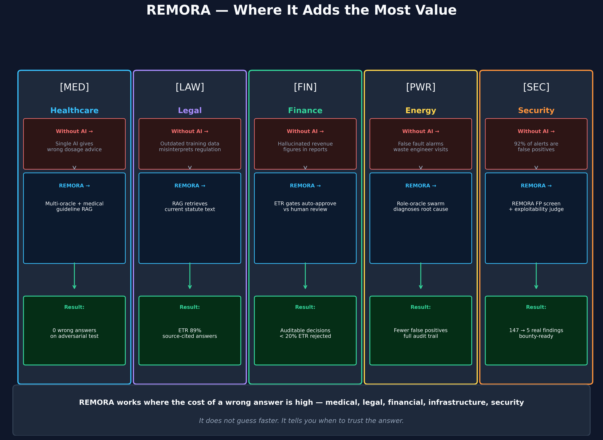

# REMORA — Use Cases

> **For non-technical readers.** This section explains where REMORA could add
> value, using plain language and illustrative examples from real sectors.

> ⚠️ **Scope: illustrative, not deployment results.** REMORA is a research-grade
> governance overlay in **SHADOW_ONLY** mode — not production-certified and not
> deployed in any sector below. Every scenario here is illustrative; numbers are
> illustrative unless they link to a committed artifact in `results/` or
> `artifacts/`. **ETR** ("evidence-trust rate") is an illustrative narrative
> score used in these documents only — it is not a canonical REMORA output and
> appears in no entry of `docs/assurance/claim_register_v1.yaml`. For governed
> claims see the [claim register](../assurance/claim_register_v1.yaml) and
> [evidence summary](../02-evidence-and-claims.md). The full academic treatment
> is [`paper/remora_paper.md`](../../paper/remora_paper.md) (the canonical
> source; any PDF is a dated snapshot).

---

## The core idea in one sentence

> REMORA governs whether a proposed **agent action** may proceed. Before an
> action executes, it asks multiple AI oracles, measures how much they agree,
> checks against authoritative sources where available, and routes the action to
> **ACCEPT / VERIFY / ABSTAIN / ESCALATE** — abstaining or escalating when
> evidence is insufficient. It governs execution permission, not truth; it is
> not a fact-checker.

---

## The problem REMORA solves

Every AI system can be confidently wrong.

When an AI says "I'm 94% confident" — that number comes from the model's internal statistics,
not from checking the answer against a real source. A model trained on 2021 data
will be highly confident about things that changed in 2022.

**Standard AI approach:**
```
Question → Single AI → Answer (with confidence number)
                ↑
         No way to verify
         No source cited
         No audit trail
```

**REMORA approach:**
```
Question → Multiple AI oracles → Measure agreement
        → Retrieve from authoritative sources
        → Check for contradictions
        → Only return answer when evidence is strong
        → Include audit trail + source citations
```

---

## Where REMORA adds the most value



REMORA is most valuable when the **cost of a wrong answer is high**:

| Sector | The risk | How REMORA helps |
|--------|----------|-----------------|
| [Healthcare](01-healthcare.md) | Wrong treatment advice | Medical-specific oracles + clinical guideline retrieval |
| [Legal & Compliance](02-legal-compliance.md) | Regulatory misinterpretation → €20M fine | RAG retrieves current statute text + cites source |
| [Financial Services](03-financial.md) | Hallucinated data in due diligence | ETR score gates auto-approve vs human review |
| [Energy & Infrastructure](04-energy.md) | False fault alarms waste engineer visits | Role-oracle swarm diagnoses root cause |
| [Security Research](05-security.md) | Security teams spend most of their time triaging false positives | REMORA screens alerts through multi-oracle consensus (illustrative; the only committed security artifact is an N=75 triage sample, `results/rag_adversarial_results.json` — no false-positive-rate claim is made) |
| [Public Administration — AI Hallucination](06-public-administration-hallucination.md) | Fabricated court decisions enter formal documents | DCE knowledge base lookup flags non-existent citations |
| [Norwegian Law via MCP](07-norwegian-law-mcp.md) | Legal research without authoritative statute access | MCP tools query DCE Norwegian law corpus + multi-oracle consensus |

---

## How to read the use case documents

Each use case document covers:

1. **The scenario** — a specific, realistic situation in that sector
2. **The problem without REMORA** — what goes wrong with a standard AI approach
3. **How REMORA handles it** — step by step, in plain language
4. **The illustrative value** — numbers are illustrative estimates unless a
   `results/` or `artifacts/` link is given
5. **A visual diagram** — showing the difference clearly

Technical readers can find the underlying code and research in:
- [`paper/remora_paper.md`](../../paper/remora_paper.md) — full academic treatment (canonical)
- [`remora/`](../../remora/) — the implementation
- [`results/`](../../results/) — all experimental data
- [`docs/mcp-integration.md`](../mcp-integration.md) — MCP server, all 14 tools, and extension model

---

## One thing to know

REMORA is honest about uncertainty.

When the answer is not clear enough — when oracles disagree, when confidence is low,
when no authoritative source was found — REMORA **abstains** rather than guessing.

In a 30-question adversarial test:
- Single AI model: **3 correct, 27 wrong** (10 % accuracy)
- REMORA RAG oracle: **7 correct, 0 wrong, 23 abstentions** (100 % precision)

*Source: `results/rag_adversarial_results.json`*

Abstaining is not a failure. It is the honest, safe answer.
