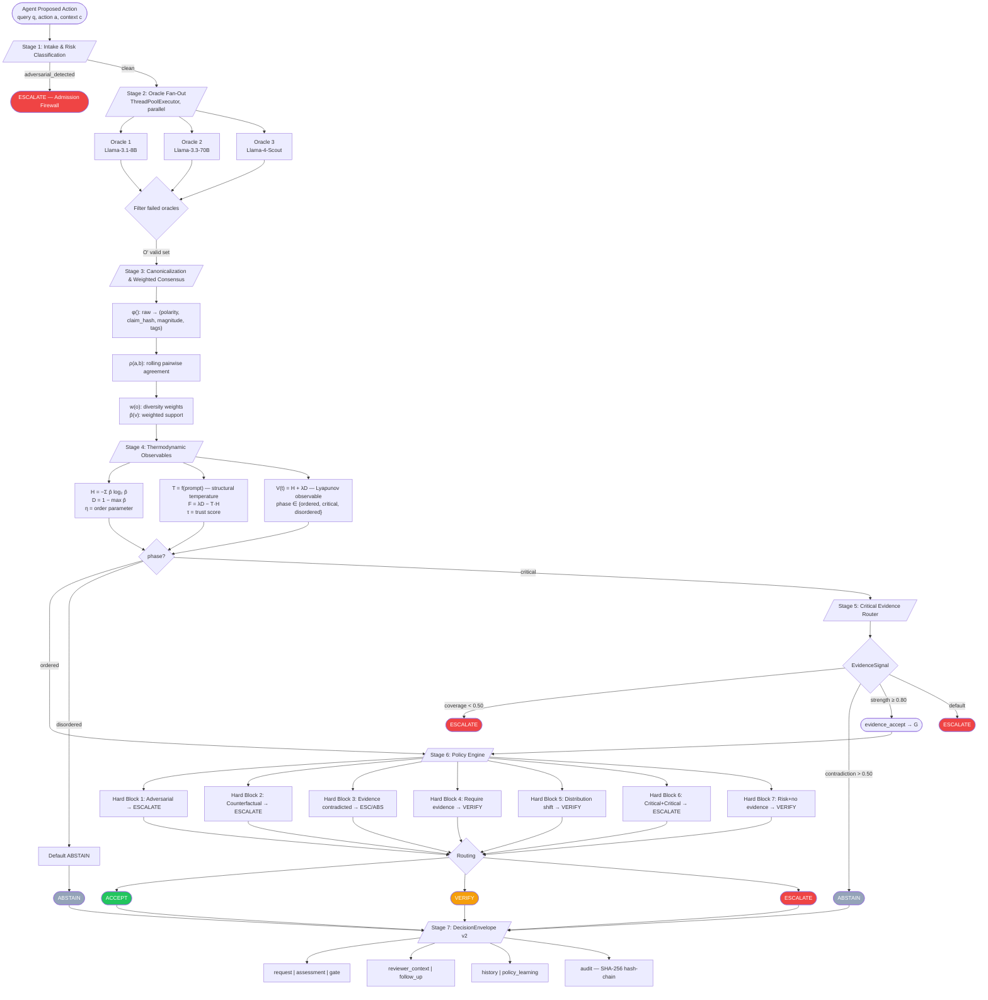
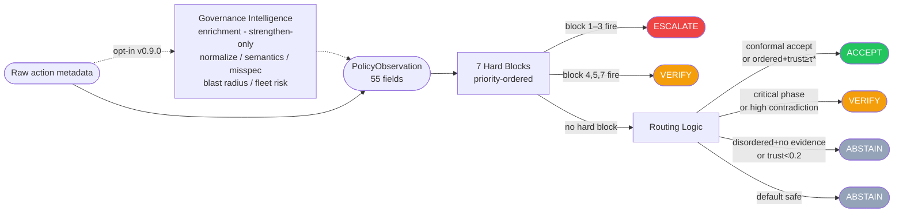
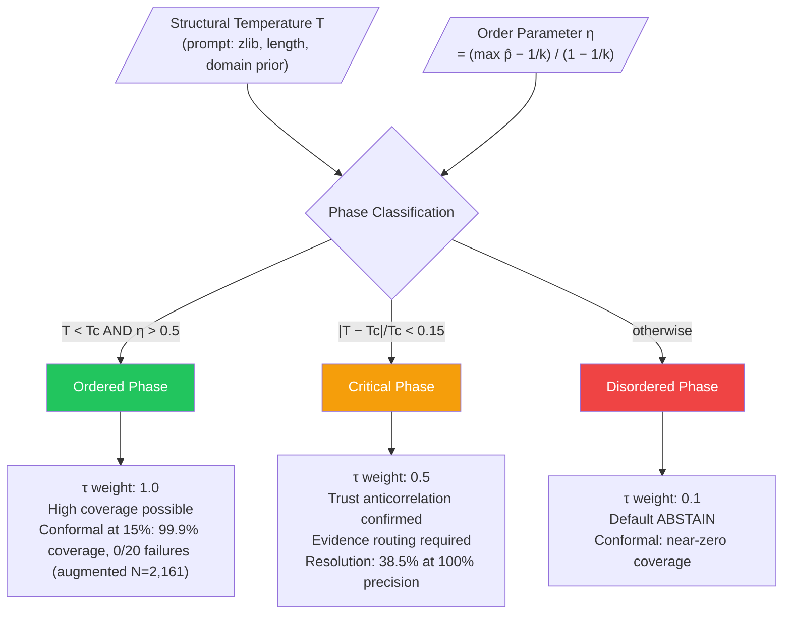
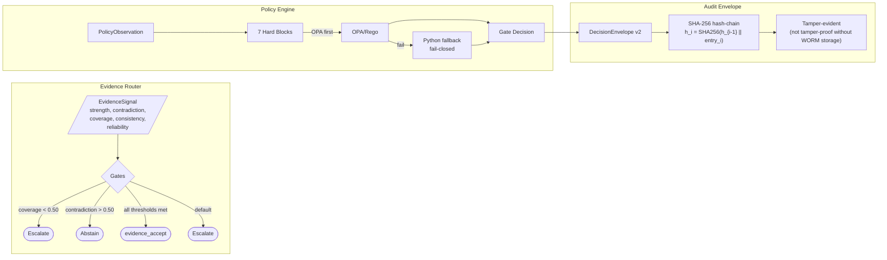
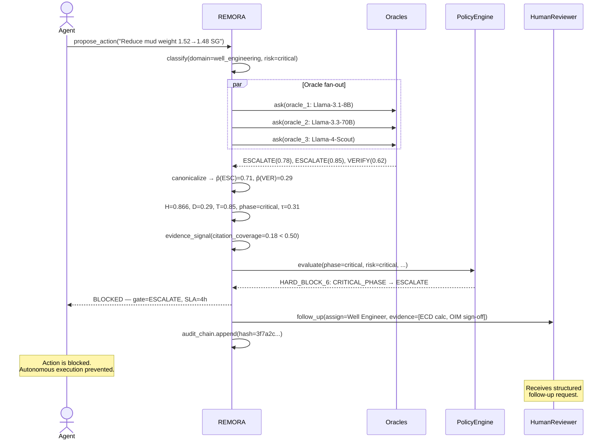

# REMORA Paper: Figure Descriptions and Mermaid Diagrams

## Figure 1: REMORA Architecture (Mermaid)

**To convert to a publication figure:**
1. Render with Mermaid CLI: `mmdc -i figures.md -o remora_arch.svg`
2. Simplify to a clean box-and-arrow diagram in Inkscape or draw.io
3. Export as PDF for LaTeX inclusion

---

## Figure 2: Decision Gate Flow

---

## Figure 3: Phase Routing

---

## Figure 4: Evidence + Policy + Audit Envelope

---

## Figure 5: Case Study Sequence (Well Barrier Agent Action)

---

## Figure Captions (for LaTeX)

**Figure 1.** REMORA gate architecture. Six decision stages process each
proposed agent action, followed by DecisionEnvelope emission (Stage 7). Hard
blocks in Stage 6 can override any earlier routing signal. Stage 7 is the
output record, not a decision stage. The policy engine queries OPA/Rego first
and falls closed to a Python fallback when OPA is unavailable.

**Figure 2.** Decision gate flow. Seven hard blocks are evaluated in priority
order before any routing logic. Policy blocks override thermodynamic consensus.

**Figure 3.** Phase routing and empirical outcomes. The ordered phase achieves
99.9% conformal coverage with 0/20 seed failures at the 15% risk target.
The critical phase cannot achieve meaningful coverage via trust scoring alone;
evidence routing resolves 38.5% of critical items with 100% precision.

**Figure 4.** Evidence router, policy engine, and audit envelope integration.
The hash-chain provides tamper-detection; tamper-proof storage requires an
external WORM backend.

**Figure 5.** Case study sequence for a well barrier agent action. The agent
proposes a mud weight reduction; REMORA fires Hard Block 6 (critical phase +
critical risk) and routes the decision to a human reviewer with a structured
follow-up request.
