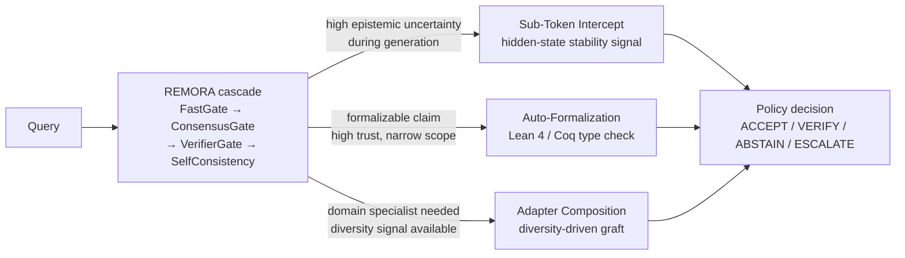

# REMORA: Future-State Research Directions

REMORA currently combines selective trust, Platt-calibrated consensus, policy
routing, tool-call gating, and agent governance primitives. The natural
extension question is: *how much closer to the model execution path can
assurance signals move while remaining auditable and controllable?*

Three long-horizon research directions mark the path forward. Each is
grounded in a concrete research question, has a defined data contract in
`remora/future_concept/`, and has a clear gap between the current skeleton and
the research target.

> **Current status of all three:** interface stubs only. Data contracts and
> integration points are defined. No production-scale proof compilation,
> weight transfer, or KV-cache integration exists yet. These should not be
> cited as current capabilities or used in any evaluation or product claim.

---

## Cloudflare Productivity Layer

REMORA can also use Cloudflare services as a practical productivity layer
around the governance system. The goal is not to replace the REMORA cascade,
but to make it cheaper to navigate, retrieve, and reason about the repo and
its evidence base.

**Recommended stack:**

- `codegraph` for repo-wide navigation and token reduction.
- `Vectorize` plus embeddings for semantic retrieval across docs, claims,
    experiments, and worker code.
- Cloudflare `AI Search` for fast, filtered search over indexed repository
    content when exact file paths are not enough.
- MCP tools that call the narrowest possible backend first, then expand only
    if the query still needs more context.

**Operating pattern:**

1. Start with `remora_codegraph_scope` to narrow the active file set.
2. Use codegraph matches to fetch only the paths that matter.
3. Use embedding search or AI Search for semantic questions across larger
     content pools.
4. Keep full-file reads as a last step, not the default.

That sequence keeps control of the code base tight while minimizing tokens.
It also fits the repo's direction: Cloudflare handles indexing and retrieval,
while REMORA retains policy, trust scoring, and final decisions.

---

## 1. Auto-Formalization Core (Lean 4 / Coq Mathematical Verification)

**Research goal:** Route narrow, formalizable claims through a local theorem
checker so that assurance is grounded in a type-theoretic kernel rather than
model confidence alone.

Large language models operate probabilistically. Some domains — mathematical
proofs, formal specifications, regulatory logic — admit deductive guarantees
for narrow subclaims. When the REMORA ensemble converges on a constrained
claim that is expressible in a formal language, a neuro-symbolic component
could attempt to auto-formalize the reasoning in Lean 4 or Coq and feed the
compiler result back into the policy decision.

$$\text{Assurance}(C) = \begin{cases} 1 & \text{if } \vdash \mathcal{F}(C) \text{ type-checks in } K \\ 0 & \text{if type error or } \texttt{sorry} \end{cases}$$

If $\mathcal{F}(C)$ fails to check, the policy routes to `VERIFY` or
`ESCALATE` rather than treating model confidence as sufficient. This would
not make arbitrary natural-language answers mathematically infallible — only
claims that can be expressed in a formal language are candidates.

**Research challenges:** automatic extraction of formalizable sub-claims from
natural-language LLM output; domain coverage (mathematical vs. regulatory
logic vs. code specifications); latency of proof compilation.

**Current baseline (`remora/future_concept/auto_formalization.py`):**
`Lean4Compiler.formalize_consensus()` generates a proof script of the form
`theorem auto_gen : <statement> := by sorry`. The interface is defined and
testable. The open problem is replacing `sorry` with a real proof strategy.

---

## 2. Dynamic Weight Grafting (Diversity-Driven Adapter Composition)

**Research goal:** Use REMORA's oracle diversity and trust signals to select
and compose model adapters at inference time, moving assurance logic closer to
the weight level without sacrificing traceability.

External multi-model routing (the current approach) is practical and auditable
but requires separate API calls. A longer-horizon question is whether the
`OracleDiversityTracker`'s historical pairwise agreement data could inform
adapter selection — choosing submodules or specialist heads based on domain
performance and measured independence rather than static configuration.

The key constraint is that any composition must remain auditable: the graft
configuration, contributing adapters, and stability score must be logged in
the assurance trace.

**Research challenges:** weight compatibility across model families; ensuring
grafted layers do not introduce correlated failure modes; integrating graft
selection with the existing `DomainCoverageOptimizer`.

**Current baseline (`remora/future_concept/weight_grafting.py`):**
`NeuralSplicer.splice_layers()` replaces named numpy weight tensors and
returns a `GraftedModel` with a stability score. The interface and data
contract are defined. The open problem is connecting real adapter weights and
the diversity tracker's selection signal.

---

## 3. Sub-Token Intercept (Early Stability Signal Before Generation Completes)

**Research goal:** Estimate a stability signal from hidden states or KV-cache
activations *during* generation and apply a conservative logit correction when
the predictor indicates high divergence risk — before the full sequence is
completed.

Current REMORA components operate on completed outputs, proposed actions, or
local hook payloads. For tightly controlled model-serving environments where
a generated sequence reaching the output layer represents a latency and safety
cost, an earlier intervention point is valuable.

A prevalidated stability predictor inspecting $h_t$ (hidden state at step $t$)
would apply:

$$L_{\text{corrected}} = L - \alpha \nabla_h V$$

when the predictor detects escalating entropy in the hidden-state trajectory.
The correction is conservative: it reduces logit mass on high-risk tokens
rather than blocking generation entirely.

**Research challenges:** training a reliable stability predictor from REMORA's
existing uncertainty signals; KV-cache access API compatibility across serving
frameworks (vLLM, TGI, TensorRT-LLM); calibrating $\alpha$ to avoid
over-correction on well-formed sequences.

**Current baseline (`remora/future_concept/kv_intercept.py`):**
`SubTokenInterceptor.monitor_kv_cache()` applies a logit penalty when a
synthetic dissonance score (sum-of-squares of hidden state floats) exceeds
a threshold. The `InterceptResult` data contract is defined. The open problem
is replacing the synthetic dissonance signal with a real predictor trained on
REMORA's uncertainty decomposition output.

---

## Target Architecture

Each extension feeds back into the standard policy decision rather than
replacing it. The cascade pipeline remains the primary execution path.

---

## Open Research Questions

| Direction | Key open problem | Dependency on current REMORA |
|---|---|---|
| Auto-formalization | Automatic formalizable sub-claim extraction from LLM output | Cascade trust score → routing signal for formalization |
| Weight grafting | Real adapter weight compatibility + diversity-driven selection | `OracleDiversityTracker` agreement matrix → graft selector |
| Sub-token intercept | Predictor trained on real uncertainty signals, not synthetic dissonance | `decompose()` epistemic/aleatoric output → predictor training data |

These directions share a common pattern: REMORA's existing uncertainty signals
(trust score, phase, epistemic/aleatoric decomposition, diversity weights)
provide the training data or routing signal. The research work is building the
bridge from those signals to the new execution path.
